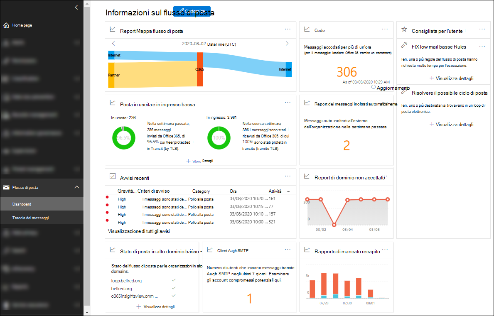

# Informazioni dettagliate sul flusso di posta nel Centro sicurezza e conformitàMail flow insights in the Security & Compliance Center

[!INCLUDE [Microsoft 365 Defender rebranding](../includes/microsoft-defender-for-office.md)]

**Si applica a****Applies to**
- [Exchange Online ProtectionExchange Online Protection](https://go.microsoft.com/fwlink/?linkid=2148611)
- [Microsoft Defender per Office 365 piano 1 e piano 2Microsoft Defender for Office 365 plan 1 and plan 2](https://go.microsoft.com/fwlink/?linkid=2148715)
- [Microsoft 365 DefenderMicrosoft 365 Defender](https://go.microsoft.com/fwlink/?linkid=2118804)

Gli amministratori possono usare il dashboard del flusso di posta nel Centro sicurezza & conformità per individuare tendenze, approfondimenti e intraprendere azioni per risolvere i problemi relativi al flusso di posta nell'organizzazione.Admins can use Mail flow dashboard in the Security & Compliance Center to discover trends, insights, and take actions to fix issues related to mail flow in their organization.

Le informazioni dettagliate disponibili sono:The available insights are:

- [Informazioni dettagliate sui messaggi inoltrati automaticamenteAuto-forwarded messages insight](mfi-auto-forwarded-messages-report.md)

- [Correggere le possibili informazioni dettagliate sul ciclo di posta](mfi-mail-loop-insight.md)1[Fix possible mail loop insight](mfi-mail-loop-insight.md)1

- [Correggere le informazioni dettagliate sulle regole del flusso di](mfi-slow-mail-flow-rules-insight.md)posta lento1[Fix slow mail flow rules insight](mfi-slow-mail-flow-rules-insight.md)1

- [Mappa del flusso di postaMail flow map](mfi-mail-flow-map-report.md)

- [Informazioni dettagliate sui nuovi domini inoltrati tramite posta](mfi-new-domains-being-forwarded-email.md)elettronica 2[New domains being forwarded email insight](mfi-new-domains-being-forwarded-email.md)2

- [Nuovi utenti che inoltrano informazioni dettagliate sulla posta](mfi-new-users-forwarding-email.md)elettronica 2[New users forwarding email insight](mfi-new-users-forwarding-email.md)2

- [Report di dominio non accettatoNon-accepted domain report](mfi-non-accepted-domain-report.md)

- [Rapporto di mancato recapitoNon-delivery report](mfi-non-delivery-report.md)

- [Informazioni dettagliate sul flusso di posta in ingresso e in uscitaOutbound and inbound mail flow insight](mfi-outbound-and-inbound-mail-flow.md)

- [Dati analitici sulle codeQueues insight](mfi-queue-alerts-and-queues.md)

- [Informazioni dettagliate e report sui client di autenticazione SMTPSMTP Auth clients insight and report](mfi-smtp-auth-clients-report.md)

- [Informazioni dettagliate sullo stato del flusso di posta del dominio principaleTop domain mail flow status insight](mfi-domain-mail-flow-status-insight.md)

1 Queste informazioni vengono visualizzate nell'area Consigliata per **l'utente** del dashboard del flusso di posta solo dopo che il problema è stato rilevato.1 This insight appears in the **Recommended for you** area of the Mail flow dashboard only after the issue is detected. In caso contrario, non verrà visualizzato.Otherwise, you won't see it.

2 Queste informazioni non vengono visualizzate nel dashboard del flusso di posta, ma sono visibili nella pagina del [rapporto](view-mail-flow-reports.md#forwarding-report) di inoltro dopo che il problema è stato rilevato.2 This insight doesn't appear on the Mail flow dashboard, but is visible on the [Forwarding report](view-mail-flow-reports.md#forwarding-report) page after the issue is detected. In caso contrario, non verrà visualizzato.Otherwise, you won't see it.

## Autorizzazioni necessarie per visualizzare il dashboard del flusso di postaPermissions required to view the Mail flow dashboard

Il dashboard del flusso di posta è disponibile per i membri dei seguenti gruppi di ruoli:The Mail flow dashboard is available to members of the following role groups:

- **Gestione organizzazione** nel Centro sicurezza & conformità (amministratori globali).**Organization Management** in the Security & Compliance Center (global admins).

- **[Amministratore di Exchange](https://docs.microsoft.com/azure/active-directory/users-groups-roles/directory-assign-admin-roles#exchange-administrator)** in Azure Active Directory.**[Exchange Administrator](https://docs.microsoft.com/azure/active-directory/users-groups-roles/directory-assign-admin-roles#exchange-administrator)** in Azure Active Directory.

- **Amministratore di MailFlow** nel Centro sicurezza & conformità.**MailFlow Administrator** in the Security & Compliance Center. Se l'account non è anche membro dei gruppi di ruoli Gestione organizzazione o Amministratore di Exchange, considerare i seguenti problemi:If the account is not also a member of the Organization Management or Exchange Administrator role groups, consider the following issues:
  - L'utente deve accedere al Centro sicurezza & conformità direttamente all'indirizzo <https://protection.office.com> .The user must sign in to the Security & Compliance Center directly at <https://protection.office.com>.
  - L'utente avrà solo l'autorizzazione di sola lettura per il dashboard del flusso di posta.The user will only have read-only permission to the Mail flow dashboard.
  - L'utente non ha accesso all'interfaccia di amministrazione di Microsoft 365.The user won't have access to the Microsoft 365 admin center.

Per ulteriori informazioni sulle autorizzazioni, vedere Autorizzazioni nel Centro [sicurezza & conformità](permissions-in-the-security-and-compliance-center.md) e Concedere agli utenti l'accesso al Centro sicurezza & [conformità.](grant-access-to-the-security-and-compliance-center.md)For more information about permissions, see [Permissions in the Security & Compliance Center](permissions-in-the-security-and-compliance-center.md) and [Give users access to the Security & Compliance Center](grant-access-to-the-security-and-compliance-center.md).

## Dove trovare il dashboard del flusso di postaWhere to find the Mail flow dashboard

Aprire il Centro sicurezza & conformità <https://protection.office.com> in , espandere Flusso di **posta** e quindi selezionare **Dashboard.**Open the Security & Compliance Center at <https://protection.office.com>, expand **Mail flow**, and then select **Dashboard**.

Per passare direttamente al dashboard del flusso di posta, aprire <https://protection.office.com/mailflow/dashboard> .To go directly to the Mail flow dashboard, open <https://protection.office.com/mailflow/dashboard>.
