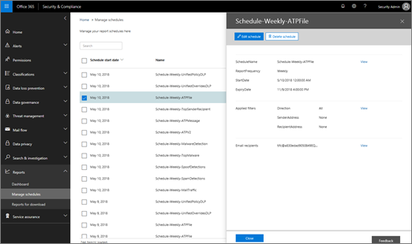

# Gestire le pianificazioni per più report nel centro &amp; sicurezza e conformitàManage schedules for multiple reports in the Security &amp; Compliance Center

Nel centro sicurezza &amp; e conformità sono disponibili diversi [report e](reports-and-insights-in-security-and-compliance.md) informazioni utili per consentire al team di sicurezza dell'organizzazione di attenuare e risolvere i rischi per l'organizzazione.In the Security &amp; Compliance Center, several [reports and insights](reports-and-insights-in-security-and-compliance.md) are available to help your organization's security team mitigate and address threats to your organization. Se si è membri del team di sicurezza dell'organizzazione, è possibile gestire le pianificazioni per uno o più report.If you're a member of your organization's security team, you can manage schedules for one or more reports. 
  
## Gestire le pianificazioni per i reportManage schedules for reports

> [!IMPORTANT]
> Verificare di disporre delle [autorizzazioni necessarie assegnate al &amp; Centro sicurezza e conformità](permissions-in-the-security-and-compliance-center.md).Make sure that you have the necessary [permissions assigned in the Security &amp; Compliance Center](permissions-in-the-security-and-compliance-center.md). In generale, gli amministratori globali, gli amministratori della sicurezza e i lettori di sicurezza possono accedere &amp; ai report nel centro sicurezza e conformità.In general, global administrators, security administrators, and security readers can access reports in the Security &amp; Compliance Center. 
  

1. Andare su [https://protection.office.com](https://protection.office.com) ed eseguire l'accesso.Go to [https://protection.office.com](https://protection.office.com) and sign in. Questo porta al centro sicurezza & Compliance.This takes you to the Security & Compliance Center.

2. Nel centro sicurezza &amp; e conformità, accedere a **report** \> di **Gestione pianificazioni**.In the Security &amp; Compliance Center, go to **Reports** \> **Manage schedules**.
    
3. Selezionare un elemento nell'elenco.Select an item in the list.
    
4. Rivedere le informazioni relative alla pianificazione del report.Review the information for the report's schedule.
    
5. Se necessario, modificare o eliminare la pianificazione, quindi fare clic su **Chiudi**.As appropriate, edit or delete the schedule, and then click **Close**.
    
## Argomenti correlatiRelated topics

[Report e informazioni dettagliate nel centro sicurezza &amp; e conformitàReports and insights in the Security &amp; Compliance Center](reports-and-insights-in-security-and-compliance.md)
  
[Creare una pianificazione per un report nel centro sicurezza &amp; e conformitàCreate a schedule for a report in the Security &amp; Compliance Center](create-a-schedule-for-a-report.md)
  
[Scaricare un report personalizzato nel centro sicurezza &amp; e conformitàDownload a custom report in the Security &amp; Compliance Center](set-up-and-download-a-custom-report.md)
  
[Scaricare i report esistenti nel centro &amp; sicurezza e conformitàDownload existing reports in the Security &amp; Compliance Center](download-existing-reports.md)
  

