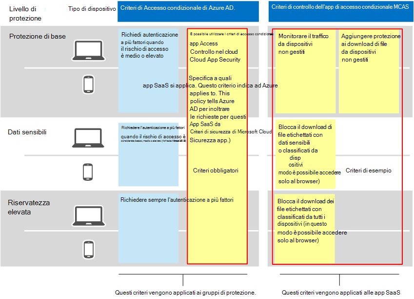
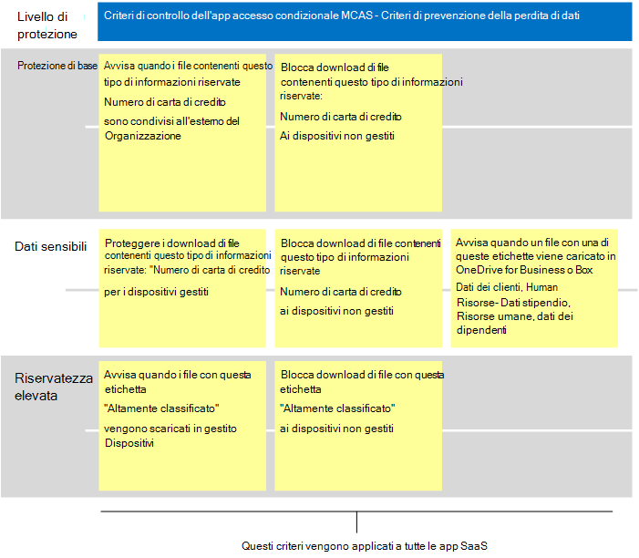

# Criteri di Microsoft Cloud App Security consigliati per le app SaaS
Microsoft Cloud App Security si basa sui criteri di accesso condizionale di Azure AD per abilitare il monitoraggio e il controllo in tempo reale delle azioni granulari con le app SaaS, ad esempio bloccando download, caricamenti, copia e incolla e stampa. Questa funzionalità aggiunge sicurezza alle sessioni che comportano rischi intrinseci, ad esempio quando si accede alle risorse aziendali da dispositivi non gestiti o da utenti guest.

Microsoft Cloud App Security si integra anche in modo nativo con Microsoft Information Protection, fornendo un'ispezione dei contenuti in tempo reale per trovare dati sensibili basati su tipi di informazioni riservate ed etichette di riservatezza e per intraprendere azioni appropriate.

Queste indicazioni includono suggerimenti per questi scenari:

- Portare le app SaaS nella gestione IT
- Ottimizzare la protezione per app SaaS specifiche
- Configurare la prevenzione della perdita dei dati (DLP) per garantire la conformità alle normative sulla protezione dei dati

## Portare le app SaaS nella gestione IT

Il primo passaggio nell'uso di Microsoft Cloud App Security per gestire le app SaaS consiste nell'individuarle e quindi aggiungerle al tenant di Azure AD. Per assistenza con l'individuazione, vedi [Individuare e gestire le app SaaS nella rete.](/cloud-app-security/tutorial-shadow-it) Dopo aver individuato le app, [aggiungerle al tenant di Azure AD.](/azure/active-directory/manage-apps/add-application-portal)

È possibile iniziare a gestire questi elementi eseguendo le operazioni seguenti:

1. Innanzitutto, in Azure AD crea un nuovo criterio di accesso condizionale e configuralo in "Usa controllo app di accesso condizionale". In questo modo la richiesta viene reindirizzata a Cloud App Security. Puoi creare un criterio e aggiungere tutte le app SaaS a questo criterio.
1. Successivamente, in Cloud App Security crea i criteri di sessione. Creare un criterio per ogni controllo che si desidera applicare.

Le autorizzazioni per le app SaaS si basano in genere sulla necessità aziendale di accedere all'app. Queste autorizzazioni possono essere altamente dinamiche. L'uso dei criteri di Cloud App Security garantisce la protezione dei dati delle app, indipendentemente dal fatto che gli utenti siano assegnati a un gruppo di Azure AD associato a una protezione di base, sensibile o altamente regolamentata.

Per proteggere i dati nella raccolta di app SaaS, nel diagramma seguente vengono illustrati i criteri di accesso condizionale di Azure AD necessari e i criteri suggeriti che è possibile creare in Cloud App Security. In questo esempio, i criteri creati in Cloud App Security si applicano a tutte le app SaaS che stai gestendo. Sono progettati per applicare controlli appropriati in base alla gestione dei dispositivi e alle etichette di riservatezza già applicate ai file.

Nella tabella seguente sono elencati i nuovi criteri di accesso condizionale che è necessario creare in Azure AD.

|Livello di protezione|Criteri|Ulteriori informazioni|
|---|---|---|
|Tutti i livelli di protezione|[Usare il controllo delle app di accesso condizionale in Cloud App Security](/cloud-app-security/proxy-deployment-aad#configure-integration-with-azure-ad)|In questo modo l'IdP (Azure AD) viene configurato per l'utilizzo con Cloud App Security.|
||||

Nella tabella seguente sono elencati i criteri di esempio illustrati in precedenza che è possibile creare per proteggere tutte le app SaaS. Assicurarsi di valutare gli obiettivi aziendali, di sicurezza e di conformità e quindi creare criteri che forniranno la protezione più appropriata per l'ambiente.

|Livello di protezione|Criteri|
|---|---|
|Protezione di base|Monitorare il traffico da dispositivi non gestiti 
 Aggiungere protezione ai download di file da dispositivi non gestiti|
|Dati sensibili|Blocca il download di file etichettati con dati sensibili o classificati da dispositivi non gestiti (in questo modo è possibile accedere solo al browser)|
|Riservatezza elevata|Blocca il download dei file etichettati con classificati da tutti i dispositivi (in questo modo è possibile accedere solo al browser)|
|||

Per istruzioni end-to-end per la configurazione del controllo dell'app di accesso condizionale, vedi Distribuire il controllo dell'app di [accesso condizionale per le app in primo piano.](/cloud-app-security/proxy-deployment-aad) Questo articolo illustra come creare i criteri di accesso condizionale necessari in Azure AD e testare le app SaaS.

Per altre informazioni, vedi [Proteggere le app con Microsoft Cloud App Security Conditional Access App Control.](/cloud-app-security/proxy-intro-aad)

## Ottimizzare la protezione per app SaaS specifiche

Potresti voler applicare controlli e monitoraggio aggiuntivi a specifiche app SaaS nel tuo ambiente. Cloud App Security consente di eseguire questa operazione. Ad esempio, se un'app come Box viene usata molto nel tuo ambiente, è opportuno applicare controlli aggiuntivi. In caso contrario, se il reparto legale o finanziario usa un'app SaaS specifica per i dati aziendali sensibili, puoi scegliere una protezione aggiuntiva per queste app.

Ad esempio, è possibile proteggere l'ambiente Box con questi tipi di modelli di criteri di rilevamento delle anomalie predefiniti:

- Attività da indirizzi IP anonimi
- Attività da paesi poco frequenti
- Attività da indirizzi IP sospetti
- Viaggio impossibile
- Attività eseguita dall'utente terminato (richiede AAD come IdP)
- Rilevamento malware
- Più tentativi di accesso non riusciti
- Attività ransomware
- App Oauth rischiosa
- Attività insolita di condivisione file

Questi sono esempi. Ulteriori modelli di criteri vengono aggiunti a intervalli regolari. Per esempi su come applicare una protezione aggiuntiva a app specifiche, vedi [Protezione delle app connesse.](/cloud-app-security/protect-connected-apps)

[In che modo Cloud App Security](/cloud-app-security/protect-box) aiuta a proteggere l'ambiente Box dimostra i tipi di controlli che possono aiutarti a proteggere i dati business in Box e in altre app con dati sensibili.

## Configurare la prevenzione della perdita dei dati (DLP) per garantire la conformità alle normative sulla protezione dei dati

Cloud App Security può essere uno strumento utile per configurare la protezione per le normative di conformità. In questo caso, si creano criteri specifici per cercare dati specifici a cui si applica un regolamento e configurare ogni criterio in modo che eserciti le azioni appropriate.

Nella figura e nella tabella seguenti vengono forniti diversi esempi di criteri che possono essere configurati per garantire la conformità al Regolamento generale sulla protezione dei dati (GDPR). In questi esempi, i criteri ricercano dati specifici. In base alla riservatezza dei dati, ogni criterio è configurato per eseguire le azioni appropriate.

|Livello di protezione|Criteri di esempio|
|---|---|
|Protezione di base|Avvisa quando i file contenenti questo tipo di informazioni riservate ("Numero carta di credito") vengono condivisi all'esterno dell'organizzazione 
 >bloccare i download di file contenenti questo tipo di informazioni riservate ("Numero carta di credito") per i dispositivi non gestiti|
|Dati sensibili|Proteggere i download di file contenenti questo tipo di informazioni riservate ("Numero di carta di credito") nei dispositivi gestiti 
 Blocca download di file contenenti questo tipo di informazioni riservate ("Numero carta di credito") nei dispositivi non gestiti 
 Avvisa quando un file con su di queste etichette viene caricato in OneDrive for Business o Box (dati dei clienti, risorse umane: dati sullo stipendio, risorse umane, dati dei dipendenti)|
|Riservatezza elevata|Avvisa quando i file con questa etichetta ("Altamente classificati") vengono scaricati nei dispositivi gestiti 
 Blocca i download di file con questa etichetta ("Altamente classificati") nei dispositivi non gestiti|
|||

## Passaggi successivi

Per altre informazioni sull'uso di Cloud App Security, vedi [la documentazione di Microsoft Cloud App Security.](//cloud-app-security/)
