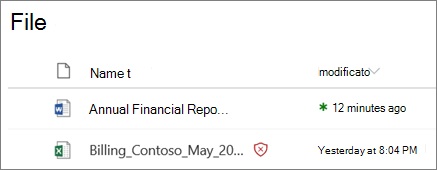

# Allegati sicuri per SharePoint, OneDrive e Microsoft TeamsSafe Attachments for SharePoint, OneDrive, and Microsoft Teams

[!INCLUDE [Microsoft 365 Defender rebranding](../includes/microsoft-defender-for-office.md)]

**Si applica a****Applies to**
- [Microsoft Defender per Office 365 piano 1 e piano 2Microsoft Defender for Office 365 plan 1 and plan 2](defender-for-office-365.md)
- [Microsoft 365 DefenderMicrosoft 365 Defender](../defender/microsoft-365-defender.md)

Allegati sicuri per SharePoint, OneDrive e Microsoft Teams in Microsoft [Defender per Office 365](whats-new-in-defender-for-office-365.md) offre un ulteriore livello di protezione per i file che sono già stati analizzati in fase di caricamento dal motore di rilevamento virus comune [in Microsoft 365](virus-detection-in-spo.md).Safe Attachments for SharePoint, OneDrive, and Microsoft Teams in [Microsoft Defender for Office 365](whats-new-in-defender-for-office-365.md) provides an additional layer of protection for files that have already been scanned at upload time by the [common virus detection engine in Microsoft 365](virus-detection-in-spo.md). Allegati sicuri per SharePoint, OneDrive e Microsoft Teams consente di rilevare e bloccare i file esistenti identificati come dannosi nei siti del team e nelle raccolte documenti.Safe Attachments for SharePoint, OneDrive, and Microsoft Teams helps detect and block existing files that are identified as malicious in team sites and document libraries.

Gli allegati sicuri per SharePoint, OneDrive e Microsoft Teams non sono abilitati per impostazione predefinita.Safe Attachments for SharePoint, OneDrive, and Microsoft Teams is not enabled by default. Per attivarlo, vedere Attivare allegati sicuri per [SharePoint, OneDrive e Microsoft Teams](turn-on-mdo-for-spo-odb-and-teams.md).To turn it on, see [Turn on Safe Attachments for SharePoint, OneDrive, and Microsoft Teams](turn-on-mdo-for-spo-odb-and-teams.md).

## Funzionamento degli allegati sicuri SharePoint, OneDrive e Microsoft TeamsHow Safe Attachments for SharePoint, OneDrive, and Microsoft Teams works

Quando allegati sicuri per SharePoint, OneDrive e Microsoft Teams è abilitato e identifica un file come dannoso, il file viene bloccato utilizzando l'integrazione diretta con gli archivi file.When Safe Attachments for SharePoint, OneDrive, and Microsoft Teams is enabled and identifies a file as malicious, the file is locked using direct integration with the file stores. L'immagine di seguito mostra un esempio di file dannoso rilevato in una raccolta.The following image shows an example of a malicious file detected in a library.

Anche se il file bloccato è ancora elencato nella raccolta documenti e nelle applicazioni Web, mobili o desktop, gli utenti non possono aprire, copiare, spostare o condividere il file.Although the blocked file is still listed in the document library and in web, mobile, or desktop applications, people can't open, copy, move, or share the file. Ma possono eliminare il file bloccato.But they can delete the blocked file.

Ecco un esempio dell'aspetto di un file bloccato in un dispositivo mobile:Here's an example of what a blocked file looks like on a mobile device:

Per impostazione predefinita, gli utenti possono scaricare un file bloccato.By default, people can download a blocked file. Ecco l'aspetto del download di un file bloccato in un dispositivo mobile:Here's what downloading a blocked file looks like on a mobile device:

SharePoint Gli amministratori online possono impedire agli utenti di scaricare file dannosi.SharePoint Online admins can prevent people from downloading malicious files. Per istruzioni, vedere [Use SharePoint Online PowerShell to prevent users from downloading malicious files](turn-on-mdo-for-spo-odb-and-teams.md#step-2-recommended-use-sharepoint-online-powershell-to-prevent-users-from-downloading-malicious-files).For instructions, see [Use SharePoint Online PowerShell to prevent users from downloading malicious files](turn-on-mdo-for-spo-odb-and-teams.md#step-2-recommended-use-sharepoint-online-powershell-to-prevent-users-from-downloading-malicious-files).

Per ulteriori informazioni sull'esperienza utente quando un file è stato rilevato come dannoso, vedere Cosa fare quando viene trovato un file dannoso [in SharePoint Online, OneDrive](https://support.microsoft.com/office/01e902ad-a903-4e0f-b093-1e1ac0c37ad2)o Microsoft Teams .To learn more about the user experience when a file has been detected as malicious, see [What to do when a malicious file is found in SharePoint Online, OneDrive, or Microsoft Teams](https://support.microsoft.com/office/01e902ad-a903-4e0f-b093-1e1ac0c37ad2).

## Visualizzare informazioni sui file dannosi rilevati dagli allegati sicuri per SharePoint, OneDrive e Microsoft TeamsView information about malicious files detected by Safe Attachments for SharePoint, OneDrive, and Microsoft Teams

I file identificati come dannosi dagli allegati sicuri per SharePoint, OneDrive e Microsoft Teams verranno visualizzati nei report per [Microsoft Defender](view-reports-for-mdo.md) per Office 365 e in Esplora risorse (e rilevamenti in tempo [reale).](threat-explorer.md)Files that are identified as malicious by Safe Attachments for SharePoint, OneDrive, and Microsoft Teams will show up in [reports for Microsoft Defender for Office 365](view-reports-for-mdo.md) and in [Explorer (and real-time detections)](threat-explorer.md).

A maggio 2018, quando un file viene identificato come dannoso dagli allegati sicuri per SharePoint, OneDrive e Microsoft Teams, il file è disponibile anche in quarantena.As of May 2018, when a file is identified as malicious by Safe Attachments for SharePoint, OneDrive, and Microsoft Teams, the file is also available in quarantine. Per altre informazioni, vedi [Gestire i file in quarantena in Defender per Office 365](manage-quarantined-messages-and-files.md#use-the-microsoft-365-defender-portal-to-manage-quarantined-files-in-defender-for-office-365).For more information, see [Manage quarantined files in Defender for Office 365](manage-quarantined-messages-and-files.md#use-the-microsoft-365-defender-portal-to-manage-quarantined-files-in-defender-for-office-365).

## Tenere presenti questi puntiKeep these points in mind

- Defender per Office 365 non analizza ogni singolo file in SharePoint Online, OneDrive for Business o Microsoft Teams.Defender for Office 365 will not scan every single file in SharePoint Online, OneDrive for Business, or Microsoft Teams. Si tratta di un comportamento legato alla progettazione.This is by design. I file vengono analizzati in modo asincrono.Files are scanned asynchronously. Il processo usa gli eventi di condivisione e attività guest insieme all'euristica intelligente e ai segnali di minaccia per identificare i file dannosi.The process uses sharing and guest activity events along with smart heuristics and threat signals to identify malicious files.

- Verificare che i siti SharePoint siano configurati per l'utilizzo [dell'esperienza moderna.](/sharepoint/guide-to-sharepoint-modern-experience)Make sure your SharePoint sites are configured to use the [Modern experience](/sharepoint/guide-to-sharepoint-modern-experience). Defender per Office 365 protezione si applica se viene usata l'esperienza moderna o la visualizzazione classica; Tuttavia, gli indicatori visivi che un file è bloccato sono disponibili solo nell'esperienza moderna.Defender for Office 365 protection applies whether the Modern experience or the Classic view is used; however, visual indicators that a file is blocked are available only in the Modern experience.

- Allegati sicuri per SharePoint, OneDrive e Microsoft Teams fa parte della strategia generale di protezione dalle minacce dell'organizzazione, che include la protezione da posta indesiderata e antimalware in Exchange Online Protection (EOP), nonché collegamenti sicuri e allegati sicuri in Microsoft Defender per Office 365.Safe Attachments for SharePoint, OneDrive, and Microsoft Teams is part of your organization's overall threat protection strategy, which includes anti-spam and anti-malware protection in Exchange Online Protection (EOP), as well as Safe Links and Safe Attachments in Microsoft Defender for Office 365. Per ulteriori informazioni, vedere [Protezione dalle minacce in Office 365](protect-against-threats.md).To learn more, see [Protect against threats in Office 365](protect-against-threats.md).
