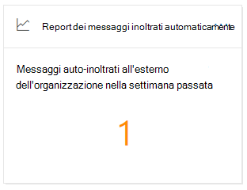
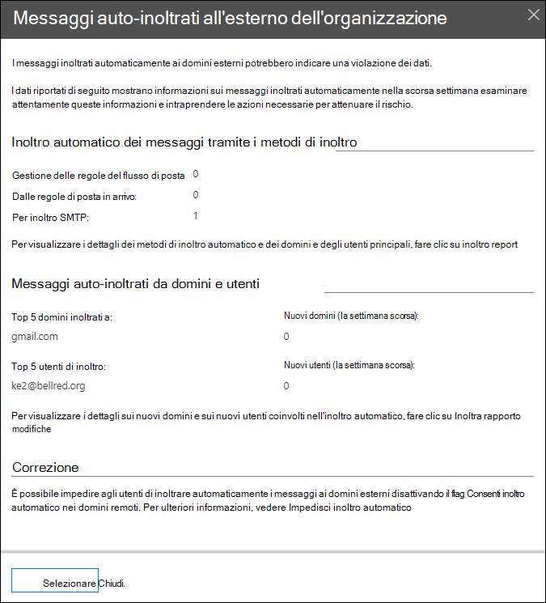

# Insight dei messaggi auto-inoltrati nel centro sicurezza & ComplianceAuto-forwarded messages insight in the Security & Compliance Center

L'Insight dei **messaggi auto-inoltrati** nel [Dashboard del flusso di posta elettronica](mail-flow-insights-v2.md) nel centro sicurezza & conformità Visualizza informazioni sui messaggi che vengono inoltrati automaticamente dall'organizzazione ai destinatari nei domini esterni.The **Auto-forwarded messages** insight in the [Mail flow dashboard](mail-flow-insights-v2.md) in the Security & Compliance Center displays information about messages that are automatically forwarded from your organization to recipients in external domains.

## Dettagli dei messaggi inoltrati automaticamenteAuto-forwarded messages details

Quando si fa clic sul numero di messaggi nel widget, viene visualizzato un riquadro a comparsa che consente di visualizzare ulteriori informazioni sui messaggi auto-inoltrati:When you click the number of messages in the widget, a flyout pane appears that shows more information about the auto-forwarded messages:

- Inoltro **automatico dei messaggi tramite i metodi di inoltro**:**Auto-forwarded messages by forwarding methods**:

  - **Regole del flusso di posta****By mail flow rules**
  - **Dalle regole di posta in arrivo****By Inbox rules**
  - **Per inoltro SMTP****By SMTP forwarding**
  - Un collegamento al [rapporto di inoltro](view-mail-flow-reports.md#forwarding-report) per ulteriori dettagli.A link to the [Forwarding report](view-mail-flow-reports.md#forwarding-report) for more details.

- **Messaggi auto-inoltrati da domini e utenti**:**Auto-forwarded messages by domains and users**:

  - **Top 5 domini inoltrati a****Top 5 domains forwarded to**
  - **Nuovi domini (la settimana scorsa)****New domains (last week)**
  - **Top 5 utenti di inoltro****Top 5 forwarding users**
  - **Nuovi utenti (la settimana scorsa)****New users (last week)**
  - Un collegamento al [rapporto di modifica di inoltro](mfi-new-users-forwarding-email.md#forwarding-modifications-report) per ulteriori dettagli.A link to the [Forwarding modifications report](mfi-new-users-forwarding-email.md#forwarding-modifications-report) for more details.

## ApprofondimentiInsights

Vengono generate due intuizioni in base ai dati del rapporto:Two insights are generated based on the report data:

- [Nuovi utenti che inoltrano messaggi di posta elettronicaNew users forwarding email](mfi-new-users-forwarding-email.md)
- [Nuovi domini che vengono inoltrati tramite posta elettronicaNew domains being forwarded email](mfi-new-domains-being-forwarded-email.md)

## Vedere ancheSee also

Per informazioni su altre intuizioni nel dashboard del flusso di posta, vedere [Mail Flow Insights in the Security & Compliance Center](mail-flow-insights-v2.md).For information about other insights in the Mail flow dashboard, see [Mail flow insights in the Security & Compliance Center](mail-flow-insights-v2.md).
