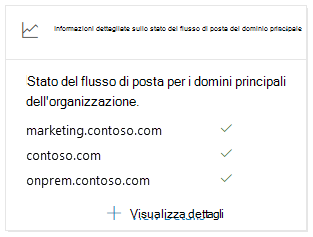
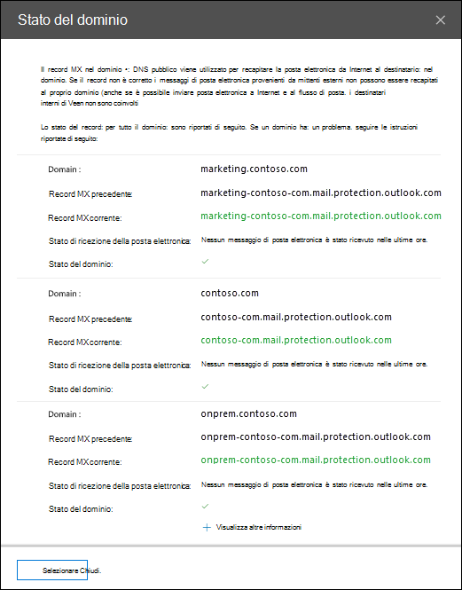

# Informazioni sullo stato del flusso di posta del dominio principale nel centro sicurezza & ComplianceTop domain mail flow status insight in the Security & Compliance Center

La panoramica dello **stato del flusso di posta del dominio principale** nel [Dashboard del flusso di posta elettronica](mail-flow-insights-v2.md) nel centro sicurezza & conformità fornisce lo stato corrente dei domini dell'organizzazione in termini di flusso di posta.The **Top domain mail flow status** insight in the [Mail flow dashboard](mail-flow-insights-v2.md) in the Security & Compliance Center gives you the current status for your organization's domains in terms of mail flow. Questo Insight consente di identificare e risolvere i problemi relativi ai domini che si verificano problemi di ***flusso di posta*** (ad esempio, non è possibile ricevere messaggi di posta elettronica esterni), in particolare le scadenze o i domini di dominio con record MX non corretti.This insight helps you identify and troubleshoot domains that are experiencing ***mail flow impacting*** issues (for example, unable to receive external email), especially domain expirations or domains with incorrect MX records.

Quando si fa clic su **Visualizza dettagli** nel widget, viene visualizzato un riquadro a comparsa di **stato del dominio** che Mostra più dettagli per lo stato di ogni dominio:When you click **View details** in the widget, a **Domain status** flyout appears that shows you more details for the status of each domain:

- **Dominio****Domain**
- **Record MX precedente****Previous MX record**
- **Record MX corrente****Current MX record**
- **Stato di ricezione della posta elettronica****Email receiving status**
- **Stato del dominio**: un segno di spunta verde indica che il record MX corrente (quando si è fatto clic sul widget) corrisponde al valore che abbiamo registrato e che il dominio ha ricevuto la posta elettronica nelle ultime due ore.**Domain status**: A green check mark indicates the current MX record (at the time you clicked on the widget) matches the value we have on record, and that the domain has received email during the past two hours.

  Una X rossa indica che il record MX è stato modificato e che il dominio non ha ricevuto alcun messaggio di posta elettronica nelle ultime 6 ore.A red X indicates the MX record has been changed, and that the domain has received no email during the past 6 hours. Questo indica probabilmente che il dominio è scaduto o che il record MX è stato aggiornato in modo errato.This likely indicates that your domain has expired, or that the MX record has been incorrectly updated. Verificare con il registrar o con il servizio di hosting DNS se il dominio è scaduto o se il record MX del dominio non è corretto.Check with your domain registrar or DNS hosting service to see if the domain has expired, or if the domain's MX record is incorrect.

È possibile fare clic su **Visualizza altro** per visualizzare le stesse informazioni relative a più domini.You can click **View more** to see the same information for more domains.

## Argomenti correlatiRelated topics

Per informazioni su altre intuizioni nel dashboard del flusso di posta, vedere [Mail Flow Insights in the Security & Compliance Center](mail-flow-insights-v2.md).For information about other insights in the Mail flow dashboard, see [Mail flow insights in the Security & Compliance Center](mail-flow-insights-v2.md).
