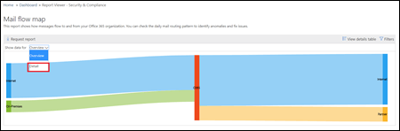

# Report Mappa flusso di postaMail flow map report

Questo rapporto fornisce informazioni dettagliate sul modo in cui la posta scorre nell'organizzazione.This report gives insights as to how mail flows through your organization. È possibile utilizzare queste informazioni per apprendere modelli, identificare anomalie e correggere i problemi man mano che si verificano.You can use this information to learn patterns, identify anomalies, and fix issues as they arise.

## Widget mappa del flusso di postaMail flow map widget

Per impostazione predefinita, la mappa del flusso di posta Visualizza il modello di flusso di posta di alto livello del giorno precedente.By default, the mail flow map shows the high level mail flow pattern from the previous day. È possibile utilizzare le frecce sinistra e destra per giorni diversi.You can use the left and right arrows for different days. Se si passa il puntatore del mouse su ogni area del report, viene visualizzato il volume di posta da e verso l'organizzazione, come illustrato nel diagramma seguente:Hovering your mouse cursor over each area in the report will show the volume of mail to and from your organization as shown in the following diagram:

## Nozioni di base sul flusso di postaMail flow map basics

Se si fa clic sul widget **mappa del flusso di posta elettronica** , verrà eseguito il rapporto **mappa del flusso di posta** .Clicking on the **Mail flow map** widget will take you to the **Mail flow map** report. In questa sezione è possibile visualizzare un livello di report più granulare, è possibile fare clic su Visualizza dettagli per visualizzare i dati dettagliati.Here you can see more granular level of report, you can click View details table to see detailed data. È inoltre possibile scaricare il report dettagliato facendo clic su Richiedi report.You can also download the detailed report by clicking Request report.

## DettagliDetails

Per impostazione predefinita, la **visualizzazione dei dati per** è impostata sul valore **Overview**.By default, **Show data for** is set to the value **Overview**. Quando si fa clic sul menu a discesa e si seleziona **Dettagli**, la visualizzazione passa al dettaglio del livello di dominio.When you click on the drop down and select **Detail**, the view switches to the domain level detail.

I domini principale del mittente e del destinatario sono elencati e gli altri verranno inseriti in **altri** , come illustrato nei diagrammi seguenti:The top sender and recipient domains are listed, and the rest will be put in **Others** as shown in the following diagrams:

## Approfondimenti correlatiRelated insights

Le informazioni correlate vengono visualizzate sotto la mappa del flusso di posta, se disponibili, ad esempio l'Insight del dominio del mittente o l'Insight del loop di posta elettronica.Related insights are shown beneath the Mail flow map if they're available (for example, the Sender domain insight or the Mail loop insight).

## Vedere ancheSee also

Per ulteriori informazioni su altre comprensioni del flusso di posta nel dashboard del flusso di posta, vedere [Mail Flow Insights in the Security & Compliance Center](mail-flow-insights-v2.md).For more information about other mail flow insights in the mail flow dashboard, see [Mail flow insights in the Security & Compliance Center](mail-flow-insights-v2.md).
