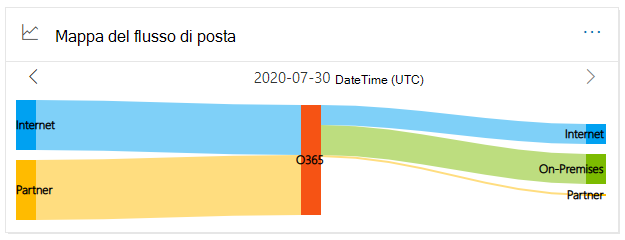
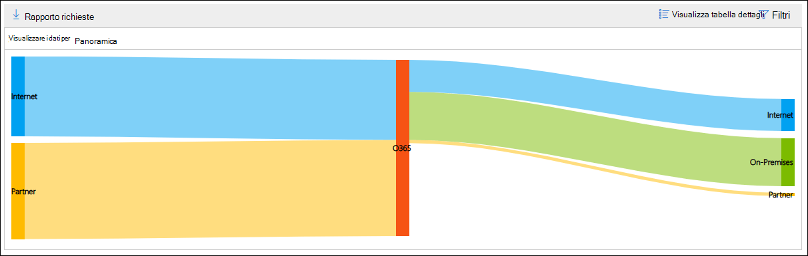
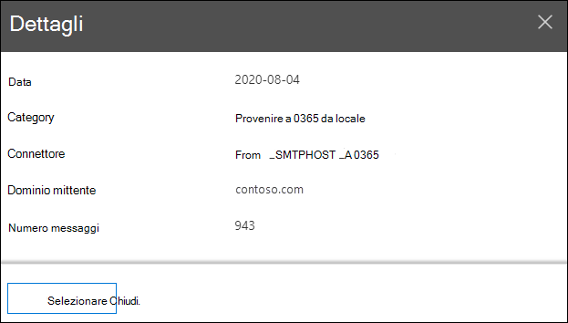

# Mappa del flusso di posta elettronica nel centro sicurezza & ComplianceMail flow map in the Security & Compliance Center

[!INCLUDE [Microsoft 365 Defender rebranding](../includes/microsoft-defender-for-office.md)]

La **mappa del flusso** di posta nel [Dashboard del flusso di posta](mail-flow-insights-v2.md) elettronica nel [Centro sicurezza & conformità](https://protection.office.com) fornisce informazioni su come scorre la posta attraverso la propria organizzazione.The **Mail flow map** in the [Mail flow dashboard](mail-flow-insights-v2.md) in the [Security & Compliance Center](https://protection.office.com) gives insight as to how mail flows through your organization. È possibile utilizzare queste informazioni per apprendere modelli, identificare anomalie e correggere i problemi che si verificano.You can use this information to learn patterns, identify anomalies, and fix issues as they occur.

Per impostazione predefinita, il widget Visualizza il modello del flusso di posta del giorno precedente in un grafico conosciuto come diagramma di *Sankey* .By default, the widget shows the mail flow pattern from the previous day in a chart known as a *Sankey* diagram. È possibile utilizzare il freccia sinistra freccia sinistra e freccia destra   per visualizzare le informazioni di giorni diversi.You can use the left arrow  and right arrow  to show information from different days. Ogni colore diverso rappresenta il flusso di posta su un connettore in ingresso o in uscita diverso (o senza l'utilizzo di connettori).Each different color represents mail flow over a different inbound or outbound connector (or without using connectors). Se si posiziona il puntatore del mouse su un colore specifico, il numero di messaggi viene visualizzato per il tipo di connettore.If you hover over a specific color, the number of messages is displayed for that type of connector.

## Visualizzazione report per la mappa del flusso di postaReport view for the Mail flow map

Se si fa clic sul widget **mappa del flusso di posta elettronica** , verrà eseguito il rapporto **mappa del flusso di posta** .Clicking on the **Mail flow map** widget will take you to the **Mail flow map** report.

Nella visualizzazione report sono disponibili i grafici seguenti:The following charts are available in the report view:

- Mostra **dati per: Panoramica** : è fondamentalmente una visualizzazione ingrandita del widget.**Show data for: Overview** : This is basically a larger view of the widget. Se si posiziona il puntatore del mouse su un colore specifico, il numero di messaggi viene visualizzato per il tipo di connettore.If you hover over a specific color, the number of messages is displayed for that type of connector.

  

- Mostra **dati per: dettaglio** : questa visualizzazione contiene informazioni dettagliate sui connettori e sui domini di destinazione.**Show data for: Detail** : This view shows details about the connectors and destination domains. I domini principale del mittente e del destinatario sono elencati e gli altri vengono inseriti in **altri**.The top sender and recipient domains are listed, and the rest are put in **Others**. Se si posiziona il puntatore del mouse su un colore e una sezione specifici, viene visualizzato il numero di messaggi.If you hover over a specific color and section, the number of messages is displayed.

  

Se si fa clic su **filtri** in una visualizzazione report, è possibile specificare un intervallo di date con data di **inizio** e **Data di fine**.If you click **Filters** in a report view, you can specify a date range with **Start date** and **End date**.

Per inviare tramite posta elettronica il report per un intervallo di date specifico a uno o più destinatari, fare clic su **Richiedi download**.To email the report for a specific date range to one or more recipients, click **Request download**.

Le informazioni correlate vengono visualizzate sotto la mappa del flusso di posta, se disponibili, ad esempio l' [Insight del ciclo di posta possibile](mfi-mail-loop-insight.md).Related insights are shown beneath the Mail flow map if they're available (for example, the [Fix possible mail loop insight](mfi-mail-loop-insight.md)).

## Visualizzazione della tabella dei dettagli per la mappa del flusso di postaDetails table view for the Mail flow map

Se si fa clic su **Visualizza tabella dettagli** in una visualizzazione report, vengono visualizzate le informazioni seguenti:If you click **View details table** in a report view, the following information is shown:

- **Data****Date**
- **Categoria****Category**
- **Connettore/provider di servizi di terze parti****Connector / Third-party service provider**
- **Dominio mittente/destinatario****Sender/Recipient domain**
- **Numero di messaggi****Message count**

Se si fa clic su **filtri** in una visualizzazione tabella dettagli, è possibile specificare un intervallo di date con data di **inizio** e **Data di fine**.If you click **Filters** in a details table view, you can specify a date range with **Start date** and **End date**.

Se si seleziona una riga, i dettagli simili vengono visualizzati in un riquadro a comparsa:If you select a row, similar details are shown in a flyout:

Per inviare tramite posta elettronica il report per un intervallo di date specifico a uno o più destinatari, fare clic su **Richiedi download**.To email the report for a specific date range to one or more recipients, click **Request download**.

Per tornare alla visualizzazione report, fare clic su **Visualizza report**.To go back to the reports view, click **View report**.

## Vedere ancheSee also

Per informazioni su altre intuizioni nel dashboard del flusso di posta, vedere [Mail Flow Insights in the Security & Compliance Center](mail-flow-insights-v2.md).For information about other insights in the Mail flow dashboard, see [Mail flow insights in the Security & Compliance Center](mail-flow-insights-v2.md).
