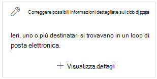
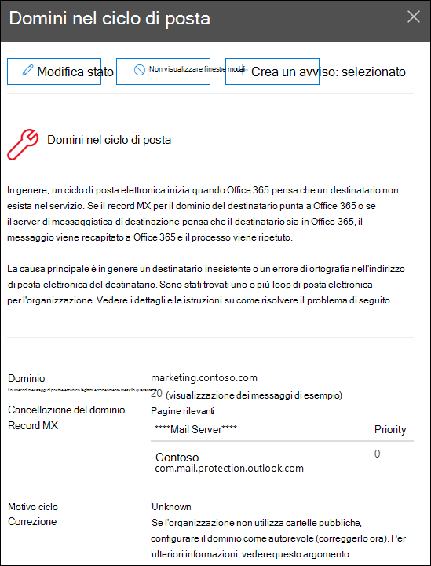

# Correggere le possibili informazioni dettagliate sul ciclo di posta nel Centro sicurezza & conformitàFix possible mail loop insight in the Security & Compliance Center

[!INCLUDE [Microsoft 365 Defender rebranding](../includes/microsoft-defender-for-office.md)]

**Si applica a****Applies to**
- [Exchange Online ProtectionExchange Online Protection](exchange-online-protection-overview.md)
- [Microsoft Defender per Office 365 piano 1 e piano 2Microsoft Defender for Office 365 plan 1 and plan 2](office-365-atp.md)
- [Microsoft 365 DefenderMicrosoft 365 Defender](../mtp/microsoft-threat-protection.md)

I cicli di posta non sono erri perché:Mail loops are bad because:

- Sprecano risorse di sistema.They waste system resources.
- Utilizzano la quota del volume di posta dell'organizzazione.They consume your organization's mail volume quota.
- Inviano rapporti di mancato recapito confusi (noti anche come rapporti di mancato recapito o notifiche di mancato recapito) ai mittenti dei messaggi originali.They send confusing non-delivery reports (also known as NDRs or bounce messages) to the original message senders.

La **correzione delle possibili** informazioni dettagliate sul ciclo di posta nell'area Consigliata per l'utente del [dashboard](mail-flow-insights-v2.md) del flusso di posta nel Centro sicurezza [&](https://protection.office.com) conformità notifica quando viene rilevato un ciclo di posta nell'organizzazione. The **Fix possible mail loop** insight in the **Recommended for you** area of the [Mail flow dashboard](mail-flow-insights-v2.md) in the [Security & Compliance Center](https://protection.office.com) notifies you when a mail loop is detected in your organization.

Queste informazioni vengono visualizzate solo dopo che la condizione è stata rilevata (se non sono presenti loop di posta, non verranno visualizzate le informazioni dettagliate).This insight appears only after the condition is detected (if you don't have any mail loops, you won't see the insight).

Quando si fa **clic su Visualizza** dettagli nel widget, viene visualizzato un riquadro a comparsa con ulteriori informazioni:When you click **View details** on the widget, a flyout appears with more information:

- **Dominio****Domain**
- **Numero di messaggi**: è possibile **fare** clic su Visualizza messaggi di esempio per visualizzare i risultati della traccia dei messaggi per un campione dei messaggi interessati dal ciclo. **Number of messages**: You can click **View sample messages** to see the [message trace](message-trace-scc.md) results for a sample of the messages that were affected by the loop.
- **Tipo di** dominio " Ad esempio, Autorevole o Non autorevole.**Domain type**" For example, Authoritative or Non-authoritative.
- **Record MX**: l'host (**Server di** posta ) e i valori **di** priorità del record MX per il dominio.**MX record**: The host (**Mail server**) and **Priority** values of the MX record for the domain.
- **Motivo del ciclo** **e come risolvere** il problema: identificheremo gli scenari di loop di posta più comuni e forniremo le azioni consigliate per correggere il ciclo.**Loop reason** and **How to fix**: We'll identify the most common mail loop scenarios and provide recommended actions to fix the loop.

## Vedere ancheSee also

Per informazioni su altre informazioni dettagliate nel dashboard del flusso di posta, vedere Informazioni dettagliate sul flusso di posta [nel Centro sicurezza & conformità.](mail-flow-insights-v2.md)For information about other insights in the Mail flow dashboard, see [Mail flow insights in the Security & Compliance Center](mail-flow-insights-v2.md).
