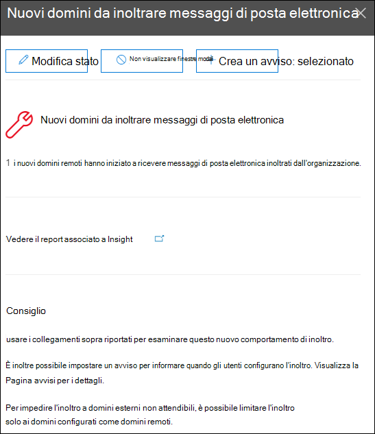

# Informazioni dettagliate sui nuovi domini inoltrati tramite posta elettronica nel Centro sicurezza & conformità

[!INCLUDE [Microsoft 365 Defender rebranding](../includes/microsoft-defender-for-office.md)]

**Si applica a**
- [Exchange Online Protection](exchange-online-protection-overview.md)
- [Microsoft Defender per Office 365 piano 1 e piano 2](office-365-atp.md)
- [Microsoft 365 Defender](../mtp/microsoft-threat-protection.md)

Esistono validi motivi aziendali per inoltrare i messaggi di posta elettronica a destinatari esterni in domini specifici. Tuttavia, è sospetto quando gli utenti dell'organizzazione iniziano improvvisamente a inoltrare i messaggi a un dominio a cui nessuno nell'organizzazione ha mai inoltrato i messaggi (un nuovo dominio).

Questa condizione potrebbe indicare che gli account utente sono compromessi. Se si sospetta che gli account siano stati compromessi, vedere [Risposta a un account di posta elettronica compromesso.](responding-to-a-compromised-email-account.md)

Le **informazioni dettagliate sui** nuovi domini inoltrati tramite posta elettronica nel Centro sicurezza [&](https://protection.office.com) conformità notificano quando gli utenti dell'organizzazione inoltrano i messaggi a nuovi domini.

Questa panoramica viene visualizzata solo quando viene rilevato il problema e viene visualizzata nella pagina [Rapporto di inoltro.](view-mail-flow-reports.md#forwarding-report)

Quando si fa clic sul widget, viene visualizzato un riquadro a comparsa in cui è possibile trovare ulteriori dettagli sui messaggi inoltrati, incluso un collegamento al [report Inoltro.](view-mail-flow-reports.md#forwarding-report)

È inoltre possibile accedere **a** questa pagina dei  dettagli quando si selezionano le informazioni dettagliate dopo aver fatto clic su Visualizza tutto nell'area Principali & suggerimenti su ( \> **Dashboard** report o <https://protection.office.com/insightdashboard> ).

Per impedire l'inoltro automatico dei messaggi a domini esterni, configurare un dominio remoto per alcuni o tutti i domini esterni. Per ulteriori informazioni, vedere [Manage remote domains in Exchange Online](/Exchange/mail-flow-best-practices/remote-domains/manage-remote-domains).

## Argomenti correlati

Per informazioni su altre informazioni dettagliate nel dashboard del flusso di posta, vedere Informazioni dettagliate sul flusso di posta [nel Centro sicurezza & conformità.](mail-flow-insights-v2.md)