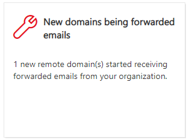

# Nuovi domini che vengono inoltrati Insight di posta elettronica nel centro sicurezza & ComplianceNew domains being forwarded email insight in the Security & Compliance Center

[!INCLUDE [Microsoft 365 Defender rebranding](../includes/microsoft-defender-for-office.md)]

Esistono motivi aziendali validi per inoltrare i messaggi di posta elettronica ai destinatari esterni in domini specifici.There are valid business reasons to forward email messages to external recipients in specific domains. Tuttavia, è sospettoso quando gli utenti dell'organizzazione iniziano improvvisamente a inoltrare i messaggi a un dominio in cui nessuno nell'organizzazione ha mai inoltrato messaggi a (un nuovo dominio).However, it's suspicious when users in your organization suddenly start forwarding messages to a domain where no one in your organization has ever forwarded messages to (a new domain).

Questa condizione potrebbe indicare che gli account utente sono compromessi.This condition might indicate that the user accounts are compromised. Se si sospetta che gli account siano stati compromessi, vedere [rispondere a un account di posta elettronica compromesso](https://docs.microsoft.com/microsoft-365/security/office-365-security/responding-to-a-compromised-email-account).If you suspect the accounts have been compromised, see [Responding to a compromised email account](https://docs.microsoft.com/microsoft-365/security/office-365-security/responding-to-a-compromised-email-account).

I **nuovi domini che vengono inoltrati tramite posta elettronica** nel [Centro sicurezza & Compliance](https://protection.office.com) notifica quando gli utenti dell'organizzazione stanno inoltrando i messaggi ai nuovi domini.The **New domains being forwarded email** insight in the [Security & Compliance Center](https://protection.office.com) notifies you when users in your organization are forwarding messages to new domains.

Questa intuizione viene visualizzata solo quando il problema viene rilevato e viene visualizzato nella pagina del [rapporto di inoltro](view-mail-flow-reports.md#forwarding-report) .This insight appears only when the issue is detected, and it appears on the [Forwarding report](view-mail-flow-reports.md#forwarding-report) page.

Quando si fa clic sul widget, viene visualizzato un riquadro a comparsa in cui è possibile trovare ulteriori dettagli sui messaggi inoltrati, incluso un collegamento al [rapporto di inoltro](view-mail-flow-reports.md#forwarding-report).When you click on the widget, a flyout appears where you can find more details about the forwarded messages, including a link back to the [Forwarding report](view-mail-flow-reports.md#forwarding-report).

È inoltre possibile accedere a questa pagina dei dettagli quando si seleziona l'Insight dopo aver fatto clic su **Visualizza tutti** nell'area **suggerimenti & consigliati** (dashboard dei **report** \> **Dashboard** o <https://protection.office.com/insightdashboard> ).You can also get to this details page when you select the insight after you click **View all** in the **Top insights & recommendations** area on ( **Reports** \> **Dashboard** or <https://protection.office.com/insightdashboard>).

Per impedire l'inoltro automatico dei messaggi ai domini esterni, configurare un dominio remoto per alcuni o per tutti i domini esterni.To prevent automatic message forwarding to external domains, configure a remote domain for some or all external domains. Per ulteriori informazioni, vedere [Manage Remote Domains in Exchange Online](https://docs.microsoft.com/Exchange/mail-flow-best-practices/remote-domains/manage-remote-domains).For more information, see [Manage remote domains in Exchange Online](https://docs.microsoft.com/Exchange/mail-flow-best-practices/remote-domains/manage-remote-domains).

## Argomenti correlatiRelated topics

Per informazioni su altre intuizioni nel dashboard del flusso di posta, vedere [Mail Flow Insights in the Security & Compliance Center](mail-flow-insights-v2.md).For information about other insights in the Mail flow dashboard, see [Mail flow insights in the Security & Compliance Center](mail-flow-insights-v2.md).
