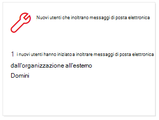
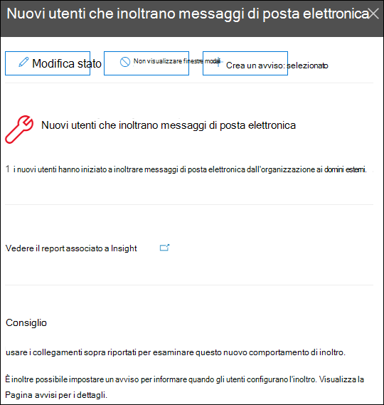
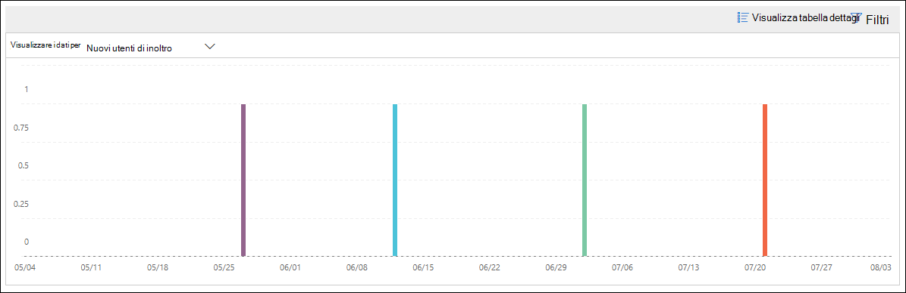
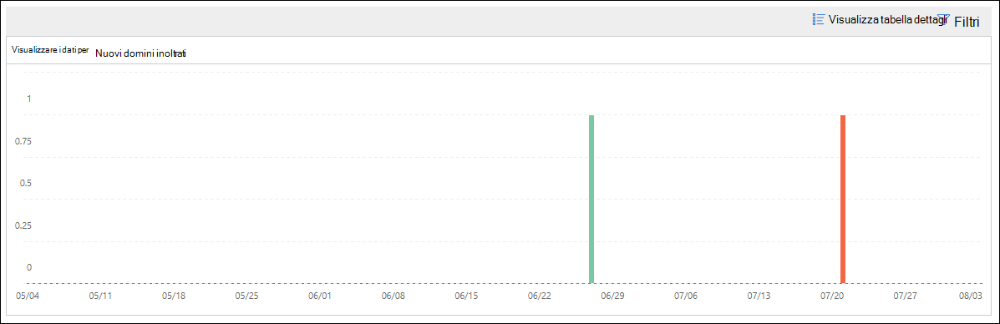

# Nuovi utenti che inoltrano informazioni sulla posta elettronica nel centro sicurezza & Compliance

È sospetto che i nuovi account utente dell'organizzazione inizino improvvisamente a inoltrare messaggi di posta elettronica ai domini esterni.

I **nuovi domini che vengono inoltrati tramite posta elettronica** nel [Centro sicurezza & Compliance](https://protection.office.com) notifica quando gli utenti appena creati nell'organizzazione stanno inoltrando i messaggi a domini esterni. Questa condizione potrebbe indicare che sono stati utilizzati account di amministrazione compromessi per creare i nuovi utenti. Se si sospetta che gli account siano stati compromessi, vedere [rispondere a un account di posta elettronica compromesso](https://docs.microsoft.com/microsoft-365/security/office-365-security/responding-to-a-compromised-email-account).

Questa intuizione viene visualizzata solo quando il problema viene rilevato e viene visualizzato nella pagina del [rapporto di inoltro](view-mail-flow-reports.md#forwarding-report) .

Quando si fa clic sul widget, viene visualizzato un riquadro a comparsa in cui è possibile trovare ulteriori dettagli sui messaggi inoltrati, incluso un collegamento al [rapporto modifiche di inoltro](#forwarding-modifications-report) come descritto più avanti in questo argomento.

È inoltre possibile accedere a questa pagina dei dettagli quando si seleziona l'Insight dopo aver fatto clic su **Visualizza tutti** nell'area **suggerimenti & consigliati** (dashboard dei**report** \> **Dashboard** o <https://protection.office.com/insightdashboard> ).

È possibile fare clic sul collegamento **Visualizza rapporto associato a Insight** per passare al **rapporto modifiche di inoltro** come descritto nella sezione successiva.

## Report sulle modifiche di inoltro

Il **rapporto modifiche di inoltro** Visualizza i dettagli sui messaggi che vengono inoltrati automaticamente dai mittenti nell'organizzazione:

- Account appena creati che inoltrano messaggi a domini esterni.
- Account che inoltrano messaggi a domini esterni che non sono mai stati inoltrati da altri mittenti nell'organizzazione.

Questi tipi di messaggi inoltrati possono rappresentare un rischio per la sicurezza o la conformità e potrebbero indicare account compromessi.

Il report contiene dati per un massimo di 90 giorni. Per impostazione predefinita, il report Visualizza i dati per gli ultimi 7 giorni.

Questo report non è disponibile direttamente nel [Dashboard del flusso di posta](mail-flow-insights-v2.md) o nel [dashboard dei report](view-mail-flow-reports.md). Oltre a fare clic sul collegamento **Visualizza rapporto associato a Insight** nell'Insight della **posta elettronica per l'inoltro di nuovi utenti** , è possibile accedere al rapporto:

- Facendo clic sul collegamento **segnala notifiche di inoltro** nei dettagli dei [nuovi domini che vengono inoltrati tramite posta elettronica Insight](mfi-new-domains-being-forwarded-email.md).
- Apertura <https://protection.office.com/reportv2?id=MailFlowNewForwarding> .

### Visualizzazione report per il rapporto modifiche di inoltro

Nella visualizzazione report sono disponibili i grafici seguenti:

- **Mostra dati per: nuovi utenti di inoltro**:

  

- **Mostra dati per: nuovi domini di inoltro**:

  

Se si fa clic su **filtri** in una visualizzazione report, è possibile specificare un intervallo di date con data di **inizio** e **Data di fine**.

### Visualizzazione tabella dettagli per il report modifiche di inoltro

Se si fa clic su **Visualizza tabella dettagli**, le informazioni visualizzate dipendono dal grafico che si sta esaminando:

- **Mostra dati per: nuovi utenti di inoltro**:

  - **Nome**: l'indirizzo di posta elettronica del mittente.
  - **Tipo di inoltro**
  - **Indirizzo del destinatario**
  - **Dettagli**
  - **Numero**
  - **Prima data di inoltro**

- **Mostra dati per: nuovi domini di inoltro**:

  - **Nome**: il dominio di posta elettronica del mittente.
  - **Tipo di inoltro**
  - **Indirizzo del destinatario**
  - **Dettagli**
  - **Numero**
  - **Prima data di inoltro**

Se si fa clic su **filtri** in una visualizzazione tabella dettagli, è possibile specificare un intervallo di date con data di **inizio** e **Data di fine**.

Se si seleziona una riga dalla tabella, verrà visualizzato un riquadro a comparsa **Dettagli** con le informazioni seguenti:

- **Nome**: questo è l'indirizzo di posta elettronica del mittente (da Mostra **dati per: nuova visualizzazione utenti di inoltro** ) o il dominio di posta elettronica del mittente (da Mostra **dati per: nuova visualizzazione domini di inoltro** ).
- **Tipo di inoltro**
- **Destinatario**
- **Dettagli**
- **Numero**
- **Data di inizio**
- **Suggerimento**: da qui, è possibile fare clic sul collegamento per gestire l'utente nell'interfaccia di amministrazione di Microsoft 365.

Per tornare alla visualizzazione report, fare clic su **Visualizza report**.

## Argomenti correlati

Per informazioni su altre intuizioni nel dashboard del flusso di posta, vedere [Mail Flow Insights in the Security & Compliance Center](mail-flow-insights-v2.md).
