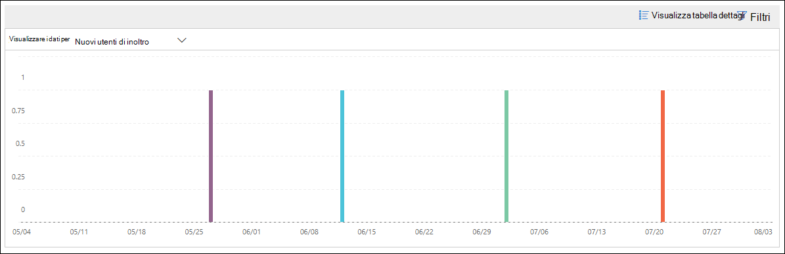
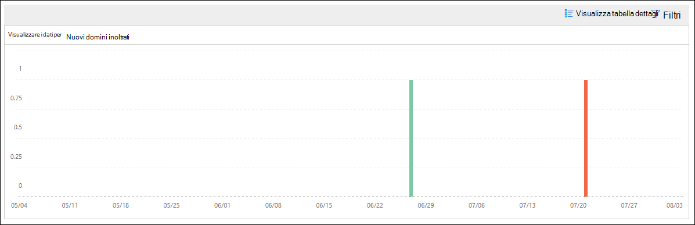

# Nuovi utenti che inoltrano informazioni sulla posta elettronica nel centro sicurezza & ComplianceNew users forwarding email insight in the Security & Compliance Center

È sospetto che i nuovi account utente dell'organizzazione inizino improvvisamente a inoltrare messaggi di posta elettronica ai domini esterni.It's suspicious when new user accounts in your organization suddenly start forwarding email messages to external domains.

I **nuovi domini che vengono inoltrati tramite la posta elettronica** vengono avvisati quando gli utenti appena creati nell'organizzazione stanno inoltrando messaggi a domini esterni.The **New domains being forwarded email** insight notifies you when newly-created users in your organization are forwarding messages to external domains. Questa condizione potrebbe indicare che sono stati utilizzati account di amministrazione compromessi per creare i nuovi utenti.This condition could indicate compromised admin accounts were used to create the new users. Se si sospetta che gli account siano stati compromessi, vedere [rispondere a un account di posta elettronica compromesso](https://docs.microsoft.com/microsoft-365/security/office-365-security/responding-to-a-compromised-email-account).If you suspect the accounts have been compromised, see [Responding to a compromised email account](https://docs.microsoft.com/microsoft-365/security/office-365-security/responding-to-a-compromised-email-account).

Questa intuizione viene visualizzata solo quando il problema viene rilevato e viene visualizzato nella pagina del [rapporto di inoltro](view-mail-flow-reports.md#forwarding-report) .This insight appears only when the issue is detected, and it appears on the [Forwarding report](view-mail-flow-reports.md#forwarding-report) page.

Quando si fa clic sul widget, viene visualizzato un riquadro a comparsa in cui è possibile trovare ulteriori dettagli sui messaggi inoltrati, incluso un collegamento al [rapporto modifiche di inoltro](#forwarding-modifications-report) come descritto più avanti in questo argomento.When you click on the widget, a flyout appears where you can find more details about the forwarded messages, including a link to the [Forwarding modifications report](#forwarding-modifications-report) as described later in this topic.

È inoltre possibile accedere a questa pagina dei dettagli quando si seleziona l'Insight dopo aver fatto clic su **Visualizza tutti** nell'area **suggerimenti & consigliati** (dashboard dei**report** \> **Dashboard** o <https://protection.office.com/insightdashboard> ).You can also get to this details page when you select the insight after you click **View all** in the **Top insights & recommendations** area on (**Reports** \> **Dashboard** or <https://protection.office.com/insightdashboard>).

È possibile fare clic sul collegamento **Visualizza rapporto associato a Insight** per passare al **rapporto modifiche di inoltro** come descritto nella sezione successiva.You can click the **See report associated with insight** link to go to the **Forwarding modifications report** as described in the next section.

## Report sulle modifiche di inoltroForwarding modifications report

Il **rapporto modifiche di inoltro** Visualizza i dettagli sui messaggi che vengono inoltrati automaticamente dai mittenti nell'organizzazione:The **Forwarding modifications report** shows details about messages that are being automatically forwarded from senders in your organization:

- Account appena creati che inoltrano messaggi a domini esterni.Newly-created accounts that are forwarding messages to external domains.
- Account che inoltrano messaggi a domini esterni che non sono mai stati inoltrati da altri mittenti nell'organizzazione.Accounts that are forwarding messages to external domains that have never been forwarded to by other senders in your organization.

Questi tipi di messaggi inoltrati possono rappresentare un rischio per la sicurezza o la conformità e potrebbero indicare account compromessi.These types of forwarded messages can pose a security or compliance risk, and might indicate compromised accounts.

Il report contiene dati per un massimo di 90 giorni.The report contains data for up to 90 days. Per impostazione predefinita, il report Visualizza i dati per gli ultimi 7 giorni.By default, the report shows data for the last 7 days.

Questo report non è disponibile direttamente nel [Dashboard del flusso di posta](mail-flow-insights-v2.md) o nel [dashboard dei report](view-mail-flow-reports.md).This report isn't directly available in the [Mail flow dashboard](mail-flow-insights-v2.md) or in the [Reports dashboard](view-mail-flow-reports.md). Oltre a fare clic sul collegamento **Visualizza rapporto associato a Insight** nell'Insight della **posta elettronica per l'inoltro di nuovi utenti** , è possibile accedere al rapporto:In addition to clicking the **See report associated with insight** link in the **New users forwarding email** insight, you get to the report by:

- Facendo clic sul collegamento **segnala notifiche di inoltro** nei dettagli dei [nuovi domini che vengono inoltrati tramite posta elettronica Insight](mfi-new-domains-being-forwarded-email.md).Clicking the **Forwarding notifications report** link in the details of the [New domains being forwarded email insight](mfi-new-domains-being-forwarded-email.md).
- Apertura <https://protection.office.com/reportv2?id=MailFlowNewForwarding> .Opening <https://protection.office.com/reportv2?id=MailFlowNewForwarding>.

### Visualizzazione report per il rapporto modifiche di inoltroReport view for the Forwarding modifications report

Nella visualizzazione report sono disponibili i grafici seguenti:The following charts are available in the report view:

- **Mostra dati per: nuovi utenti di inoltro**:**Show data for: New forwarding users**:

  

- **Mostra dati per: nuovi domini di inoltro**:**Show data for: New forwarding domains**:

  

Se si fa clic su **filtri** in una visualizzazione report, è possibile specificare un intervallo di date con data di **inizio** e **Data di fine**.If you click **Filters** in a report view, you can specify a date range with **Start date** and **End date**.

### Visualizzazione tabella dettagli per il report modifiche di inoltroDetails table view for the Forwarding modifications report

Se si fa clic su **Visualizza tabella dettagli**, le informazioni visualizzate dipendono dal grafico che si sta esaminando:If you click **View details table**, the information that's shown depends on the chart you were looking at:

- **Mostra dati per: nuovi utenti di inoltro**:**Show data for: New forwarding users**:

  - **Nome**: l'indirizzo di posta elettronica del mittente.**Name**: The email address of the sender.
  - **Tipo di inoltro****Forwarding type**
  - **Indirizzo del destinatario****Recipient address**
  - **Dettagli****Details**
  - **Numero****Count**
  - **Prima data di inoltro****First forward date**

- **Mostra dati per: nuovi domini di inoltro**:**Show data for: New forwarding domains**:

  - **Nome**: il dominio di posta elettronica del mittente.**Name**: The email domain of the sender.
  - **Tipo di inoltro****Forwarding type**
  - **Indirizzo del destinatario****Recipient address**
  - **Dettagli****Details**
  - **Numero****Count**
  - **Prima data di inoltro****First forward date**

Se si fa clic su **filtri** in una visualizzazione tabella dettagli, è possibile specificare un intervallo di date con data di **inizio** e **Data di fine**.If you click **Filters** in a details table view, you can specify a date range with **Start date** and **End date**.

Se si seleziona una riga dalla tabella, verrà visualizzato un riquadro a comparsa **Dettagli** con le informazioni seguenti:If you select a row from the table, a **Details** flyout appears with the following information:

- **Nome**: questo è l'indirizzo di posta elettronica del mittente (da Mostra **dati per: nuova visualizzazione utenti di inoltro** ) o il dominio di posta elettronica del mittente (da Mostra **dati per: nuova visualizzazione domini di inoltro** ).**Name**: This is either the sender's email address (from **Show data for: New forwarding users** view) or the sender's email domain (from **Show data for: New forwarding domains** view).
- **Tipo di inoltro****Forwarding type**
- **Destinatario****Recipient**
- **Dettagli****Details**
- **Numero****Count**
- **Data di inizio****Start date**
- **Suggerimento**: da qui, è possibile fare clic sul collegamento per gestire l'utente nell'interfaccia di amministrazione di Microsoft 365.**Recommendation**: From here, you can click the link to manage the user in the Microsoft 365 admin center.

Per tornare alla visualizzazione report, fare clic su **Visualizza report**.To go back to the reports view, click **View report**.

## Argomenti correlatiRelated topics

Per informazioni su altre intuizioni nel dashboard del flusso di posta, vedere [Mail Flow Insights in the Security & Compliance Center](mail-flow-insights-v2.md).For information about other insights in the Mail flow dashboard, see [Mail flow insights in the Security & Compliance Center](mail-flow-insights-v2.md).
