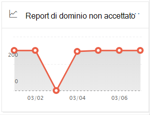
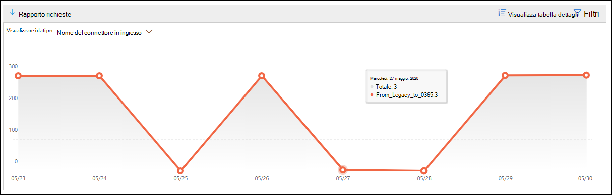

# Report dominio non accettato nel Centro sicurezza & conformitàNon-accepted domain report in the Security & Compliance Center

[!INCLUDE [Microsoft 365 Defender rebranding](../includes/microsoft-defender-for-office.md)]

**Si applica a****Applies to**
- [Exchange Online ProtectionExchange Online Protection](https://go.microsoft.com/fwlink/?linkid=2148611)
- [Microsoft Defender per Office 365 piano 1 e piano 2Microsoft Defender for Office 365 plan 1 and plan 2](https://go.microsoft.com/fwlink/?linkid=2148715)
- [Microsoft 365 DefenderMicrosoft 365 Defender](https://go.microsoft.com/fwlink/?linkid=2118804)

Il **report** Dominio non accettato nel [dashboard](mail-flow-insights-v2.md) del flusso di posta nel Centro sicurezza [&](https://protection.office.com) conformità visualizza informazioni sui messaggi provenienti dall'organizzazione di posta elettronica locale in cui il dominio del mittente non è configurato come dominio accettato nell'organizzazione di Microsoft 365.The **Non-accepted domain** report in the [Mail flow dashboard](mail-flow-insights-v2.md) in the [Security & Compliance Center](https://protection.office.com) displays information about messages from your on-premises email organization where the sender's domain isn't configured as an accepted domain in your Microsoft 365 organization.

Microsoft 365 potrebbe limitazione di questi messaggi se si dispone di dati per dimostrare che l'intento di questi messaggi è dannoso.Microsoft 365 might throttle these messages if we have data to prove that the intent of these messages is malicious. Pertanto, è importante comprendere cosa sta succedendo e risolvere il problema.Therefore, it's important for you to understand what's happening and to fix the issue.

## Visualizzazione report per il rapporto dominio non accettatoReport view for the Non-accepted domain report

Se si fa clic sul grafico **nel** widget Dominio non accettato, verrà visualizzato il report **Dominio non** accettato.Clicking the chart on the **Non-accepted domain** widget will take you to the **Non-accepted domain** report.

Per impostazione predefinita, viene visualizzata l'attività per tutti i connettori interessati.By default, the activity for all affected connectors is shown. Se si fa **clic su Mostra dati per**, è possibile selezionare un connettore specifico nell'elenco a discesa.If you click **Show data for**, you can select a specific connector from the dropdown.

Se si passa il mouse su un punto dati (giorno) nel grafico, viene visualizzato il numero totale di messaggi per il connettore.If you hover over a data point (day) in the chart, you'll see the total number of messages for the connector.

## Visualizzazione della tabella dei dettagli per il report dominio non accettatoDetails table view for the Non-accepted domain report

Se si fa **clic su Visualizza tabella dettagli** in una visualizzazione report, vengono visualizzate le informazioni seguenti:If you click **View details table** in a report view, the following information is shown:

- **Data****Date**
- **Nome connettore in ingresso****Inbound connector name**
- **Dominio del mittente****Sender domain**
- **Numero messaggi****Message count**
- **Messaggi di esempio**: ID messaggio di un campione di messaggi interessati.**Sample messages**: The message IDs of a sample of affected messages.

Se si fa **clic su Filtri** in una visualizzazione tabella dei dettagli, è possibile specificare un intervallo di date con Data di inizio **e** Data **di fine.**If you click **Filters** in a details table view, you can specify a date range with **Start date** and **End date**.

Per inviare tramite posta elettronica il report per un intervallo di date specifico a uno o più destinatari, fare clic **su Richiedi download.**To email the report for a specific date range to one or more recipients, click **Request download**.

Quando si seleziona una riga nella tabella, viene visualizzato un riquadro a comparsa con le informazioni seguenti:When you select a row in the table, a flyout appears with the following information:

- **Data****Date**
- **Nome connettore in ingresso****Inbound connector name**
- **Dominio del mittente****Sender domain**
- **Numero messaggi****Message count**
- **Messaggi di esempio:** è possibile fare clic **su Visualizza** messaggi di esempio per visualizzare i risultati [della](message-trace-scc.md) traccia dei messaggi per un campione dei messaggi interessati.**Sample messages**: You can click **View sample messages** to see the [message trace](message-trace-scc.md) results for a sample of the affected messages.

Per tornare alla visualizzazione report, fare clic su **Visualizza report.**To go back to the reports view, click **View report**.

## Argomenti correlatiRelated topics

Per informazioni su altre informazioni dettagliate nel dashboard del flusso di posta, vedere Informazioni dettagliate sul flusso di posta [nel Centro sicurezza & conformità.](mail-flow-insights-v2.md)For information about other insights in the Mail flow dashboard, see [Mail flow insights in the Security & Compliance Center](mail-flow-insights-v2.md).
