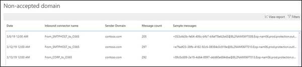

# Report di dominio non accettato

Analogamente all'Insight del **dominio del mittente** , l'Insight del **dominio non accettato** identifica i messaggi provenienti dall'organizzazione di posta elettronica locale, ma il dominio del mittente non è configurato come dominio accettato nell'organizzazione di Office 365.

Se si dispone di dati per dimostrare che lo scopo di questi messaggi è dannoso, Office 365 potrebbe limitare tali messaggi. Pertanto, è importante capire cosa succede e risolvere il problema.

Quando si fa clic sul widget, viene portato al rapporto completo. Nel report completo, in cui è possibile fare clic su **Visualizza dettagli** per visualizzare le informazioni in una tabella, come illustrato nel diagramma seguente:

Quando si seleziona una riga nella tabella, viene visualizzato un riquadro a comparsa per visualizzare ulteriori dettagli. È possibile fare clic su **Visualizza messaggi di esempio** per visualizzare alcuni dei messaggi identificati.

## Vedere anche

Per ulteriori informazioni su altre comprensioni del flusso di posta nel dashboard del flusso di posta, vedere [Mail Flow Insights in the Security & Compliance Center](mail-flow-insights-v2.md).
