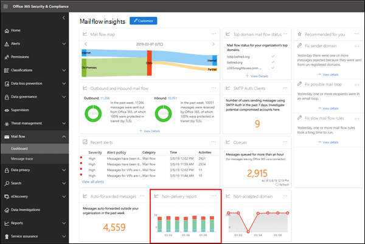
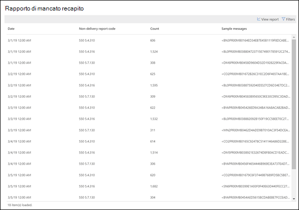

# Rapporto di mancato recapito

Il **rapporto di mancato recapito** indica i codici di errore più rilevati nei rapporti di mancato recapito (noti anche come NDR o messaggi di rimbalzo) per gli utenti dell'organizzazione. Questo rapporto è destinato a visualizzare i dettagli dei rapporti di mancato recapito, quindi è possibile risolvere i problemi.

È possibile visualizzare informazioni su tutti i codici di mancato recapito o su un codice specifico facendo clic su **Mostra dati per**. È inoltre possibile fare clic su **Visualizza dettagli** per visualizzare una visualizzazione più dettagliata, come illustrato nel diagramma seguente:

Quando si seleziona una riga nella tabella per visualizzare i dettagli del rapporto di mancato recapito specifico, è possibile utilizzare le informazioni dettagliate per risolvere i problemi e intraprendere le azioni necessarie.

## Argomenti correlati

Per ulteriori informazioni su altre comprensioni del flusso di posta nel dashboard del flusso di posta, vedere [Mail Flow Insights in the Security & Compliance Center](mail-flow-insights-v2.md).
