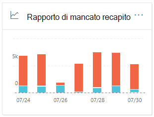
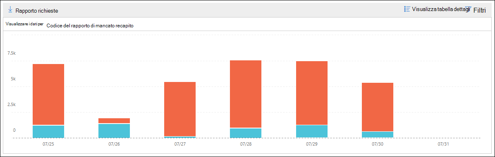

# Rapporto di mancato recapito nel centro sicurezza & Compliance

Il **rapporto di mancato recapito** nel [Dashboard del flusso di posta](mail-flow-insights-v2.md) nel centro sicurezza & conformità Visualizza i codici di errore più rilevati nei rapporti di mancato recapito (noti anche come NDR o messaggi di rimbalzo) per gli utenti dell'organizzazione. Questo rapporto Visualizza i dettagli dei rapporti di mancato recapito in modo da poter risolvere i problemi relativi al parto.

## Visualizzazione report per il rapporto di mancato recapito

Se si fa clic sul widget del **rapporto di mancato recapito** , verrà eseguito il **rapporto di mancato recapito**.

Per impostazione predefinita, viene visualizzata l'attività per tutti i codici di errore. Se si fa clic su **Mostra dati per**, è possibile selezionare un codice di errore specifico dall'elenco a discesa.

Se si posiziona il puntatore del mouse su un colore specifico (codice di errore) in un giorno specifico del grafico, verrà visualizzato il numero totale di messaggi per l'errore.

## Visualizzazione della tabella dei dettagli per il rapporto di mancato recapito

Se si fa clic su **Visualizza tabella dettagli** in una visualizzazione report, vengono visualizzate le informazioni seguenti:

- **Data**
- **Codice del rapporto di mancato recapito**
- **Numero**
- **Messaggi di esempio**: ID del messaggio di un esempio di messaggi coinvolti.

Se si fa clic su **filtri** in una visualizzazione tabella dettagli, è possibile specificare un intervallo di date con data di **inizio** e **Data di fine**.

Per inviare tramite posta elettronica il report per un intervallo di date specifico a uno o più destinatari, fare clic su **Richiedi download**.

Quando si seleziona una riga nella tabella, viene visualizzato un riquadro a comparsa con le seguenti informazioni:

- **Data**
- **Codice del rapporto di mancato recapito**: è possibile fare clic sul collegamento per ottenere ulteriori informazioni sulle cause e sulle soluzioni per il codice di errore specifico.
- **Numero**
- **Messaggi di esempio**: è possibile fare clic su **Visualizza messaggi di esempio** per visualizzare i risultati della [traccia](message-trace-scc.md) dei messaggi per un esempio di messaggi coinvolti.

## Argomenti correlati

Per informazioni su altre intuizioni nel dashboard del flusso di posta, vedere [Mail Flow Insights in the Security & Compliance Center](mail-flow-insights-v2.md).
