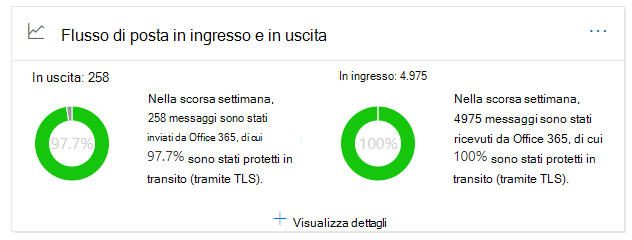
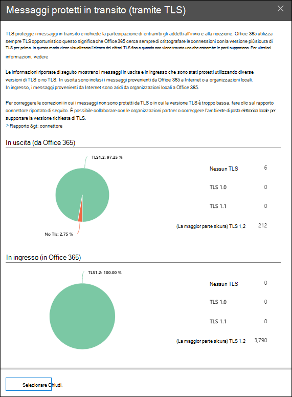

# Insight sul flusso di posta in uscita e in ingresso nel centro sicurezza & Compliance

[!INCLUDE [Microsoft 365 Defender rebranding](../includes/microsoft-defender-for-office.md)]

L'Insight sul **flusso di posta in uscita e in ingresso** nel dashboard del flusso di [posta](mail-flow-insights-v2.md) nel [Centro sicurezza & conformità](https://protection.office.com) unisce le informazioni del [rapporto connettore](view-mail-flow-reports.md#connector-report) e il precedente **rapporto di panoramica TLS** in un'unica posizione.

Il widget Visualizza la crittografia TLS utilizzata per la connessione quando i messaggi vengono recapitati da e verso l'organizzazione. Le connessioni stabilite con altri servizi di posta elettronica vengono crittografate tramite TLS quando TLS viene offerto da entrambi i lati. Il widget offre un'istantanea dell'ultima settimana di flusso di posta.

Le informazioni contenute nel widget sono correlate ai connettori e alla protezione dei messaggi TLS in Microsoft 365. Per ulteriori informazioni, vedere gli argomenti riportati di seguito:

- [Configurare il flusso di posta utilizzando i connettori](https://docs.microsoft.com/exchange/mail-flow-best-practices/use-connectors-to-configure-mail-flow/use-connectors-to-configure-mail-flow)
- [Come Exchange Online USA TLS per proteggere le connessioni di posta elettronica](https://docs.microsoft.com/microsoft-365/compliance/exchange-online-uses-tls-to-secure-email-connections)
- [Informazioni di riferimento tecnico sulla crittografia in Microsoft 365](https://docs.microsoft.com/microsoft-365/compliance/technical-reference-details-about-encryption)

## Protezione dei messaggi in transito (tramite TLS)

Quando si fa clic su **Visualizza dettagli** nel widget, il riquadro a comparsa del **messaggio protetto in transito (tramite TLS)** Mostra la protezione TLS per i messaggi in entrata e in uscita dall'organizzazione.

Attualmente, TLS 1,2 è la versione più sicura di TLS offerta da Microsoft 365. Spesso, è necessario conoscere la crittografia TLS utilizzata per i controlli di conformità. Probabilmente non si ha una relazione diretta con la maggior parte dei server di posta elettronica di origine e di destinazione (non è proprietaria e non è presente né Microsoft), pertanto non sono disponibili molte opzioni per migliorare la crittografia TLS utilizzata da tali server.

Tuttavia, è possibile utilizzare i [connettori](https://docs.microsoft.com/exchange/mail-flow-best-practices/use-connectors-to-configure-mail-flow/use-connectors-to-configure-mail-flow) per garantire la migliore protezione TLS disponibile per i messaggi inviati tra i server di posta elettronica e Microsoft 365. Il flusso di posta tra Microsoft 365 e i server di posta elettronica personali o i server appartenenti ai propri partner è spesso più importante e sensibile rispetto ai messaggi normali, quindi si desidera applicare maggiore sicurezza e vigilanza ai messaggi.

È possibile aggiornare o correggere i propri server di posta elettronica per migliorare la crittografia TLS utilizzata o rivolgersi ai propri partner per fare lo stesso. Il **rapporto del connettore** Visualizza sia il volume del flusso di posta che la crittografia TLS per i messaggi che utilizzano i connettori Microsoft 365.

È possibile fare clic sul collegamento del **rapporto connettore** per passare al [rapporto del connettore](view-mail-flow-reports.md#connector-report). Se è stata rilevata la condizione associata, è possibile che nella pagina del **rapporto del connettore** siano disponibili le informazioni seguenti:

- **Connettore partner in ingresso che vede il flusso di posta TLS 1.0 significativo**
- **Connettore onlocali in ingresso che vede il flusso di posta di TLS 1.0 significativo**

Per le connessioni TLS 1,0, è effettivamente necessario ottenere il server di posta elettronica o il server del partner aggiornato o risolto per evitare eventuali problemi quando il supporto di TLS 1,0 è obsoleto in Microsoft 365.

## Vedere anche

Per informazioni su altre intuizioni nel dashboard del flusso di posta, vedere [Mail Flow Insights in the Security & Compliance Center](mail-flow-insights-v2.md).
