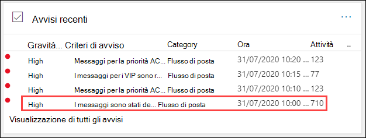
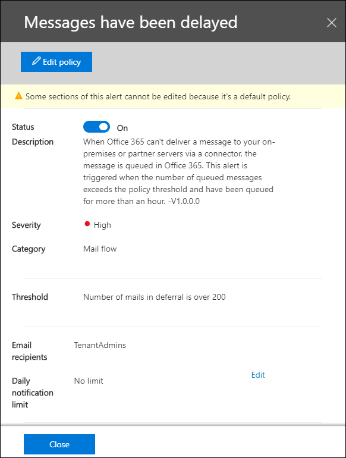
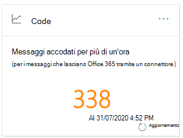
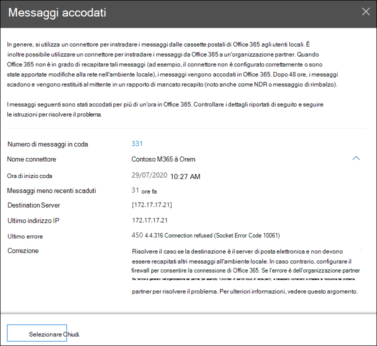
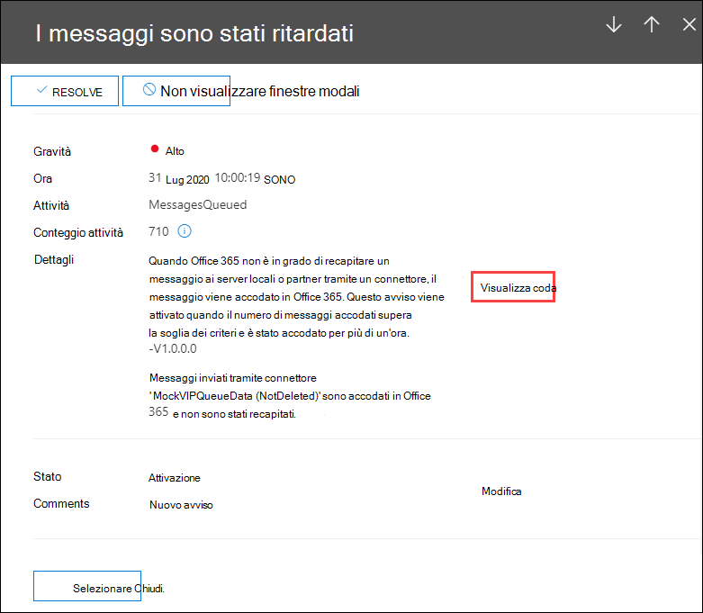

# Insight nelle code nel centro sicurezza & Compliance

[!INCLUDE [Microsoft 365 Defender rebranding](../includes/microsoft-defender-for-office.md)]

Quando i messaggi non possono essere inviati dall'organizzazione ai server di posta elettronica locali o partner utilizzando i connettori, i messaggi vengono accodati in Microsoft 365. Esempi comuni che causano questa condizione sono:

- Il connettore non è configurato correttamente.
- Sono state apportate modifiche alla rete o al firewall nell'ambiente locale.

Microsoft 365 continuerà a riprovare al recapito per 24 ore. Dopo 24 ore, i messaggi scadranno e verranno restituiti ai mittenti nei rapporti di mancato recapito (noti anche come NDR o messaggi di rimbalzo).

Se il volume della posta in coda supera la soglia predefinita (il valore predefinito è 200 messaggi), le informazioni sono disponibili nelle posizioni seguenti:

- Le **Code** Insight nel dashboard del [flusso di posta elettronica](mail-flow-insights-v2.md) nel [Centro sicurezza & Compliance](https://protection.office.com). Per ulteriori informazioni, vedere l'articolo relativo alle [code nella sezione Dashboard del flusso di posta](#queues-insight-in-the-mail-flow-dashboard) di questo argomento.
  
- Viene visualizzato un avviso in **avvisi recenti** il dashboard avvisi nel [Centro sicurezza & conformità](https://protection.office.com) (Dashboard **avvisi** \> **Dashboard** o <https://protection.office.com/alertsdashboard> ).

  

- Gli amministratori riceveranno una notifica tramite posta elettronica in base alla configurazione del criterio di avviso predefinito denominato **messaggi che sono stati posticipati**. Per configurare le impostazioni di notifica per questo avviso, vedere la sezione successiva.

  Per ulteriori informazioni sui criteri di avviso, vedere [criteri di avviso nel centro sicurezza & conformità](../../compliance/alert-policies.md).

## Personalizzare gli avvisi delle code

1. Nel [Centro sicurezza & conformità](https://protection.office.com), accedere a criteri **Alerts** di \> **avviso** avvisi o Apri <https://protection.office.com/alertpolicies> .

2. Nella pagina **criteri di avviso** individuare e selezionare i criteri denominati **messaggi sono stati posticipati**.

3. Nel riquadro a comparsa **ritardato** che si apre, è possibile abilitare o disabilitare l'avviso e configurare le impostazioni di notifica.

   

   - **Stato** : è possibile attivare o disattivare l'avviso.

   - **Destinatari della posta elettronica** e **limite di notifica giornaliero** : fare clic su **modifica** per configurare le impostazioni seguenti:

4. Per configurare le impostazioni di notifica, fare clic su **modifica**. Nel riquadro a comparsa dei **criteri di modifica** che viene visualizzato, configurare le seguenti impostazioni:

   - **Invia notifiche tramite posta elettronica** : il valore predefinito è attivato.
   - **Destinatari della posta elettronica** : il valore predefinito è **TenantAdmins**.
   - **Limite di notifica giornaliero** : il valore predefinito è **Nessun limite**.
   - **Soglia** : il valore predefinito è 200.

   

5. Al termine, fare clic su **Salva** e **Chiudi**.

## Insight nelle code nel dashboard del flusso di posta

Anche se il volume del messaggio in coda non ha superato la soglia e ha generato un avviso, è comunque possibile utilizzare le **Code** Insight nel [Dashboard del flusso di posta](mail-flow-insights-v2.md) per visualizzare i messaggi accodati per più di un'ora e intervenire prima che il numero di messaggi in coda diventi troppo elevato.

Se si fa clic sul numero di messaggi sul widget, viene visualizzato un riquadro a comparsa in **coda dei messaggi** con le seguenti informazioni:

- **Numero di messaggi in coda**
- **Nome connettore** : fare clic sul nome del connettore per gestire il connettore nell'interfaccia di amministrazione di Exchange (EAC).
- **Ora di inizio coda**
- **Messaggi meno recenti scaduti**
- **Server di destinazione**
- **Ultimo indirizzo IP**
- **Ultimo errore**
- **Come risolvere il** problema: sono disponibili problemi e soluzioni comuni. Se è disponibile un collegamento **Correggi ora** , fare clic su di esso per risolvere il problema. In caso contrario, fare clic su tutti i collegamenti disponibili per ulteriori informazioni sull'errore e le possibili soluzioni.

Lo stesso riquadro a comparsa visualizzato dopo aver fatto clic su **Visualizza coda** nei dettagli di un **messaggio è stato ritardato** .

## Vedere anche

Per informazioni su altre intuizioni nel dashboard del flusso di posta, vedere [Mail Flow Insights in the Security & Compliance Center](mail-flow-insights-v2.md).
