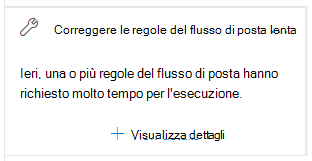
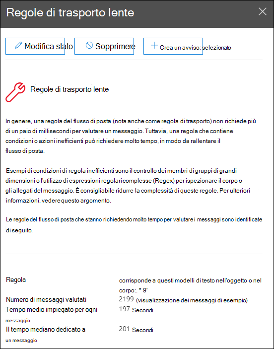

# Correggere le informazioni dettagliate sulle regole del flusso di posta lente nel Centro sicurezza & conformità

[!INCLUDE [Microsoft 365 Defender rebranding](../includes/microsoft-defender-for-office.md)]

**Si applica a**
- [Exchange Online Protection](https://go.microsoft.com/fwlink/?linkid=2148611)
- [Microsoft Defender per Office 365 piano 1 e piano 2](https://go.microsoft.com/fwlink/?linkid=2148715)
- [Microsoft 365 Defender](https://go.microsoft.com/fwlink/?linkid=2118804)

Le regole del flusso di posta inefficienti (note anche come regole di trasporto) possono causare ritardi nel flusso di posta per l'organizzazione. Queste informazioni dettagliate segnalano le regole del flusso di posta che hanno un impatto sul flusso di posta dell'organizzazione. Di seguito sono riportati alcuni esempi di questi tipi di regole:

- Condizioni che utilizzano **Is member of** per gruppi di grandi dimensioni.
- Condizioni che utilizzano la corrispondenza di criteri di espressione regolare complessa (regex).
- Condizioni che utilizzano l'archiviazione del contenuto negli allegati.

**L'analisi** delle regole del flusso di posta lento nell'area  Consigliata per l'utente del [dashboard](mail-flow-insights-v2.md) del flusso di posta nel Centro sicurezza [&](https://protection.office.com) conformità notifica quando il completamento di una regola del flusso di posta sta prendendo troppo tempo.

Queste informazioni vengono visualizzate solo dopo che la condizione è stata rilevata (se non sono presenti loop di posta, non verranno visualizzate le informazioni dettagliate).

È possibile utilizzare questa notifica per identificare e ottimizzare le regole del flusso di posta per ridurre i ritardi del flusso di posta.

Quando si fa **clic su Visualizza** dettagli nel widget, viene visualizzato un riquadro a comparsa con ulteriori informazioni:

- **Regola:** è possibile passare il puntatore del mouse sul riepilogo per visualizzare tutte le condizioni, le eccezioni e le azioni della regola. È possibile fare clic sul riepilogo per modificare la regola nell'interfaccia di amministrazione di Exchange ( EAC).
- **Numero di messaggi valutati:** è possibile  fare clic su Visualizza messaggi di esempio per visualizzare i risultati della traccia dei messaggi per un campione dei messaggi interessati dalla regola. 
- **Tempo medio dedicato a ogni messaggio**
- **Tempo mediano dedicato a un messaggio:** valore intermedio che separa la metà superiore dai dati della metà inferiore del tempo.

Per ulteriori informazioni sulle condizioni e le eccezioni nelle regole del flusso di posta, vedere Condizioni ed eccezioni delle regole del flusso di posta [(predicati) in Exchange Online.](https://docs.microsoft.com/Exchange/security-and-compliance/mail-flow-rules/conditions-and-exceptions)

## Vedere anche

Per informazioni su altre informazioni dettagliate nel dashboard del flusso di posta, vedere Informazioni dettagliate sul flusso di posta [nel Centro sicurezza & conformità.](mail-flow-insights-v2.md)
