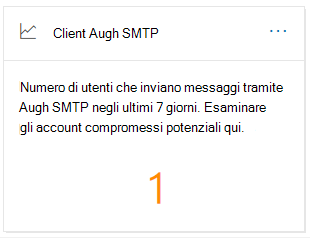
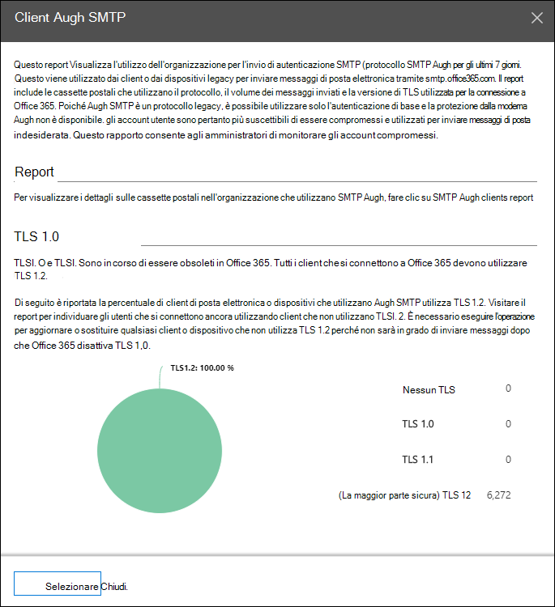
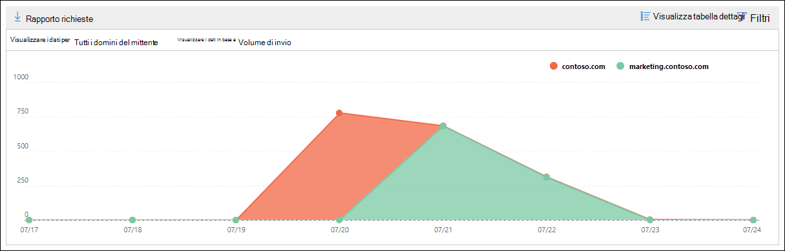
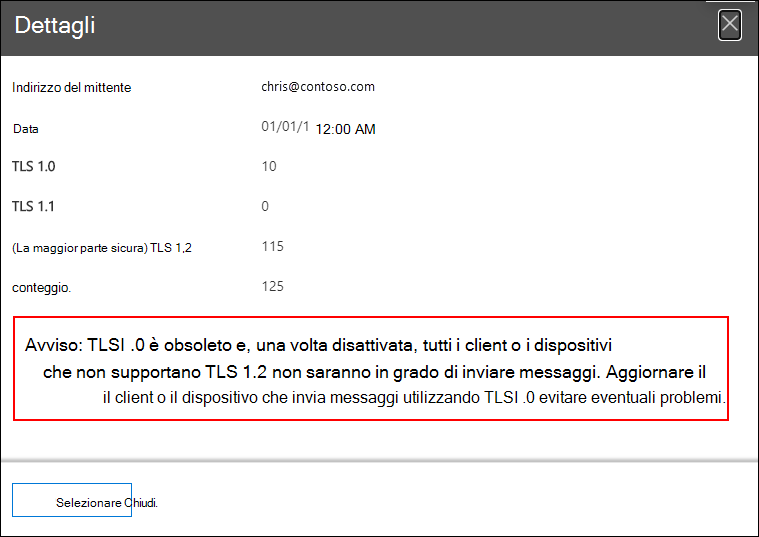

# Insight e report dei client auth SMTP nel centro sicurezza & Compliance

I **client auth SMTP** Insight nel [Dashboard del flusso di posta](mail-flow-insights-v2.md) e nel [rapporto client auth SMTP](#smtp-auth-clients-report) associati evidenziano l'utilizzo del protocollo di invio client auth SMTP da parte degli utenti o degli account di sistema nell'organizzazione. Questo protocollo legacy (che utilizza l'endpoint smtp.office365.com) offre solo l'autenticazione di base ed è suscettibile di essere utilizzato dagli account compromessi per inviare messaggi di posta elettronica. Insight and report consentono di verificare l'utilizzo di attività inusuali per invii di posta elettronica SMTP AUTH. Vengono inoltre visualizzati i dati di utilizzo di TLS per client o dispositivi che utilizzano l'autenticazione SMTP.

Il widget indica il numero di utenti o di account di servizio che hanno utilizzato il protocollo di autenticazione SMTP negli ultimi 7 giorni.

Se si fa clic sul numero di messaggi sul widget, viene visualizzato un riquadro a comparsa dei **client auth SMTP** . Il riquadro a comparsa fornisce una visualizzazione aggregata dell'utilizzo e dei volumi TLS per l'ultima settimana.

È possibile fare clic sul collegamento **rapporto client auth SMTP** per accedere al report client auth SMTP come descritto nella sezione successiva.

## Report sui client di autenticazione SMTP

### Visualizzazione report per il rapporto client auth SMTP

Per impostazione predefinita, il report Visualizza i dati per gli ultimi 7 giorni, ma i dati sono disponibili per gli ultimi 90 giorni.

La sezione Panoramica contiene i grafici seguenti:

- **Visualizzazione dei dati per: volume di invio**: per impostazione predefinita, il grafico mostra il numero di messaggi client di autenticazione SMTP inviati da tutti i domini (**Mostra dati per: tutti i domini mittente** è selezionata per impostazione predefinita). È possibile filtrare i risultati in uno specifico dominio del mittente facendo clic su **Mostra dati per** e selezionando il dominio del mittente dall'elenco a discesa. Se si posiziona il puntatore del mouse su un punto dati specifico (giorno), viene visualizzato il numero di messaggi.

  

- **Visualizzare i dati in base a: utilizzo TLS**: il grafico mostra la percentuale di utilizzo di TLS per tutti i messaggi client auth SMTP durante il periodo di tempo selezionato. Questo grafico consente di identificare ed eseguire azioni su utenti e account di sistema che continuano a utilizzare versioni precedenti di TLS.

  

Se si fa clic su **filtri** in una visualizzazione report, è possibile specificare un intervallo di date con data di **inizio** e **Data di fine**.

Fare clic su **Richiedi report** per ricevere una versione più dettagliata del report in un messaggio di posta elettronica. È possibile specificare l'intervallo di date e i destinatari per la ricezione del report.

### Visualizzazione tabella dettagli per il rapporto client auth SMTP

Se si fa clic su **Visualizza tabella dettagli**, le informazioni visualizzate dipendono dal grafico che si sta esaminando:

- **Visualizzare i dati in base a: volume di invio**: le informazioni seguenti sono visualizzate in una tabella:

  - **Indirizzo del mittente**
  - **Numero di messaggi**

  Se si seleziona una riga, gli stessi dettagli vengono visualizzati in un riquadro a comparsa.

- **Visualizzare i dati in base a: utilizzo di TLS**: le informazioni seguenti sono visualizzate in una tabella:

  - **Indirizzo del mittente**
  - **TLS 1.0%**\*
  - **TLS 1.1%**\*
  - **TLS 1.2%**\*
  - **Numero di messaggi**

  \*In questa colonna sono riportati sia la percentuale che il numero di messaggi provenienti dal mittente.

Se si fa clic su **filtri** in una visualizzazione tabella dettagli, è possibile specificare un intervallo di date con data di **inizio** e **Data di fine**.

Se si seleziona una riga, i dettagli simili vengono visualizzati in un riquadro a comparsa:

Fare clic su **Richiedi report** per ricevere una versione più dettagliata del report in un messaggio di posta elettronica. È possibile specificare l'intervallo di date e i destinatari per la ricezione del report.

Per tornare alla visualizzazione report, fare clic su **Visualizza report**.

## Argomenti correlati

Per informazioni su altre intuizioni nel dashboard del flusso di posta, vedere [Mail Flow Insights in the Security & Compliance Center](mail-flow-insights-v2.md).
