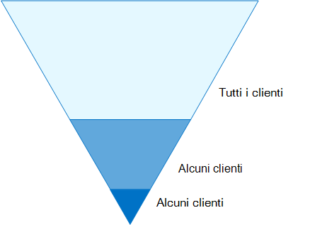
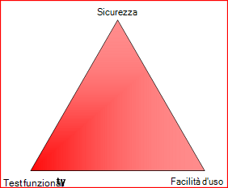
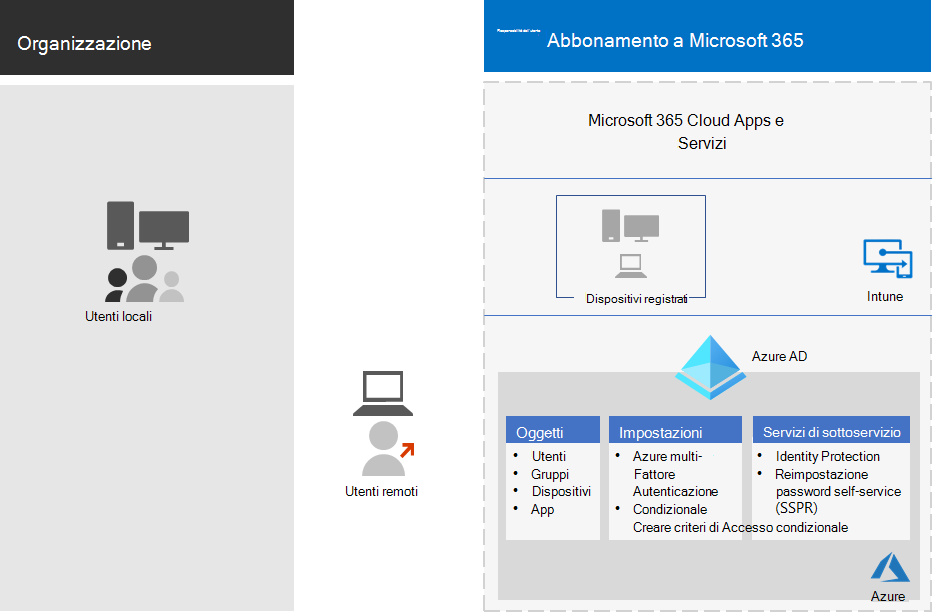
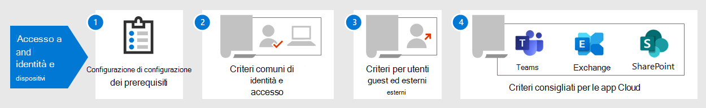

# Configurazioni di identità e accesso dei dispositiviIdentity and device access configurations

Il perimetro di sicurezza moderno dell'organizzazione ora si estende oltre la rete per includere gli utenti che accedono alle app basate su cloud da qualsiasi percorso con una vasta gamma di dispositivi.The modern security perimeter of your organization now extends beyond your network to include users accessing cloud-based apps from any location with a variety of devices. L'infrastruttura di sicurezza deve determinare se una richiesta di accesso specificata deve essere concessa e in quali condizioni.Your security infrastructure needs to determine whether a given access request should be granted and under what conditions.

Questa determinazione deve basarsi sull'account utente dell'accesso, sul dispositivo utilizzato, sull'app che l'utente utilizza per accedere, sul percorso da cui viene eseguita la richiesta di accesso e sulla valutazione del rischio della richiesta.This determination should be based on the user account of the sign-in, the device being used, the app the user is using for access, the location from which the access request is made, and an assessment of the risk of the request. Questa funzionalità garantisce che solo gli utenti e i dispositivi autorizzati possano accedere alle risorse cruciali dell'utente.This capability helps ensure that only approved users and devices can access your critical resources.

In questa serie di articoli viene descritto un insieme di configurazioni dei prerequisiti di accesso a identità e dispositivi e un set di accessi condizionali di Azure Active Directory (Azure AD), Microsoft Intune e altri criteri per garantire l'accesso a Microsoft 365 per le app e i servizi cloud aziendali, altri servizi SaaS e applicazioni locali pubblicate con proxy di applicazione Azure AD.This series of articles describes a set of identity and device access prerequisite configurations and a set of Azure Active Directory (Azure AD) Conditional Access, Microsoft Intune, and other policies to secure access to Microsoft 365 for enterprise cloud apps and services, other SaaS services, and on-premises applications published with Azure AD Application Proxy.

Le impostazioni e i criteri di accesso ai dispositivi e alle identità sono consigliati in tre livelli: protezione di base, protezione riservata e protezione per ambienti con dati altamente regolamentati o classificati.Identity and device access settings and policies are recommended in three tiers: baseline protection, sensitive protection, and protection for environments with highly regulated or classified data. Questi livelli, e le loro configurazioni corrispondenti, offrono livelli costanti di protezione per tutti i dati, le identità e i dispositivi.These tiers and their corresponding configurations provide consistent levels of protection across your data, identities, and devices.

Queste funzionalità e i relativi suggerimenti:These capabilities and their recommendations:

- Sono supportate in Microsoft 365 E3 e Microsoft 365 E5.Are supported in Microsoft 365 E3 and Microsoft 365 E5.
- Sono allineati con [Microsoft Secure Score](https://docs.microsoft.com/microsoft-365/security/mtp/microsoft-secure-score) così come il [Punteggio di identità in Azure ad](https://docs.microsoft.com/azure/active-directory/fundamentals/identity-secure-score)e aumentano questi punteggi per l'organizzazione.Are aligned with [Microsoft Secure Score](https://docs.microsoft.com/microsoft-365/security/mtp/microsoft-secure-score) as well as [identity score in Azure AD](https://docs.microsoft.com/azure/active-directory/fundamentals/identity-secure-score), and will increase these scores for your organization.
- Consentirà di implementare questi [cinque passaggi per proteggere l'infrastruttura di identità](https://docs.microsoft.com/azure/security/azure-ad-secure-steps).Will help you implement these [five steps to securing your identity infrastructure](https://docs.microsoft.com/azure/security/azure-ad-secure-steps).

Se nell'organizzazione sono presenti requisiti o complessità univoci per l'ambiente, utilizzare questi suggerimenti come punto di partenza.If your organization has unique environment requirements or complexities, use these recommendations as a starting point. Tuttavia, la maggior parte delle organizzazioni può implementare questi suggerimenti come prescritto.However, most organizations can implement these recommendations as prescribed.

>[!Note]
>Microsoft vende anche licenze Enterprise Mobility + Security (EMS) per le sottoscrizioni di Office 365.Microsoft also sells Enterprise Mobility + Security (EMS) licenses for Office 365 subscriptions. Le funzionalità EMS E3 e EMS E5 sono equivalenti a quelle di Microsoft 365 E3 e Microsoft 365 E5.EMS E3 and EMS E5 capabilities are equivalent to those in Microsoft 365 E3 and Microsoft 365 E5. Vedere i [piani di EMS](https://www.microsoft.com/en-us/microsoft-365/enterprise-mobility-security/compare-plans-and-pricing) per i dettagli.See [EMS plans](https://www.microsoft.com/en-us/microsoft-365/enterprise-mobility-security/compare-plans-and-pricing) for the details.
>

## Pubblico previstoIntended audience

Tali raccomandazioni sono destinate a Enterprise Architects e ai professionisti IT che hanno familiarità con Microsoft 365 cloud Productivity and Security Services, che include Azure AD (Identity), Microsoft Intune (Device Management) e Azure Information Protection (Data Protection).These recommendations are intended for enterprise architects and IT professionals who are familiar with Microsoft 365 cloud productivity and security services, which includes Azure AD (identity), Microsoft Intune (device management), and Azure Information Protection (data protection).

### Ambiente del clienteCustomer environment

I criteri consigliati sono applicabili alle organizzazioni aziendali che operano sia interamente all'interno del cloud Microsoft sia per i clienti con infrastruttura di identità ibrida, che è una foresta di servizi di dominio Active Directory locale che viene sincronizzata con un tenant di Azure AD.The recommended policies are applicable to enterprise organizations operating both entirely within the Microsoft cloud and for customers with hybrid identity infrastructure, which is an on-premises Active Directory Domain Services (AD DS) forest that is synchronized with an Azure AD tenant.

Molte delle raccomandazioni fornite si basano sui servizi disponibili solo con Microsoft 365 E5, Microsoft 365 E3 con l'identità & il componente aggiuntivo di protezione dalle minacce, EMS E5 o le licenze P2 di Azure Premium.Many of the provided recommendations rely on services available only with Microsoft 365 E5, Microsoft 365 E3 with the Identity & Threat Protection add-on, EMS E5, or Azure Premium P2 licenses.

Per le organizzazioni che non dispongono di queste licenze, Microsoft consiglia di implementare almeno le [impostazioni predefinite](https://docs.microsoft.com/azure/active-directory/fundamentals/concept-fundamentals-security-defaults)per la sicurezza, che è inclusa in tutti i piani di Microsoft 365.For those organizations who do not have these licenses, Microsoft recommends you at least implement [security defaults](https://docs.microsoft.com/azure/active-directory/fundamentals/concept-fundamentals-security-defaults), which is included with all Microsoft 365 plans.

### AvvertimentiCaveats

L'organizzazione può essere soggetta a requisiti normativi o di altro tipo, tra cui consigli specifici che potrebbero richiedere l'applicazione di criteri che divergono da queste configurazioni consigliate.Your organization may be subject to regulatory or other compliance requirements, including specific recommendations that may require you to apply policies that diverge from these recommended configurations. Tali configurazioni consigliano controlli dell'utilizzo non disponibili in precedenza.These configurations recommend usage controls that have not historically been available. Questi controlli sono consigliati perché riteniamo che rappresentino un equilibrio tra sicurezza e produttività.We recommend these controls because we believe they represent a balance between security and productivity.

In questo modo, è possibile tenere conto di una vasta gamma di requisiti di protezione dell'organizzazione, ma non si è in grado di tenere conto di tutti i requisiti possibili o di tutti gli aspetti univoci della propria azienda.We've done our best to account for a wide variety of organizational protection requirements, but we're not able to account for all possible requirements or for all the unique aspects of your organization.

## Tre livelli di protezioneThree tiers of protection

La maggior parte delle organizzazioni hanno requisiti specifici relativi a sicurezza e protezione dei dati.Most organizations have specific requirements regarding security and data protection. Tali requisiti variano in base al settore e alle mansioni lavorative all'interno delle organizzazioni.These requirements vary by industry segment and by job functions within organizations. Ad esempio, il reparto legale e gli amministratori possono richiedere ulteriori controlli di sicurezza e protezione delle informazioni attorno alla corrispondenza di posta elettronica non necessari per altre unità aziendali.For example, your legal department and administrators might require additional security and information protection controls around their email correspondence that are not required for other business units.

Ogni settore ha anche il proprio set di normative specializzate.Each industry also has their own set of specialized regulations. Piuttosto che fornire un elenco di tutte le opzioni di sicurezza possibili o una raccomandazione per segmento di settore o funzione del processo, sono state fornite indicazioni per tre diversi livelli di sicurezza e protezione che possono essere applicati in base alla granularità delle proprie esigenze.Rather than providing a list of all possible security options or a recommendation per industry segment or job function, recommendations have been provided for three different tiers of security and protection that can be applied based on the granularity of your needs.

- **Protezione di base**: si consiglia di stabilire uno standard minimo per la protezione dei dati, nonché le identità e i dispositivi che accedono ai dati.**Baseline protection**: We recommend you establish a minimum standard for protecting data, as well as the identities and devices that access your data. È possibile seguire questi suggerimenti di base per fornire una protezione predefinita complessa che soddisfi le esigenze di molte organizzazioni.You can follow these baseline recommendations to provide strong default protection that meets the needs of many organizations.
- **Protezione sensibile**: alcuni clienti dispongono di un sottoinsieme di dati che devono essere protetti a livelli superiori oppure possono richiedere che tutti i dati siano protetti a un livello superiore.**Sensitive protection**: Some customers have a subset of data that must be protected at higher levels, or they may require all data to be protected at a higher level. È possibile applicare una maggiore protezione a tutti o a set di dati specifici nell'ambiente Microsoft 365.You can apply increased protection to all or specific data sets in your Microsoft 365 environment. È consigliabile proteggere le identità e i dispositivi che accedono ai dati sensibili con livelli di sicurezza analoghi.We recommend protecting identities and devices that access sensitive data with comparable levels of security.
- **Altamente regolamentato**: alcune organizzazioni potrebbero avere una piccola quantità di dati altamente classificati, costituiti da segreti commerciali o da dati regolamentati.**Highly regulated**: Some organizations may have a small amount of data that is highly classified, constitutes trade secrets, or is regulated data. Microsoft offre funzionalità che consentono alle organizzazioni di soddisfare questi requisiti, inclusa la protezione aggiuntiva per identità e dispositivi.Microsoft provides capabilities to help organizations meet these requirements, including added protection for identities and devices.

In questa guida viene illustrato come implementare la protezione per identità e dispositivi per ognuno di questi livelli di protezione.This guidance shows you how to implement protection for identities and devices for each of these tiers of protection. Utilizzare queste linee guida come punto di partenza per l'organizzazione e regolare i criteri per soddisfare i requisiti specifici dell'organizzazione.Use this guidance as a starting point for your organization and adjust the policies to meet your organization's specific requirements.

È importante utilizzare livelli di protezione coerenti tra dati, identità e dispositivi.It's important to use consistent levels of protection across your data, identities, and devices. Ad esempio, se si implementano queste linee guida, assicurarsi di proteggere i dati a livelli comparabili.For example, if you implement this guidance, be sure to protect your data at comparable levels.

Il modello **di architettura di Microsoft 365 per l'identità e la protezione dei dispositivi** indica quali funzionalità sono confrontabili.The **Identity and device protection for Microsoft 365** architecture model shows you which capabilities are comparable.

    [Visualizzazione in formato PDF](../../downloads/MSFT_cloud_architecture_identity&device_protection.pdf) \| [Scarica come PDF](https://github.com/MicrosoftDocs/microsoft-365-docs/raw/public/microsoft-365/downloads/MSFT_cloud_architecture_identity&device_protection.pdf) \| [Scaricare come Visio](https://github.com/MicrosoftDocs/microsoft-365-docs/raw/public/microsoft-365/downloads/MSFT_cloud_architecture_identity&device_protection.vsdx)  [View as a PDF](../../downloads/MSFT_cloud_architecture_identity&device_protection.pdf) \| [Download as a PDF](https://github.com/MicrosoftDocs/microsoft-365-docs/raw/public/microsoft-365/downloads/MSFT_cloud_architecture_identity&device_protection.pdf)  \| [Download as a Visio](https://github.com/MicrosoftDocs/microsoft-365-docs/raw/public/microsoft-365/downloads/MSFT_cloud_architecture_identity&device_protection.vsdx)

Vedere inoltre la soluzione [deploy Information Protection for data privacy Regulations](../../solutions/information-protection-deploy.md) per proteggere le informazioni archiviate in Microsoft 365.Additionally, see the [Deploy information protection for data privacy regulations](../../solutions/information-protection-deploy.md) solution to protect information stored in Microsoft 365.

## Compromesso tra sicurezza e produttivitàSecurity and productivity trade-offs

L'implementazione di qualsiasi strategia di sicurezza richiede compromessi tra la sicurezza e la produttività.Implementing any security strategy requires trade-offs between security and productivity. È utile valutare il modo in cui ogni decisione influisce sul saldo di sicurezza, funzionalità e facilità d'uso.It's helpful to evaluate how each decision affects the balance of security, functionality, and ease of use.

Le raccomandazioni fornite si basano sui seguenti principi:The recommendations provided are based on the following principles:

- Conoscere gli utenti ed essere flessibili per la sicurezza e i requisiti funzionali.Know your users and be flexible to their security and functional requirements.
- Applicare un criterio di sicurezza appena in tempo e assicurarsi che sia significativo.Apply a security policy just in time and ensure it is meaningful.

## Servizi e concetti relativi a identità e protezione dall'accesso ai dispositiviServices and concepts for identity and device access protection

Microsoft 365 for Enterprise è stato ideato per le organizzazioni di grandi dimensioni per consentire a tutti di essere creativi e di collaborare in modo sicuro.Microsoft 365 for enterprise is designed for large organizations to empower everyone to be creative and work together securely.

In questa sezione viene fornita una panoramica dei servizi e delle funzionalità di Microsoft 365 che sono importanti per l'accesso a identità e dispositivi.This section provides an overview of the Microsoft 365 services and capabilities that are important for identity and device access.

### Azure ADAzure AD

Azure AD offre una serie completa di funzionalità di gestione delle identità.Azure AD provides a full suite of identity management capabilities. È consigliabile utilizzare queste funzionalità per garantire l'accesso.We recommend using these capabilities to secure access.

|Capacità o funzionalitàCapability or feature|DescrizioneDescription|LicenzeLicensing|
|---|---|---|
|[Autenticazione a più fattori (MFA)Multi-factor authentication (MFA)](/azure/active-directory/authentication/concept-mfa-howitworks)|L'AMF richiede agli utenti di fornire due forme di verifica, ad esempio una password utente e una notifica dall'app Microsoft Authenticator o da una telefonata.MFA requires users to provide two forms of verification, such as a user password plus a notification from the Microsoft Authenticator app or a phone call. Il Master riduce notevolmente il rischio che le credenziali rubate possano essere utilizzate per accedere all'ambiente.MFA greatly reduces the risk that stolen credentials can be used to access your environment. Microsoft 365 utilizza il servizio di autenticazione a più fattori di Azure AD per gli accessi basati su AMF.Microsoft 365 uses the Azure AD Multi-Factor Authentication service for MFA-based sign-ins.|Microsoft 365 E3 o E5Microsoft 365 E3 or E5|
|[Accesso condizionaleConditional Access](/azure/active-directory/conditional-access/overview)|Azure AD valuta le condizioni dell'accesso dell'utente e utilizza i criteri di accesso condizionale per determinare gli accessi consentiti.Azure AD evaluates the conditions of the user sign-in and uses Conditional Access policies to determine the allowed access. Ad esempio, in questa guida viene illustrato come creare un criterio di accesso condizionale per richiedere la conformità del dispositivo all'accesso ai dati riservati.For example, in this guidance we show you how to create a Conditional Access policy to require device compliance for access to sensitive data. In questo modo si riduce notevolmente il rischio che un hacker con il proprio dispositivo e le credenziali rubate possano accedere ai dati riservati.This greatly reduces the risk that a hacker with their own device and stolen credentials can access your sensitive data. Protegge inoltre i dati sensibili nei dispositivi, in quanto i dispositivi devono soddisfare requisiti specifici per la sicurezza e l'integrità.It also protects sensitive data on the devices, because the devices must meet specific requirements for health and security.|Microsoft 365 E3 o E5Microsoft 365 E3 or E5|
|[Gruppi di Azure ADAzure AD groups](/azure/active-directory/fundamentals/active-directory-manage-groups)|I criteri di accesso condizionale, la gestione dei dispositivi con Intune e persino le autorizzazioni per i file e i siti dell'organizzazione si basano sull'assegnazione agli account utente o ai gruppi di Azure AD.Conditional Access policies, device management with Intune, and even permissions to files and sites in your organization rely on the assignment to user accounts or Azure AD groups. Si consiglia di creare gruppi di Azure AD che corrispondono ai livelli di protezione che si stanno implementando.We recommend you create Azure AD groups that correspond to the levels of protection you are implementing. Ad esempio, il personale esecutivo è probabilmente un obiettivo di valore superiore per gli hacker.For example, your executive staff are likely higher value targets for hackers. Pertanto, è opportuno aggiungere gli account utente di questi dipendenti a un gruppo di Azure AD e assegnare questo gruppo ai criteri di accesso condizionale e ad altri criteri che applicano un livello di protezione più elevato per l'accesso.Therefore, it makes sense to add the user accounts of these employees to an Azure AD group and assign this group to Conditional Access policies and other policies that enforce a higher level of protection for access.|Microsoft 365 E3 o E5Microsoft 365 E3 or E5|
|[Registrazione del dispositivoDevice enrollment](/azure/active-directory/devices/overview)|La registrazione di un dispositivo in Azure AD per la creazione di un'identità per il dispositivo.You enroll a device into Azure AD to create an identity for the device. Questa identità viene utilizzata per autenticare il dispositivo quando un utente accede e per applicare criteri di accesso condizionale che richiedono PC conformi a un dominio.This identity is used to authenticate the device when a user signs in and to apply Conditional Access policies that require domain-joined or compliant PCs. Per queste linee guida, viene utilizzata la registrazione dei dispositivi per registrare automaticamente i computer Windows con join di dominio.For this guidance, we use device enrollment to automatically enroll domain-joined Windows computers. La registrazione del dispositivo è un prerequisito per la gestione dei dispositivi con Intune.Device enrollment is a prerequisite for managing devices with Intune.|Microsoft 365 E3 o E5Microsoft 365 E3 or E5|
|[Azure AD Identity ProtectionAzure AD Identity Protection](/azure/active-directory/identity-protection/overview)|Consente di rilevare potenziali vulnerabilità che interessano le identità dell'organizzazione e configurare i criteri di correzione automatici per il rischio di accesso basso, medio e alto e per i rischi dell'utente.Enables you to detect potential vulnerabilities affecting your organization's identities and configure automated remediation policy to low, medium, and high sign-in risk and user risk. Questa guida si basa su questa valutazione dei rischi per applicare criteri di accesso condizionale per l'autenticazione a più fattori.This guidance relies on this risk evaluation to apply Conditional Access policies for multi-factor authentication. Questa guida include anche un criterio di accesso condizionale che richiede agli utenti di modificare la propria password se viene rilevata un'attività ad alto rischio per il proprio account.This guidance also includes a Conditional Access policy that requires users to change their password if high-risk activity is detected for their account.|Microsoft 365 E5, Microsoft 365 E3 con il componente aggiuntivo Identity & Threat Protection, EMS E5 o le licenze P2 di Azure PremiumMicrosoft 365 E5, Microsoft 365 E3 with the Identity & Threat Protection add-on, EMS E5, or Azure Premium P2 licenses|
|[Reimpostazione della password in modalità self-service (SSPR)Self-service password reset (SSPR)](/azure/active-directory/authentication/concept-sspr-howitworks)|Consente agli utenti di reimpostare le password in modo sicuro e senza l'intervento di supporto tecnico, fornendo la verifica di più metodi di autenticazione che l'amministratore può controllare.Allow your users to reset their passwords securely and without help-desk intervention, by providing verification of multiple authentication methods that the administrator can control.|Microsoft 365 E3 o E5Microsoft 365 E3 or E5|
|[Protezione delle password di Azure ADAzure AD password protection](https://docs.microsoft.com/azure/active-directory/authentication/concept-password-ban-bad)|Individuare e bloccare le password deboli note e le relative varianti e i termini deboli aggiuntivi specifici per l'organizzazione.Detect and block known weak passwords and their variants and additional weak terms that are specific to your organization. Gli elenchi predefiniti di password escluse globalmente sono applicate automaticamente a tutti gli utenti dei tenant di Azure AD.Default global banned password lists are automatically applied to all users in an Azure AD tenant. È possibile definire altre voci in un elenco di password escluse personalizzato.You can define additional entries in a custom banned password list. Quando gli utenti modificano o reimpostano le loro password, gli elenchi di password escluse sono controllati per applicare l'uso di password sicure.When users change or reset their passwords, these banned password lists are checked to enforce the use of strong passwords.|Microsoft 365 E3 o E5Microsoft 365 E3 or E5|
|

Di seguito sono inclusi i componenti di accesso alle identità e ai dispositivi, tra cui gli oggetti, le impostazioni e i servizi secondari di Intune e Azure AD.Here are the components of identity and device access, including Intune and Azure AD objects, settings, and subservices.

### Microsoft IntuneMicrosoft Intune

[Intune](https://docs.microsoft.com/intune/introduction-intune) è il servizio di gestione dei dispositivi mobili basato sul cloud di Microsoft.[Intune](https://docs.microsoft.com/intune/introduction-intune) is Microsoft's cloud-based mobile device management service. Le linee guida consigliate per la gestione dei dispositivi Windows PC con Intune e consigliate configurazioni di criteri di conformità del dispositivo.This guidance recommends device management of Windows PCs with Intune and recommends device compliance policy configurations. Intune determina se i dispositivi sono conformi e li invia a Azure ad per l'applicazione dei criteri di accesso condizionale.Intune determines whether devices are compliant and sends this data to Azure AD to use when applying Conditional Access policies.

#### Protezione delle app di IntuneIntune app protection

I criteri di [protezione delle app di Intune](https://docs.microsoft.com/intune/app-protection-policy) possono essere utilizzati per proteggere i dati dell'organizzazione nelle app per dispositivi mobili, con o senza la registrazione di periferiche in gestione.[Intune app protection](https://docs.microsoft.com/intune/app-protection-policy) policies can be used to protect your organization's data in mobile apps, with or without enrolling devices into management. Intune consente di proteggere le informazioni, assicurandosi che i dipendenti possano continuare a essere produttivi e prevenire la perdita di dati.Intune helps protect information, making sure your employees can still be productive, and preventing data loss. Se si implementano i criteri a livello di app, è possibile limitare l'accesso alle risorse aziendali e mantenere i dati all'interno del controllo del reparto IT.By implementing app-level policies, you can restrict access to company resources and keep data within the control of your IT department.

In questa guida viene illustrato come creare criteri consigliati per applicare l'utilizzo di app approvate e per determinare in che modo queste app possono essere utilizzate con i dati aziendali.This guidance shows you how to create recommended policies to enforce the use of approved apps and to determine how these apps can be used with your business data.

### Microsoft 365Microsoft 365

In questa guida viene illustrato come implementare un insieme di criteri per proteggere l'accesso ai servizi cloud di Microsoft 365, tra cui Microsoft teams, Exchange Online, SharePoint Online e OneDrive for business.This guidance shows you how to implement a set of policies to protect access to Microsoft 365 cloud services, including Microsoft Teams, Exchange Online, SharePoint Online, and OneDrive for Business. Oltre all'implementazione di questi criteri, è consigliabile aumentare anche il livello di protezione per il tenant utilizzando queste risorse:In addition to implementing these policies, we recommend you also raise the level of protection for your tenant using these resources:

- [Configurare il tenant per una maggiore sicurezzaConfigure your tenant for increased security](tenant-wide-setup-for-increased-security.md)

  Consigli che si applicano alla sicurezza di base per il tenant.Recommendations that apply to baseline security for your tenant.

- [Roadmap sulla sicurezza: priorità principali per i primi 30 giorni, 90 giorni e oltreSecurity roadmap: Top priorities for the first 30 days, 90 days, and beyond](security-roadmap.md)

  Consigli che includono la registrazione, la governance dei dati, l'accesso di amministratore e la protezione dalle minacce.Recommendations that include logging, data governance, admin access, and threat protection.

### Windows 10 e App Microsoft 365 per grandi impreseWindows 10 and Microsoft 365 Apps for enterprise

Windows 10 con Microsoft 365 Apps for Enterprise è l'ambiente client consigliato per i PC.Windows 10 with Microsoft 365 Apps for enterprise is the recommended client environment for PCs. È consigliabile utilizzare Windows 10 perché Azure è stato creato per offrire un'esperienza più agevole possibile sia per gli ambienti locali che per gli Azure AD.We recommend Windows 10 because Azure is designed to provide the smoothest experience possible for both on-premises and Azure AD. Windows 10 include anche funzionalità di sicurezza avanzate che possono essere gestite tramite Intune.Windows 10 also includes advanced security capabilities that can be managed through Intune. Microsoft 365 Apps for Enterprise include le versioni più recenti delle applicazioni di Office.Microsoft 365 Apps for enterprise includes the latest versions of Office applications. Questi utilizzano l'autenticazione moderna, che è più sicura e un requisito per l'accesso condizionale.These use modern authentication, which is more secure and a requirement for Conditional Access. Queste app includono anche strumenti avanzati per la sicurezza e la conformità.These apps also include enhanced security and compliance tools.

## Applicazione di queste funzionalità tra i tre livelli di protezioneApplying these capabilities across the three tiers of protection

Nella tabella seguente vengono riepilogati i suggerimenti per l'utilizzo di queste funzionalità tra i tre livelli di protezione.The following table summarizes our recommendations for using these capabilities across the three tiers of protection.

|Meccanismo di protezioneProtection mechanism|Protezione di baseBaseline|Dati sensibiliSensitive|Riservatezza elevataHighly regulated|
|---|---|---|---|
|**Applicare l'autenticazione a più fattori****Enforce MFA**|A partire da rischio di accesso medioOn medium or above sign-in risk|A partire da rischio di accesso bassoOn low or above sign-in risk|Per tutte le nuove sessioniOn all new sessions|
|**Applicare la modifica della password****Enforce password change**|Per gli utenti con rischio elevatoFor high-risk users|Per gli utenti con rischio elevatoFor high-risk users|Per gli utenti con rischio elevatoFor high-risk users|
|**Applicare la protezione delle applicazioni di Intune****Enforce Intune application protection**|SìYes|SìYes|SìYes|
|**Applicare la registrazione di Intune per il dispositivo di proprietà dell'organizzazione****Enforce Intune enrollment for organization-owned device**|Richiedere un PC conforme o aggiunto a un dominio, ma consentire telefoni e Tablet BYOD (Bring-Your-Own Devices)Require a compliant or domain-joined PC, but allow bring-your-own devices (BYOD) phones and tablets|Richiedere un dispositivo conforme o collegato a un dominioRequire a compliant or domain-joined device|Richiedere un dispositivo conforme o collegato a un dominioRequire a compliant or domain-joined device|
|

## Proprietà del dispositivoDevice ownership

La tabella di cui sopra riflette l'andamento di molte organizzazioni a supportare una combinazione di dispositivi di proprietà dell'organizzazione, nonché personale o BYODs per consentire la produttività mobile in tutta la forza lavoro.The above table reflects the trend for many organizations to support a mix of organization-owned devices, as well as personal or BYODs to enable mobile productivity across the workforce. I criteri di protezione delle app di Intune assicurano che la posta elettronica sia protetta da exfiltrating fuori dell'app di Outlook Mobile e di altre app per dispositivi mobili di Office, sia a livello di proprietà dell'organizzazione sia BYODs.Intune app protection policies ensure that email is protected from exfiltrating out of the Outlook mobile app and other Office mobile apps, on both organization-owned devices and BYODs.

È consigliabile gestire i dispositivi di proprietà dell'organizzazione da Intune o da un dominio aggiunto per applicare protezioni e controlli aggiuntivi.We recommend organization-owned devices be managed by Intune or domain-joined to apply additional protections and control. A seconda della sensibilità dei dati, l'organizzazione può scegliere di non consentire l'utilizzo di BYODs per specifiche popolazioni di utenti o app specifiche.Depending on data sensitivity, your organization may choose to not allow BYODs for specific user populations or specific apps.

## Distribuzione e appDeployment and your apps

Prima di configurare e distribuire la configurazione di identità e accesso ai dispositivi per le app integrate in Azure AD, è necessario eseguire le operazioni seguenti:Prior to configuring and rolling out identity and device access configuration for your Azure AD-integrated apps, you must:

- Decidere quali app utilizzare nell'organizzazione si desidera proteggere.Decide which apps used in your organization you want to protect.
- Analizzare questo elenco di app per determinare i gruppi di criteri che offrono livelli di protezione adeguati.Analyze this list of apps to determine the sets of policies that provide appropriate levels of protection.

  Non è consigliabile creare insiemi di criteri distinti per ogni app perché la loro gestione può risultare ingombrante.You should not create separate sets of policies each for app because management of them can become cumbersome. Microsoft consiglia di raggruppare le app con gli stessi requisiti di protezione per gli stessi utenti.Microsoft recommends that you group your apps that have the same protection requirements for the same users.

  Ad esempio, è possibile disporre di un set di criteri che includa tutte le app Microsoft 365 per tutti gli utenti per la protezione di base e un secondo set di criteri per tutte le app sensibili, ad esempio quelle utilizzate dalle risorse umane o dai reparti finanziari, e applicarle a tali gruppi.For example, you could have one set of policies that include all Microsoft 365 apps for all of your users for baseline protection and a second set of policies for all sensitive apps, such as those used by human resources or finance departments, and apply them to those groups.

Dopo aver determinato il set di criteri per le app che si desidera proteggere, eseguire il rollforward dei criteri in modo incrementale, affrontando i problemi lungo il percorso.Once you have determined the set of policies for the apps you want to secure, roll the policies out to your users incrementally, addressing issues along the way.

Ad esempio, configurare i criteri che verranno utilizzati per tutte le app Microsoft 365 solo per Exchange Online con le modifiche aggiuntive per Exchange.For example, configure the policies that will be used for all your Microsoft 365 apps for just Exchange Online with the additional changes for Exchange. Eseguire il rollforward dei criteri per gli utenti e risolvere eventuali problemi.Roll these policies out to your users and work through any issues. Aggiungere quindi i team con le relative modifiche aggiuntive e riportarlo agli utenti.Then, add Teams with its additional changes and roll this out to your users. Aggiungere quindi SharePoint con le modifiche aggiuntive.Then, add SharePoint with its additional changes. Continuare ad aggiungere le altre app fino a quando non è possibile configurare con sicurezza questi criteri di base per includere tutte le app di Microsoft 365.Continue adding the rest of your apps until you can confidently configure these baseline policies to include all Microsoft 365 apps.

Analogamente, per le app sensibili, creare il set di criteri e aggiungere un'app alla volta e risolvere eventuali problemi finché non sono tutti inclusi nel set di criteri per le app sensibili.Similarly, for your sensitive apps, create the set of policies and add one app at a time and work through any issues until they are all included in the sensitive app policy set.

Microsoft consiglia di non creare set di criteri che si applicano a tutte le app, perché possono verificarsi alcune configurazioni indesiderate.Microsoft recommends that you do not create policy sets that apply to all apps because it can result in some unintended configurations. Ad esempio, i criteri che bloccano tutte le app potrebbero bloccare gli amministratori fuori dal portale di Azure e le esclusioni non possono essere configurate per endpoint importanti come Microsoft Graph.For example, policies that block all apps could lock your admins out of the Azure portal and exclusions cannot be configured for important endpoints such as Microsoft Graph.

## Passaggi del processo di configurazione dell'identità e dell'accesso ai dispositiviSteps in the process of configuring identity and device access

1. Configurare le funzionalità di identità dei prerequisiti e le relative impostazioni.Configure prerequisite identity features and their settings.
2. Configurare i criteri di accesso condizionale e di identità comuni.Configure the common identity and access Conditional Access policies.
3. Configurare i criteri di accesso condizionale per gli utenti guest ed esterni.Configure Conditional Access policies for guest and external users.
4. Configurare i criteri di accesso condizionale per le app cloud di Microsoft 365, ad esempio Microsoft teams, Exchange Online e SharePoint.Configure Conditional Access policies for Microsoft 365 cloud apps such as Microsoft Teams, Exchange Online, and SharePoint.

Dopo aver configurato l'accesso a identità e dispositivi, vedere la [Guida alla distribuzione delle funzionalità di Azure ad](https://docs.microsoft.com/azure/active-directory/fundamentals/active-directory-deployment-checklist-p2) per un elenco di controllo in fasi di funzionalità aggiuntive da considerare e di [Azure ad Identity governance](https://docs.microsoft.com/azure/active-directory/governance/) per proteggere, monitorare e controllare l'accesso.After you have configured identity and device access, see the [Azure AD feature deployment guide](https://docs.microsoft.com/azure/active-directory/fundamentals/active-directory-deployment-checklist-p2) for a phased checklist of additional features to consider and [Azure AD Identity Governance](https://docs.microsoft.com/azure/active-directory/governance/) to protect, monitor, and audit access.

## Passaggio successivoNext step

[Lavoro prerequisito per l'implementazione dei criteri di identità e accesso ai dispositiviPrerequisite work for implementing identity and device access policies](identity-access-prerequisites.md)
