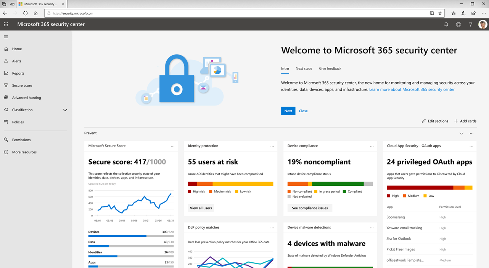

# I nuovi Microsoft 365 Security Center e Microsoft 365 Compliance Center sono ora generalmente disponibiliThe new Microsoft 365 security center and Microsoft 365 compliance center are now generally available

**Siamo lieti di annunciare che il nuovissimo [Microsoft 365 Security Center](#microsoft-365-security-center) e [Microsoft 365 Compliance Center](#microsoft-365-compliance-center)** sono ora generalmente disponibili.**We are pleased to announce that the all-new [Microsoft 365 security center](#microsoft-365-security-center) and [Microsoft 365 compliance center](#microsoft-365-compliance-center)**, are now generally available. Leggere questo articolo per ottenere una panoramica delle novità, [cosa aspettarsi](#what-to-expect)e [licenze e autorizzazioni necessarie](#required-licenses-and-permissions).Read this article to get an overview of what's new, [what to expect](#what-to-expect), and [required licenses and permissions](#required-licenses-and-permissions).

## Centro sicurezza Microsoft 365Microsoft 365 security center

Il nuovo [Centro sicurezza di Microsoft 365](../mtp/overview-security-center.md) include un dashboard che consente di gestire e monitorare la sicurezza in tutte le identità, i dati, i dispositivi, le app e l'infrastruttura.Your new [Microsoft 365 security center](../mtp/overview-security-center.md) includes a dashboard to help you manage and monitor security across your identities, data, devices, apps, and infrastructure. È inoltre possibile accedere facilmente al nuovo [Punteggio di Microsoft Secure](../mtp/microsoft-secure-score.md), ai nuovi report sulle minacce dei dispositivi, ai nuovi rapporti sulle minacce di identità e ai report di sicurezza delle app cloud.You will also have easy access to your all-new [Microsoft Secure Score](../mtp/microsoft-secure-score.md), new device threat reports, new identity threat reports, and your Cloud App Security reports. 

Quando si utilizza Microsoft 365 Security Center per la prima volta, vengono visualizzate le informazioni sulla parte superiore dello schermo per iniziare.When you use the Microsoft 365 security center for the first time, you'll see information across the top of the screen to help you get started. Vedrai anche come esplorare facilmente le funzionalità di sicurezza che più ti interessano.You'll also see how to navigate easily to the security features you're most interested in exploring. Per ulteriori informazioni, vedere [Overview of the Microsoft 365 Security Center](../mtp/overview-security-center.md).To learn more, see [Overview of the Microsoft 365 security center](../mtp/overview-security-center.md).

Sarà possibile accedere al centro sicurezza Microsoft 365 all'indirizzo [https://security.microsoft.com](https://security.microsoft.com).You will be able to access the Microsoft 365 security center at [https://security.microsoft.com](https://security.microsoft.com). 

> [!NOTE]
> Per accedere al centro sicurezza Microsoft 365 è necessario che sia assegnato un ruolo di Azure Active Directory valido.You must be assigned a valid Azure Active Directory role to access the Microsoft 365 security center. Per ulteriori informazioni, vedere la sezione relativa alle [licenze e alle autorizzazioni necessarie](#required-licenses-and-permissions) (in questo articolo).To learn more, see the [Required licenses and permissions](#required-licenses-and-permissions) section (in this article).

## Centro conformità Microsoft 365Microsoft 365 compliance center

Il nuovo [centro conformità di microsoft 365](../../compliance/microsoft-365-compliance-center.md) fornisce visibilità in Microsoft Compliance Manager, che rispecchia la posizione di conformità globale e fornisce le azioni consigliate per la configurazione delle impostazioni in modo da soddisfare la conformità complessa obblighi.Your new [Microsoft 365 compliance center](../../compliance/microsoft-365-compliance-center.md) provides you with visibility into Microsoft Compliance Manager, which reflects your overall compliance posture and gives you recommended actions to help you configure settings to meet complex compliance obligations. 

È possibile accedere facilmente alle etichette e ai criteri per la conservazione e la sensibilità, la prevenzione della perdita di dati (DLP), la governance dei dati, eDiscovery, le richieste del soggetto dei dati (richieste DSR), la gestione delle case e la sicurezza delle app cloud.You’ll have easy access to sensitivity and retention labels and policies, data loss prevention (DLP), data governance, eDiscovery, data subject requests (DSRs), case management, and Cloud App Security. Inoltre, è possibile ottenere Insight e sfruttare l'automazione intelligente per ridurre i rischi di conformità e salvaguardare la propria azienda digitale.Additionally, you can gain actionable insights and leverage intelligent automation to reduce your compliance risks and safeguard your digital estate. 

Quando si utilizza Microsoft 365 Compliance Center per la prima volta, vengono visualizzate le informazioni sulla parte superiore dello schermo per facilitare l'avvio.When you use the Microsoft 365 compliance center for the first time, you'll see information across the top of the screen to help you get started. Vedrai come esplorare facilmente le funzionalità di conformità che più ti interessano.You'll see how to navigate easily to the compliance features you're most interested in exploring. Per ulteriori informazioni, vedere [Welcome to your all-new Microsoft 365 Compliance Center](../../compliance/microsoft-365-compliance-center.md).To learn more, see [Welcome to your all-new Microsoft 365 compliance center](../../compliance/microsoft-365-compliance-center.md).

Sarà necessario accedere al centro conformità Microsoft 365 all'indirizzo [https://compliance.microsoft.com](https://compliance.microsoft.com).You will be to access the Microsoft 365 compliance center at [https://compliance.microsoft.com](https://compliance.microsoft.com).  

> [!NOTE]
> È necessario essere assegnati a un ruolo di Azure Active Directory valido per accedere al centro conformità Microsoft 365.You must be assigned a valid Azure Active Directory role to access the Microsoft 365 compliance center. Per ulteriori informazioni, vedere la sezione relativa alle [licenze e alle autorizzazioni necessarie](#required-licenses-and-permissions) (in questo articolo).To learn more, see the [Required licenses and permissions](#required-licenses-and-permissions) section (in this article).

## Cosa aspettarsiWhat to expect

### Disponibile adesso!Available now!

Il nuovo Centro sicurezza di Microsoft 365 e il nuovo centro conformità di Microsoft 365 sono ora generalmente disponibili per i clienti Microsoft 365 alla fine di marzo 2019.The new Microsoft 365 security center and the new Microsoft 365 compliance center are now generally available to Microsoft 365 customers, as of the end of March 2019. 

Se si dispone di un altro abbonamento, ad esempio un piano autonomo che include il Centro sicurezza & conformità di Office 365, è possibile accedere al centro sicurezza di Microsoft 365 e al più presto a Microsoft 365 Compliance Center.If you have another subscription, such as a standalone plan that includes the Office 365 Security & Compliance Center, you'll have access to the new Microsoft 365 security center and Microsoft 365 compliance center soon. Per ulteriori informazioni, vedere la Guida di [orientamento di Microsoft 365](https://www.microsoft.com/microsoft-365/roadmap).To learn more, see the [Microsoft 365 roadmap](https://www.microsoft.com/microsoft-365/roadmap).

### Facile accesso!Easy access!

Con una navigazione migliorata, soluzioni integrate e un'esperienza semplificata, è possibile visualizzare e accedere alle informazioni più interessate e sfruttare le potenti soluzioni di sicurezza e conformità in Microsoft 365.With improved navigation, integrated solutions, and a streamlined experience, you'll be able to see and access the information you're most interested in and take advantage of the powerful security and compliance solutions in Microsoft 365. Mentre più funzionalità e soluzioni vengono aggiunte nei prossimi mesi, il centro[https://protection.microsoft.com](https://protection.microsoft.com)sicurezza & conformità di Office 365 è ancora disponibile.And, while more functionality and solutions are being added over the coming months, the Office 365 Security & Compliance Center ([https://protection.microsoft.com](https://protection.microsoft.com)) is still available.

Per accedere al centro conformità & sicurezza di Office 365, nel riquadro di spostamento a sinistra dello schermo, scegliere **altre risorse**.To access the Office 365 Security & Compliance Center, in the navigation pane on the left side of the screen, choose **More resources**. Quindi, sotto **Office 365 security & Compliance Center**, scegliere **Apri**.Then, under **Office 365 security & compliance center**, choose **Open**.

### Transizione agevole!Smooth transition!

È possibile prevedere una transizione graduale ai nuovi centri.You can expect a smooth transition to the new centers. Infine, l'ex centro[https://protection.microsoft.com](https://protection.microsoft.com)protezione & conformità di Microsoft 365 verrà ritirato.Eventually, the former Microsoft 365 Security & Compliance Center ([https://protection.microsoft.com](https://protection.microsoft.com)) will be retired. Anche se l'esperienza dell'amministratore cambierà, ciò non influisce sulle configurazioni di conformità e sicurezza correnti.Although the administrator experience will change, this won’t impact your current security and compliance configurations. Se l'organizzazione dispone di Microsoft 365 Enterprise E3 o E5, gli amministratori della sicurezza e della conformità possono:If your organization has Microsoft 365 Enterprise E3 or E5, your security and compliance administrators can:

- Passare direttamente a [https://security.microsoft.com](https://security.microsoft.com) e [https://compliance.microsoft.com](https://compliance.microsoft.com);Navigate directly to [https://security.microsoft.com](https://security.microsoft.com) and [https://compliance.microsoft.com](https://compliance.microsoft.com);  oppureor  
- Passare all'interfaccia di amministrazione di Microsoft 365[https://admin.microsoft.com](https://admin.microsoft.com)() e passare da qui (nel riquadro di spostamento, fare clic su **Mostra tutto**, quindi scegliere **sicurezza** o **conformità**).Go to the Microsoft 365 admin center ([https://admin.microsoft.com](https://admin.microsoft.com)), and navigate from there (in the navigation pane, click **Show all**, and then choose **Security** or **Compliance**).

È inoltre possibile configurare e gestire le impostazioni nel centro[https://protection.office.com](http://protection.office.com)di sicurezza & Compliance di Office 365 esistente.In addition, you can still configure and manage settings in the existing Office 365 Security & Compliance Center ([https://protection.office.com](http://protection.office.com)). Le configurazioni verranno mantenute sia nel centro sicurezza & conformità di Office 365 che nel centro protezione Microsoft 365 e Microsoft 365 Compliance Center.Your configurations will be maintained in both the existing Office 365 Security & Compliance Center and in the new Microsoft 365 security center and Microsoft 365 compliance center.  

## Licenze e autorizzazioni necessarieRequired licenses and permissions

### LicenzeLicenses

Per ottenere il nuovo Centro sicurezza Microsoft 365 e il centro conformità Microsoft 365, è necessario che l'organizzazione disponga di una sottoscrizione a Microsoft 365 E3 o E5 oppure di un equivalente per contratti multilicenza (costituito da Office 365 E3 o E5, Enterprise Mobility + Security E3 o E5 e Windows 10 Enterprise E3/E5).To get the new Microsoft 365 security center and Microsoft 365 compliance center, your organization must have a subscription to Microsoft 365 E3 or E5, or a Volume Licensing equivalent (which consists of Office 365 E3 or E5, Enterprise Mobility + Security E3 or E5, and Windows 10 Enterprise E3/E5). Per ulteriori informazioni su questi piani, vedere [Discover the Microsoft 365 solution that ' s right for you](https://www.microsoft.com/microsoft-365/compare-all-microsoft-365-plans).To learn more about these plans, see [Discover the Microsoft 365 solution that’s right for you](https://www.microsoft.com/microsoft-365/compare-all-microsoft-365-plans).

### Ruoli e autorizzazioniRoles and permissions

Gli utenti devono essere assegnati all'amministratore globale, all'amministratore della conformità, all'amministratore dei dati di conformità, all'amministratore della sicurezza, all'operatore di sicurezza o al ruolo di lettore di sicurezza in Azure Active Directory per accedere al nuovo Centro sicurezza di Microsoft 365 o Microsoft 365 Compliance Center.Users must be assigned the Global Administrator, Compliance Administrator, Compliance Data Administrator, Security Administrator, Security Operator, or Security Reader role in Azure Active Directory to access the new Microsoft 365 security center or Microsoft 365 compliance center.

- Gli amministratori globali possono accedere sia al centro sicurezza che al centro conformitàGlobal Administrators can access both the security center and the compliance center

- Gli amministratori di conformità e gli amministratori dei dati di conformità possono accedere al centro conformitàCompliance Administrators and Compliance Data Administrators can access the compliance center

- Gli amministratori della sicurezza, gli operatori di sicurezza e i lettori di sicurezza possono accedere al centro sicurezzaSecurity Administrators, Security Operators, and Security Readers can access the security center

 Per ulteriori informazioni su questi ruoli, vedere [Permissions in the Office 365 Security & Compliance Center](permissions-in-the-security-and-compliance-center.md).To learn more about these roles, see [Permissions in the Office 365 Security & Compliance Center](permissions-in-the-security-and-compliance-center.md).
 
Nella tabella seguente sono riepilogati gli utenti che possono accedere a vari portali in Azure, Office 365 e Windows:The following table summarizes who can access various portals across Azure, Office 365, and Windows:

|PortalePortal |Amministratore globaleGlobal Administrator |Amministratore della sicurezza, operatore di sicurezza o lettore di sicurezzaSecurity Administrator, Security Operator, or Security Reader|Amministratore di conformità o amministratore dei dati di conformitàCompliance  Administrator or Compliance Data Administrator |
|---------|---------|---------|---------|
|[Centro sicurezza & conformitàSecurity & Compliance Center](https://protection.office.com) |SìYes |SìYes  |SìYes |
|[Centro sicurezza Microsoft 365Microsoft 365 security center](https://security.microsoft.com) |SìYes  | SìYes  | NoNo        |
|[Centro conformità Microsoft 365Microsoft 365 compliance center](https://compliance.microsoft.com) | SìYes | NoNo | SìYes |
|[Compliance ManagerCompliance Manager](https://aka.ms/compliancemanager) |SìYes | SìYes |SìYes  |
|[Azure Information ProtectionAzure Information Protection](https://docs.microsoft.com/azure/information-protection) |SìYes |SìYes |NoNo |
|[Centro sicurezza di AzureAzure Security Center](https://docs.microsoft.com/azure/security-center/)  |SìYes |SìYes |NoNo |
|[Protezione avanzata dalle minacce di AzureAzure Advanced Threat Protection](https://docs.microsoft.com/azure-advanced-threat-protection/what-is-atp)  |SìYes |SìYes |NoNo |
|[ATP Microsoft DefenderMicrosoft Defender ATP](https://docs.microsoft.com/windows/security/threat-protection/microsoft-defender-atp/microsoft-defender-advanced-threat-protection) |SìYes |SìYes |NoNo |
|[Protezione delle identitàIdentity Protection](https://docs.microsoft.com/azure/active-directory/identity-protection)     |SìYes |SìYes |NoNo |
|[Gestione delle identità con privilegiPrivileged Identity Management](https://docs.microsoft.com/azure/active-directory/privileged-identity-management)     |SìYes |SìYes |NoNo |
|[IntuneIntune](https://docs.microsoft.com/intune)     |SìYes |SìYes |SìYes |
|[Cloud App SecurityCloud App Security](https://docs.microsoft.com/cloud-app-security/)     |SìYes |SìYes |SìYes |
|[Secure ScoreSecure Score](https://docs.microsoft.com/office365/securitycompliance/office-365-secure-score)     |SìYes |SìYes |NoNo |
|[ExchangeExchange](https://docs.microsoft.com/exchange/)     |SìYes |SìYes |SìYes |

## Risorse aggiuntiveAdditional resources

[Centro sicurezza Microsoft 365Microsoft 365 security center](../mtp/overview-security-center.md)

[Centro conformità Microsoft 365Microsoft 365 compliance center](../../compliance/microsoft-365-compliance-center.md)

[Roadmap di Microsoft 365Microsoft 365 roadmap](https://www.microsoft.com/microsoft-365/roadmap)

[Descrizione del servizio Centro sicurezza & conformità di Office 365Office 365 Security & Compliance Center Service Description](https://docs.microsoft.com/office365/servicedescriptions/office-365-platform-service-description/office-365-securitycompliance-center)

Per fornire commenti e suggerimenti su Microsoft 365 Security Center e Microsoft 365 Compliance Center, ad esempio idee per nuove funzionalità, visitare [i commenti e suggerimenti dei clienti per Microsoft Office 365](https://office365.uservoice.com)To provide feedback about Microsoft 365 security center and Microsoft 365 compliance center, such as ideas for new features, please visit [Customer Feedback for Microsoft Office 365](https://office365.uservoice.com)
