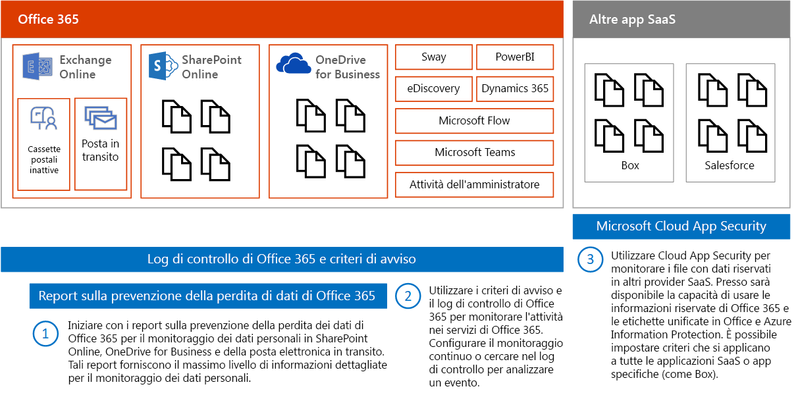
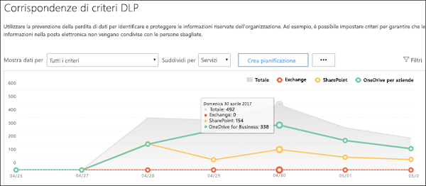
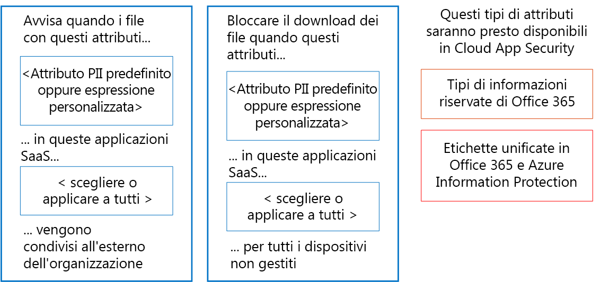
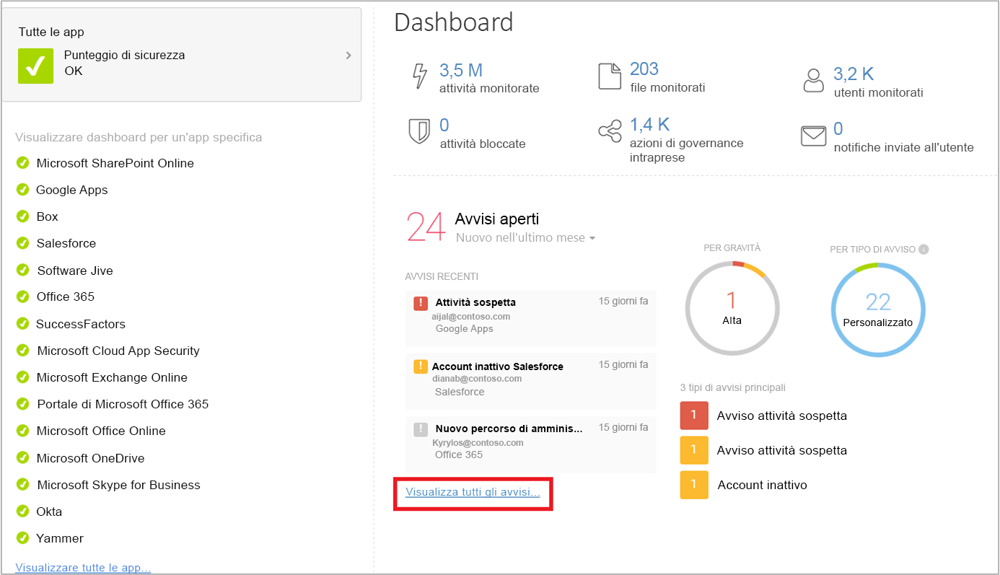

# Monitorare la perdita di dati personali

Sono disponibili molti strumenti che è possibile utilizzare per monitorare l'uso e il trasporto dei dati personali. In questo argomento ne vengono descritti tre.

Nella figura:

- Iniziare con i report sulla prevenzione della perdita dei dati di Microsoft 365 per il monitoraggio dei dati personali in SharePoint Online, OneDrive for Business e della posta elettronica in transito. Tali report forniscono il massimo livello di informazioni dettagliate per il monitoraggio dei dati personali. Tuttavia, non includono tutti i servizi in Office 365.

- Successivamente, usare i criteri di avviso e i log di controllo per monitorare l'attività nei servizi. Configurare il monitoraggio continuo o cercare nel log di controllo per analizzare un evento. Il log di controllo è supportato da vari servizi: Sway, PowerBI, eDiscovery, Dynamics 365, Microsoft Flow, Microsoft Teams, Attività amministrative, OneDrive for Business, SharePoint Online, posta in transito e cassette postali inattive. Le conversazioni di Skype sono incluse nelle cassette postali inattive.

- Infine, usare Microsoft Cloud App Security per monitorare i file con dati sensibili in altri provider SaaS. Presto sarà possibile usare i tipi di informazioni sensibili di e le etichette unificate in Azure Information Protection e Office con Cloud App Security. È possibile configurare criteri applicabili a tutte le app SaaS o ad app specifiche (ad esempio, Box). Cloud App Security non rileva i file in Exchange Online, compresi quelli allegati ai messaggi di posta elettronica.

## Report sulla prevenzione della perdita di dati

Dopo aver creato i criteri di prevenzione della perdita dei dati (DLP), è consigliabile verificare che funzionino come previsto e aiutino a mantenere la conformità. Con i report di prevenzione della perdita dei dati in Office 365, è possibile visualizzare rapidamente il numero di corrispondenze, sostituzioni e falsi positivi dei criteri DLP, vederne l'andamento nel corso del tempo, filtrare il report in vari modi ed entrare nei dettagli selezionando un punto nel grafico.

È possibile utilizzare i report DLP per:

- Concentrare l'attenzione su intervalli di tempo specifici e comprendere i motivi di eventuali impennate e tendenze.

- Individuare i processi aziendali che violano i criteri DLP dell'organizzazione.

- Comprendere l'eventuale impatto aziendale dei criteri DLP.

- Visualizzare le giustificazioni inviate dagli utenti quando risolvono un suggerimento per i criteri ignorando il criterio o segnalando un falso positivo.

- Verificare la conformità con uno specifico criterio DLP mostrando le eventuali corrispondenze per tale criterio.

- Visualizzare un elenco di file con dati riservati corrispondenti ai criteri DLP nel riquadro dei dettagli.

Inoltre, è possibile utilizzare i report DLP per ottimizzare i criteri DLP, quando vengono eseguiti nella modalità test.

I report DPL sono disponibili nel centro sicurezza e nel centro conformità. Passare a Report \> Visualizza report. Sotto Prevenzione della perdita dei dati scegliere Corrispondenze della regola e dei criteri di prevenzione della perdita dei dati o Falsi positivi e override dei criteri di prevenzione della perdita dei dati.

Per ulteriori informazioni, vedere [Visualizzare i report di prevenzione della perdita di dati](https://docs.microsoft.com/microsoft-365/compliance/view-the-dlp-reports).

## Log di controllo e criteri di avviso

Il log di controllo contiene eventi di Exchange Online, SharePoint Online, OneDrive for Business, Azure Active Directory, Microsoft Teams, Power BI, Sway e altri servizi.

Il Centro sicurezza e conformità offre due metodi per il monitoraggio e la creazione di report in merito al log di controllo:

- Configurare criteri di avviso, visualizzare avvisi e monitorare le tendenze: utilizzare gli strumenti della dashboard e dei criteri di avviso nel centro sicurezza o nel centro conformità.

- Cercare direttamente il log di controllo: è possibile ricercare tutti gli eventi in un intervallo di date specificato o filtrare i risultati in base a criteri specifici, come l'utente che ha effettuato l'operazione, l'operazione o l'oggetto di destinazione.

I team di conformità e sicurezza delle informazioni possono usare questi strumenti per analizzare in modo proattivo le attività eseguite dagli utenti finali e dagli amministratori nei servizi. È possibile configurare avvisi automatici per l'invio di notifiche tramite posta elettronica quando si verificano certe attività su specifiche raccolte siti, ad esempio, quando vengono condivisi contenuti da siti contenenti informazioni correlate al GDPR. Ciò consente a questi team di intervenire presso gli utenti per assicurarsi che rispettino i criteri di sicurezza aziendali o per offrire formazione aggiuntiva.

I team di sicurezza delle informazioni possono anche cercare nel log di controllo per analizzare sospette violazioni dei dati e determinarne l'eventuale causa e gravità. Questa funzionalità integrata agevola la conformità agli articoli 33 e 34 dell'RGPD, secondo i quali le notifiche devono essere fornite all'autorità di supervisione dell'RGPD e ai soggetti dei dati interessati da una violazione dei dati entro uno specifico periodo di tempo. Le voci del log di controllo vengono conservate solo per 90 giorni nel servizio (spesso è consigliabile e molte organizzazioni hanno richiesto un periodo di conservazione di tali log anche maggiore).

Sono disponibili soluzioni che consentono di sottoscrivere i log di controllo unificati tramite l'API Office 365 Management Activity, di archiviare voci di log secondo necessità e che forniscono dashboard e avvisi avanzati. Un esempio è [Microsoft Operations Management Suite (OMS)](https://docs.microsoft.com/azure/operations-management-suite/oms-solution-office-365).

Ulteriori informazioni sui criteri di avviso e sulla ricerca nel log di controllo:

- [Criteri di avviso nei centri di sicurezza e di conformità di Microsoft 365](https://docs.microsoft.com/microsoft-365/compliance/alert-policies)

- [Eseguire ricerche nel il log di controllo per le attività di utente e amministratore in Office 365](https://docs.microsoft.com/microsoft-365/compliance/search-the-audit-log) (introduzione)

- [Abilitare o disabilitare la ricerca nel log di controllo](https://docs.microsoft.com/microsoft-365/compliance/turn-audit-log-search-on-or-off)

- [Eseguire ricerche nel log di controllo](https://docs.microsoft.com/microsoft-365/compliance/search-the-audit-log-in-security-and-compliance)

- [Search-UnifiedAuditLog](https://docs.microsoft.com/powershell/module/exchange/policy-and-compliance-audit/search-unifiedauditlog) (cmdlet)

- [Proprietà dettagliate nel log di controllo](https://docs.microsoft.com/microsoft-365/compliance/detailed-properties-in-the-office-365-audit-log)

## Microsoft Cloud App Security

Microsoft Cloud App Security consente di individuare altre app SaaS in uso nelle reti e i dati riservati inviati a e da tali app.

Microsoft Cloud App Security è un servizio completo che fornisce visibilità approfondita, controlli più specifici e protezione avanzata dalle minacce per le app cloud. Consente di identificare più di 15.000 applicazioni cloud nei dispositivi collegati alla rete e fornisce l'analisi e la valutazione dei rischi. Non sono richiesti agenti: le informazioni vengono raccolte dai firewall e dai proxy per garantire visibilità completa e contesto per l'uso del cloud e shadow IT.

Per conoscere meglio l'ambiente cloud in uso, la funzionalità di analisi di Cloud App Security fornisce visibilità approfondita nelle attività, nei file e negli account delle app gestite e approvate. È possibile ottenere informazioni dettagliate su un livello di file e individuare dove transitano i dati nelle app cloud.

Ad esempio, nella seguente figura sono illustrati due criteri di Cloud App Security che possono risultare utili con RGPD.

Il primo criterio avvisa quando i file con un attributo PII predefinito o un'espressione personalizzata selezionati vengono condivisi all'esterno dell'organizzazione dalle app SaaS scelte.

Il secondo criterio blocca i download di file a qualsiasi dispositivo non gestito. Scegliere gli attributi all'interno dei file in cui eseguire la ricerca e delle app SaaS a cui si desidera applicare il criterio.

Questi tipi di attributi saranno presto disponibili in Cloud App Security:

- Tipi di informazioni sensibili

- Etichette unificate in Microsoft 365 e Azure Information Protection

### Dashboard di Cloud App Security

Se ancora non si usa Cloud App Security, iniziare a configurarlo. Per accedere a Cloud App Security: <https://portal.cloudappsecurity.com>.

Nota: verificare che "Analizza automaticamente i file per le etichette di classificazione di Azure Information Protection" (nelle impostazioni generali) sia abilitato prima di iniziare a usare Cloud App Security o ad assegnare etichette. Dopo la configurazione, Cloud App Security non ripete l'analisi dei file esistenti finché non vengono modificati.

Ulteriori informazioni:

- [Distribuzione di Cloud App Security](https://docs.microsoft.com/cloud-app-security/getting-started-with-cloud-app-security)

- [Ulteriori informazioni su Microsoft Cloud App Security](https://www.microsoft.com/cloud-platform/cloud-app-security)

- [Blocco dei download di informazioni sensibili tramite il proxy di Microsoft Cloud App Security](https://docs.microsoft.com/cloud-app-security/use-case-proxy-block-session-aad)

## File di esempio e criteri di attività per rilevare la condivisione di dati personali

### Individuare la condivisione di file contenenti informazioni personali - Numero di carta di credito

L'avviso relativo a un file contenente un numero di carta di credito viene condiviso da un'app cloud approvata.

<table>
<thead>
<tr class="header">
<th align="left"><strong>Controllo</strong></th>
<th align="left"><strong>Impostazioni</strong></th>
</tr>
</thead>
<tbody>
<tr class="odd">
<td align="left">Tipo di criterio</td>
<td align="left">Criteri file</td>
</tr>
<tr class="even">
<td align="left">Modello di criteri</td>
<td align="left">Nessun modello</td>
</tr>
<tr class="odd">
<td align="left">Gravità del criterio</td>
<td align="left">Alta</td>
</tr>
<tr class="even">
<td align="left">Categoria</td>
<td align="left">DLP</td>
</tr>
<tr class="odd">
<td align="left">Impostazioni filtro</td>
<td align="left">
Livello di accesso = Pubblico (Internet), Pubblico, Esterno

App = &lt;selezionare app&gt; (utilizzare questa impostazione se si desidera limitare il monitoraggio ad app SaaS specifiche)
</td>
</tr>
<tr class="even">
<td align="left">Applica a</td>
<td align="left">Tutti i file, tutti i proprietari</td>
</tr>
<tr class="odd">
<td align="left">Ispezione del contenuto</td>
<td align="left">
Include i file che corrispondono a un'espressione presente: Tutti i paesi - Finanza: numero di carta di credito

Non richiedere il contesto rilevante: deselezionato (questo troverà una corrispondenza con parole chiave e regex)

Include file con almeno 1 corrispondenza

Annulla il mascheramento degli ultimi 4 caratteri della violazione: selezionato
</td>
</tr>
<tr class="even">
<td align="left">Avvisi</td>
<td align="left">
Crea un avviso per ogni file corrispondente: selezionato

Limite di avvisi giornaliero: 1.000

Seleziona un avviso come e-mail: selezionato

A: infosec@contoso.com
</td>
</tr>
<tr class="odd">
<td align="left">Governance</td>
<td align="left">
Microsoft OneDrive for Business

Rendi privato: selezionare Rimuovi gli utenti esterni

Tutte le altre impostazioni: deselezionato

Microsoft SharePoint Online

Rendi privato: selezionare Rimuovi gli utenti esterni

Tutte le altre impostazioni: deselezionato
</td>
</tr>
</tbody>
</table>

Criteri simili:

- Individuare la condivisione di file contenenti informazioni personali - Indirizzo e-mail

- Individuare la condivisione di file contenenti informazioni personali - Numero di passaporto

### Rilevare cliente o dati sulle risorse umane in Box o OneDrive for Business

L'avviso relativo a un file etichettato come Dati della società o Dati sulle risorse umane viene caricato su OneDrive for Business o Box.

Note:

- Il monitoraggio di Box richiede un connettore configurato con l'SDK API Connector.

- Questo criterio richiede funzionalità al momento in anteprima privata.

<table>
<thead>
<tr class="header">
<th align="left"><strong>Controllo</strong></th>
<th align="left"><strong>Impostazioni</strong></th>
</tr>
</thead>
<tbody>
<tr class="odd">
<td align="left">Tipo di criterio</td>
<td align="left">Criteri attività</td>
</tr>
<tr class="even">
<td align="left">Modello di criteri</td>
<td align="left">Nessun modello</td>
</tr>
<tr class="odd">
<td align="left">Gravità del criterio</td>
<td align="left">Alta</td>
</tr>
<tr class="even">
<td align="left">Categoria</td>
<td align="left">Controllo della condivisione</td>
</tr>
<tr class="odd">
<td align="left">Azione su</td>
<td align="left">Singola attività</td>
</tr>
<tr class="even">
<td align="left">Impostazioni filtro</td>
<td align="left">
Tipo di attività = Carica file

App = Microsoft OneDrive for Business e Box

Etichetta di classificazione (al momento in anteprima privata): Azure Information Protection = Dati della società, Risorse umane - Dati sulle retribuzioni, Risorse umane - Dati sui dipendenti
</td>
</tr>
<tr class="odd">
<td align="left">Avvisi</td>
<td align="left">
Crea un avviso: selezionato

Limite di avvisi giornaliero: 1.000

Seleziona un avviso come e-mail: selezionato

A: infosec@contoso.com
</td>
</tr>
<tr class="even">
<td align="left">Governance</td>
<td align="left">
Tutte le app

Metti utente in quarantena: selezionato

Tutte le altre impostazioni: deselezionato

Office 365

Metti utente in quarantena: selezionato

Tutte le altre impostazioni: deselezionato
</td>
</tr>
</tbody>
</table>

Criteri simili:

- Rilevare download di grandi dimensioni di Dati della società o Dati sulle risorse umane: avviso relativo al rilevamento del download di un gran numero di file contenenti dati sulla società o sulle risorse umane da parte di un singolo utente in un breve periodo di tempo.

- Individuare la condivisione di dati sulla società e sulle risorse umane: avviso relativo alla condivisione di file contenenti dati sulla società o sulle risorse umane.
