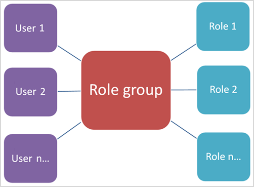

# Autorizzazioni nel Centro sicurezza e conformitàPermissions in the Security & Compliance Center

[!INCLUDE [Microsoft 365 Defender rebranding](../includes/microsoft-defender-for-office.md)]

Il Centro sicurezza & conformità consente di concedere autorizzazioni a utenti che eseguono attività di conformità come la gestione dei dispositivi, la prevenzione della perdita di dati, eDiscovery, la conservazione e così via.The Security & Compliance Center lets you grant permissions to people who perform compliance tasks like device management, data loss prevention, eDiscovery, retention, and so on. Tali utenti possono eseguire solo le attività in cui si concede esplicitamente l'accesso.These people can perform only the tasks that you explicitly grant them access to. Per accedere al centro sicurezza & conformità, gli utenti devono essere un amministratore globale o un membro di uno o più gruppi di ruoli Centro sicurezza & conformità.To access the Security & Compliance Center, users need to be a global administrator or a member of one or more Security & Compliance Center role groups.

Le autorizzazioni nel centro sicurezza & conformità si basano sul modello di autorizzazioni di controllo di accesso basato sui ruoli (RBAC).Permissions in the Security & Compliance Center are based on the role-based access control (RBAC) permissions model. RBAC è lo stesso modello di autorizzazioni utilizzato da Exchange, quindi se si ha familiarità con Exchange, la concessione di autorizzazioni nel centro sicurezza & conformità sarà molto simile.RBAC is the same permissions model that's used by Exchange, so if you're familiar with Exchange, granting permissions in the Security & Compliance Center will be very similar. Tuttavia, è importante tenere presente che i gruppi di ruoli di Exchange e i gruppi di ruoli Centro sicurezza & conformità non condividono l'appartenenza o le autorizzazioni.It's important to remember, however, that Exchange role groups and Security & Compliance Center role groups don't share membership or permissions. Sebbene entrambi dispongano di un gruppo di ruoli di gestione dell'organizzazione, non sono uguali.While both have an Organization Management role group, they aren't the same. Le autorizzazioni concesse e i membri dei gruppi di ruoli sono diverse.The permissions they grant, and the members of the role groups, are different. Di seguito è riportato un elenco di gruppi di ruoli del Centro sicurezza & conformità.There's a list of Security & Compliance Center role groups below.

## Relazione tra membri, ruoli e gruppi di ruoliRelationship of members, roles, and role groups

Un **ruolo** concede le autorizzazioni per eseguire una serie di attività. ad esempio, il ruolo di gestione dei casi consente alle persone di lavorare con eDiscovery.A **role** grants permissions to do a set of tasks; for example, the Case Management role lets people work with eDiscovery cases.

Un **gruppo di ruolo** è un insieme di ruoli che consentono agli utenti di svolgere il proprio lavoro in tutto il centro sicurezza & Compliance.A **role group** is a set of roles that lets people do their jobs across the Security & Compliance Center. Ad esempio, il gruppo di ruoli amministratore conformità include (tra gli altri ruoli) i ruoli per la gestione dei casi, la ricerca di contenuto e la configurazione dell'organizzazione (più altri) perché un amministratore di conformità avrà bisogno delle autorizzazioni necessarie per svolgere il proprio lavoro.For example, the Compliance Administrator role group includes (among other roles) the roles for Case Management, Content Search, and Organization Configuration (plus others) because someone who's a compliance admin will need the permissions for those tasks to do their job.

Il Centro sicurezza & conformità include i gruppi di ruoli predefiniti per le attività e le funzioni più comuni che è necessario assegnare agli utenti.The Security & Compliance Center includes default role groups for the most common tasks and functions that you'll need to assign people to. È consigliabile aggiungere singoli utenti come **membri** ai gruppi di ruoli predefiniti.We recommend simply adding individual users as **members** to the default role groups.

## Autorizzazioni necessarie per utilizzare le funzionalità nel centro sicurezza & CompliancePermissions needed to use features in the Security & Compliance Center

Nella tabella seguente sono elencati i gruppi di ruoli predefiniti disponibili nel centro sicurezza & compliance e i ruoli assegnati ai gruppi di ruoli per impostazione predefinita.The following table lists the default role groups that are available in the Security & Compliance Center, and the roles that are assigned to the role groups by default. Per concedere le autorizzazioni a un utente per eseguire un'attività di conformità, aggiungerle al gruppo di ruoli Centro protezione & conformità appropriato.To grant permissions to a user to perform a compliance task, add them to the appropriate Security & Compliance Center role group.

La gestione delle autorizzazioni nel centro sicurezza & conformità fornisce solo agli utenti l'accesso alle funzionalità di conformità disponibili all'interno del Centro sicurezza & conformità stesso.Managing permissions in the Security & Compliance Center only gives users access to the compliance features that are available within the Security & Compliance Center itself. Se si desidera concedere le autorizzazioni ad altre funzionalità di conformità che non sono nel centro sicurezza & conformità, ad esempio le regole del flusso di posta di Exchange (note anche come regole di trasporto), è necessario utilizzare l'interfaccia di amministrazione di Exchange.If you want to grant permissions to other compliance features that aren't in the Security & Compliance Center, such as Exchange mail flow rules (also known as transport rules), you need to use the Exchange admin center.

Per informazioni su come concedere l'accesso al centro sicurezza & conformità, vedere [concedere agli utenti l'accesso a Microsoft 365 Compliance Admin Center](grant-access-to-the-security-and-compliance-center.md).To see how to grant access to the Security & Compliance Center, check out [Give users access to Microsoft 365 Compliance admin center](grant-access-to-the-security-and-compliance-center.md).

****

|Gruppo di ruoliRole group|DescrizioneDescription|Ruoli predefiniti assegnatiDefault roles assigned|
|---|---|---|
|**Conformità alla comunicazione****Communication Compliance**|Fornisce l'autorizzazione per tutti i ruoli di conformità di comunicazione: Administrator, Analyst, Investigator e Viewer.Provides permission to all the communication compliance roles: administrator, analyst, investigator, and viewer.|Gestione dei casiCase Management 
 Amministratore della conformità alla comunicazioneCommunication Compliance Admin 
 Analisi di conformità della comunicazioneCommunication Compliance Analysis 
 Gestione dei casi di conformità alla comunicazioneCommunication Compliance Case Management 
 Indagine di conformità della comunicazioneCommunication Compliance Investigation 
 Visualizzatore conformità comunicazioneCommunication Compliance Viewer 
 Provider di commenti e suggerimenti sulla classificazione dei datiData Classification Feedback Provider 
 View-Only casoView-Only Case|
|**Amministratori della conformità alla comunicazione****Communication Compliance Administrators**|Amministratori della conformità di comunicazione che possono creare o modificare criteri e definire le impostazioni globali.Administrators of communication compliance that can create/edit policies and define global settings.|Amministratore della conformità alla comunicazioneCommunication Compliance Admin 
 Gestione dei casi di conformità alla comunicazioneCommunication Compliance Case Management|
|**Analisti di conformità della comunicazione****Communication Compliance Analysts**|Analisti di conformità alla comunicazione che possono esaminare le corrispondenze di criteri, visualizzare i metadati dei messaggi e intraprendere azioni correttive.Analysts of communication compliance that can investigate policy matches, view message meta data, and take remediation actions.|Analisi di conformità della comunicazioneCommunication Compliance Analysis 
 Gestione dei casi di conformità alla comunicazioneCommunication Compliance Case Management|
|**Investigatori conformità comunicazione****Communication Compliance Investigators**|Analisti di conformità alla comunicazione che possono esaminare le corrispondenze di criteri, visualizzare il contenuto del messaggio e intraprendere azioni correttive.Analysts of communication compliance that can investigate policy matches, view message content, and take remediation actions.|Gestione dei casiCase Management 
 Analisi di conformità della comunicazioneCommunication Compliance Analysis 
 Gestione dei casi di conformità alla comunicazioneCommunication Compliance Case Management 
 Indagine di conformità della comunicazioneCommunication Compliance Investigation 
 Provider di commenti e suggerimenti sulla classificazione dei datiData Classification Feedback Provider 
 View-Only casoView-Only Case|
|**Visualizzatori conformità comunicazione****Communication Compliance Viewers**|Visualizzatore di conformità alla comunicazione che può accedere ai report e ai widget disponibili.Viewer of communication compliance that can access the available reports and widgets.|Gestione dei casi di conformità alla comunicazioneCommunication Compliance Case Management 
 Visualizzatore conformità comunicazioneCommunication Compliance Viewer|
|**Amministratore conformità**1**Compliance Administrator**1|I membri possono gestire le impostazioni per la gestione dei dispositivi, la prevenzione della perdita di dati, i report e la conservazione.Members can manage settings for device management, data loss prevention, reports, and preservation.|Gestione dei casiCase Management 
 Amministratore di conformitàCompliance Administrator 
 Ricerca di conformitàCompliance Search 
 Provider di commenti e suggerimenti sulla classificazione dei datiData Classification Feedback Provider 
 Revisore commenti e suggerimenti sulla classificazione dei datiData Classification Feedback Reviewer 
 Gestione delle indagini sui datiData Investigation Management 
 Gestione dei dispositiviDevice Management 
 Gestione della disposizioneDisposition Management 
 Gestione della conformità DLPDLP Compliance Management 
 HoldHold 
 Gestione della conformità IBIB Compliance Management 
 Gestione avvisiManage Alerts 
 Configurazione dell'organizzazioneOrganization Configuration 
 RecordManagementRecordManagement 
 Gestione della conservazioneRetention Management 
 View-Only registri di controlloView-Only Audit Logs 
 View-Only casoView-Only Case 
 Gestione dei dispositivi View-OnlyView-Only Device Management 
 View-Only la gestione della conformità DLPView-Only DLP Compliance Management 
 Gestione della conformità a View-Only IBView-Only IB Compliance Management 
 View-Only gestire gli avvisiView-Only Manage Alerts 
 Destinatari solo visualizzazioneView-Only Recipients 
 Gestione dei record View-OnlyView-Only Record Management 
 Gestione della conservazione View-OnlyView-Only Retention Management|
|**Amministratore dei dati di conformità****Compliance Data Administrator**|I membri possono gestire le impostazioni per la gestione di dispositivi, la protezione dei dati, la prevenzione della perdita di dati, i report e la conservazione.Members can manage settings for device management, data protection, data loss prevention, reports, and preservation.|Amministratore di conformitàCompliance Administrator 
 Ricerca di conformitàCompliance Search 
 Gestione dei dispositiviDevice Management 
 Gestione della conformità DLPDLP Compliance Management 
 Gestione della disposizioneDisposition Management 
 Gestione della conformità IBIB Compliance Management 
 Gestione avvisiManage Alerts 
 Configurazione dell'organizzazioneOrganization Configuration 
 RecordManagementRecordManagement 
 Gestione della conservazioneRetention Management 
 Amministratore dell'etichetta di riservatezzaSensitivity Label Administrator 
 View-Only registri di controlloView-Only Audit Logs 
 Gestione dei dispositivi View-OnlyView-Only Device Management 
 View-Only la gestione della conformità DLPView-Only DLP Compliance Management 
 Gestione della conformità a View-Only IBView-Only IB Compliance Management 
 View-Only gestire gli avvisiView-Only Manage Alerts 
 Destinatari solo visualizzazioneView-Only Recipients 
 Gestione dei record View-OnlyView-Only Record Management 
 Gestione della conservazione View-OnlyView-Only Retention Management|
|**Amministratori di Compliance Manager****Compliance Manager Administrators**|Gestire la creazione e la modifica del modello.Manage template creation and modification.|Amministrazione di Compliance ManagerCompliance Manager Administration 
 Valutazione di Compliance ManagerCompliance Manager Assessment 
 Contributo di Compliance ManagerCompliance Manager Contribution 
 Compliance Manager - LettoreCompliance Manager Reader|
|**Valutatori di Compliance Manager****Compliance Manager Assessors**|Creare valutazioni, implementare azioni di miglioramento e aggiornare lo stato dei test per le azioni di miglioramento.Create assessments, implement improvement actions, and update test status for improvement actions.|Valutazione di Compliance ManagerCompliance Manager Assessment 
 Contributo di Compliance ManagerCompliance Manager Contribution 
 Compliance Manager - LettoreCompliance Manager Reader|
|**Collaboratori di Compliance Manager****Compliance Manager Contributors**|Creare valutazioni ed eseguire operazioni di miglioramento.Create assessments and perform work to implement improvement actions.|Contributo di Compliance ManagerCompliance Manager Contribution 
 Compliance Manager - LettoreCompliance Manager Reader|
|**Lettori di Compliance Manager****Compliance Manager Readers**|Visualizzare tutti i contenuti di Compliance Manager ad eccezione delle funzioni di amministratore.View all Compliance Manager content except for administrator functions.|Compliance Manager - LettoreCompliance Manager Reader|
|**Visualizzatore contenuto Esplora contenuto****Content Explorer Content Viewer**|Visualizzare i file di contenuto in Esplora contenuto.View the contents files in Content explorer.|Visualizzatore contenuto di classificazione dei datiData Classification Content Viewer|
|**Visualizzatore elenco contenuto Esplora risorse****Content Explorer List Viewer**|Visualizzare tutti gli elementi in Esplora contenuto solo in formato elenco.View all items in Content explorer in list format only.|Visualizzatore elenco di classificazione dei datiData Classification List Viewer|
|**Ricercatore di dati****Data Investigator**|I membri possono eseguire ricerche nelle cassette postali, nei siti di SharePoint e negli account di OneDrive.Members can perform searches on mailboxes, SharePoint sites, and OneDrive accounts.|ComunicazioneCommunication 
 Ricerca di conformitàCompliance Search 
 CustodeCustodian 
 Gestione delle indagini sui datiData Investigation Management 
 EsportazioneExport 
 AnteprimaPreview 
 Decrittografia RMSRMS Decrypt 
 RevisioneReview 
 Ricerca ed eliminazioneSearch And Purge|
|**Gestore di eDiscovery****eDiscovery Manager**|I membri possono eseguire ricerche e conservare posizioni su cassette postali, siti di SharePoint Online e OneDrive for business.Members can perform searches and place holds on mailboxes, SharePoint Online sites, and OneDrive for Business locations. I membri possono anche creare e gestire i casi di eDiscovery, aggiungere e rimuovere membri in un caso, creare e modificare le ricerche di contenuto associate a un caso e accedere ai dati del caso in Advanced eDiscovery.Members can also create and manage eDiscovery cases, add and remove members to a case, create and edit Content Searches associated with a case, and access case data in Advanced eDiscovery. 
 Un amministratore di eDiscovery è un membro del gruppo di ruoli di eDiscovery Manager a cui sono state assegnate altre autorizzazioni.An eDiscovery Administrator is a member of the eDiscovery Manager role group who has been assigned additional permissions. Oltre alle attività che possono essere eseguite da un Manager di eDiscovery, un amministratore di eDiscovery può:In addition to the tasks that an eDiscovery Manager can perform, an eDiscovery Administrator can:<ul><li>Visualizzare tutti i casi di eDiscovery nell'organizzazione.View all eDiscovery cases in the organization.</li><li>Gestire qualsiasi caso di eDiscovery dopo essersi aggiunti come membri del caso.Manage any eDiscovery case after they add themselves as a member of the case.</li></ul> 
 La differenza principale tra un responsabile di eDiscovery e un amministratore di eDiscovery è che un amministratore di eDiscovery può accedere a tutti i casi elencati nella pagina **casi di eDiscovery** nel centro sicurezza & Compliance.The primary difference between an eDiscovery Manager and an eDiscovery Administrator is that an eDiscovery Administrator can access all cases that are listed on the **eDiscovery cases** page in the Security & Compliance Center. Un Manager di eDiscovery può accedere solo ai casi in cui sono stati creati o a cui sono membri.An eDiscovery manager can only access the cases they created or cases they are a member of. Per ulteriori informazioni sulla preparazione di un utente a un amministratore di eDiscovery, vedere [assign eDiscovery Permissions in the Security & Compliance Center](../../compliance/assign-ediscovery-permissions.md).For more information about making a user an eDiscovery Administrator, see [Assign eDiscovery permissions in the Security & Compliance Center](../../compliance/assign-ediscovery-permissions.md).|Gestione dei casiCase Management 
 ComunicazioneCommunication 
 Ricerca di conformitàCompliance Search 
 CustodeCustodian 
 EsportazioneExport 
 HoldHold 
 AnteprimaPreview 
 RevisioneReview 
 Decrittografia RMSRMS Decrypt|
|**Lettore globale****Global Reader**|I membri dispongono dell'accesso in sola lettura ai report, agli avvisi e possono visualizzare tutte le configurazioni e le impostazioni.Members have read-only access to reports, alerts, and can see all the configuration and settings.
 La differenza principale tra lettore globale e lettore di sicurezza è che un lettore globale può accedere alla **configurazione e alle impostazioni**.The primary difference between Global Reader and Security Reader is that a Global Reader can access **configuration and settings**.|Ruolo con autorizzazioni di lettura per la sicurezzaSecurity Reader 
 Lettore di etichette di riservatezzaSensitivity Label Reader 
 Visualizzazione garanzia del servizioService Assurance View 
 View-Only registri di controlloView-Only Audit Logs 
 Gestione dei dispositivi View-OnlyView-Only Device Management 
 View-Only la gestione della conformità DLPView-Only DLP Compliance Management 
 Gestione della conformità a View-Only IBView-Only IB Compliance Management 
 View-Only gestire gli avvisiView-Only Manage Alerts 
 Destinatari solo visualizzazioneView-Only Recipients 
 Gestione dei record View-OnlyView-Only Record Management 
 Gestione della conservazione View-OnlyView-Only Retention Management|
|**Gestione dei rischi Insider****Insider Risk Management**|Utilizzare questo gruppo di ruoli per gestire la gestione dei rischi Insider per la propria organizzazione in un singolo gruppo.Use this role group to manage insider risk management for your organization in a single group. Aggiungendo tutti gli account utente per gli amministratori, gli analisti e gli investigatori designati, è possibile configurare le autorizzazioni di gestione dei rischi insider in un singolo gruppo.By adding all user accounts for designated administrators, analysts, and investigators, you can configure insider risk management permissions in a single group. Questo gruppo di ruoli contiene tutti i ruoli di autorizzazione di gestione dei rischi Insider.This role group contains all the insider risk management permission roles. Questo è il modo più semplice per iniziare rapidamente con la gestione dei rischi Insider ed è una buona misura per le organizzazioni che non necessitano di autorizzazioni separate definite per gruppi di utenti separati.This is the easiest way to quickly get started with insider risk management and is a good fit for organizations that do not need separate permissions defined for separate groups of users.|Gestione dei casiCase Management 
 Amministratore di gestione dei rischi InsiderInsider Risk Management Admin 
 Analisi di gestione dei rischi InsiderInsider Risk Management Analysis 
 Indagini sulla gestione dei rischi InsiderInsider Risk Management Investigation 
 View-Only casoView-Only Case|
|**Amministratori di gestione dei rischi Insider****Insider Risk Management Admins**|Utilizzare questo gruppo di ruoli per configurare inizialmente la gestione dei rischi Insider e successivamente per separare gli amministratori del rischio insider in un gruppo definito.Use this role group to initially configure insider risk management and later to segregate insider risk administrators into a defined group. Gli utenti di questo gruppo di ruoli possono creare, leggere, aggiornare ed eliminare i criteri di gestione dei rischi Insider, le impostazioni globali e le assegnazioni di gruppi di ruoli.Users in this role group can create, read, update, and delete insider risk management policies, global settings, and role group assignments.|Gestione dei casiCase Management 
 Amministratore di gestione dei rischi InsiderInsider Risk Management Admin 
 View-Only casoView-Only Case|
|**Analisti di gestione dei rischi Insider****Insider Risk Management Analysts**|Utilizzare questo gruppo per assegnare le autorizzazioni agli utenti che fungeranno da analisti dei casi di rischio Insider.Use this group to assign permissions to users that will act as insider risk case analysts. Gli utenti di questo gruppo di ruolo possono accedere a tutti i modelli di avvisi, casi e notifiche di gestione dei rischi Insider.Users in this role group can access all insider risk management alerts, cases, and notices templates. Non possono accedere all'esploratore di contenuto a rischio Insider.They cannot access the insider risk Content Explorer.|Gestione dei casiCase Management 
 Analisi di gestione dei rischi InsiderInsider Risk Management Analysis 
 View-Only casoView-Only Case|
|**Revisori di gestione dei rischi Insider****Insider Risk Management Auditors**|Sindaci di gestione dei rischi insider in grado di visualizzare i registri di controllo delle azioni eseguite da analisti, investigatori e amministratori.Auditors of insider risk management that can view the audit logs of actions performed by Analysts, Investigators and Administrators.|Audit di gestione dei rischi InsiderInsider Risk Management Audit|
|**Investigatori della gestione dei rischi Insider****Insider Risk Management Investigators**|Utilizzare questo gruppo per assegnare le autorizzazioni agli utenti che agiranno come investigatori dei dati di rischio Insider.Use this group to assign permissions to users that will act as insider risk data investigators. Gli utenti di questo gruppo di ruoli possono accedere a tutti gli avvisi di gestione dei rischi Insider, i casi, i modelli di avvisi e l'Esplora contenuto per tutti i casi.Users in this role group can access all insider risk management alerts, cases, notices templates, and the Content Explorer for all cases.|Gestione dei casiCase Management 
 Indagini sulla gestione dei rischi InsiderInsider Risk Management Investigation 
 View-Only casoView-Only Case|
|**Collaboratori di IRM****IRM Contributors**|Questo gruppo di ruoli è visibile, ma viene utilizzato solo dai servizi in background.This role group is visible, but is used by background services only.|Contributo permanente di gestione dei rischi InsiderInsider Risk Management Permanent contribution 
 Contributo temporaneo alla gestione dei rischi InsiderInsider Risk Management Temporary contribution|
|**Amministratore del flusso di posta****MailFlow Administrator**|I membri possono monitorare e visualizzare le informazioni sul flusso di posta e i report nel centro sicurezza & Compliance.Members can monitor and view mail flow insights and reports in the Security & Compliance Center. Gli amministratori globali possono aggiungere utenti comuni a questo gruppo, ma, se l'utente non è un membro del gruppo di amministrazione di Exchange, l'utente non avrà accesso alle attività relative all'amministratore di Exchange.Global admins can add ordinary users to this group, but, if the user isn't a member of the Exchange Admin group, the user will not have access to Exchange admin-related tasks.|Destinatari solo visualizzazioneView-Only Recipients|
|**Gestione organizzazione**1**Organization Management**1|I membri possono controllare le autorizzazioni per l'accesso alle funzionalità nel centro sicurezza & conformità e gestire anche le impostazioni per la gestione dei dispositivi, la prevenzione della perdita di dati, i report e la conservazione.Members can control permissions for accessing features in the Security & Compliance Center, and also manage settings for device management, data loss prevention, reports, and preservation. 
 Gli utenti che non sono amministratori globali devono essere amministratori di Exchange per visualizzare e intraprendere azioni sui dispositivi gestiti da base Mobility and Security per Microsoft 365 (in precedenza noto come Mobile Device Management o MDM).Users who are not global administrators must be Exchange administrators to see and take action on devices that are managed by Basic Mobility and Security for Microsoft 365 (formerly known as Mobile Device Management or MDM). 
 Gli amministratori globali vengono aggiunti automaticamente come membri di questo gruppo di ruoli.Global admins are automatically added as members of this role group.|Registri di controlloAudit Logs 
 Gestione dei casiCase Management 
 Amministratore di conformitàCompliance Administrator 
 Ricerca di conformitàCompliance Search 
 Gestione dei dispositiviDevice Management 
 Gestione della conformità DLPDLP Compliance Management 
 HoldHold 
 Gestione della conformità IBIB Compliance Management 
 Gestione avvisiManage Alerts 
 Configurazione dell'organizzazioneOrganization Configuration 
 QuarantenaQuarantine 
 RecordManagementRecordManagement 
 Gestione della conservazioneRetention Management 
 Gestione dei ruoliRole Management 
 Ricerca ed eliminazioneSearch And Purge 
 Amministratore della sicurezzaSecurity Administrator 
 Ruolo con autorizzazioni di lettura per la sicurezzaSecurity Reader 
 Amministratore dell'etichetta di riservatezzaSensitivity Label Administrator 
 Lettore di etichette di riservatezzaSensitivity Label Reader 
 Visualizzazione garanzia del servizioService Assurance View 
 Collaboratore TagTag Contributor 
 Gestione tagTag Manager 
 Lettore TagTag Reader 
 View-Only registri di controlloView-Only Audit Logs 
 Gestione dei dispositivi View-OnlyView-Only Device Management 
 View-Only la gestione della conformità DLPView-Only DLP Compliance Management 
 Gestione della conformità a View-Only IBView-Only IB Compliance Management 
 View-Only casoView-Only Case 
 View-Only gestire gli avvisiView-Only Manage Alerts 
 Destinatari solo visualizzazioneView-Only Recipients 
 Gestione dei record View-OnlyView-Only Record Management 
 Gestione della conservazione View-OnlyView-Only Retention Management|
|**Amministratore della quarantena****Quarantine Administrator**|I membri possono accedere a tutte le azioni di quarantena.Members can access all Quarantine actions. Per ulteriori informazioni, vedere [gestire i messaggi e i file in quarantena come amministratore in EOP](manage-quarantined-messages-and-files.md)For more information, see [Manage quarantined messages and files as an admin in EOP](manage-quarantined-messages-and-files.md)|QuarantenaQuarantine|
|**Gestione della privacy****Privacy Management**|Gestire il controllo di accesso per la soluzione di gestione della privacy nel centro conformità di Microsoft 365.Manage access control for Privacy Management solution in the Microsoft 365 Compliance Center.|Amministratore della gestione della privacyPrivacy Management Admin 
 Analisi della gestione della privacyPrivacy Management Analysis 
 Indagini sulla gestione della privacyPrivacy Management Investigation 
 Contributo permanente alla gestione della privacyPrivacy Management Permanent contribution 
 Contributo temporaneo alla gestione della privacyPrivacy Management Temporary contribution 
 Visualizzatore di gestione della privacyPrivacy Management Viewer|
|**Amministratori di gestione della privacy****Privacy Management Administrators**|Amministratori della soluzione di gestione della privacy in grado di creare o modificare criteri e definire le impostazioni globali.Administrators of privacy management solution that can create/edit policies and define global settings.|Amministratore della gestione della privacyPrivacy Management Admin|
|**Analisti di gestione della privacy****Privacy Management Analysts**|Analizzatori della soluzione di gestione della privacy in grado di analizzare le corrispondenze di criteri, visualizzare i metadati dei messaggi e intraprendere azioni correttive.Analysts of privacy management solution that can investigate policy matches, view messages meta data, and take remediation actions.|Analisi della gestione della privacyPrivacy Management Analysis|
|**Collaboratori per la gestione della privacy****Privacy Management Contributors**|Gestire l'accesso dei collaboratori per i casi di gestione della privacy.Manage contributor access for privacy management cases.|Contributo permanente alla gestione della privacyPrivacy Management Permanent contribution 
 Contributo temporaneo alla gestione della privacyPrivacy Management Temporary contribution|
|**Investigatori sulla gestione della privacy****Privacy Management Investigators**|Analizzatori della soluzione di gestione della privacy in grado di analizzare le corrispondenze di criteri, visualizzare il contenuto del messaggio e intraprendere azioni correttive.Analysts of privacy management solution that can investigate policy matches, view message content, and take remediation actions.|Indagini sulla gestione della privacyPrivacy Management Investigation|
|**Visualizzatori di gestione della privacy****Privacy Management Viewers**|Visualizzatore della soluzione di gestione della privacy che può accedere ai widget e ai dashboard disponibili.Viewer of privacy management solution that can access the available dashboards and widgets.|Visualizzatore di gestione della privacyPrivacy Management Viewer|
|**Gestione record****Records Management**|I membri possono configurare tutti gli aspetti della gestione dei record, incluse le etichette di conservazione e le recensioni sulla disposizione.Members can configure all aspects of records management, including retention labels and disposition reviews.|Gestione della disposizioneDisposition Management 
 RecordManagementRecordManagement 
 Gestione della conservazioneRetention Management|
|**Reviewer****Reviewer**|I membri possono visualizzare solo l'elenco dei casi nella pagina casi di eDiscovery nel centro sicurezza & conformità.Members can only view the list of cases on the eDiscovery cases page in the Security & Compliance Center. Non è possibile creare, aprire o gestire un caso di eDiscovery.They can't create, open, or manage an eDiscovery case. Lo scopo principale di questo gruppo di ruoli è consentire ai membri di visualizzare e accedere ai dati del caso in [Advanced eDiscovery (Classic)](../../compliance/office-365-advanced-ediscovery.md) (noto anche come *Advanced eDiscovery V1*).The primary purpose of this role group is to allow members to view and access case data in [Advanced eDiscovery (classic)](../../compliance/office-365-advanced-ediscovery.md) (also known as *Advanced eDiscovery v1*). 
 Questo gruppo di ruoli ha le autorizzazioni più restrittive relative a eDiscovery.This role group has the most restrictive eDiscovery-related permissions. 
 **Nota:** A questo punto, gli utenti che sono membri del gruppo di ruoli reviewer non possono accedere ai dati in [Advanced eDiscovery in Microsoft 365](../../compliance/overview-ediscovery-20.md) (noto anche come *Advanced eDiscovery V2*).**Note:** At this time, users who are a member of the Reviewer role group can't access data in [Advanced eDiscovery in Microsoft 365](../../compliance/overview-ediscovery-20.md) (also known as *Advanced eDiscovery v2*). Per aggiungere membri a un caso in Advanced eDiscovery V2 in modo che possano esaminare i dati dei casi, un utente deve essere membro del gruppo di ruoli Gestione eDiscovery.To add members to a case in Advanced eDiscovery v2 so that they can review case data, a user must be a member of the eDiscovery Manager role group.|RevisioneReview|
|**Amministratore della sicurezza****Security Administrator**|I membri hanno accesso a una serie di funzionalità di sicurezza di Identity Protection Center, gestione delle identità privilegiate, monitoraggio dell'integrità del servizio Microsoft 365 e sicurezza & Compliance Center.Members have access to a number of security features of Identity Protection Center, Privileged Identity Management, Monitor Microsoft 365 Service Health, and Security & Compliance Center. 
 Per impostazione predefinita, questo gruppo di ruoli potrebbe non essere membro.By default, this role group may not appear to have any members. Tuttavia, il ruolo di amministratore della sicurezza di Azure Active Directory viene assegnato a questo gruppo di ruoli.However, the Security Administrator role from Azure Active Directory is assigned to this role group. Pertanto, questo gruppo di ruoli eredita le funzionalità e l'appartenenza al ruolo di amministratore della sicurezza da Azure Active Directory.Therefore, this role group inherits the capabilities and membership of the Security Administrator role from Azure Active Directory. 
 Per gestire le autorizzazioni in modo centralizzato, aggiungere e rimuovere membri del gruppo nell'interfaccia di amministrazione di Azure Active Directory.To manage permissions centrally, add and remove group members in the Azure Active Directory admin center. Per ulteriori informazioni, vedere [autorizzazioni dei ruoli di amministratore in Azure Active Directory](https://docs.microsoft.com/azure/active-directory/users-groups-roles/directory-assign-admin-roles).For more information, see [Administrator role permissions in Azure Active Directory](https://docs.microsoft.com/azure/active-directory/users-groups-roles/directory-assign-admin-roles). Se si modifica questo gruppo di ruoli nel centro sicurezza & Compliance (appartenenza o ruoli), tali modifiche verranno applicate solo al centro conformità & sicurezza e non ad altri servizi.If you edit this role group in the Security & Compliance Center (membership or roles), those changes apply only to the Security & Compliance Center and not to any other services. 
 Questo gruppo di ruoli include tutte le autorizzazioni di sola lettura del ruolo di Reader di sicurezza, oltre a una serie di autorizzazioni amministrative aggiuntive per gli stessi servizi: Azure Information Protection, Identity Protection Center, Privileged Identity Management, monitor Microsoft 365 Service Health e Security & Compliance Center.This role group includes all of the read-only permissions of the Security reader role, plus a number of additional administrative permissions for the same services: Azure Information Protection, Identity Protection Center, Privileged Identity Management, Monitor Microsoft 365 Service Health, and Security & Compliance Center.|Registri di controlloAudit Logs 
 Gestione dei dispositiviDevice Management 
 Gestione della conformità DLPDLP Compliance Management 
 Gestione della conformità IBIB Compliance Management 
 Gestione avvisiManage Alerts 
 QuarantenaQuarantine 
 Amministratore della sicurezzaSecurity Administrator 
 Amministratore dell'etichetta di riservatezzaSensitivity Label Administrator 
 Collaboratore TagTag Contributor 
 Gestione tagTag Manager 
 Lettore TagTag Reader 
 View-Only registri di controlloView-Only Audit Logs 
 Gestione dei dispositivi View-OnlyView-Only Device Management 
 View-Only la gestione della conformità DLPView-Only DLP Compliance Management 
 Gestione della conformità a View-Only IBView-Only IB Compliance Management 
 View-Only gestire gli avvisiView-Only Manage Alerts|
|**Operatore di sicurezza****Security Operator**|I membri possono gestire gli avvisi di sicurezza, nonché visualizzare i report e le impostazioni delle funzionalità di sicurezza.Members can manage security alerts, and also view reports and settings of security features.|Ricerca di conformitàCompliance Search 
 Gestione avvisiManage Alerts 
 Ruolo con autorizzazioni di lettura per la sicurezzaSecurity Reader 
 Collaboratore TagTag Contributor 
 Lettore TagTag Reader 
 View-Only registri di controlloView-Only Audit Logs 
 Gestione dei dispositivi View-OnlyView-Only Device Management 
 View-Only la gestione della conformità DLPView-Only DLP Compliance Management 
 Gestione della conformità a View-Only IBView-Only IB Compliance Management 
 View-Only gestire gli avvisiView-Only Manage Alerts|
|**Lettore di sicurezza****Security Reader**|I membri dispongono dell'accesso in sola lettura a diverse funzionalità di sicurezza di Identity Protection Center, gestione delle identità con privilegi, monitoraggio dell'integrità del servizio Microsoft 365 e sicurezza & Compliance Center.Members have read-only access to a number of security features of Identity Protection Center, Privileged Identity Management, Monitor Microsoft 365 Service Health, and Security & Compliance Center. 
 Per impostazione predefinita, questo gruppo di ruoli potrebbe non essere membro.By default, this role group may not appear to have any members. Tuttavia, il ruolo lettore di sicurezza di Azure Active Directory viene assegnato a questo gruppo di ruoli.However, the Security Reader role from Azure Active Directory is assigned to this role group. Pertanto, questo gruppo di ruoli eredita le funzionalità e l'appartenenza del ruolo di lettore di sicurezza da Azure Active Directory.Therefore, this role group inherits the capabilities and membership of the Security Reader role from Azure Active Directory. 
 Per gestire le autorizzazioni in modo centralizzato, aggiungere e rimuovere membri del gruppo nell'interfaccia di amministrazione di Azure Active Directory.To manage permissions centrally, add and remove group members in the Azure Active Directory admin center. Per ulteriori informazioni, vedere [autorizzazioni dei ruoli di amministratore in Azure Active Directory](https://docs.microsoft.com/azure/active-directory/users-groups-roles/directory-assign-admin-roles).For more information, see [Administrator role permissions in Azure Active Directory](https://docs.microsoft.com/azure/active-directory/users-groups-roles/directory-assign-admin-roles). Se si modifica questo gruppo di ruoli nel centro sicurezza & Compliance (appartenenza o ruoli), tali modifiche verranno applicate solo al centro conformità & sicurezza e non ad altri servizi.If you edit this role group in the Security & Compliance Center (membership or roles), those changes apply only to the Security & Compliance Center and not to any other services.|Ruolo con autorizzazioni di lettura per la sicurezzaSecurity Reader 
 Lettore di etichette di riservatezzaSensitivity Label Reader 
 Lettore TagTag Reader 
 Gestione dei dispositivi View-OnlyView-Only Device Management 
 View-Only la gestione della conformità DLPView-Only DLP Compliance Management 
 Gestione della conformità a View-Only IBView-Only IB Compliance Management 
 View-Only gestire gli avvisiView-Only Manage Alerts|
|**Utente di Service Assurance****Service Assurance User**|I membri possono accedere alla sezione Assurance del servizio di sicurezza & Compliance Center.Members can access the Service assurance section in the Security & Compliance Center. Service Assurance fornisce report e documenti che descrivono le procedure di sicurezza di Microsoft per i dati dei clienti archiviati in Microsoft 365.Service assurance provides reports and documents that describe Microsoft's security practices for customer data that's stored in Microsoft 365. Sono inoltre disponibili report di controllo di terze parti indipendenti su Microsoft 365.It also provides independent third-party audit reports on Microsoft 365. Per ulteriori informazioni, vedere [Service Assurance in the Security & Compliance Center](https://docs.microsoft.com/microsoft-365/compliance/service-assurance).For more information, see [Service assurance in the Security & Compliance Center](https://docs.microsoft.com/microsoft-365/compliance/service-assurance).|Visualizzazione garanzia del servizioService Assurance View|
|**Revisione di supervisione****Supervisory Review**|I membri possono creare e gestire i criteri che definiscono le comunicazioni soggette a revisione in un'organizzazione.Members can create and manage the policies that define which communications are subject to review in an organization. Per ulteriori informazioni, vedere [Configure Communication Compliance Policy for Your Organization](../../compliance/communication-compliance-configure.md).For more information, see [Configure communication compliance policies for your organization](../../compliance/communication-compliance-configure.md).|Amministratore revisione di supervisioneSupervisory Review Administrator|
|

> [!NOTE]
> 1 questo gruppo di ruoli non assegna ai membri le autorizzazioni necessarie per eseguire una ricerca nel registro di controllo o per utilizzare i report che potrebbero includere dati di Exchange, ad esempio i report DLP o Defender per Office 365.1 This role group doesn't assign members the permissions necessary to search the audit log or to use any reports that might include Exchange data, such as the DLP or Defender for Office 365 reports. Per eseguire una ricerca nel registro di controllo o per visualizzare tutti i report, a un utente devono essere assegnate le autorizzazioni in Exchange Online.To search the audit log or to view all reports, a user has to be assigned permissions in Exchange Online. Ciò avviene perché il cmdlet sottostante usato per la ricerca nel log di controllo è un cmdlet di Exchange Online.This is because the underlying cmdlet used to search the audit log is an Exchange Online cmdlet. Gli amministratori globali possono eseguire una ricerca nel registro di controllo e visualizzare tutti i report perché vengono aggiunti automaticamente come membri del gruppo di ruoli Gestione organizzazione in Exchange Online.Global admins can search the audit log and view all reports because they're automatically added as members of the Organization Management role group in Exchange Online. Per ulteriori informazioni, vedere [Search the audit log in the Security & Compliance Center](https://docs.microsoft.com/microsoft-365/compliance/search-the-audit-log-in-security-and-compliance).For more information, see [Search the audit log in the Security & Compliance Center](https://docs.microsoft.com/microsoft-365/compliance/search-the-audit-log-in-security-and-compliance).

## Ruoli nel centro sicurezza & conformitàRoles in the Security & Compliance Center

Nella tabella seguente sono elencati i ruoli disponibili e i gruppi di ruoli a cui sono assegnati per impostazione predefinita.The following table lists the available roles and the role groups that they're assigned to by default.

Tenere presente che per impostazione predefinita i ruoli seguenti non sono assegnati al gruppo di ruoli Gestione organizzazione:Note that the following roles aren't assigned to the Organization Management role group by default:

- Amministratore del simulatore di attaccoAttack Simulator Admin
- Autore del payload del simulatore di attaccoAttack Simulator Payload Author
- ComunicazioneCommunication
- Amministratore della conformità alla comunicazioneCommunication Compliance Admin
- Analisi di conformità della comunicazioneCommunication Compliance Analysis
- Gestione dei casi di conformità alla comunicazioneCommunication Compliance Case Management
- Indagine di conformità della comunicazioneCommunication Compliance Investigation
- Visualizzatore conformità comunicazioneCommunication Compliance Viewer
- Amministrazione di Compliance ManagerCompliance Manager Administration
- Valutazione di Compliance ManagerCompliance Manager Assessment
- Contributo di Compliance ManagerCompliance Manager Contribution
- Compliance Manager - LettoreCompliance Manager Reader
- CustodeCustodian
- Visualizzatore contenuto di classificazione dei datiData Classification Content Viewer
- Provider di commenti e suggerimenti sulla classificazione dei datiData Classification Feedback Provider
- Revisore commenti e suggerimenti sulla classificazione dei datiData Classification Feedback Reviewer
- Visualizzatore elenco di classificazione dei datiData Classification List Viewer
- Gestione delle indagini sui datiData Investigation Management
- Gestione della disposizioneDisposition Management
- EsportazioneExport
- Amministratore di gestione dei rischi InsiderInsider Risk Management Admin
- Analisi di gestione dei rischi InsiderInsider Risk Management Analysis
- Audit di gestione dei rischi InsiderInsider Risk Management Audit
- Indagini sulla gestione dei rischi InsiderInsider Risk Management Investigation
- Contributo permanente di gestione dei rischi InsiderInsider Risk Management Permanent contribution
- Contributo temporaneo alla gestione dei rischi InsiderInsider Risk Management Temporary contribution
- AnteprimaPreview
- Amministratore della gestione della privacyPrivacy Management Admin
- Analisi della gestione della privacyPrivacy Management Analysis
- Indagini sulla gestione della privacyPrivacy Management Investigation
- Contributo permanente alla gestione della privacyPrivacy Management Permanent contribution
- Contributo temporaneo alla gestione della privacyPrivacy Management Temporary contribution
- Visualizzatore di gestione della privacyPrivacy Management Viewer
- RevisioneReview
- Decrittografia RMSRMS Decrypt
- Amministratore revisione di supervisioneSupervisory Review Administrator

****

|RuoloRole|DescrizioneDescription|Assegnazioni predefinite del gruppo di ruoliDefault role group assignments|
|---|---|---|
|**Amministratore del simulatore di attacco****Attack Simulator Admin**|Utilizzato per creare e gestire tutti gli aspetti delle campagne di simulazione degli attacchi.Used to create and manage all aspects of attack simulation campaigns.||
|**Autore del payload del simulatore di attacco****Attack Simulator Payload Author**|Utilizzato per creare e gestire i payload di attacco che è possibile distribuire tramite Attack Simulator Administrator.Used to create and manage attack payloads that can be deployed by attack simulator administrator.||
|**Registri di controllo****Audit Logs**|Abilitare e configurare il controllo per l'organizzazione, visualizzare i rapporti di controllo dell'organizzazione e quindi esportare i rapporti in un file.Turn on and configure auditing for the organization, view the organization's audit reports, and then export these reports to a file.|Gestione organizzazioneOrganization Management 
 Amministratore della sicurezzaSecurity Administrator|
|**Gestione dei casi****Case Management**|Creare, modificare, eliminare e controllare l'accesso ai casi di eDiscovery.Create, edit, delete, and control access to eDiscovery cases.|Conformità delle comunicazioniCommunication Compliance 
 Investigatori conformità comunicazioneCommunication Compliance Investigators 
 Amministratore di conformitàCompliance Administrator 
 Gestore di eDiscoveryeDiscovery Manager 
 Gestione dei rischi InsiderInsider Risk Management 
 Amministratori di gestione dei rischi InsiderInsider Risk Management Admins 
 Analisti di gestione dei rischi InsiderInsider Risk Management Analysts 
 Investigatori della gestione dei rischi InsiderInsider Risk Management Investigators 
 Gestione organizzazioneOrganization Management|
|**Comunicazione****Communication**|Gestire tutte le comunicazioni con i depositari identificati in un caso avanzato di eDiscovery.Manage all communications with the custodians identified in an Advanced eDiscovery case.  Creare notifiche di archiviazione, promemoria di attesa e escalation alla gestione.Create hold notifications, hold reminders, and escalations to management. Tenere presente il riconoscimento del custode delle notifiche di blocco e gestire l'accesso al portale dei depositari utilizzato da ogni custode in un caso per tenere conto delle comunicazioni per i casi in cui sono stati identificati come custode.Track custodian acknowledgment of hold notifications and manage access to the custodian portal that is used by each custodian in a case to track communications for the cases where they were identified as a custodian.|Ricercatore di datiData Investigator 
 Gestore di eDiscoveryeDiscovery Manager|
|**Amministratore della conformità alla comunicazione****Communication Compliance Admin**|Utilizzato per gestire i criteri nella funzionalità di conformità della comunicazione.Used to manage policies in the Communication Compliance feature.|Conformità delle comunicazioniCommunication Compliance 
 Amministratori della conformità alla comunicazioneCommunication Compliance Administrators|
|**Analisi di conformità della comunicazione****Communication Compliance Analysis**|Utilizzato per eseguire indagini, correggere le violazioni dei messaggi nella funzionalità di conformità della comunicazione.Used to perform investigation, remediation of the message violations in the Communication Compliance feature. È possibile visualizzare solo i metadati dei messaggi.Can only view message meta data.|Conformità delle comunicazioniCommunication Compliance 
 Analisti di conformità della comunicazioneCommunication Compliance Analysts 
 Investigatori conformità comunicazioneCommunication Compliance Investigators|
|**Gestione dei casi di conformità alla comunicazione****Communication Compliance Case Management**|Utilizzato per accedere ai casi di conformità della comunicazione.Used to access Communication Compliance cases.|Conformità delle comunicazioniCommunication Compliance 
 Amministratori della conformità alla comunicazioneCommunication Compliance Administrators 
 Analisti di conformità della comunicazioneCommunication Compliance Analysts 
 Investigatori conformità comunicazioneCommunication Compliance Investigators 
 Visualizzatori conformità comunicazioneCommunication Compliance Viewers|
|**Indagine di conformità della comunicazione****Communication Compliance Investigation**|Utilizzato per eseguire indagini, correggere e verificare le violazioni dei messaggi nella funzionalità di conformità della comunicazione.Used to perform investigation, remediation, and review message violations in the Communication Compliance feature. È possibile visualizzare i metadati e il messaggio dei messaggi.Can view message meta data and message.|Conformità delle comunicazioniCommunication Compliance 
 Investigatori conformità comunicazioneCommunication Compliance Investigators|
|**Visualizzatore conformità comunicazione****Communication Compliance Viewer**|Utilizzato per accedere ai report e ai widget nella funzionalità di conformità della comunicazione.Used to access reports and widgets in the Communication Compliance feature.|Conformità delle comunicazioniCommunication Compliance 
 Visualizzatori conformità comunicazioneCommunication Compliance Viewers|
|**Amministratore di conformità****Compliance Administrator**|Visualizzare e modificare le impostazioni e i report per le funzionalità di conformità.View and edit settings and reports for compliance features.|Amministratore di conformitàCompliance Administrator 
 Amministratore dei dati di conformitàCompliance Data Administrator 
 Gestione organizzazioneOrganization Management|
|**Amministrazione di Compliance Manager****Compliance Manager Administration**|Gestire la creazione e la modifica del modello.Manage template creation and modification.|Amministratori di Compliance ManagerCompliance Manager Administrators|
|**Valutazione di Compliance Manager****Compliance Manager Assessment**|Creare valutazioni, implementare azioni di miglioramento e aggiornare lo stato dei test per le azioni di miglioramento.Create assessments, implement improvement actions, and update test status for improvement actions.|Amministratori di Compliance ManagerCompliance Manager Administrators 
 Valutatori di Compliance ManagerCompliance Manager Assessors|
|**Contributo di Compliance Manager****Compliance Manager Contribution**|Creare valutazioni ed eseguire operazioni di miglioramento.Create assessments and perform work to implement improvement actions.|Amministratori di Compliance ManagerCompliance Manager Administrators 
 Valutatori di Compliance ManagerCompliance Manager Assessors 
 Collaboratori di Compliance ManagerCompliance Manager Contributors|
|**Compliance Manager - Lettore****Compliance Manager Reader**|Visualizzare tutti i contenuti di Compliance Manager ad eccezione delle funzioni di amministratore.View all Compliance Manager content except for administrator functions.|Amministratori di Compliance ManagerCompliance Manager Administrators 
 Valutatori di Compliance ManagerCompliance Manager Assessors 
 Collaboratori di Compliance ManagerCompliance Manager Contributors 
 Lettori di Compliance ManagerCompliance Manager Readers|
|**Ricerca di conformità****Compliance Search**|Consente di eseguire ricerche tra le cassette postali e di ottenere una stima dei risultati.Perform searches across mailboxes and get an estimate of the results.|Amministratore di conformitàCompliance Administrator 
 Amministratore dei dati di conformitàCompliance Data Administrator 
 Ricercatore di datiData Investigator 
 Gestore di eDiscoveryeDiscovery Manager 
 Gestione organizzazioneOrganization Management 
 Operatore della sicurezzaSecurity Operator|
|**Custode****Custodian**|Identificare e gestire i depositari per i casi avanzati di eDiscovery e utilizzare le informazioni di Azure Active Directory e di altre origini per individuare origini dati associate ai depositari.Identify and manage custodians for Advanced eDiscovery cases and use the information from Azure Active Directory and other sources to find data sources associated with custodians. Associare altre origini dati, ad esempio le cassette postali, i siti di SharePoint e i team con depositari in un caso.Associate other data sources such as mailboxes, SharePoint sites, and Teams with custodians in a case.  Inserire un blocco legale nelle origini dati associate ai depositari per mantenere il contenuto nel contesto di un caso.Place a legal hold on the data sources associated with custodians to preserve content in the context of a case.|Ricercatore di datiData Investigator 
 Gestore di eDiscoveryeDiscovery Manager|
|**Visualizzatore contenuto di classificazione dei dati****Data Classification Content Viewer**|Visualizzare il rendering sul posto dei file in Esplora contenuto.View in-place rendering of files in Content explorer.|Visualizzatore contenuto Esplora contenutoContent Explorer Content Viewer|
|**Provider di commenti e suggerimenti sulla classificazione dei dati****Data Classification Feedback Provider**|Consente di fornire commenti e suggerimenti ai classificatori in Esplora contenuto.Allows providing feedback to classifiers in content explorer.|Conformità delle comunicazioniCommunication Compliance 
 Investigatori conformità comunicazioneCommunication Compliance Investigators 
 Amministratore di conformitàCompliance Administrator|
|**Revisore commenti e suggerimenti sulla classificazione dei dati****Data Classification Feedback Reviewer**|Consente la revisione dei commenti e suggerimenti da classificatori in Esplora commenti e suggerimenti.Allows reviewing feedback from classifiers in feedback explorer.|Amministratore di conformitàCompliance Administrator|
|**Visualizzatore elenco di classificazione dei dati****Data Classification List Viewer**|Visualizzare l'elenco dei file in Esplora contenuto.View the list of files in content explorer.|Visualizzatore elenco contenuto Esplora risorseContent Explorer List Viewer|
|**Gestione delle indagini sui dati****Data Investigation Management**|Consente di creare, modificare, eliminare e controllare l'accesso alle indagini sui dati.Create, edit, delete, and control access to data investigations.|Amministratore di conformitàCompliance Administrator 
 Ricercatore di datiData Investigator|
|**Gestione dei dispositivi****Device Management**|Visualizzare e modificare le impostazioni e i report per le funzionalità di gestione dei dispositivi.View and edit settings and reports for device management features.|Amministratore di conformitàCompliance Administrator 
 Amministratore dei dati di conformitàCompliance Data Administrator 
 Gestione organizzazioneOrganization Management 
 Amministratore della sicurezzaSecurity Administrator|
|**Gestione della disposizione****Disposition Management**|Controllare le autorizzazioni per l'accesso a disposizione manuale nel centro sicurezza & conformità.Control permissions for accessing Manual Disposition in the Security & Compliance Center.|Amministratore di conformitàCompliance Administrator 
 Amministratore dei dati di conformitàCompliance Data Administrator 
 Gestione recordRecords Management|
|**Gestione della conformità DLP****DLP Compliance Management**|Visualizzare e modificare le impostazioni e i report per i criteri di prevenzione della perdita di dati (DLP).View and edit settings and reports for data loss prevention (DLP) policies.|Amministratore di conformitàCompliance Administrator 
 Amministratore dei dati di conformitàCompliance Data Administrator 
 Gestione organizzazioneOrganization Management 
 Amministratore della sicurezzaSecurity Administrator|
|**Esportazione****Export**|Esportare il contenuto delle cassette postali e del sito restituito dalle ricerche.Export mailbox and site content that's returned from searches.|Ricercatore di datiData Investigator 
 Gestore di eDiscoveryeDiscovery Manager|
|**Hold****Hold**|Inserire il contenuto nelle cassette postali, nei siti e nelle cartelle pubbliche in attesa.Place content in mailboxes, sites, and public folders on hold. Quando è in attesa, una copia del contenuto viene archiviata in una posizione sicura.When on hold, a copy of the content is stored in a secure location. I proprietari di contenuto saranno comunque in grado di modificare o eliminare il contenuto originale.Content owners will still be able to modify or delete the original content.|Amministratore di conformitàCompliance Administrator 
 Gestore di eDiscoveryeDiscovery Manager 
 Gestione organizzazioneOrganization Management|
|**Gestione della conformità IB****IB Compliance Management**|Visualizzare, creare, rimuovere, modificare e testare i criteri di barriera delle informazioni.View, create, remove, modify, and test Information Barrier policies.|Amministratore di conformitàCompliance Administrator 
 Amministratore dei dati di conformitàCompliance Data Administrator 
 Gestione organizzazioneOrganization Management 
 Amministratore della sicurezzaSecurity Administrator|
|**Amministratore di gestione dei rischi Insider****Insider Risk Management Admin**|Consente di creare, modificare, eliminare e controllare l'accesso alla funzionalità di gestione dei rischi Insider.Create, edit, delete, and control access to Insider Risk Management feature.|Gestione dei rischi InsiderInsider Risk Management 
 Amministratori di gestione dei rischi InsiderInsider Risk Management Admins|
|**Analisi di gestione dei rischi Insider****Insider Risk Management Analysis**|Accedere a tutti i modelli di avvisi, casi e notifiche di gestione dei rischi Insider.Access all insider risk management alerts, cases, and notices templates.|Gestione dei rischi InsiderInsider Risk Management 
 Analisti di gestione dei rischi InsiderInsider Risk Management Analysts|
|**Audit di gestione dei rischi Insider****Insider Risk Management Audit**|Consenti visualizzazione dei percorsi di controllo dei rischi Insider.Allow viewing Insider Risk audit trails.|Revisori di gestione dei rischi InsiderInsider Risk Management Auditors|
|**Indagini sulla gestione dei rischi Insider****Insider Risk Management Investigation**|Accedere a tutti gli avvisi di gestione dei rischi Insider, i casi, i modelli di avvisi e l'Esplora contenuto per tutti i casi.Access all insider risk management alerts, cases, notices templates, and the Content Explorer for all cases.|Gestione dei rischi InsiderInsider Risk Management 
 Investigatori della gestione dei rischi InsiderInsider Risk Management Investigators|
|**Contributo permanente di gestione dei rischi Insider****Insider Risk Management Permanent contribution**|Questo gruppo di ruoli è visibile, ma viene utilizzato solo dai servizi in background.This role group is visible, but is used by background services only.|Collaboratori di IRMIRM Contributors|
|**Contributo temporaneo alla gestione dei rischi Insider****Insider Risk Management Temporary contribution**|Questo gruppo di ruoli è visibile, ma viene utilizzato solo dai servizi in background.This role group is visible, but is used by background services only.|Collaboratori di IRMIRM Contributors|
|**Gestione avvisi****Manage Alerts**|Visualizzare e modificare le impostazioni e i report per gli avvisi.View and edit settings and reports for alerts.|Amministratore di conformitàCompliance Administrator 
 Amministratore dei dati di conformitàCompliance Data Administrator 
 Gestione organizzazioneOrganization Management 
 Amministratore della sicurezzaSecurity Administrator 
 Operatore della sicurezzaSecurity Operator|
|**Configurazione dell'organizzazione****Organization Configuration**|Eseguire, visualizzare ed esportare i report di controllo e gestire i criteri di conformità per DLP, dispositivi e conservazione.Run, view, and export audit reports and manage compliance policies for DLP, devices, and preservation.|Amministratore di conformitàCompliance Administrator 
 Amministratore dei dati di conformitàCompliance Data Administrator 
 Gestione organizzazioneOrganization Management|
|**Anteprima****Preview**|Consente di visualizzare un elenco di elementi restituiti dalle ricerche di contenuto e di aprire ogni elemento dall'elenco per visualizzarne il contenuto.View a list of items that are returned from content searches, and open each item from the list to view its contents.|Ricercatore di datiData Investigator 
 Gestore di eDiscoveryeDiscovery Manager|
|**Amministratore della gestione della privacy****Privacy Management Admin**|Utilizzato per gestire i criteri nella soluzione di gestione della privacy e ha accesso a tutte le funzionalità della soluzione.Used to manage policies in Privacy Management solution and has access to all functionality of the solution.|Gestione della privacyPrivacy Management 
 Amministratori di gestione della privacyPrivacy Management Administrators|
|**Analisi della gestione della privacy****Privacy Management Analysis**|Utilizzato per eseguire indagini, correggere le violazioni dei messaggi nella soluzione di gestione della privacy.Used to perform investigation, remediation of the message violations in Privacy Management solution. È possibile visualizzare solo i metadati dei messaggi.Can only view messages meta data.|Gestione della privacyPrivacy Management 
 Analisti di gestione della privacyPrivacy Management Analysts|
|**Indagini sulla gestione della privacy****Privacy Management Investigation**|Utilizzato per eseguire indagini, correggere le violazioni dei messaggi nella soluzione di gestione della privacy.Used to perform investigation, remediation, review message violations in Privacy Management solution. È possibile visualizzare i messaggi metadati & messaggio completo.Can view messages meta data & full message.|Gestione della privacyPrivacy Management 
 Investigatori sulla gestione della privacyPrivacy Management Investigators|
|**Contributo permanente alla gestione della privacy****Privacy Management Permanent contribution**|Utilizzato per accedere al caso di gestione della privacy come collaboratore permanente.Used to access Privacy Management case as a permanent contributor.|Gestione della privacyPrivacy Management 
 Collaboratori per la gestione della privacyPrivacy Management Contributors|
|**Contributo temporaneo alla gestione della privacy****Privacy Management Temporary contribution**|Utilizzato per accedere al caso di gestione della privacy come collaboratore temporaneo.Used to access Privacy Management case as a temporary contributor.|Gestione della privacyPrivacy Management 
 Collaboratori per la gestione della privacyPrivacy Management Contributors|
|**Visualizzatore di gestione della privacy****Privacy Management Viewer**|Utilizzato per accedere ai dashboard & widget nella soluzione di gestione della privacy.Used to access dashboards & widgets in Privacy Management solution.|PrivacyManagementPrivacyManagement 
 Visualizzatori di gestione della privacyPrivacy Management Viewers|
|**Quarantena****Quarantine**|Consente la visualizzazione e il rilascio di messaggi di posta elettronica in quarantena.Allows viewing and releasing quarantined email.|Amministratore della quarantenaQuarantine Administrator 
 Amministratore della sicurezzaSecurity Administrator 
 Gestione organizzazioneOrganization Management|
|**RecordManagement****RecordManagement**|Consente di visualizzare e modificare la configurazione della funzionalità di gestione dei record.View and edit the configuration of the records management feature.|Amministratore di conformitàCompliance Administrator 
 Amministratore dei dati di conformitàCompliance Data Administrator 
 Gestione organizzazioneOrganization Management 
 Gestione recordRecords Management|
|**Gestione della conservazione****Retention Management**|Gestire i criteri di conservazione, le etichette di conservazione e i criteri delle etichette di conservazione.Manage retention policies, retention labels, and retention label policies.|Amministratore di conformitàCompliance Administrator 
 Amministratore dei dati di conformitàCompliance Data Administrator 
 Gestione organizzazioneOrganization Management 
 Gestione recordRecords Management|
|**Verifica****Review**|Utilizzare Advanced eDiscovery per monitorare, contrassegnare, analizzare e testare i documenti a essi assegnati.Use Advanced eDiscovery to track, tag, analyze, and test documents that are assigned to them.|Ricercatore di datiData Investigator 
 Gestore di eDiscoveryeDiscovery Manager 
 ReviewerReviewer|
|**Decrittografia RMS****RMS Decrypt**|Decrittografare il contenuto protetto da RMS durante l'esportazione dei risultati della ricerca.Decrypt RMS-protected content when exporting search results.|Ricercatore di datiData Investigator 
 Gestore di eDiscoveryeDiscovery Manager|
|**Gestione dei ruoli****Role Management**|Gestire l'appartenenza a un gruppo di ruoli e creare o eliminare gruppi di ruoli personalizzati.Manage role group membership and create or delete custom role groups.|Gestione organizzazioneOrganization Management|
|**Ricerca ed eliminazione****Search And Purge**|Consente agli utenti di rimuovere in blocco i dati che soddisfano i criteri di una ricerca di contenuto.Lets people bulk-remove data that matches the criteria of a content search.|Ricercatore di datiData Investigator 
 Gestione organizzazioneOrganization Management|
|**Amministratore della sicurezza****Security Administrator**|Visualizzare e modificare la configurazione e i report per le funzionalità di sicurezza.View and edit the configuration and reports for Security features.|Gestione organizzazioneOrganization Management 
 Amministratore della sicurezzaSecurity Administrator|
|**Lettore di sicurezza****Security Reader**|Visualizzare la configurazione e i report per le funzionalità di sicurezza.View the configuration and reports for Security features.|Ruolo con autorizzazioni di lettura globaliGlobal Reader 
 Gestione organizzazioneOrganization Management 
 Operatore della sicurezzaSecurity Operator 
 Ruolo con autorizzazioni di lettura per la sicurezzaSecurity Reader|
|**Amministratore dell'etichetta di riservatezza****Sensitivity Label Administrator**|Visualizzare, creare, modificare e rimuovere le etichette di riservatezza.View, create, modify, and remove sensitivity labels.|Amministratore dei dati di conformitàCompliance Data Administrator 
 Gestione organizzazioneOrganization Management 
 Amministratore della sicurezzaSecurity Administrator|
|**Lettore di etichette di riservatezza****Sensitivity Label Reader**|Visualizzare la configurazione e l'utilizzo delle etichette di riservatezza.View the configuration and usage of sensitivity labels.|Ruolo con autorizzazioni di lettura globaliGlobal Reader 
 Gestione organizzazioneOrganization Management 
 Ruolo con autorizzazioni di lettura per la sicurezzaSecurity Reader|
|**Visualizzazione garanzia del servizio****Service Assurance View**|Scaricare i documenti disponibili dalla sezione Service Assurance.Download the available documents from the Service Assurance section. Il contenuto include il controllo indipendente, la documentazione relativa alla conformità e le indicazioni relative all'attendibilità per l'utilizzo delle funzionalità di Microsoft 365 per gestire i rischi di conformità e sicurezza della normativa.Content includes independent auditing, compliance documentation, and trust-related guidance for using Microsoft 365 features to manage regulatory compliance and security risks.|Ruolo con autorizzazioni di lettura globaliGlobal Reader 
 Gestione organizzazioneOrganization Management 
 Utente di Service AssuranceService Assurance User|
|**Amministratore revisione di supervisione****Supervisory Review Administrator**|Gestire i criteri di revisione di supervisione, tra cui le comunicazioni da esaminare e gli utenti che devono eseguire la revisione.Manage supervisory review policies, including which communications to review and who should do the review.|Revisione di supervisioneSupervisory Review|
|**Collaboratore Tag****Tag Contributor**|Visualizzare e aggiornare l'appartenenza ai tag degli utenti esistenti.View and update membership of existing user tags.|Gestione organizzazioneOrganization Management 
 Amministratore della sicurezzaSecurity Administrator 
 Operatore della sicurezzaSecurity Operator|
|**Gestione tag****Tag Manager**|Visualizzare, aggiornare, creare ed eliminare i tag utente.View, update, create, and delete user tags.|Gestione organizzazioneOrganization Management 
 Amministratore della sicurezzaSecurity Administrator|
|**Lettore Tag****Tag Reader**|Accesso in sola lettura ai tag utente esistenti.Read-only access to existing user tags.|Ruolo con autorizzazioni di lettura per la sicurezzaSecurity Reader|
|**Registri di controllo di sola visualizzazione****View-Only Audit Logs**|Visualizzare ed esportare i report di controllo.View and export audit reports. Poiché tali rapporti potrebbero contenere informazioni riservate, è consigliabile assegnare questo ruolo solo alle persone con una necessità esplicita di visualizzare queste informazioni.Because these reports might contain sensitive information, you should only assign this role to people with an explicit need to view this information.|Amministratore di conformitàCompliance Administrator 
 Amministratore dei dati di conformitàCompliance Data Administrator 
 Ruolo con autorizzazioni di lettura globaliGlobal Reader 
 Gestione organizzazioneOrganization Management 
 Amministratore della sicurezzaSecurity Administrator 
 Operatore della sicurezzaSecurity Operator|
|**Caso di sola visualizzazione****View-Only Case**||Conformità delle comunicazioniCommunication Compliance 
 Investigatori conformità comunicazioneCommunication Compliance Investigators 
 Amministratore di conformitàCompliance Administrator 
 Gestione dei rischi InsiderInsider Risk Management 
 Amministratori di gestione dei rischi InsiderInsider Risk Management Admins 
 Analisti di gestione dei rischi InsiderInsider Risk Management Analysts 
 Investigatori di RiskManagement InsiderInsider RiskManagement Investigators 
 Gestione organizzazioneOrganization Management|
|**Gestione dei dispositivi di sola visualizzazione****View-Only Device Management**|Consente di visualizzare la configurazione e i report per la funzionalità di gestione dei dispositivi.View the configuration and reports for the Device Management feature.|Amministratore di conformitàCompliance Administrator 
 Amministratore dei dati di conformitàCompliance Data Administrator 
 Ruolo con autorizzazioni di lettura globaliGlobal Reader 
 Gestione organizzazioneOrganization Management 
 Amministratore della sicurezzaSecurity Administrator 
 Operatore della sicurezzaSecurity Operator 
 Ruolo con autorizzazioni di lettura per la sicurezzaSecurity Reader|
|**Gestione della conformità DLP solo visualizzazione****View-Only DLP Compliance Management**|Visualizzare le impostazioni e i report per i criteri di prevenzione della perdita di dati (DLP).View the settings and reports for data loss prevention (DLP) policies.|Amministratore di conformitàCompliance Administrator 
 Amministratore dei dati di conformitàCompliance Data Administrator 
 Ruolo con autorizzazioni di lettura globaliGlobal Reader 
 Gestione organizzazioneOrganization Management 
 Amministratore della sicurezzaSecurity Administrator 
 Operatore della sicurezzaSecurity Operator 
 Ruolo con autorizzazioni di lettura per la sicurezzaSecurity Reader|
|**Gestione della conformità IB solo visualizzazione****View-Only IB Compliance Management**|Visualizzare la configurazione e i report per la caratteristica barriere informative.View the configuration and reports for the Information Barriers feature.|Amministratore di conformitàCompliance Administrator 
 Amministratore dei dati di conformitàCompliance Data Administrator 
 Ruolo con autorizzazioni di lettura globaliGlobal Reader 
 Gestione organizzazioneOrganization Management 
 Amministratore della sicurezzaSecurity Administrator 
 Operatore della sicurezzaSecurity Operator 
 Ruolo con autorizzazioni di lettura per la sicurezzaSecurity Reader|
|**Visualizzazione-solo Gestione avvisi****View-Only Manage Alerts**|Consente di visualizzare la configurazione e i report per la funzionalità Gestisci avvisi.View the configuration and reports for the Manage Alerts feature.|Amministratore di conformitàCompliance Administrator 
 Amministratore dei dati di conformitàCompliance Data Administrator 
 Ruolo con autorizzazioni di lettura globaliGlobal Reader 
 Gestione organizzazioneOrganization Management 
 Amministratore della sicurezzaSecurity Administrator 
 Operatore della sicurezzaSecurity Operator 
 Ruolo con autorizzazioni di lettura per la sicurezzaSecurity Reader|
|**Destinatari solo visualizzazione****View-Only Recipients**|Consente di visualizzare informazioni su utenti e gruppi.View information about users and groups.|Amministratore di conformitàCompliance Administrator 
 Amministratore dei dati di conformitàCompliance Data Administrator 
 Ruolo con autorizzazioni di lettura globaliGlobal Reader 
 Amministratore del flusso di postaMailFlow Administrator 
 Gestione organizzazioneOrganization Management|
|**Gestione dei record di sola visualizzazione****View-Only Record Management**|Consente di visualizzare la configurazione della funzionalità di gestione dei record.View the configuration of the records management feature.|Amministratore di conformitàCompliance Administrator 
 Amministratore dei dati di conformitàCompliance Data Administrator 
 
 Ruolo con autorizzazioni di lettura globaliGlobal Reader 
 Gestione organizzazioneOrganization Management|
|**Gestione della conservazione in sola visualizzazione****View-Only Retention Management**|Visualizzare la configurazione dei criteri di conservazione, le etichette di conservazione e i criteri delle etichette di conservazione.View the configuration of retention policies, retention labels, and retention label policies.|Amministratore di conformitàCompliance Administrator 
 Amministratore dei dati di conformitàCompliance Data Administrator 
 Amministratore globaleGlobal Administrator 
 Gestione organizzazioneOrganization Management|
|
