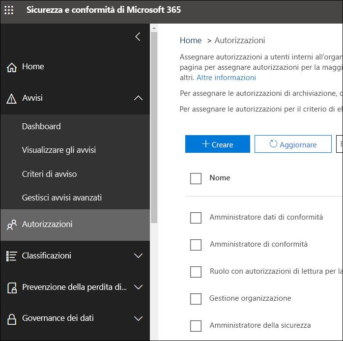

# Autorizzazioni nel Centro conformità Microsoft 365 e nel Centro sicurezza Microsoft 365Permissions in the Microsoft 365 compliance center and Microsoft 365 security center

L'organizzazione deve gestire gli scenari di sicurezza e conformità che riguardano tutti i servizi di Microsoft 365.Your organization needs to manage security and compliance scenarios that span all the Microsoft 365 services. Inoltre, è necessaria flessibilità per fornire le corrette autorizzazioni di amministratore alle persone giuste nel gruppo IT dell'organizzazione.And you need the flexibility to give the right admin permissions to the right people in your organization's IT group. Utilizzando il Centro sicurezza Microsoft 365 o il Centro conformità Microsoft 365, è possibile gestire le autorizzazioni in una posizione centralizzata per tutte le attività relative alla sicurezza o alla conformità.By using the Microsoft 365 security center or Microsoft 365 compliance center, you can manage permissions centrally for all tasks related to security or compliance.

In seguito all'assegnazione dei ruoli di amministratore da parte dell'amministratore globale, gli amministratori avranno accesso a funzionalità e dati che riguardano tutti i servizi di Microsoft 365, come il Centro sicurezza Microsoft 365, il Centro conformità Microsoft 365, Azure, Office 365 ed Enterprise Mobility + Security.After the global administrator assigns these admin roles, the admins have access to features and data that span all services in Microsoft 365, such as the Microsoft 365 security center, Microsoft 365 compliance center, Azure, Office 365, and Enterprise Mobility + Security.

## Quali sono i ruoli di Microsoft 365What the Microsoft 365 roles are

I ruoli visualizzati nel Centro conformità Microsoft 365 e nel Centro sicurezza Microsoft 365 sono ruoli di Azure Active Directory.The roles that appear in the Microsoft 365 compliance center and Microsoft 365 security center are Azure Active Directory roles. Tali ruoli sono progettati per uniformarsi alle funzioni lavorative nel gruppo IT della propria organizzazione, semplificando quindi l'assegnazione di autorizzazioni necessarie per svolgere il lavoro.These roles are designed to align with job functions in your organization's IT group, making it easy to give a person all the permissions necessary to get their job done.

|**Ruolo****Role**|**Descrizione****Description**|
|:-----|:-----|
|**Amministratore globale****Global administrator**|Gli utenti con questo ruolo hanno accesso a tutte le funzionalità amministrative presenti in ogni servizio di Microsoft 365.Users with this role have access to all administrative features in all Microsoft 365 services. Solo gli amministratori globali possono assegnare altri ruoli di amministratore.Only global administrators can assign other administrator roles.|
|**Amministratore dati di conformità****Compliance data administrator**|Gli utenti con questo ruolo possono tenere traccia dei dati dell'organizzazione su Microsoft 365, assicurarsi che siano protetti e ottenere informazioni dettagliate su eventuali problemi in modo da attenuarne i rischi.Users with this role can keep track of your organization's data across Microsoft 365, make sure it's protected, and get insights into any issues to help mitigate risks.|
|**Amministratore di conformità****Compliance administrator**|Gli utenti con questo ruolo possono aiutare l'organizzazione a rimanere conforme ai requisiti normativi, gestire i casi di eDiscovery e mantenere i criteri di governance dei dati nelle posizioni, identità e app di Microsoft 365.Users with this role can help your organization stay compliant with any regulatory requirements, manage eDiscovery cases, and maintain data governance policies across Microsoft 365 locations, identities, and apps.|
|**Operatore della sicurezza****Security operator**|Gli utenti con questo ruolo possono visualizzare, analizzare e rispondere alle minacce attive a utenti, dispositivi e contenuti di Microsoft 365.Users with this role can view, investigate, and respond to active threats to your Microsoft 365 users, devices, and content.|
|**Ruolo con autorizzazioni di lettura per la sicurezza****Security reader**|Gli utenti con questo ruolo possono visualizzare, analizzare e rispondere alle minacce attive a utenti, dispositivi e contenuti di Microsoft 365 ma, a differenza del ruolo di Operatore della sicurezza, non hanno le autorizzazioni necessarie per intervenire.Users with this role can view and investigate active threats to your Microsoft 365 users, devices, and content, but (unlike the Security operator) they do not have permissions to respond by taking action.|
|**Amministratore della sicurezza****Security administrator**|Gli utenti con questo ruolo possono controllare la sicurezza complessiva dell'organizzazione gestendo i criteri di sicurezza, esaminando l'analisi e i report della sicurezza nei prodotti di Microsoft 365 e tenendosi informati sul panorama delle minacce.Users with this role can control your organization's overall security by managing security policies, reviewing security analytics and reports across Microsoft 365 products, and staying up-to-speed on the threat landscape.|

## A cosa hanno accesso i ruoli di Microsoft 365What the Microsoft 365 roles have access to

Ecco i ruoli disponibili e le operazioni consentite alle persone a cui vengono assegnati.Here are the available roles and what people assigned to them can do.

### Amministratore globaleGlobal administrator

Gli utenti con questo ruolo hanno accesso a tutte le funzionalità amministrative in Azure Active Directory, nonché ai servizi che usano identità di Azure Active Directory come Centro sicurezza Microsoft 365, Centro conformità Microsoft 365, Exchange Online, SharePoint Online e Skype for Business Online.Users with this role have access to all administrative features in Azure Active Directory, as well as services that use Azure Active Directory identities like Microsoft 365 security center, Microsoft 365 compliance center, Exchange Online, SharePoint Online, and Skype for Business Online. La persona che effettua l'iscrizione per il tenant di Azure Active Directory diventa amministratore globale.The person who signs up for the Azure Active Directory tenant becomes a global administrator. Solo gli amministratori globali possono assegnare altri ruoli di amministratore.Only global administrators can assign other administrator roles. In una società possono essere presenti più amministratori globali.There can be more than one global administrator at your company. Gli amministratori globali possono reimpostare la password per qualsiasi utente e per tutti gli altri amministratori.Global admins can reset the password for any user and all other administrators.

### Amministratore di conformitàCompliance administrator

Gli utenti con questo ruolo hanno le autorizzazioni necessarie per gestire le funzionalità relative alla conformità nel Centro conformità Microsoft 365, nell'interfaccia di amministrazione di Microsoft 365, in Azure e nel Centro sicurezza e conformità di Office 365.Users with this role have permissions to manage compliance-related features in the Microsoft 365 compliance center, Microsoft 365 admin center, Azure, and Office 365 Security & Compliance Center. Gli utenti possono anche gestire tutte le funzionalità all'interno dell'interfaccia di amministrazione di Exchange e nell'interfaccia di amministrazione di Teams e Skype for Business e creare ticket di supporto per Azure e Microsoft 365.Users can also manage all features within the Exchange admin center and Teams & Skype for Business admin center and create support tickets for Azure and Microsoft 365.

|**In questo servizio...****In this service...**|**L'amministratore di conformità può...****The compliance administrator can...**|
|:-----|:-----|
|[**Centro conformità Microsoft 365****Microsoft 365 compliance center**](https://compliance.microsoft.com/)|Proteggere e gestire i dati dell'organizzazione in tutti i servizi di Microsoft 365.Protect and manage your organization's data across Microsoft 365 services.    Gestire gli avvisi di conformità.Manage compliance alerts.|
|[**Punteggio conformità****Compliance Score**](https://docs.microsoft.com/office365/securitycompliance/meet-data-protection-and-regulatory-reqs-using-microsoft-cloud)|Monitorare, assegnare e verificare le attività di conformità alle normative dell'organizzazione.Track, assign, and verify your organization's regulatory compliance activities.|
|[**Centro sicurezza e conformità di Office 365****Office 365 Security & Compliance Center**](https://docs.microsoft.com/office365/admin/add-users/about-admin-roles)|Gestire la governance dei dati.Manage data governance.    Eseguire analisi sui dati e di carattere legale.Perform legal and data investigation.    Gestire le richieste degli interessati.Manage Data Subject Request.|
|[**Intune****Intune**](https://docs.microsoft.com/intune/role-based-access-control)|Visualizzare tutti i dati di controllo di Intune.View all Intune audit data.|
|[**Cloud App Security****Cloud App Security**](https://docs.microsoft.com/cloud-app-security/manage-admins)|Disporre di autorizzazioni di sola lettura e gestire gli avvisi.Has read-only permissions and can manage alerts.    Creare e modificare i criteri di file e consentire azioni di governance sui file.Can create and modify file policies and allow file governance actions.    Visualizzare tutti i report predefiniti in Gestione dati.Can view all the built-in reports under Data Management.|

### Amministratore dati di conformitàCompliance data administrator

Gli utenti con questo ruolo hanno le autorizzazioni necessarie per proteggere e monitorare i dati nel Centro conformità Microsoft 365, nell'interfaccia di amministrazione di Microsoft 365 e in Azure.Users with this role have permissions to protect and track data in the Microsoft 365 compliance center, Microsoft 365 admin center, and Azure. Gli utenti possono anche gestire tutte le funzionalità all'interno dell'interfaccia di amministrazione di Exchange, in Punteggio conformità, nell'interfaccia di amministrazione di Teams e Skype for Business e creare ticket di supporto per Azure e Microsoft 365.Users can also manage all features within the Exchange admin center, Compliance Score, and Teams & Skype for Business admin center and create support tickets for Azure and Microsoft 365.

|**In questo servizio...****In this service...**|**L'amministratore dati di conformità può...****The compliance data administrator can...**|
|:-----|:-----|
|[**Centro conformità Microsoft 365****Microsoft 365 compliance center**](https://compliance.microsoft.com/)|Proteggere e gestire i dati dell'organizzazione in tutti i servizi di Microsoft 365.Protect and manage your organization's data across Microsoft 365 services.    Gestire gli avvisi di conformità.Manage compliance alerts.    Gestire le etichette di riservatezza.Manage sensitivity labels|
|[**Punteggio conformità****Compliance Score**](https://docs.microsoft.com/office365/securitycompliance/meet-data-protection-and-regulatory-reqs-using-microsoft-cloud)|Monitorare, assegnare e verificare le attività di conformità alle normative dell'organizzazione.Track, assign, and verify your organization's regulatory compliance activities.|
|[**Centro sicurezza e conformità di Office 365****Office 365 Security & Compliance Center**](https://docs.microsoft.com/office365/admin/add-users/about-admin-roles)|Gestire la governance dei dati.Manage data governance.    Eseguire analisi sui dati e di carattere legale.Perform legal and data investigation.    Gestire le richieste degli interessati.Manage Data Subject Request.    Gestire le etichette di riservatezza.Manage sensitivity labels|
|[**Intune**](https://docs.microsoft.com/intune/role-based-access-control) (presto disponibile)[**Intune**](https://docs.microsoft.com/intune/role-based-access-control) (coming soon)|Visualizzare tutti i dati di controllo di Intune.View all Intune audit data.|
|[**Cloud App Security****Cloud App Security**](https://docs.microsoft.com/cloud-app-security/manage-admins)|Utilizzare le autorizzazioni di sola lettura per visualizzare le informazioni.Use read-only permissions to view information.  Gestire gli avvisi.Manage alerts.    Creare e modificare i criteri di file e consentire azioni di governance sui file.Create and modify file policies and allow file governance actions.    Visualizzare tutti i report predefiniti in Gestione dati.View all the built-in reports under Data Management.|

### Amministratore della sicurezzaSecurity administrator

Gli utenti con questo ruolo hanno le autorizzazioni necessarie per gestire le funzionalità relative alla sicurezza nel Centro sicurezza Microsoft 365, in Azure Active Directory Identity Protection, in Azure Information Protection e nel Centro sicurezza e conformità di Office 365.Users with this role have permissions to manage security-related features in the Microsoft 365 security center, Azure Active Directory Identity Protection, Azure Information Protection, and Office 365 Security & Compliance Center.

|**In questo servizio...****In this service...**|**L'amministratore della sicurezza può...****The security administrator can...**|
|:-----|:-----|
|[**Centro sicurezza Microsoft 365****Microsoft 365 security center**](https://security.microsoft.com/)|Monitorare i criteri correlati alla sicurezza in tutti i servizi di Microsoft 365.Monitor security-related policies across Microsoft 365 services.     Gestire gli avvisi e le minacce alla sicurezza.Manage security threats and alerts.    Visualizzare i report.View reports.    Gestire le etichette di riservatezza.Manage sensitivity labels.|
|**Identity Protection Center****Identity Protection Center**|Eseguire le stesse operazioni del ruolo con autorizzazioni di lettura per la sicurezza, oltre a eseguire tutte le operazioni di Identity Protection Center, ad eccezione del ripristino delle password.Do everything the Security Reader role can, plus  perform all Identity Protection Center operations, except for reset passwords.|
|[**Privileged Identity Management****Privileged Identity Management**](https://docs.microsoft.com/azure/active-directory/privileged-identity-management/pim-configure)|Eseguire le stesse operazioni del ruolo con autorizzazioni di lettura per la sicurezza.Do everything the Security Reader role can.    **Non può** gestire le assegnazioni o le impostazioni dei ruoli di Azure AD.**Cannot** manage Azure AD role assignments or settings.|
|[**Centro sicurezza e conformità di Office 365****Office 365 Security & Compliance Center**](https://docs.microsoft.com/office365/admin/add-users/about-admin-roles)|Gestire i criteri di sicurezza.Manage security policies.    Visualizzare, analizzare e rispondere alle minacce alla sicurezzaView, investigate, and respond to security threats    Visualizzare i report.View reports.    Gestire le etichette di riservatezza.Manage sensitivity labels.|
|**Azure Advanced Threat Protection****Azure Advanced Threat Protection**|Monitorare e rispondere alle attività sospette dal punto di vista della sicurezza.Monitor and respond to suspicious security activity.|
|**Windows Defender ATP ed EDR****Windows Defender ATP and EDR**|Assegnare ruoli.Assign roles.    Gestire i gruppi di computer.Manage machine groups.    Configurare il rilevamento delle minacce agli endpoint e le funzionalità automatizzate di correzione.Configure endpoint threat detection and automated remediation.    Visualizzare, analizzare e rispondere agli avvisi.View, investigate, and respond to alerts.|
|[**Intune****Intune**](https://docs.microsoft.com/intune/role-based-access-control)|Visualizzare le informazioni relative a utenti, dispositivi e applicazioni e i dati di registrazione e configurazione.Views user, device, enrollment, configuration, and application information.    **Non può** apportare modifiche a Intune.**Cannot** make changes to Intune.|
|[**Cloud App Security****Cloud App Security**](https://docs.microsoft.com/cloud-app-security/manage-admins)|Aggiungere amministratori, criteri e impostazioni, caricare i log ed eseguire azioni di governance.Add admins, add policies and settings, upload logs and perform governance actions.|
|[**Centro sicurezza di Azure**](https://docs.microsoft.com/azure/role-based-access-control/built-in-roles) (presto disponibile)[**Azure Security Center**](https://docs.microsoft.com/azure/role-based-access-control/built-in-roles) (coming soon)|Visualizzare i criteri di sicurezza e gli stati di sicurezza, modificare i criteri di sicurezza, visualizzare gli avvisi e le raccomandazioni, ignorare gli avvisi e le raccomandazioni.View security policies, view security states, edit security policies, view alerts and recommendations, dismiss alerts and recommendations.|
|[**Integrità dei servizi di Office 365****Office 365 service health**](https://docs.microsoft.com/office365/enterprise/view-service-health)|Visualizzare l'integrità dei servizi di Office 365.View the health of Office 365 services.|

### Operatore della sicurezzaSecurity operator

Gli utenti con questo ruolo possono gestire gli avvisi e hanno accesso globale di sola lettura alle funzionalità relative alla sicurezza, incluse tutte le informazioni nel Centro sicurezza Microsoft 365, in Azure Active Directory, Identity Protection e Privileged Identity Management, oltre alla possibilità di accedere in lettura ai log di controllo e ai report di accesso di Azure Active Directory, e nel Centro sicurezza e conformità di Office 365.Users with this role can manage alerts and have global read-only access on security-related feature, including all information in the Microsoft 365 security center, Azure Active Directory, Identity Protection, Privileged Identity Management, as well as the ability to read Azure Active Directory sign-in reports and audit logs, and in Office 365 Security & Compliance Center.

|**In questo servizio...****In this service...**|**L'operatore della sicurezza può...****The security operator can...**|
|:-----|:-----|
|[**Centro sicurezza Microsoft 365****Microsoft 365 security center**](https://security.microsoft.com/)|Eseguire le stesse operazioni del ruolo con autorizzazioni di lettura per la sicurezza.Do everything the Security Reader role can.    Visualizzare, analizzare e rispondere agli avvisi di sicurezza.View, investigate, and respond to security alerts.|
|**Identity Protection Center** (presto disponibile)**Identity Protection Center** (coming soon)|Eseguire le stesse operazioni del ruolo con autorizzazioni di lettura per la sicurezza.Do everything the Security Reader role can.|
|[**Privileged Identity Management****Privileged Identity Management**](https://docs.microsoft.com/azure/active-directory/privileged-identity-management/pim-configure)|Eseguire le stesse operazioni del ruolo con autorizzazioni di lettura per la sicurezza.Do everything the Security Reader role can.|
|[**Centro sicurezza e conformità di Office 365****Office 365 Security & Compliance Center**](https://docs.microsoft.com/office365/admin/add-users/about-admin-roles)|Eseguire le stesse operazioni del ruolo con autorizzazioni di lettura per la sicurezza.Do everything the Security Reader role can.    Visualizzare, analizzare e rispondere alle minacce alla sicurezzaView, investigate, and respond to security threats|
|**Windows Defender ATP ed EDR****Windows Defender ATP and EDR**|Eseguire le stesse operazioni del ruolo con autorizzazioni di lettura per la sicurezza.Do everything the Security Reader role can.    Visualizzare, analizzare e rispondere agli avvisi.View, investigate, and respond to alerts.|
|[**Intune****Intune**](https://docs.microsoft.com/intune/role-based-access-control)|Visualizzare le informazioni relative a utenti, dispositivi e applicazioni e i dati di registrazione e configurazione.Views user, device, enrollment, configuration, and application information.    **Non può** apportare modifiche a Intune.**Cannot** make changes to Intune.|
|[**Cloud App Security****Cloud App Security**](https://docs.microsoft.com/cloud-app-security/manage-admins)|Eseguire le stesse operazioni del ruolo con autorizzazioni di lettura per la sicurezza, oltre a visualizzare e ignorare gli avvisi.Do everything the Security Reader role can, plus view and dismiss alerts.|
|[**Integrità dei servizi di Office 365****Office 365 service health**](https://docs.microsoft.com/office365/enterprise/view-service-health)|Visualizzare l'integrità dei servizi di Office 365.View the health of Office 365 services.|

### Ruolo con autorizzazioni di lettura per la sicurezzaSecurity reader

Gli utenti con questo ruolo hanno accesso globale di sola lettura alle funzionalità relative alla sicurezza, incluse tutte le informazioni nel Centro sicurezza Microsoft 365, in Azure Active Directory, Identity Protection e Privileged Identity Management, oltre alla possibilità di accedere in lettura ai log di controllo e ai report di accesso di Azure Active Directory e nel Centro sicurezza e conformità di Office 365.Users with this role have global read-only access on security-related feature, including all information in the Microsoft 365 security center, Azure Active Directory, Identity Protection, Privileged Identity Management, as well as the ability to read Azure Active Directory sign-in reports and audit logs, and in Office 365 Security & Compliance Center.

|**In questo servizio...****In this service...**|**Il ruolo con autorizzazioni di lettura per la sicurezza può...****The security reader can...**|
|:-----|:-----|
|[**Centro sicurezza Microsoft 365****Microsoft 365 security center**](https://security.microsoft.com/)|Visualizzare i criteri correlati alla sicurezza in tutti i servizi di Microsoft 365.View security-related policies across Microsoft 365 services.    Visualizzare gli avvisi e le minacce alla sicurezza.View security threats and alerts.    Visualizzare i report.View reports.|
|**Identity Protection Center****Identity Protection Center**|Leggere tutti i report sulla sicurezza e le informazioni sulle impostazioni per le funzionalità di sicurezza: protezione da posta indesiderata, crittografia, prevenzione della perdita di dati (DLP), antimalware, Advanced Threat Protection (ATP), anti-phishing e regole del flusso di posta (note anche come regole di trasporto).Read all security reports and settings information for security features: anti-spam, encryption, data loss prevention (DLP), anti-malware, Advanced Threat Protection (ATP), anti-phishing, and mail flow rules (also known as transport rules).|
|[**Privileged Identity Management****Privileged Identity Management**](https://docs.microsoft.com/azure/active-directory/privileged-identity-management/pim-configure)|Utilizzare l'accesso in sola lettura per visualizzare tutte le informazioni presentate in Azure AD PIM: criteri e report per le assegnazioni di ruoli in Azure AD, verifiche della sicurezza e, in futuro, report e dati dei criteri per gli scenari in aggiunta all'assegnazione di ruoli in Azure AD.Use read-only access to view all information surfaced in Azure AD PIM: Policies and reports for Azure AD role assignments, security reviews, and (in the future) policy data and reports for scenarios other than Azure AD role assignment.    **Non può** eseguire l'iscrizione ad Azure AD PIM o apportarvi modifiche.**Cannot** sign up for Azure AD PIM or make any changes to it. Nel portale di PIM o tramite PowerShell, un utente con questo ruolo può attivare altri ruoli, ad esempio amministratore globale o amministratore di ruoli con privilegi, se è idoneo per questi ruoli.In the PIM portal or via PowerShell, someone in this role can activate additional roles (for example, Global Admin or Privileged Role Administrator), if the user is a eligible for them.|
|[**Centro sicurezza e conformità di Office 365****Office 365 Security & Compliance Center**](https://docs.microsoft.com/office365/admin/add-users/about-admin-roles)|Visualizzare i criteri di sicurezza.View security policies.    Visualizzare e analizzare le minacce alla sicurezza.View and investigate security threats.    Visualizzare i report.View reports.|
|**Windows Defender ATP ed EDR****Windows Defender ATP and EDR**|Visualizzare e analizzare gli avvisi.View and investigate alerts.|
|[**Intune****Intune**](https://docs.microsoft.com/intune/role-based-access-control)|Visualizzare le informazioni relative a utenti, dispositivi e applicazioni e i dati di registrazione e configurazione.Views user, device, enrollment, configuration, and application information.    **Non può** apportare modifiche a Intune.**Cannot** make changes to Intune.|
|[**Cloud App Security****Cloud App Security**](https://docs.microsoft.com/cloud-app-security/manage-admins)|Utilizzare le autorizzazioni di sola lettura per visualizzare le informazioni.Use read-only permissions to view information.    Gestire gli avvisi.Manage alerts.|
|[**Centro sicurezza di Azure****Azure Security Center**](https://docs.microsoft.com/azure/role-based-access-control/built-in-roles)|Visualizzare raccomandazioni e avvisi.View recommendations and alerts.    Visualizzare i criteri di sicurezza.View security policies.    Visualizzare gli stati di sicurezza, ma non può apportare modifiche.View security states, but cannot make changes.|
|[**Integrità dei servizi di Office 365****Office 365 service health**](https://docs.microsoft.com/office365/enterprise/view-service-health)|Visualizzare l'integrità dei servizi di Office 365.View the health of Office 365 services.|

## Gli amministratori globali possono gestire i ruoli in Azure Active DirectoryGlobal administrators can manage roles in Azure Active Directory

Quando un ruolo viene selezionato nel Centro conformità Microsoft 365 e nel Centro sicurezza Microsoft 365, è possibile visualizzarne le assegnazioni.In the Microsoft 365 compliance center and Microsoft 365 security center, when you select a role, you can view its assignments. Tuttavia, per gestire tali assegnazioni, è necessario accedere ad Azure Active Directory.But to manage those assignments, you need to go to the Azure Active Directory.

Per altre informazioni, vedere [Visualizzare e assegnare i ruoli di amministratore in Azure Active Directory](https://docs.microsoft.com/azure/active-directory/users-groups-roles/directory-manage-roles-portal).For more information, see [View and assign administrator roles in Azure Active Directory](https://docs.microsoft.com/azure/active-directory/users-groups-roles/directory-manage-roles-portal).

## Gestione dei ruoli in un servizio anziché in Azure Active DirectoryManaging roles in a service instead of Azure Active Directory

I ruoli visualizzati nel Centro conformità Microsoft 365 e nel Centro sicurezza Microsoft 365 sono visualizzati anche nei servizi per cui si hanno le autorizzazioni necessarie.The roles that appear in the Microsoft 365 compliance center and Microsoft 365 security center also appear in the services where they have permissions. Ad esempio, è possibile visualizzare questi ruoli nel Centro sicurezza e conformità di Office 365.For example, you can see these roles in the Office 365 Security & Compliance Center.

### Interruzione dell'ereditarietàBreaking inheritance

È importante tenere presente che quando si gestiscono questi ruoli in Azure Active Directory, **tutti** i servizi di Microsoft 365 sono gestiti in una posizione centralizzata.It's important to understand that you when you manage these roles in Azure Active Directory, you're doing so centrally for **all** Microsoft 365 services. Tuttavia, quando si gestisce un ruolo in un servizio specifico, come il Centro sicurezza e conformità di Office 365, si sta gestendo il ruolo **solo** per quel servizio specifico.However, when you manage a role in a specific service, such as the Office 365 Security & Compliance Center, you're managing the role for **only** that specific service. Le assegnazioni e le autorizzazioni per un ruolo in un servizio hanno la precedenza su tutte le autorizzazioni concesse al ruolo di Azure Active Directory.The assignments and permissions for a role in a service override any permissions granted to the Azure Active Directory role.

Ciò può rilevarsi utile. Ad esempio, se viene assegnato il ruolo di amministratore della sicurezza a un utente, questo non dispone delle autorizzazioni necessarie per gestire gli incidenti.This can be useful – for example, if a person is assigned to the Security administrator role, they don't have permissions to manage incidents. È tuttavia possibile utilizzare le autorizzazioni in Windows Defender Advanced Threat Protection per fornirgli le autorizzazioni specifiche per la gestione degli incidenti in quel servizio.But you can use the permissions in Windows Defender Advanced Threat Protection to give them the specific permission for incident management in that service.

## Dove trovare le informazioni sui ruoli per ogni servizio Microsoft 365Where to find role information for each Microsoft 365 service

Assegnando uno dei ruoli di amministratore di conformità o di sicurezza di Microsoft 365 a un utente, gli vengono concesse le autorizzazioni a una gamma di servizi di Microsoft 365.By assigning a user to one of the Microsoft 365 compliance or security admin roles, you give that user permissions to a range of Microsoft 365 services. Utilizzare i collegamenti seguenti per trovare ulteriori informazioni sulle autorizzazioni specifiche per un ruolo in ciascun servizio.Use the links below to find more information about the specific permissions for a role in each service.

|**Servizio Microsoft 365****Microsoft 365 service**|**Informazioni sul ruolo****Role info**|
|:-----|:-----|
|Ruoli di amministratore in Office 365 e piani aziendali di Microsoft 365Admin roles in Office 365 and Microsoft 365 business plans|[Ruoli di amministrazione di Office 365Office 365 admin roles](https://docs.microsoft.com/office365/admin/add-users/about-admin-roles?view=o365-worldwide)|
|Azure Active Directory (Azure AD) e Azure AD Identity ProtectionAzure Active Directory (Azure AD) and Azure AD Identity Protection|[Ruoli di amministratore di Azure ADAzure AD admin roles](https://docs.microsoft.com/azure/active-directory/users-groups-roles/directory-assign-admin-roles)|
|Azure Advanced Threat ProtectionAzure Advanced Threat Protection|[Gruppi di ruoli di Azure ATPAzure ATP role groups](https://docs.microsoft.com/azure-advanced-threat-protection/atp-role-groups)|
|Azure Information ProtectionAzure Information Protection|[Ruoli di amministratore di Azure ADAzure AD admin roles](https://docs.microsoft.com/azure/active-directory/users-groups-roles/directory-assign-admin-roles)|
|Punteggio di conformitàCompliance Score|[Ruoli di Punteggio conformitàCompliance Score roles](https://docs.microsoft.com/microsoft-365/compliance/compliance-score-setup#set-user-permissions-and-assign-roles)|
|Exchange OnlineExchange Online|[Controllo degli accessi in base al ruolo di ExchangeExchange role-based access control](https://docs.microsoft.com/exchange/understanding-role-based-access-control-exchange-2013-help)|
|IntuneIntune|[Controllo degli accessi in base al ruolo di IntuneIntune role-based access control](https://docs.microsoft.com/intune/role-based-access-control)|
|Managed DesktopManaged Desktop|[Ruoli di amministratore di Azure ADAzure AD admin roles](https://docs.microsoft.com/azure/active-directory/users-groups-roles/directory-assign-admin-roles)|
|Microsoft Cloud App SecurityMicrosoft Cloud App Security|[Controllo degli accessi in base al ruoloRole-based access control](https://docs.microsoft.com/cloud-app-security/manage-admins)|
|Centro sicurezza e conformità di Office 365Office 365 Security & Compliance Center|[Ruoli di amministrazione di Office 365Office 365 admin roles](https://docs.microsoft.com/office365/SecurityCompliance/permissions-in-the-security-and-compliance-center)|
|Privileged Identity ManagementPrivileged Identity Management|[Ruoli di amministratore di Azure ADAzure AD admin roles](https://docs.microsoft.com/azure/active-directory/users-groups-roles/directory-assign-admin-roles)|
|Secure ScoreSecure Score|[Ruoli di amministratore di Azure ADAzure AD admin roles](https://docs.microsoft.com/azure/active-directory/users-groups-roles/directory-assign-admin-roles)|
|SharePoint OnlineSharePoint Online|[Ruoli di amministratore di Azure ADAzure AD admin roles](https://docs.microsoft.com/azure/active-directory/users-groups-roles/directory-assign-admin-roles)    [Informazioni sul ruolo di amministratore di SharePoint in Office 365About the SharePoint admin role in Office 365](https://docs.microsoft.com/sharepoint/sharepoint-admin-role)|
|Teams/Skype for BusinessTeams/Skype for Business|[Ruoli di amministratore di Azure ADAzure AD admin roles](https://docs.microsoft.com/azure/active-directory/users-groups-roles/directory-assign-admin-roles)|
|Windows Defender Advanced Threat ProtectionWindows Defender Advanced Threat Protection|[Controllo degli accessi in base al ruolo di Windows Defender ATPWindows Defender ATP role-based access control](https://docs.microsoft.com/windows/security/threat-protection/windows-defender-atp/rbac-windows-defender-advanced-threat-protection)|

## Presto disponibileWhat is coming soon

Le autorizzazioni nel Centro conformità Microsoft 365 e nel Centro sicurezza Microsoft 365 sono ancora in fase di sviluppo.We're still working on permissions in the Microsoft 365 compliance center and Microsoft 365 security center. Ad esempio, è in fase di sviluppo il supporto per:For example, we're currently working on support for the ability to:

- Gestire i ruoli nel Centro conformità Microsoft 365 e nel Centro sicurezza Microsoft 365, senza dover accedere ad Azure Active Directory.Manage roles in the Microsoft 365 compliance center and Microsoft 365 security center, instead of going to Azure Active Directory.

- Personalizzare i ruoli aggiungendo o rimuovendo autorizzazioni specifiche.Customize roles by adding or removing specific permissions.

- Creare ruoli personalizzati con le autorizzazioni scelte.Create custom roles with permissions that you choose.
