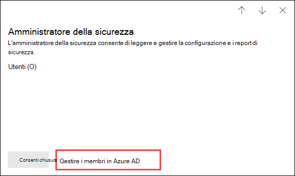

# Autorizzazioni nel Centro conformità Microsoft 365 e nel Centro sicurezza Microsoft 365Permissions in the Microsoft 365 compliance center and Microsoft 365 security center

[!INCLUDE [Microsoft 365 Defender rebranding](../includes/microsoft-defender-for-office.md)]

**Si applica a****Applies to**
- [Exchange Online ProtectionExchange Online Protection](exchange-online-protection-overview.md)
- [Microsoft Defender per Office 365 piano 1 e piano 2Microsoft Defender for Office 365 plan 1 and plan 2](office-365-atp.md)
- [Microsoft 365 DefenderMicrosoft 365 Defender](../mtp/microsoft-threat-protection.md)

L'organizzazione deve gestire gli scenari di sicurezza e conformità che riguardano tutti i servizi di Microsoft 365.Your organization needs to manage security and compliance scenarios that span all the Microsoft 365 services. Inoltre, è necessaria flessibilità per fornire le corrette autorizzazioni di amministratore alle persone giuste nel gruppo IT dell'organizzazione.And you need the flexibility to give the right admin permissions to the right people in your organization's IT group. Utilizzando il Centro sicurezza Microsoft 365 o il Centro conformità Microsoft 365, è possibile gestire le autorizzazioni in una posizione centralizzata per tutte le attività relative alla sicurezza o alla conformità.By using the Microsoft 365 security center or Microsoft 365 compliance center, you can manage permissions centrally for all tasks related to security or compliance.

In seguito all'aggiunta di utenti a questi ruoli di amministratore da parte di un amministratore globale, questi amministratori avranno accesso a funzionalità e dati che riguardano tutti i servizi di Microsoft 365, come il Centro sicurezza Microsoft 365, il Centro conformità Microsoft 365, Azure, Office 365 ed Enterprise Mobility + Security.After a global administrator adds users to these admin roles, these admin will have access to features and data that span all services in Microsoft 365, such as the Microsoft 365 security center, Microsoft 365 compliance center, Azure, Office 365, and Enterprise Mobility + Security.

## Quali sono i ruoli di Microsoft 365What the Microsoft 365 roles are

I ruoli visualizzati nel Centro conformità Microsoft 365 e nel Centro sicurezza Microsoft 365 sono ruoli di Azure Active Directory.The roles that appear in the Microsoft 365 compliance center and Microsoft 365 security center are Azure Active Directory roles. Tali ruoli sono progettati per uniformarsi alle funzioni lavorative nel gruppo IT della propria organizzazione, semplificando quindi l'assegnazione di autorizzazioni necessarie per svolgere il lavoro.These roles are designed to align with job functions in your organization's IT group, making it easy to give a person all the permissions necessary to get their job done.

****

|RuoloRole|DescrizioneDescription|
|---|---|
|**Amministratore globale****Global administrator**|Ha accesso a tutte le funzionalità amministrative presenti in ogni servizio di Microsoft 365.Access to all administrative features in all Microsoft 365 services. Solo gli amministratori globali possono assegnare altri ruoli di amministratore.Only global administrators can assign other administrator roles. Per altre informazioni, vedere [Amministratore globale / Amministratore aziendale](/azure/active-directory/roles/permissions-reference#global-administrator--company-administrator).For more information, see [Global Administrator / Company Administrator](/azure/active-directory/roles/permissions-reference#global-administrator--company-administrator).|
|**Amministratore dati di conformità****Compliance data administrator**|Tiene traccia dei dati dell'organizzazione su Microsoft 365, si assicura che siano protetti e ottiene informazioni dettagliate su eventuali problemi, in modo da attenuarne i rischi.Keep track of your organization's data across Microsoft 365, make sure it's protected, and get insights into any issues to help mitigate risks. Per ulteriori informazioni, vedere [Amministratore dati di conformità](/azure/active-directory/roles/permissions-reference#compliance-data-administrator).For more information, see [Compliance Data Administrator](/azure/active-directory/roles/permissions-reference#compliance-data-administrator).|
|**Amministratore di conformità****Compliance administrator**|Aiuta l'organizzazione a rimanere conforme ai requisiti normativi, gestire i casi di eDiscovery e mantenere i criteri di governance dei dati nelle posizioni, identità e app di Microsoft 365.Help your organization stay compliant with any regulatory requirements, manage eDiscovery cases, and maintain data governance policies across Microsoft 365 locations, identities, and apps. Per ulteriori informazioni, vedere [Amministratore di conformità](/azure/active-directory/roles/permissions-reference#compliance-administrator).For more information, see [Compliance Administrator](/azure/active-directory/roles/permissions-reference#compliance-administrator).|
|**Operatore della sicurezza****Security operator**|Può visualizzare, analizzare e rispondere alle minacce attive a utenti, dispositivi e contenuti di Microsoft 365.View, investigate, and respond to active threats to your Microsoft 365 users, devices, and content. Per altre informazioni, vedere [Operatore della sicurezza](/azure/active-directory/roles/permissions-reference#security-operator).For more information, see [Security Operator](/azure/active-directory/roles/permissions-reference#security-operator).|
|**Ruolo con autorizzazioni di lettura per la sicurezza****Security reader**|Può visualizzare, analizzare e rispondere alle minacce attive a utenti, dispositivi e contenuti di Microsoft 365 ma, a differenza del ruolo di Operatore della sicurezza, non ha le autorizzazioni necessarie per intervenire.View and investigate active threats to your Microsoft 365 users, devices, and content, but (unlike the Security operator) they do not have permissions to respond by taking action. Per altre informazioni, vedere [Ruolo con autorizzazioni di lettura per la sicurezza](/azure/active-directory/roles/permissions-reference#security-reader).For more information, see [Security Reader](/azure/active-directory/roles/permissions-reference#security-reader).|
|**Amministratore della sicurezza****Security administrator**|Può controllare la sicurezza complessiva dell'organizzazione gestendo i criteri di sicurezza, esaminando l'analisi e i report della sicurezza nei prodotti di Microsoft 365 e tenendosi informato sul panorama delle minacce.Control your organization's overall security by managing security policies, reviewing security analytics and reports across Microsoft 365 products, and staying up-to-speed on the threat landscape. Per altre informazioni, vedere [Amministratore di sicurezza](/azure/active-directory/roles/permissions-reference#security-administrator).For more information, see [Security Administrator](/azure/active-directory/roles/permissions-reference#security-administrator).|
|**Ruolo con autorizzazioni di lettura globali****Global reader**|La versione di sola lettura del ruolo **Amministratore globale**.The read-only version of the **Global administrator** role. Può visualizzare tutte le impostazioni e le informazioni amministrative in Microsoft 365.View all settings and administrative information across Microsoft 365. Per altre informazioni, vedere [Ruolo con autorizzazioni di lettura globali](/azure/active-directory/roles/permissions-reference#global-reader).For more information, see [Global Reader](/azure/active-directory/roles/permissions-reference#global-reader).|
|

## Gli amministratori globali possono gestire i ruoli in Azure Active DirectoryGlobal administrators can manage roles in Azure Active Directory

Quando un ruolo viene selezionato nel Centro conformità Microsoft 365 e nel Centro sicurezza Microsoft 365, è possibile visualizzarne le assegnazioni.In the Microsoft 365 compliance center and Microsoft 365 security center, when you select a role, you can view its assignments. Tuttavia, per gestire tali assegnazioni, è necessario accedere ad Azure Active Directory.But to manage those assignments, you need to go to the Azure Active Directory.

Per altre informazioni, vedere [Visualizzare e assegnare i ruoli di amministratore in Azure Active Directory](/azure/active-directory/users-groups-roles/directory-manage-roles-portal).For more information, see [View and assign administrator roles in Azure Active Directory](/azure/active-directory/users-groups-roles/directory-manage-roles-portal).

## Gestione dei ruoli in un servizio anziché in Azure Active DirectoryManaging roles in a service instead of Azure Active Directory

I ruoli visualizzati nel Centro conformità Microsoft 365 e nel Centro sicurezza Microsoft 365 sono visualizzati anche nei servizi per cui si hanno le autorizzazioni necessarie.The roles that appear in the Microsoft 365 compliance center and Microsoft 365 security center also appear in the services where they have permissions. Ad esempio, è possibile visualizzare questi ruoli nel Centro sicurezza e conformità.For example, you can see these roles in the Security & Compliance Center.

Per informazioni sull'uso di questi ruoli nel Centro sicurezza e conformità, vedere [Autorizzazioni nel Centro sicurezza e conformità](permissions-in-the-security-and-compliance-center.md).For information about how these roles are used in the Security & Compliance Center, see [Permissions in the Security & Compliance Center](permissions-in-the-security-and-compliance-center.md).

### Interruzione dell'ereditarietàBreaking inheritance

È importante tenere presente che quando si gestiscono questi ruoli in Azure Active Directory, **tutti** i servizi di Microsoft 365 sono gestiti in una posizione centralizzata.It's important to understand that you when you manage these roles in Azure Active Directory, you're doing so centrally for **all** Microsoft 365 services. Tuttavia, quando si gestisce un ruolo in un servizio specifico, come il Centro sicurezza e conformità, si sta gestendo il ruolo **solo** per quel servizio specifico.However, when you manage a role in a specific service, such as the Security & Compliance Center, you're managing the role for **only** that specific service. Le assegnazioni e le autorizzazioni per un ruolo in un servizio hanno la precedenza su tutte le autorizzazioni concesse al ruolo di Azure Active Directory.The assignments and permissions for a role in a service override any permissions granted to the Azure Active Directory role.

Questo può essere utile.This can be useful. Ad esempio, se viene assegnato il ruolo di amministratore della sicurezza a un utente, questo non dispone delle autorizzazioni necessarie per gestire gli incidenti.For example, if a person is assigned to the Security administrator role, they don't have permissions to manage incidents. È tuttavia possibile utilizzare le autorizzazioni in Microsoft Defender per endpoint per fornirgli le autorizzazioni specifiche per la gestione degli incidenti in quel servizio.But you can use the permissions in Microsoft Defender for Endpoint to give them the specific permission for incident management in that service.

## Dove trovare le informazioni sui ruoli per ogni servizio Microsoft 365Where to find role information for each Microsoft 365 service

Assegnando uno dei ruoli di amministratore di conformità o di sicurezza di Microsoft 365 a un utente, gli vengono concesse le autorizzazioni a una gamma di servizi di Microsoft 365.By assigning a user to one of the Microsoft 365 compliance or security admin roles, you give that user permissions to a range of Microsoft 365 services. Utilizzare i collegamenti seguenti per trovare ulteriori informazioni sulle autorizzazioni specifiche per un ruolo in ciascun servizio.Use the links below to find more information about the specific permissions for a role in each service.

****

|Servizio Microsoft 365Microsoft 365 service|Informazioni sul ruoloRole info|
|---|---|
|Ruoli di amministratore nei piani di Office 365 e Microsoft 365 per le aziendeAdmin roles in Office 365 and Microsoft 365 for business plans|[Ruoli di amministratore di Microsoft 365Microsoft 365 admin roles](../../admin/add-users/about-admin-roles.md)|
|Azure Active Directory (Azure AD) e Azure AD Identity ProtectionAzure Active Directory (Azure AD) and Azure AD Identity Protection|[Ruoli di amministratore di Azure ADAzure AD admin roles](/azure/active-directory/users-groups-roles/directory-assign-admin-roles)|
|Che cosa è Microsoft Defender per identità?Microsoft Defender for Identity|[Ruoli dei gruppi Microsoft Defender per identitàMicrosoft Defender for Identity role groups](/azure-advanced-threat-protection/atp-role-groups)|
|Azure Information ProtectionAzure Information Protection|[Ruoli di amministratore di Azure ADAzure AD admin roles](/azure/active-directory/users-groups-roles/directory-assign-admin-roles)|
|Compliance ManagerCompliance Manager|[Compliance ManagerCompliance Manager](../../compliance/compliance-manager-setup.md#set-user-permissions-and-assign-roles)|
|Exchange OnlineExchange Online|[Controllo degli accessi in base al ruolo di ExchangeExchange role-based access control](/exchange/permissions-exo/permissions-exo)|
|IntuneIntune|[Controllo degli accessi in base al ruolo di IntuneIntune role-based access control](/intune/role-based-access-control)|
|Managed DesktopManaged Desktop|[Ruoli di amministratore di Azure ADAzure AD admin roles](/azure/active-directory/users-groups-roles/directory-assign-admin-roles)|
|Microsoft Cloud App SecurityMicrosoft Cloud App Security|[Controllo degli accessi in base al ruoloRole-based access control](/cloud-app-security/manage-admins)|
|Centro sicurezza e conformitàSecurity & Compliance Center|[Ruoli di amministratore di Microsoft 365Microsoft 365 admin roles](permissions-in-the-security-and-compliance-center.md)|
|Privileged Identity ManagementPrivileged Identity Management|[Ruoli di amministratore di Azure ADAzure AD admin roles](/azure/active-directory/users-groups-roles/directory-assign-admin-roles)|
|Secure ScoreSecure Score|[Ruoli di amministratore di Azure ADAzure AD admin roles](/azure/active-directory/users-groups-roles/directory-assign-admin-roles)|
|SharePoint OnlineSharePoint Online|[Ruoli di amministratore di Azure ADAzure AD admin roles](/azure/active-directory/users-groups-roles/directory-assign-admin-roles) 
 [Informazioni sul ruolo di amministratore di SharePoint in Office 365About the SharePoint admin role in Office 365](/sharepoint/sharepoint-admin-role)|
|Teams/Skype for BusinessTeams/Skype for Business|[Ruoli di amministratore di Azure ADAzure AD admin roles](/azure/active-directory/users-groups-roles/directory-assign-admin-roles)|
|Microsoft Defender per endpointMicrosoft Defender for Endpoint|[Controllo degli accessi in base al ruolo di Microsoft Defender per endpointMicrosoft Defender for Endpoint role-based access control](/windows/security/threat-protection/windows-defender-atp/rbac-windows-defender-advanced-threat-protection)|
|

## Presto disponibileComing soon

Le autorizzazioni nel Centro conformità Microsoft 365 e nel Centro sicurezza Microsoft 365 sono ancora in fase di sviluppo.We're still working on permissions in the Microsoft 365 compliance center and Microsoft 365 security center. Ad esempio, è in fase di sviluppo il supporto per:For example, we're currently working on support for the ability to:

- Gestire i ruoli nel Centro conformità Microsoft 365 e nel Centro sicurezza Microsoft 365, senza dover accedere ad Azure Active Directory.Manage roles in the Microsoft 365 compliance center and Microsoft 365 security center, instead of going to Azure Active Directory.
- Personalizzare i ruoli aggiungendo o rimuovendo autorizzazioni specifiche.Customize roles by adding or removing specific permissions.
- Creare ruoli personalizzati con le autorizzazioni scelte.Create custom roles with permissions that you choose.