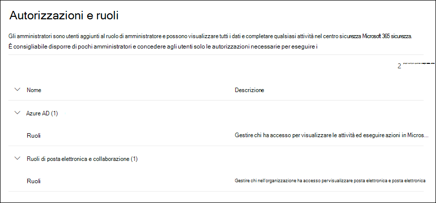
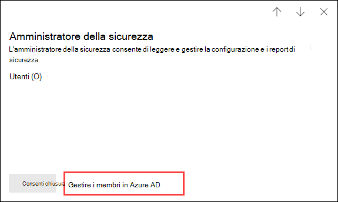

# Autorizzazioni nel portale di Microsoft 365 Defender

[!INCLUDE [Microsoft 365 Defender rebranding](../includes/microsoft-defender-for-office.md)]

**Si applica a**
- [Exchange Online Protection](exchange-online-protection-overview.md)
- [Microsoft Defender per Office 365 piano 1 e piano 2](defender-for-office-365.md)
- [Microsoft 365 Defender](../defender/microsoft-365-defender.md)

È necessario gestire gli scenari di sicurezza e conformità che riguardano tutti i servizi di Microsoft 365. Inoltre, è necessaria flessibilità per fornire le corrette autorizzazioni di amministratore alle persone giuste dell'organizzazione.

Il portale di Microsoft 365 Defender alla pagina <https://security.microsoft.com> supporta la gestione diretta delle autorizzazioni per gli utenti che eseguono attività di sicurezza in Microsoft 365. Usando il portale di Microsoft 365 Defender è possibile gestire in una posizione centralizzata le autorizzazioni per tutte le attività relative alla sicurezza.

Per gestire le autorizzazioni nel portale di Microsoft 365 Defender passare a **Autorizzazioni e ruoli** o <https://security.microsoft.com/securitypermissions>. È necessario essere un **amministratore globale** o un membro del gruppo di ruoli **Gestione organizzazione** nel portale di Microsoft 365 Defender. In particolare, il ruolo **Gestione ruoli** consente agli utenti di visualizzare, creare e modificare i gruppi di ruoli nel portale di Microsoft 365 Defender e, per impostazione predefinita, questo ruolo è assegnato solo al gruppo di ruoli **Gestione organizzazione**.

> [!NOTE]
> Per informazioni sulle autorizzazioni nel Centro conformità Microsoft 365, vedere [Autorizzazioni nel Centro conformità Microsoft 365](../../compliance/microsoft-365-compliance-center-permissions.md).

## Relazione tra membri, ruoli e gruppi di ruoli

Le autorizzazioni nel portale di Microsoft 365 Defender sono basate sul modello di autorizzazioni di Controllo degli accessi in base al ruolo. Controllo degli accessi in base al ruolo è lo stesso modello di autorizzazioni usato dalla maggior parte dei servizi di Microsoft 365, quindi se si ha familiarità con la struttura delle autorizzazioni di questi servizi, concedere le autorizzazioni nel portale di Microsoft 365 Defender sarà semplice.

Un **ruolo** concede le autorizzazioni per svolgere una serie di attività.

Un **gruppo di ruoli** è un set di ruoli che consente alle persone di svolgere il proprio lavoro nel portale di Microsoft 365 Defender. Ad esempio, il gruppo di ruoli Amministratori simulatore attacchi include il ruolo di Amministratore della simulazione di attacco, per creare e gestire tutti gli aspetti della preparazione alla simulazione di attacchi.

Il portale di Microsoft 365 Defender include gruppi di ruoli predefiniti per le attività e le funzioni più comuni che sarà necessario assegnare. In linea generale, si consiglia di aggiungere semplicemente singoli utenti come **membri** ai gruppi di ruoli predefiniti.

## Ruoli e gruppi di ruoli nel portale di Microsoft 365 Defender

In **Autorizzazioni e ruoli** nel portale di Microsoft 365 Defender sono disponibili i tipi di ruoli e gruppi di ruoli seguenti:

- **Ruoli di Azure AD**: è possibile visualizzare i ruoli e gli utenti assegnati, ma non gestirli direttamente nel portale di Microsoft 365 Defender. I ruoli di Azure AD sono ruoli centrali che assegnano autorizzazioni per **tutti** i servizi di Microsoft 365.

- **Ruoli di posta elettronica e collaborazione**: si tratta degli stessi gruppi di ruoli disponibili nel Centro sicurezza e conformità, ma è possibile gestirli direttamente nel portale di Microsoft 365 Defender. Le autorizzazioni assegnate qui sono specifiche per il portale di Microsoft 365 Defender, il Centro conformità Microsoft 365 e il Centro sicurezza e conformità e non coprono tutte le autorizzazioni necessarie in altri carichi di lavoro di Microsoft 365.

### Ruoli di Azure AD nel portale di Microsoft 365 Defender

Passando a **Ruoli di posta elettronica e collaborazione** \> **Autorizzazioni e ruoli** \> **Ruoli di Azure AD** \> **Ruoli** (o direttamente a<https://security.microsoft.com/aadpermissions>), verranno visualizzati i ruoli di Azure AD descritti in questa sezione.

Quando si seleziona un ruolo, compare un riquadro di dettagli che contiene la descrizione del ruolo e le assegnazioni degli utenti. Per gestire queste assegnazioni è necessario fare clic su **Gestisci i membri di Azure AD** nel riquadro a comparsa dei dettagli.

Per altre informazioni, vedere [Visualizzare e assegnare i ruoli di amministratore in Azure Active Directory](/azure/active-directory/users-groups-roles/directory-manage-roles-portal).

 

****

|Ruolo|Descrizione|
|---|---|
|**Amministratore globale**|Ha accesso a tutte le funzionalità amministrative presenti in ogni servizio di Microsoft 365. Solo gli amministratori globali possono assegnare altri ruoli di amministratore. Per altre informazioni, vedere [Amministratore globale / Amministratore aziendale](/azure/active-directory/roles/permissions-reference#global-administrator--company-administrator).|
|**Amministratore dati di conformità**|Tiene traccia dei dati dell'organizzazione su Microsoft 365, si assicura che siano protetti e ottiene informazioni dettagliate su eventuali problemi, in modo da attenuarne i rischi. Per ulteriori informazioni, vedere [Amministratore dati di conformità](/azure/active-directory/roles/permissions-reference#compliance-data-administrator).|
|**Amministratore di conformità**|Aiuta l'organizzazione a rimanere conforme ai requisiti normativi, gestire i casi di eDiscovery e mantenere i criteri di governance dei dati nelle posizioni, identità e app di Microsoft 365. Per ulteriori informazioni, vedere [Amministratore di conformità](/azure/active-directory/roles/permissions-reference#compliance-administrator).|
|**Operatore della sicurezza**|Può visualizzare, analizzare e rispondere alle minacce attive a utenti, dispositivi e contenuti di Microsoft 365. Per altre informazioni, vedere [Operatore della sicurezza](/azure/active-directory/roles/permissions-reference#security-operator).|
|**Ruolo con autorizzazioni di lettura per la sicurezza**|Può visualizzare, analizzare e rispondere alle minacce attive a utenti, dispositivi e contenuti di Microsoft 365 ma, a differenza del ruolo di Operatore della sicurezza, non ha le autorizzazioni necessarie per intervenire. Per altre informazioni, vedere [Ruolo con autorizzazioni di lettura per la sicurezza](/azure/active-directory/roles/permissions-reference#security-reader).|
|**Amministratore della sicurezza**|Può controllare la sicurezza complessiva dell'organizzazione gestendo i criteri di sicurezza, esaminando l'analisi e i report della sicurezza nei prodotti di Microsoft 365 e tenendosi informato sul panorama delle minacce. Per altre informazioni, vedere [Amministratore di sicurezza](/azure/active-directory/roles/permissions-reference#security-administrator).|
|**Ruolo con autorizzazioni di lettura globali**|La versione di sola lettura del ruolo **Amministratore globale**. Può visualizzare tutte le impostazioni e le informazioni amministrative in Microsoft 365. Per altre informazioni, vedere [Ruolo con autorizzazioni di lettura globali](/azure/active-directory/roles/permissions-reference#global-reader).|
|**Amministratore della simulazione di attacco**|Può creare e gestire tutti gli aspetti della creazione di [simulazioni di attacchi](attack-simulation-training.md), dell'avvio e della pianificazione di una simulazione e dell'analisi dei risultati della simulazione. Per altre informazioni, vedere [Amministratore della simulazione di attacco](/azure/active-directory/roles/permissions-reference#attack-simulation-administrator).|
|**Autore payload dell'attacco**|Può payload di attacco, ma non avviarli o pianificarli. Per altre informazioni, vedere [Autore payload dell'attacco](/azure/active-directory/roles/permissions-reference#attack-payload-author).|
|

### Ruoli di posta elettronica e collaborazione nel portale di Microsoft 365 Defender

Passando a **Ruoli di posta elettronica e collaborazione** \> **Autorizzazioni a ruoli** \> **Ruoli di posta elettronica e collaborazione** \> **Ruoli** (o direttamente a <https://security.microsoft.com/emailandcollabpermissions>), verranno visualizzati gli stessi gruppi di ruoli disponibili nel Centro sicurezza e conformità.

Per informazioni complete su questi gruppi di ruoli, vedere [Autorizzazioni nel Centro sicurezza e conformità](permissions-in-the-security-and-compliance-center.md).

#### Modificare l'appartenenza ai ruoli di posta elettronica e collaborazione nel portale di Microsoft 365 Defender

1. Nel portale di Microsoft 365 Defender passare a **Ruoli di posta elettronica e collaborazione** \> **Autorizzazioni e ruoli** \> **Ruoli di posta elettronica e collaborazione** \> **Ruoli**.

2. Nella pagina **Autorizzazioni** visualizzata selezionare il gruppo di ruoli da modificare nell'elenco. È possibile fare clic sull'intestazione di colonna **Nome** per ordinare l'elenco in base al nome oppure fare clic su **Cerca**  per trovare il gruppo di ruoli.

3. Nel riquadro a comparsa dei dettagli del gruppo di ruoli che viene visualizzato fare clic su **Modifica** nella sezione **Membri**.

4. Nella pagina **Modifica Scegli membri** visualizzata eseguire una delle operazioni seguenti:
   - Se non sono presenti membri del gruppo di ruoli, fare clic su **Scegli membri**.
   - Se esistono membri del gruppo di ruoli, fare clic su **Modifica**

5. Nel riquadro a comparsa **Scegli membri** eseguire una delle operazioni seguenti:

   - Fare clic su **Aggiungi**. Selezionare uno o più utenti nell'elenco di utenti visualizzato. In alternativa, fare clic su **Cerca**  per trovare e selezionare utenti.

     Una volta selezionati gli utenti da aggiungere, fare clic su **Aggiungi**.

   - Fare clic su **Rimuovi**. Selezionare uno o più dei membri esistenti. In alternativa, fare clic su **Cerca**  per trovare e selezionare membri.

     Una volta selezionati i membri da aggiungere, fare clic su **Rimuovi**.

6. Di nuovo nel riquadro a comparsa **Scegli membri** fare clic su **Fine**.

7. Di nuovo nella pagina **Modifica Scegli membri** fare clic su **Salva**.

8. Di nuovo nel riquadro a comparsa dei dettagli del gruppo di ruoli fare clic su **Fine**.
