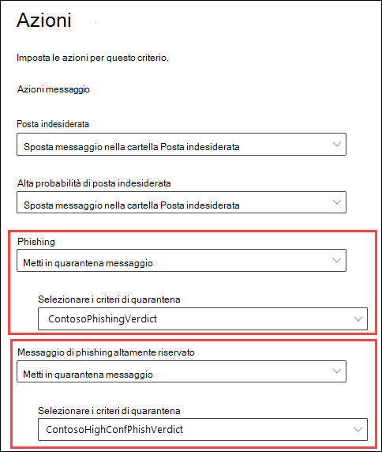
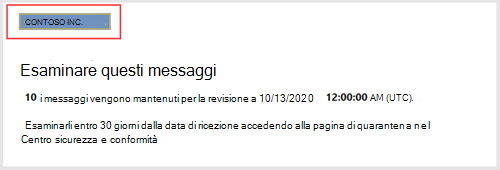
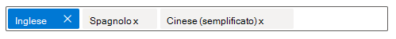
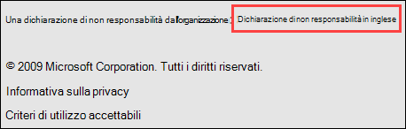
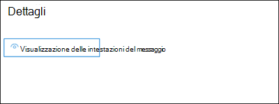
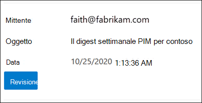
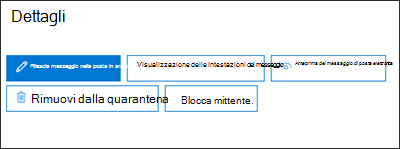
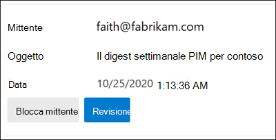
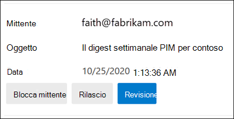

# <a name="quarantine-tags"></a>Tag per la quarantena

> [!NOTE]
> Le funzionalità descritte in questo articolo sono attualmente in anteprima, non sono disponibili per tutti e sono soggette a modifiche.

I tag di quarantena in Exchange Online Protection (EOP) consentono agli amministratori di controllare le attività che gli utenti sono in grado di eseguire sui messaggi in quarantena in base al modo in cui il messaggio è arrivato in quarantena.

EOP ha tradizionalmente consentito o impedito determinati livelli di interattività per i messaggi in [quarantena](find-and-release-quarantined-messages-as-a-user.md) e nelle notifiche di posta indesiderata [dell'utente finale.](use-spam-notifications-to-release-and-report-quarantined-messages.md) Ad esempio, gli utenti finali possono visualizzare e rilasciare i messaggi messi in quarantena dal filtro di protezione da posta indesiderata come posta indesiderata o in blocco, ma non possono visualizzare o rilasciare i messaggi messi in quarantena come phishing ad alta probabilità.

Per [le funzionalità](#step-2-assign-a-quarantine-tag-to-supported-features)di protezione supportate, i tag di quarantena specificano le attività consentite agli utenti nei messaggi di notifica di posta indesiderata dell'utente finale e nei messaggi in quarantena (messaggi in cui l'utente è un destinatario). I tag di quarantena predefiniti vengono assegnati automaticamente per applicare le funzionalità cronologiche per gli utenti finali ai messaggi in quarantena. In caso contrario, è possibile creare e assegnare tag di quarantena personalizzati per consentire o impedire agli utenti finali di eseguire azioni specifiche sui messaggi in quarantena.

Le singole autorizzazioni vengono combinate nei seguenti gruppi di autorizzazioni preimpostati:

- Nessun diritto di accesso
- Accesso limitato
- Accesso completo

Le singole autorizzazioni disponibili e ciò che è incluso o non incluso nei gruppi di autorizzazioni preimpostati sono descritti nella tabella seguente:

|Autorizzazione|Nessun diritto di accesso|Accesso limitato|Accesso completo|
|---|:---:|:---:|:---:|
|**Consenti mittente** (_PermissionToAllowSender_)||||
|**Blocca mittente** (_PermissionToBlockSender_)||||
|**Delete** (_PermissionToDelete_)||||
|**Anteprima** (_PermissionToPreview_)||||
|**Consentire ai destinatari di rilasciare un messaggio dalla quarantena** (_PermissionToRelease_)||||
|**Consentire ai destinatari di richiedere il rilascio di un messaggio dalla quarantena** (_PermissionToRequestRelease_)||||
|

Se non si desiderano le autorizzazioni predefinite nei gruppi di autorizzazioni preimpostati, è possibile utilizzare le autorizzazioni personalizzate quando si creano o si modificano tag di quarantena personalizzati. Per ulteriori informazioni sulle funzionalità di ogni autorizzazione, vedere la sezione Dettagli sulle autorizzazioni [dei tag](#quarantine-tag-permission-details) di quarantena più avanti in questo articolo.

I tag di quarantena vengono creati e assegnati nel Centro sicurezza & conformità o in PowerShell (PowerShell di Exchange Online per le organizzazioni di Microsoft 365 con cassette postali di Exchange Online; PowerShell EOP autonomo nelle organizzazioni EOP senza cassette postali di Exchange Online).

## <a name="what-do-you-need-to-know-before-you-begin"></a>Che cosa è necessario sapere prima di iniziare?

- Aprire il Centro sicurezza e conformità in <https://protection.office.com/>. Per passare direttamente alla pagina **Tag quarantena,** aprire <https://protection.office.com/quarantineTags> .

- Per informazioni su come connettersi a PowerShell per Exchange Online, vedere [Connettersi a PowerShell per Exchange Online](https://docs.microsoft.com/powershell/exchange/connect-to-exchange-online-powershell). Per connettersi a PowerShell di EOP autonomo, vedere [Connettersi a PowerShell per Exchange Online Protection](https://docs.microsoft.com/powershell/exchange/connect-to-exchange-online-protection-powershell).

- Per visualizzare, creare, modificare o rimuovere tag di quarantena,  è  necessario essere membri dei ruoli Gestione organizzazione o Amministratore sicurezza nel Centro [sicurezza & conformità.](permissions-in-the-security-and-compliance-center.md)

## <a name="step-1-create-quarantine-tags-in-the-security--compliance-center"></a>Passaggio 1: Creare tag di quarantena nel Centro sicurezza & conformità

1. Nel Centro sicurezza & conformità passare a Criteri di **gestione** delle \>  minacce e quindi selezionare **Tag quarantena.**

2. Nella pagina **Tag quarantena** selezionare Aggiungi **tag personalizzato.**

3. Verrà **visualizzata la procedura guidata Nuovo** tag. Nella pagina **Nome tag** immettere un nome breve ma univoco nel **campo Nome** tag. Dovrai identificare e selezionare il tag in base al nome nei passaggi successivi. Al termine dell'operazione, fare clic su **Avanti**.

4. Nella pagina **Accesso messaggio destinatario** selezionare uno dei seguenti valori:
   - **Nessun accesso**
   - **Accesso limitato**
   - **Accesso completo**

   Le singole autorizzazioni incluse in questi gruppi di autorizzazioni sono descritte in precedenza in questo articolo.

   Per specificare autorizzazioni personalizzate, selezionare **Imposta accesso specifico (Avanzate)** e configurare le impostazioni seguenti:

     - **Select release action preference**: Select one of the following values:
       - **Nessuna azione di rilascio:** questo è il valore predefinito.
       - **Consentire ai destinatari di rilasciare un messaggio dalla quarantena**
       - **Consentire ai destinatari di richiedere il rilascio di un messaggio dalla quarantena**

     - **Selezionare altre azioni che i destinatari possono eseguire sui** messaggi in quarantena: selezionare alcuni, tutti o nessuno dei seguenti valori:
       - **Elimina**
       - **Anteprima**
       - **Consenti mittente**
       - **Blocca mittente**

   Queste autorizzazioni e il loro effetto sui messaggi in quarantena e nelle notifiche di posta indesiderata dell'utente finale sono descritti nella sezione Dettagli autorizzazione [tag](#quarantine-tag-permission-details) quarantena più avanti in questo articolo.

   Al termine dell'operazione, fare clic su **Avanti**.

5. Nella pagina **Riepilogo** visualizzata esaminare le impostazioni. È possibile fare **clic su** Modifica per ogni impostazione per modificarla.

   Al termine, fare clic su **Invia.**

6. Fare **clic** su Fine nella pagina di conferma visualizzata.

Ora si è pronti per assegnare il tag di quarantena a una funzionalità di quarantena, come descritto nella [sezione Passaggio 2.](#step-2-assign-a-quarantine-tag-to-supported-features)

### <a name="create-quarantine-tags-in-powershell"></a>Creare tag di quarantena in PowerShell

Se si preferisce utilizzare PowerShell per creare tag di quarantena, connettersi a PowerShell di Exchange Online o PowerShell di Exchange Online Protection e utilizzare il cmdlet **New-QuarantineTag.** Sono disponibili due metodi diversi tra cui scegliere:

- Utilizzare il _parametro EndUserQuarantinePermissionsValue._
- Utilizzare il _parametro EndUserQuarantinePermissions._

Questi metodi sono descritti nelle sezioni seguenti.

#### <a name="use-the-enduserquarantinepermissionsvalue-parameter"></a>Utilizzare il parametro EndUserQuarantinePermissionsValue

Per creare un tag di quarantena utilizzando il _parametro EndUserQuarantinePermissionsValue,_ utilizzare la sintassi seguente:

```powershell
New-QuarantineTag -Name "<UniqueName>" -EndUserQuarantinePermissionsValue <0 to 236>
```

Il _parametro EndUserQuarantinePermissionsValue_ utilizza un valore decimale convertito da un valore binario. Il valore binario corrisponde alle autorizzazioni disponibili per la quarantena dell'utente finale in un ordine specifico. Per ogni autorizzazione, il valore 1 equivale a True e il valore 0 a False.

L'ordine e i valori necessari per ogni singola autorizzazione nei gruppi di autorizzazioni preimpostati sono descritti nella tabella seguente:

****

|Autorizzazione|Nessun diritto di accesso|Accesso limitato|Accesso completo|
|---|:---:|:---:|:---:|
|PermissionToAllowSender|0|0|1 |
|PermissionToBlockSender|0|1 |1 |
|PermissionToDelete|0|1 |1 |
|PermissionToDownload<sup>\*</sup>|0|0|0|
|PermissionToPreview|0|1 |1 |
|PermissionToRelease<sup>\*\*</sup>|0|0|1 |
|PermissionToRequestRelease<sup>\*\*</sup>|0|1 |0|
|PermissionToViewHeader<sup>\*</sup>|0|0|0|
|Valore binario|00000000|01101010|11101100|
|Valore decimale da utilizzare|0|106|236|

<sup>\*</sup> Attualmente, questo valore è sempre 0. Per PermissionToViewHeader, il valore 0  non nasconde il pulsante Visualizza intestazione messaggio nei dettagli del messaggio in quarantena (il pulsante è sempre disponibile).

<sup>\*\*</sup> Non impostare entrambi i valori su 1. Impostare uno su 1 e l'altro su 0 oppure impostare entrambi su 0.

In questo esempio viene creato un nuovo nome di tag di quarantena NoAccess che assegna le autorizzazioni di accesso No come descritto nella tabella precedente.

```powershell
New-QuarantineTag -Name NoAccess -EndUserQuarantinePermissionsValue 0
```

Per le autorizzazioni di accesso limitato, utilizzare il valore 106. Per le autorizzazioni di accesso completo, utilizzare il valore 236.

Per le autorizzazioni personalizzate, utilizzare la tabella precedente per ottenere il valore binario corrispondente alle autorizzazioni desiderate. Convertire il valore binario in un valore decimale e utilizzare il valore decimale per il _parametro EndUserQuarantinePermissionsValue._

Per informazioni dettagliate sulla sintassi e sui parametri, [vedere New-QuarantineTag.](https://docs.microsoft.com/powershell/module/exchange/new-quarantinetag)

#### <a name="use-the-enduserquarantinepermissions-parameter"></a>Utilizzare il parametro EndUserQuarantinePermissions

Per creare un tag di quarantena utilizzando il _parametro EndUserQuarantinePermissionsValue,_ eseguire la procedura seguente:

R. Archiviare un oggetto autorizzazioni per la quarantena in una variabile utilizzando il cmdlet **New-QuarantinePermissions.**

<p>

B. Utilizzare la variabile come _valore EndUserQuarantinePermissions_ nel **comando New-QuarantineTag.**

##### <a name="step-a-store-a-quarantine-permissions-object-in-a-variable"></a>Passaggio A: Archiviare un oggetto autorizzazioni per la quarantena in una variabile

Utilizzare la sintassi seguente:

```powershell
$<VariableName> = New-QuarantinePermissions [-PermissionToAllowSender <$true | $False>] [-PermissionToBlockSender <$true | $False>] [-PermissionToDelete <$true | $False>] [-PermissionToPreview <$true | $False>] [-PermissionToRelease <$true | $False>] [-PermissionToRequestRelease <$true | $False>]
```

Il valore predefinito per tutti i parametri inutilizzati è , pertanto è necessario utilizzare solo i parametri in cui `$false` si desidera impostare il valore su `$true` .

Negli esempi seguenti viene illustrato come creare oggetti autorizzazione corrispondenti ai gruppi di autorizzazioni preimpostati:

- **Nessun accesso:**

  ```powershell
  $NoAccess = New-QuarantinePermissions
  ```

- **Accesso limitato:**

  ```powershell
  $LimitedAccess = New-QuarantinePermissions -PermissionToBlockSender $true -PermissionToDelete $true -PermissionToPreview $true -PermissionToRequestRelease $true
  ```

- **Accesso completo:**

  ```powershell
  $FullAccess = New-QuarantinePermissions -PermissionToAllowSender $true -PermissionToBlockSender $true -PermissionToDelete $true -PermissionToPreview $true -PermissionToRelease $true
  ```

Per visualizzare i valori impostati, eseguire il nome della variabile come comando( ad esempio, eseguire il comando `$NoAccess` ).

Per le autorizzazioni personalizzate, non impostare entrambi i parametri _PermissionToRelease_ _e PermissionToRequestRelease_ su `$true` . Impostare uno su `$true` e lasciare l'altro come `$false` , oppure lasciare entrambi come `$false` .

È inoltre possibile modificare una variabile oggetto autorizzazioni esistente dopo la creazione, ma prima di utilizzarla utilizzando il cmdlet **Set-QuarantinePermissions.**

Per informazioni dettagliate sulla sintassi e sui parametri, vedere [New-QuarantinePermissions](https://docs.microsoft.com/powershell/module/exchange/new-quarantinepermissions) e [Set-QuarantinePermissions.](https://docs.microsoft.com/powershell/module/exchange/set-quarantinepermissions)

##### <a name="step-b-use-the-variable-in-the-new-quarantinetag-command"></a>Passaggio B: Utilizzare la variabile nel New-QuarantineTag comando

Dopo aver creato e archiviato l'oggetto autorizzazioni in una variabile, utilizzare la variabile per il valore del parametro _EndUserQuarantinePermission_ nel comando **New-QuarantineTag** seguente:

```powershell
New-QuarantineTag -Name "<UniqueName>" -EndUserQuarantinePermissions $<VariableName>
```

In questo esempio viene creato un nuovo tag di quarantena denominato LimitedAccess utilizzando l'oggetto autorizzazioni descritto `$LimitedAccess` e creato nel passaggio precedente.

```powershell
New-QuarantineTag -Name LimitedAccess -EndUserQuarantinePermissions $LimitedAccess
```

Per informazioni dettagliate sulla sintassi e sui parametri, [vedere New-QuarantineTag.](https://docs.microsoft.com/powershell/module/exchange/new-quarantinetag)

## <a name="step-2-assign-a-quarantine-tag-to-supported-features"></a>Passaggio 2: Assegnare un tag di quarantena alle funzionalità supportate

Nelle _funzionalità_ di protezione supportate che consentono di mettere in quarantena i messaggi o i file (automaticamente o come azione configurabile), è possibile assegnare un tag di quarantena alle azioni di quarantena disponibili. Le funzionalità che consentono di mettere in quarantena i messaggi e la disponibilità dei tag di quarantena sono descritte nella tabella seguente:

****

|Funzionalità|Tag di quarantena supportati?|Tag di quarantena predefiniti utilizzati|
|---|:---:|---|
|[Criteri di protezione da posta indesiderata:](configure-your-spam-filter-policies.md) <ul><li>**Posta** indesiderata (_SpamAction_)</li><li>**Alta probabilità di posta** indesiderata (_HighConfidenceSpamAction_)</li><li>**Posta elettronica di phishing** (_PhishSpamAction_)</li><li>**Posta elettronica di phishing** con alta probabilità (_HighConfidencePhishAction_)</li><li>**Posta elettronica in** blocco (_BulkSpamAction_)</li></ul>|Sì|<ul><li>DefaultSpamTag (accesso completo)</li><li>DefaultHighConfSpamTag (accesso completo)</li><li>DefaultPhishTag (accesso completo)</li><li>DefaultHighConfPhishTag (nessun accesso)</li><li>DefaultBulkTag (accesso completo)</li></ul>
|Criteri anti-phishing: <ul><li>[Protezione spoof intelligence](set-up-anti-phishing-policies.md#spoof-settings) (_AuthenticationFailAction_)</li><li>[Protezione della rappresentazione:](set-up-anti-phishing-policies.md#impersonation-settings-in-anti-phishing-policies-in-microsoft-defender-for-office-365)<sup>\*</sup> <ul><li>**Se la posta elettronica viene inviata da un utente rappresentato** (_TargetedUserProtectionAction_)</li><li>**Se la posta elettronica viene inviata da un dominio rappresentato** (_TargetedDomainProtectionAction_)</li><li>**Intelligence per le cassette postali** \> **Se la posta elettronica viene inviata da un utente rappresentato** (_MailboxIntelligenceProtectionAction_)</li></ul></li></ul></ul>|No|n/d|
|[Criteri antimalware:](configure-anti-malware-policies.md)tutti i messaggi rilevati vengono sempre messi in quarantena.|No|n/d|
|[Allegati sicuri per SharePoint, OneDrive e Microsoft Teams](atp-for-spo-odb-and-teams.md)|No|n/d|
|[Regole del flusso di](https://docs.microsoft.com/exchange/security-and-compliance/mail-flow-rules/mail-flow-rules) posta (note anche come regole di trasporto) con l'azione: **Recapitare** il messaggio alla quarantena ospitata (_Quarantena_).|No|n/d|
|

<sup>\*</sup> Le impostazioni di protezione della rappresentazione sono disponibili solo nei criteri anti-phishing in Microsoft Defender per Office 365.

Se si è soddisfatti delle autorizzazioni dell'utente finale fornite dai tag di quarantena predefiniti, non è necessario eseguire alcun'operazione. Se si desidera personalizzare le funzionalità dell'utente finale (pulsanti disponibili) nelle notifiche di posta indesiderata dell'utente finale o nei dettagli dei messaggi in quarantena, è possibile assegnare un tag di quarantena personalizzato.

### <a name="assign-quarantine-tags-in-anti-spam-policies-in-the-security--compliance-center"></a>Assegnare tag di quarantena nei criteri di protezione dalla posta indesiderata nel Centro sicurezza & conformità

Le istruzioni complete per la creazione e la modifica dei criteri di protezione dalla posta indesiderata sono descritte in [Configure anti-spam policies in EOP.](configure-your-spam-filter-policies.md)

1. Nel Centro sicurezza & conformità passare a Criteri di **gestione** delle \>  \> minacce e quindi selezionare **Protezione da posta indesiderata.** In caso contrario, aprire <https://protection.office.com/antispam> .

2. Trovare e selezionare un criterio di protezione da posta indesiderata esistente da modificare oppure creare un nuovo criterio di protezione da posta indesiderata.

3. Nel riquadro a comparsa dei dettagli del criterio espandere la sezione Azioni di posta **indesiderata e in blocco.**

4. Se è stato  selezionato Il messaggio in quarantena per l'azione di un verdetto di filtro della posta indesiderata disponibile, la casella Applica **tag** del criterio di quarantena è disponibile per selezionare il tag di quarantena per tale verdetto.

   **Nota:** quando si crea un nuovo criterio, viene utilizzato un valore di tag di quarantena vuoto per un verdetto di filtro della posta indesiderata che indica il tag di quarantena predefinito per tale verdetto. Quando successivamente si modifica il criterio, i valori vuoti vengono sostituiti dai nomi dei tag di quarantena predefiniti effettivi, come descritto nella tabella precedente.

   

5. Al termine, fare clic su **Salva**.

#### <a name="assign-quarantine-tags-in-anti-spam-policies-in-powershell"></a>Assegnare tag di quarantena nei criteri di protezione dalla posta indesiderata in PowerShell

Se si preferisce utilizzare PowerShell per assegnare tag di quarantena nei criteri di protezione dalla posta indesiderata, connettersi a PowerShell di Exchange Online o PowerShell di Exchange Online Protection e utilizzare la sintassi seguente:

```powershell
<New-HostedContentFilterPolicy -Name "<Unique name>" | Set-HostedContentFilterPolicy -Identity "<Policy name>">  [-SpamAction Quarantine] [-SpamQuarantineTag <QuarantineTagName>] [-HighConfidenceSpamAction Quarantine] [-HighConfidenceSpamQuarantineTag <QuarantineTagName>] [-PhishSpamAction Quarantine] [-PhishQuarantineTag <QuarantineTagName>] [-HighConfidencePhishQuarantineTag <QuarantineTagName>] [-BulkSpamAction Quarantine] [-BulkQuarantineTag <QuarantineTagName>] ...
```

**Note**:

- Il valore predefinito per il parametro _HighConfidencePhishAction_ è Quarantine, quindi non è necessario impostare l'azione di quarantena per i rilevamenti di phishing ad alta probabilità nei nuovi criteri di protezione dalla posta indesiderata. Per tutti gli altri verdetti del filtro posta indesiderata nei criteri di protezione da posta indesiderata nuovi o esistenti, il tag di quarantena è efficace solo se il valore dell'azione è Quarantena. Per visualizzare i valori delle azioni nei criteri di protezione da posta indesiderata esistenti, eseguire il comando seguente:

  ```powershell
  Get-HostedContentFilterPolicy | Format-Table Name,*SpamAction,HighConfidencePhishAction
  ```

  Per informazioni sui valori di azione predefiniti e sui valori di azione consigliati per Standard e Strict, vedere Impostazioni dei criteri di protezione da posta indesiderata [di EOP.](recommended-settings-for-eop-and-office365-atp.md#eop-anti-spam-policy-settings)

- Un verdetto di filtro della posta indesiderata senza un parametro del tag di quarantena corrispondente indica che viene utilizzato il tag di [quarantena](#step-2-assign-a-quarantine-tag-to-supported-features) predefinito per tale verdetto.

  È necessario sostituire un tag di quarantena predefinito con un tag di quarantena personalizzato solo se si desidera modificare le funzionalità predefinite dell'utente finale nei messaggi in quarantena.

- Un nuovo criterio di protezione dalla posta indesiderata in PowerShell richiede un criterio di filtro della posta indesiderata (impostazioni) utilizzando il cmdlet **New-HostedContentFilterPolicy** e una nuova regola di filtro della posta indesiderata (filtri destinatario) utilizzando il cmdlet **New-HostedContentFilterRule.** Per istruzioni, vedere [Utilizzare PowerShell per creare criteri di protezione da posta indesiderata.](configure-your-spam-filter-policies.md#use-powershell-to-create-anti-spam-policies)

In questo esempio viene creato un nuovo criterio di filtro della posta indesiderata denominato Research Department con le impostazioni seguenti:

- L'azione per tutti i verdetti del filtro posta indesiderata è impostata su Quarantena.
- Il tag di quarantena personalizzato denominato NoAccess che assegna autorizzazioni di accesso  **No** sostituisce tutti i tag di quarantena predefiniti che non assegnano già autorizzazioni di accesso no per impostazione predefinita.

```powershell
New-HostedContentFilterPolicy -Name Research Department -SpamAction Quarantine -SpamQuarantineTag NoAccess -HighConfidenceSpamAction Quarantine -HighConfidenceSpamQuarantineTag NoAction -PhishSpamAction Quarantine -PhishQuarantineTag NoAction -BulkSpamAction Quarantine -BulkQuarantineTag NoAccess
```

Per informazioni dettagliate su sintassi e parametri, vedere [New-HostedContentFilterPolicy](https://docs.microsoft.com/powershell/module/exchange/new-hostedcontentfilterpolicy).

In questo esempio viene modificato il criterio di filtro della posta indesiderata esistente denominato Human Resources. L'azione per il verdetto della quarantena della posta indesiderata è impostata su Quarantena e viene assegnato il tag di quarantena personalizzato denominato NoAccess.

```powershell
Set-HostedContentFilterPolicy -Identity "Human Resources" -SpamAction Quarantine -SpamQuarantineTag NoAccess
```

Per informazioni dettagliate su sintassi e parametri, vedere [Set-HostedContentFilterPolicy](https://docs.microsoft.com/powershell/module/exchange/set-hostedcontentfilterpolicy).

## <a name="configure-global-quarantine-notification-settings-in-the-security--compliance-center"></a>Configurare le impostazioni di notifica di quarantena globali nel Centro sicurezza & conformità

Le impostazioni globali per i tag di quarantena consentono di personalizzare le notifiche di posta indesiderata dell'utente finale inviate ai destinatari dei messaggi messi in quarantena. Per ulteriori informazioni su queste notifiche, vedere Notifiche di posta indesiderata [dell'utente finale.](use-spam-notifications-to-release-and-report-quarantined-messages.md)

1. Nel Centro sicurezza & conformità passare a Criteri di **gestione** delle \>  minacce e quindi selezionare **Tag quarantena.**

2. Nella pagina **Tag quarantena** selezionare **Impostazioni globali.**

3. Nel riquadro **a comparsa delle impostazioni di** notifica della quarantena che si apre, configurare alcune o tutte le impostazioni seguenti:

   - **Usa il logo aziendale:** selezionare questa opzione per sostituire il logo Microsoft predefinito utilizzato nella parte superiore delle notifiche di posta indesiderata dell'utente finale. Prima di eseguire questa operazione, è necessario seguire le istruzioni in Personalizzare il tema di [Microsoft 365](https://docs.microsoft.com/microsoft-365/admin/setup/customize-your-organization-theme) per l'organizzazione per caricare il logo personalizzato.

     Lo screenshot seguente mostra un logo personalizzato in una notifica di posta indesiderata dell'utente finale:

     

   - **Scegliere la lingua:** le notifiche di posta indesiderata dell'utente finale sono già localizzate in base alle impostazioni della lingua del destinatario. È possibile specificare testo personalizzato in lingue diverse per i **valori nome visualizzato** e dichiarazione di **non** responsabilità.

     Selezionare almeno una lingua dalla prima casella della lingua e quindi fare clic su **Aggiungi.** È possibile selezionare più lingue facendo clic **su Aggiungi** dopo ognuna di essi. Una casella della lingua di sezione mostra tutte le lingue selezionate:

     

   - **Nome visualizzato**: consente di personalizzare il nome visualizzato del mittente utilizzato nelle notifiche di posta indesiderata dell'utente finale.

     Per ogni lingua aggiunta, selezionare la lingua nella casella della seconda lingua (non fare clic sulla X) e immettere il valore di testo desiderato nella casella Nome **visualizzato.**

     Lo screenshot seguente mostra il nome visualizzato personalizzato in una notifica di posta indesiderata dell'utente finale:

     

   - **Dichiarazione di non responsabilità**: aggiungere una dichiarazione di non responsabilità personalizzata alla fine delle notifiche di posta indesiderata dell'utente finale. Il testo localizzato, **Una dichiarazione** di non responsabilità dell'organizzazione: viene sempre incluso per primo, seguito dal testo specificato.

     Per ogni lingua aggiunta, selezionare la lingua nella casella della seconda lingua (non fare clic sulla X) e immettere il valore di testo desiderato nella casella Dichiarazione di **non** responsabilità.

     Lo screenshot seguente mostra la dichiarazione di non responsabilità personalizzata in una notifica di posta indesiderata dell'utente finale:

     

## <a name="view-quarantine-tags-in-the-security--compliance-center"></a>Visualizzare i tag di quarantena nel Centro sicurezza & conformità

1. Nel Centro sicurezza & conformità passare a Criteri di **gestione** delle \>  minacce e quindi selezionare **Tag quarantena.**

- Per visualizzare le impostazioni dei tag di quarantena predefiniti o personalizzati, selezionare il tag di quarantena nell'elenco (non selezionare la casella di controllo).

- Per visualizzare le impostazioni globali, selezionare **Impostazioni globali**

### <a name="view-quarantine-tags-in-powershell"></a>Visualizzare i tag di quarantena in PowerShell

Se si preferisce usare PowerShell per visualizzare i tag di quarantena, eseguire una delle operazioni seguenti:

- Per visualizzare un elenco riepilogativo di tutti i tag predefiniti o personalizzati, eseguire il comando seguente:

  ```powershell
  Get-QuarantineTag | Format-Table Name
  ```

- Per visualizzare le impostazioni dei tag di quarantena predefiniti o personalizzati, sostituire con il nome del tag di quarantena \<TagName\> ed eseguire il comando seguente:

  ```powershell
  Get-QuarantineTag -Identity "<TagName>"
  ```

- Per visualizzare le impostazioni globali, eseguire il comando seguente:

  ```powershell
  Get-QuarantineTag -QuarantineTagType GlobalQuarantineTag
  ```

Per informazioni dettagliate su sintassi e parametri, vedere [Get-HostedContentFilterPolicy](https://docs.microsoft.com/powershell/module/exchange/get-hostedcontentfilterpolicy).

## <a name="remove-quarantine-tags-in-the-security--compliance-center"></a>Rimuovere i tag di quarantena nel Centro sicurezza & conformità

**Note**:

- Non è possibile rimuovere i tag di quarantena predefiniti.

- Prima di rimuovere un tag di quarantena personalizzato, verificare che non sia in uso. Ad esempio, eseguire il comando seguente in PowerShell:

  ```powershell
  Get-HostedContentFilterPolicy | Format-List Name,*QuarantineTag
  ```

  Se viene utilizzato il tag di quarantena, [sostituire il tag di quarantena assegnato](#step-2-assign-a-quarantine-tag-to-supported-features) prima di rimuoverlo.

1. Nel Centro sicurezza & conformità passare a Criteri di **gestione** delle \>  minacce e quindi selezionare **Tag quarantena.**

2. Nella pagina **Tag quarantena** selezionare il tag di quarantena personalizzato che si desidera rimuovere e fare clic su **Elimina tag.**

3. Fare **clic su Rimuovi tag** nella finestra di dialogo di conferma visualizzata.

### <a name="remove-quarantine-tags-in-powershell"></a>Rimuovere i tag di quarantena in PowerShell

Se si preferisce utilizzare PowerShell per rimuovere un tag di quarantena personalizzato, sostituire con il nome del \<TagName\> tag di quarantena ed eseguire il comando seguente:

```powershell
Remove-QuarantineTag -Identity "<TagName>"
```

Per informazioni dettagliate sulla sintassi e sui parametri, [vedere Remove-QuarantineTag.](https://docs.microsoft.com/powershell/module/exchange/remove-quarantinetag)

## <a name="quarantine-tag-permission-details"></a>Dettagli autorizzazione tag quarantena

Nelle sezioni seguenti vengono descritti gli effetti dei gruppi di autorizzazioni preimpostati e delle singole autorizzazioni nei dettagli dei messaggi in quarantena e nelle notifiche di posta indesiderata dell'utente finale.

### <a name="preset-permissions-groups"></a>Gruppi di autorizzazioni preimpostati

Le singole autorizzazioni incluse nei gruppi di autorizzazioni preimpostati sono elencate nella tabella all'inizio di questo articolo.

#### <a name="no-access"></a>Nessun diritto di accesso

Se il tag di quarantena assegna le autorizzazioni **Nessun accesso** (nessuna autorizzazione), gli utenti ottengono comunque alcune funzionalità di base:

- **Dettagli messaggio in quarantena:** il **pulsante Visualizza intestazione messaggio** è sempre disponibile.

  

- **Notifiche di posta indesiderata dell'utente finale:** **il** pulsante Revisione che porta l'utente al messaggio in quarantena è sempre disponibile.

  

#### <a name="limited-access"></a>Accesso limitato

Se il tag di quarantena assegna le **autorizzazioni accesso** limitato, gli utenti ottengono le funzionalità seguenti:

- **Dettagli messaggio in quarantena**: Sono disponibili i pulsanti seguenti:
  - **Richiesta di rilascio**
  - **Visualizzazione delle intestazioni del messaggio**
  - **Messaggio di anteprima**
  - **Blocca mittente**
  - **Rimuovi dalla quarantena**

  

- **Notifiche di posta indesiderata dell'utente finale:** sono disponibili i pulsanti seguenti:
  - **Blocca mittente**
  - **Verifica**

  

#### <a name="full-access"></a>Accesso completo

Se il tag di quarantena assegna le **autorizzazioni accesso** completo (tutte le autorizzazioni disponibili), gli utenti ottengono le funzionalità seguenti:

- **Dettagli messaggio in quarantena**: Sono disponibili i pulsanti seguenti:
  - **Messaggio di rilascio**
  - **Visualizzazione delle intestazioni del messaggio**
  - **Messaggio di anteprima**
  - **Blocca mittente**
  - **Consenti mittente**
  - **Rimuovi dalla quarantena**

  

- **Notifiche di posta indesiderata dell'utente finale:** sono disponibili i pulsanti seguenti:
  - **Blocca mittente**
  - **Rilascio**
  - **Verifica**

  

### <a name="individual-permissions"></a>Autorizzazioni individuali

> [!NOTE]
> Ricorda che gli utenti ottengono sempre i pulsanti descritti nella [sezione Nessun](#no-access) accesso. Questi pulsanti non sono inclusi nelle descrizioni delle singole autorizzazioni.

#### <a name="allow-sender-permission"></a>Autorizzazione Consenti mittente

**L'autorizzazione Consenti** mittente (_PermissionToAllowSender_) controlla l'accesso al pulsante che consente agli utenti di aggiungere comodamente il mittente del messaggio in quarantena all'elenco Mittenti attendibili.

- **Dettagli messaggio in quarantena:**
  - **Autorizzazione Consenti mittente** abilitata: il **pulsante Consenti mittente** è disponibile.
  - **Autorizzazione Consenti mittente** disabilitata: **il pulsante** Consenti mittente non è disponibile.

- **Notifiche di posta indesiderata dell'utente finale**: Nessun effetto.

Per ulteriori informazioni sull'elenco Mittenti attendibili, vedere [Impedire](https://support.microsoft.com/office/274ae301-5db2-4aad-be21-25413cede077#__toc304379666) il blocco dei mittenti attendibili e Utilizzare PowerShell di Exchange Online per configurare la raccolta dell'elenco indirizzi attendibili [in una cassetta postale.](configure-junk-email-settings-on-exo-mailboxes.md#use-exchange-online-powershell-to-configure-the-safelist-collection-on-a-mailbox)

#### <a name="block-sender-permission"></a>Autorizzazione Blocca mittente

**L'autorizzazione** Blocca mittente (_PermissionToBlockSender_) controlla l'accesso al pulsante che consente agli utenti di aggiungere comodamente il mittente del messaggio in quarantena all'elenco Mittenti bloccati.

- **Dettagli messaggio in quarantena:**
  - **Autorizzazione Blocca mittente** abilitata: il pulsante Blocca **mittente** è disponibile.
  - **Autorizzazione Blocca mittente** disabilitata: il **pulsante** Blocca mittente non è disponibile.

- **Notifiche di posta indesiderata dell'utente finale:**
  - **Autorizzazione Blocca mittente** disabilitata: il **pulsante** Blocca mittente non è disponibile.
  - **Autorizzazione Blocca mittente** abilitata: il pulsante Blocca **mittente** è disponibile.

Per ulteriori informazioni sull'elenco Mittenti bloccati, vedere [Block messages from someone](https://support.microsoft.com/office/274ae301-5db2-4aad-be21-25413cede077#__toc304379667) e Use Exchange Online [PowerShell to configure the safelist collection on a mailbox.](configure-junk-email-settings-on-exo-mailboxes.md#use-exchange-online-powershell-to-configure-the-safelist-collection-on-a-mailbox)

#### <a name="delete-permission"></a>Autorizzazione di eliminazione

**L'autorizzazione** Di eliminazione (_PermissionToDelete_) controlla la possibilità per gli utenti di eliminare dalla quarantena i propri messaggi (messaggi in cui l'utente è un destinatario).

- **Dettagli messaggio in quarantena:**
  - **Autorizzazione** di eliminazione abilitata: **il pulsante Rimuovi dalla** quarantena è disponibile.
  - **Autorizzazione** di eliminazione disabilitata: **il pulsante** Rimuovi dalla quarantena non è disponibile.

- **Notifiche di posta indesiderata dell'utente finale**: Nessun effetto.

#### <a name="preview-permission"></a>Autorizzazione anteprima

**L'autorizzazione** Anteprima (_PermissionToPreview_) controlla la possibilità per gli utenti di visualizzare in anteprima i messaggi in quarantena.

- **Dettagli messaggio in quarantena:**
  - **Autorizzazione anteprima** abilitata: **il pulsante Anteprima** messaggio è disponibile.
  - **Autorizzazione** anteprima disabilitata: **il pulsante Anteprima** messaggio non è disponibile.

- **Notifiche di posta indesiderata dell'utente finale**: Nessun effetto.

#### <a name="allow-recipients-to-release-a-message-from-quarantine-permission"></a>Consentire ai destinatari di rilasciare un messaggio dall'autorizzazione per la quarantena

**L'autorizzazione** Consenti ai destinatari di rilasciare un messaggio dalla quarantena (_PermissionToRelease_) controlla la capacità degli utenti di rilasciare i messaggi in quarantena direttamente e senza l'approvazione di un amministratore.

- **Dettagli messaggio in quarantena:**
  - Autorizzazione abilitata: il **pulsante Rilascia** messaggio è disponibile.
  - Autorizzazione disabilitata: il **pulsante Rilascia** messaggio non è disponibile.

- **Notifiche di posta indesiderata dell'utente finale:**
  - Autorizzazione abilitata: il **pulsante** Rilascia è disponibile.
  - Autorizzazione disabilitata: il **pulsante** Rilascia non è disponibile.

#### <a name="allow-recipients-to-request-a-message-to-be-released-from-quarantine-permission"></a>Consentire ai destinatari di richiedere il rilascio di un messaggio dall'autorizzazione per la quarantena

**L'autorizzazione** Consenti ai destinatari di richiedere il rilascio di un messaggio dalla quarantena  (_PermissionToRequestRelease_) controlla la capacità degli utenti di richiedere il rilascio dei messaggi in quarantena. Il messaggio viene rilasciato solo dopo che un amministratore ha approvato la richiesta.

- **Dettagli messaggio in quarantena:**
  - Autorizzazione abilitata: il **pulsante Richiedi** rilascio è disponibile.
  - Autorizzazione disabilitata: **il pulsante Richiedi** rilascio non è disponibile.

- **Notifiche di posta indesiderata dell'utente** finale: **il pulsante** Rilascia non è disponibile.
