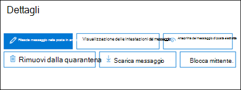

# <a name="quarantine-tags"></a><span data-ttu-id="83296-103">Tag di quarantena</span><span class="sxs-lookup"><span data-stu-id="83296-103">Quarantine tags</span></span>

> [!NOTE]
> <span data-ttu-id="83296-104">Le funzionalità descritte in questo articolo sono attualmente in anteprima, non sono disponibili per tutti gli utenti e sono soggette a modifiche.</span><span class="sxs-lookup"><span data-stu-id="83296-104">The features that are described in this article are currently in Preview, aren't available to everyone, and are subject to change.</span></span>

<span data-ttu-id="83296-105">I tag di quarantena in Exchange Online Protection (EOP) consentono agli amministratori di controllare quali utenti sono in grado di eseguire nei messaggi in quarantena in base al modo in cui il messaggio è arrivato in quarantena.</span><span class="sxs-lookup"><span data-stu-id="83296-105">Quarantine tags in Exchange Online Protection (EOP) allow admins to control what users are able to do to their quarantined messages based on how the message arrived in quarantine.</span></span>

<span data-ttu-id="83296-106">EOP ha tradizionalmente consentito o impedito alcuni livelli di interattività per i messaggi in [quarantena](find-and-release-quarantined-messages-as-a-user.md) e nelle [notifiche di posta indesiderata dell'utente finale](use-spam-notifications-to-release-and-report-quarantined-messages.md).</span><span class="sxs-lookup"><span data-stu-id="83296-106">EOP has traditionally allowed or prevented certain levels of interactivity for messages in [quarantine](find-and-release-quarantined-messages-as-a-user.md) and in [end-user spam notifications](use-spam-notifications-to-release-and-report-quarantined-messages.md).</span></span> <span data-ttu-id="83296-107">Ad esempio, gli utenti finali possono visualizzare e rilasciare i messaggi che sono stati messi in quarantena dal filtro antispam come posta indesiderata o in blocco, ma non possono visualizzare o rilasciare messaggi che sono stati messi in quarantena come phishing ad alta sicurezza.</span><span class="sxs-lookup"><span data-stu-id="83296-107">For example, end-users can view and release messages that were quarantined by anti-spam filtering as spam or bulk, but they can't view or release messages that were quarantined as high confidence phishing.</span></span>

<span data-ttu-id="83296-108">Per le [funzionalità di protezione supportate](#step-2-assign-a-quarantine-tag-to-supported-features), i tag Quarantine specificano quali utenti sono autorizzati a eseguire nei messaggi di notifica di posta indesiderata dell'utente finale e nei messaggi in quarantena (messaggi in cui l'utente è destinatario).</span><span class="sxs-lookup"><span data-stu-id="83296-108">For [supported protection features](#step-2-assign-a-quarantine-tag-to-supported-features), quarantine tags specify what users are allowed to do in end-user spam notification messages and in their quarantined messages in quarantine (messages where the user is a recipient).</span></span> <span data-ttu-id="83296-109">I tag di quarantena predefiniti vengono assegnati automaticamente per applicare le funzionalità storiche per gli utenti finali nei messaggi in quarantena.</span><span class="sxs-lookup"><span data-stu-id="83296-109">Default quarantine tags are automatically assigned to enforce the historical capabilities for end-users on quarantined messages.</span></span> <span data-ttu-id="83296-110">In alternativa, è possibile creare e assegnare tag di quarantena personalizzati per consentire o impedire agli utenti finali di eseguire azioni specifiche sui messaggi in quarantena.</span><span class="sxs-lookup"><span data-stu-id="83296-110">Or, you can create and assign custom quarantine tags to allow or prevent end-users from performing specific actions on quarantined messages.</span></span>

<span data-ttu-id="83296-111">Le singole autorizzazioni vengono combinate nei seguenti gruppi di autorizzazioni preimpostati:</span><span class="sxs-lookup"><span data-stu-id="83296-111">The individual permissions are combined into the following preset permission groups:</span></span>

- <span data-ttu-id="83296-112">Nessun diritto di accesso</span><span class="sxs-lookup"><span data-stu-id="83296-112">No access</span></span>
- <span data-ttu-id="83296-113">Accesso limitato</span><span class="sxs-lookup"><span data-stu-id="83296-113">Limited access</span></span>
- <span data-ttu-id="83296-114">Accesso completo</span><span class="sxs-lookup"><span data-stu-id="83296-114">Full access</span></span>

<span data-ttu-id="83296-115">Nella tabella seguente sono descritte le autorizzazioni individuali disponibili e quelle incluse o non incluse nei gruppi di autorizzazioni preimpostati:</span><span class="sxs-lookup"><span data-stu-id="83296-115">The available individual permissions and what's included or not included in the preset permission groups are described in the following table:</span></span>

|<span data-ttu-id="83296-116">Autorizzazione</span><span class="sxs-lookup"><span data-stu-id="83296-116">Permission</span></span>|<span data-ttu-id="83296-117">Nessun diritto di accesso</span><span class="sxs-lookup"><span data-stu-id="83296-117">No access</span></span>|<span data-ttu-id="83296-118">Accesso limitato</span><span class="sxs-lookup"><span data-stu-id="83296-118">Limited access</span></span>|<span data-ttu-id="83296-119">Accesso completo</span><span class="sxs-lookup"><span data-stu-id="83296-119">Full access</span></span>|
|---|:---:|:---:|:---:|
|<span data-ttu-id="83296-120">**Consenti mittente** ( _PermissionToAllowSender_ )</span><span class="sxs-lookup"><span data-stu-id="83296-120">**Allow sender** ( _PermissionToAllowSender_ )</span></span>||||
|<span data-ttu-id="83296-122">**Blocca mittente** ( _PermissionToBlockSender_ )</span><span class="sxs-lookup"><span data-stu-id="83296-122">**Block sender** ( _PermissionToBlockSender_ )</span></span>||||
|<span data-ttu-id="83296-125">**Delete** ( _PermissionToDelete_ )</span><span class="sxs-lookup"><span data-stu-id="83296-125">**Delete** ( _PermissionToDelete_ )</span></span>||||
|<span data-ttu-id="83296-128">**Anteprima** ( _PermissionToPreview_ )</span><span class="sxs-lookup"><span data-stu-id="83296-128">**Preview** ( _PermissionToPreview_ )</span></span>||||
|<span data-ttu-id="83296-131">**Consenti ai destinatari di rilasciare un messaggio dalla quarantena** ( _PermissionToRelease_ )</span><span class="sxs-lookup"><span data-stu-id="83296-131">**Allow recipients to release a message from quarantine** ( _PermissionToRelease_ )</span></span>||||
|<span data-ttu-id="83296-133">**Consenti ai destinatari di richiedere il rilascio di un messaggio dalla quarantena** ( _PermissionToRequestRelease_ )</span><span class="sxs-lookup"><span data-stu-id="83296-133">**Allow recipients to request a message to be released from quarantine** ( _PermissionToRequestRelease_ )</span></span>||||
|

<span data-ttu-id="83296-135">Se non si desiderano le autorizzazioni predefinite nei gruppi di autorizzazioni preimpostati, è possibile utilizzare le autorizzazioni personalizzate quando si creano o si modificano i tag di quarantena personalizzati.</span><span class="sxs-lookup"><span data-stu-id="83296-135">If you don't like the default permissions in the preset permission groups, you can use custom permissions when you create or modify custom quarantine tags.</span></span> <span data-ttu-id="83296-136">Per ulteriori informazioni sulle operazioni eseguite da ogni autorizzazione, vedere la sezione relativa alle autorizzazioni per i [tag di quarantena](#quarantine-tag-permission-details) più avanti in questo articolo.</span><span class="sxs-lookup"><span data-stu-id="83296-136">For more information about what each permission does, see the [Quarantine tag permission details](#quarantine-tag-permission-details) section later in this article.</span></span>

<span data-ttu-id="83296-137">È possibile creare e assegnare tag di quarantena nel centro sicurezza & Compliance o in PowerShell (Exchange Online PowerShell per Microsoft 365 organizzazioni con cassette postali di Exchange Online; standalone EOP PowerShell nelle organizzazioni di EOP senza cassette postali di Exchange Online).</span><span class="sxs-lookup"><span data-stu-id="83296-137">You create and assign quarantine tags in the Security & Compliance Center or in PowerShell (Exchange Online PowerShell for Microsoft 365 organizations with Exchange Online Mailboxes; standalone EOP PowerShell in EOP organizations without Exchange Online mailboxes).</span></span>

## <a name="what-do-you-need-to-know-before-you-begin"></a><span data-ttu-id="83296-138">Che cosa è necessario sapere prima di iniziare?</span><span class="sxs-lookup"><span data-stu-id="83296-138">What do you need to know before you begin?</span></span>

- <span data-ttu-id="83296-139">Aprire il Centro sicurezza e conformità in <https://protection.office.com/>.</span><span class="sxs-lookup"><span data-stu-id="83296-139">You open the Security & Compliance Center at <https://protection.office.com/>.</span></span> <span data-ttu-id="83296-140">Per passare direttamente alla pagina dei **tag di quarantena** , Apri <https://protection.office.com/quarantineTags> .</span><span class="sxs-lookup"><span data-stu-id="83296-140">To go directly to the **Quarantine tags** page, open <https://protection.office.com/quarantineTags>.</span></span>

- <span data-ttu-id="83296-141">Per informazioni su come connettersi a PowerShell per Exchange Online, vedere [Connettersi a PowerShell per Exchange Online](https://docs.microsoft.com/powershell/exchange/connect-to-exchange-online-powershell).</span><span class="sxs-lookup"><span data-stu-id="83296-141">To connect to Exchange Online PowerShell, see [Connect to Exchange Online PowerShell](https://docs.microsoft.com/powershell/exchange/connect-to-exchange-online-powershell).</span></span> <span data-ttu-id="83296-142">Per connettersi a PowerShell di EOP autonomo, vedere [Connettersi a PowerShell per Exchange Online Protection](https://docs.microsoft.com/powershell/exchange/connect-to-exchange-online-protection-powershell).</span><span class="sxs-lookup"><span data-stu-id="83296-142">To connect to standalone EOP PowerShell, see [Connect to Exchange Online Protection PowerShell](https://docs.microsoft.com/powershell/exchange/connect-to-exchange-online-protection-powershell).</span></span>

- <span data-ttu-id="83296-143">Per visualizzare, creare, modificare o rimuovere i tag di quarantena, è necessario essere membri di uno dei gruppi di ruoli seguenti:</span><span class="sxs-lookup"><span data-stu-id="83296-143">To view, create, modify, or remove quarantine tags, you need to be a member of one of the following role groups:</span></span>
  - <span data-ttu-id="83296-144">**Gestione organizzazione** o **Amministratore sicurezza** nel [Centro sicurezza e conformità](permissions-in-the-security-and-compliance-center.md).</span><span class="sxs-lookup"><span data-stu-id="83296-144">**Organization Management** or **Security Administrator** in the [Security & Compliance Center](permissions-in-the-security-and-compliance-center.md).</span></span>
  - <span data-ttu-id="83296-145">**Gestione organizzazione** o **Gestione igiene** in [Exchange Online](https://docs.microsoft.com/Exchange/permissions-exo/permissions-exo#role-groups).</span><span class="sxs-lookup"><span data-stu-id="83296-145">**Organization Management** or **Hygiene Management** in [Exchange Online](https://docs.microsoft.com/Exchange/permissions-exo/permissions-exo#role-groups).</span></span>

## <a name="step-1-create-quarantine-tags-in-the-security--compliance-center"></a><span data-ttu-id="83296-146">Passaggio 1: creare tag di quarantena nel centro sicurezza & Compliance</span><span class="sxs-lookup"><span data-stu-id="83296-146">Step 1: Create quarantine tags in the Security & Compliance Center</span></span>

1. <span data-ttu-id="83296-147">Nel centro sicurezza & conformità, accedere a criteri di **gestione delle minacce** \> **Policy** e quindi selezionare i **tag di quarantena** .</span><span class="sxs-lookup"><span data-stu-id="83296-147">In the Security & Compliance Center, go to **Threat management** \> **Policy** and then select **Quarantine tags** .</span></span>

2. <span data-ttu-id="83296-148">Nella pagina dei **tag di quarantena** , selezionare **Aggiungi tag personalizzato** .</span><span class="sxs-lookup"><span data-stu-id="83296-148">On the **Quarantine tags** page, select **Add custom tag** .</span></span>

3. <span data-ttu-id="83296-149">Verrà visualizzata la procedura guidata **nuovo tag** .</span><span class="sxs-lookup"><span data-stu-id="83296-149">The **New tag** wizard opens.</span></span> <span data-ttu-id="83296-150">Nella pagina **nome tag** immettere un nome breve ma univoco nel campo **nome tag** .</span><span class="sxs-lookup"><span data-stu-id="83296-150">On the **Tag name** page, enter a brief but unique name in the **Tag name** field.</span></span> <span data-ttu-id="83296-151">È necessario identificare e selezionare il tag per nome nei passaggi imminenti.</span><span class="sxs-lookup"><span data-stu-id="83296-151">You'll need to identify and select the tag by name in upcoming steps.</span></span> <span data-ttu-id="83296-152">Al termine dell'operazione, fare clic su **Avanti** .</span><span class="sxs-lookup"><span data-stu-id="83296-152">When you're finished, click **Next** .</span></span>

4. <span data-ttu-id="83296-153">Nella pagina **accesso ai messaggi destinatario** selezionare uno dei valori seguenti:</span><span class="sxs-lookup"><span data-stu-id="83296-153">On the **Recipient message access** page, select one of the following values:</span></span>
   - <span data-ttu-id="83296-154">**Nessun accesso**</span><span class="sxs-lookup"><span data-stu-id="83296-154">**No access**</span></span>
   - <span data-ttu-id="83296-155">**Accesso limitato**</span><span class="sxs-lookup"><span data-stu-id="83296-155">**Limited access**</span></span>
   - <span data-ttu-id="83296-156">**Accesso completo**</span><span class="sxs-lookup"><span data-stu-id="83296-156">**Full access**</span></span>

   <span data-ttu-id="83296-157">Le singole autorizzazioni incluse in questi gruppi di autorizzazioni sono descritte in precedenza in questo articolo.</span><span class="sxs-lookup"><span data-stu-id="83296-157">The individual permissions that are included in these permission groups are described earlier in this article.</span></span>

   <span data-ttu-id="83296-158">Per specificare le autorizzazioni personalizzate, selezionare **Imposta accesso specifico (avanzato)** e configurare le impostazioni seguenti:</span><span class="sxs-lookup"><span data-stu-id="83296-158">To specify custom permissions, select **Set specific access (Advanced)** and configure the following settings:</span></span>

     - <span data-ttu-id="83296-159">**Selezionare la preferenza azione di rilascio** : selezionare uno dei valori seguenti:</span><span class="sxs-lookup"><span data-stu-id="83296-159">**Select release action preference** : Select one of the following values:</span></span>
       - <span data-ttu-id="83296-160">**Nessuna azione di rilascio** : questo è il valore predefinito.</span><span class="sxs-lookup"><span data-stu-id="83296-160">**No release action** : This is the default value.</span></span>
       - <span data-ttu-id="83296-161">**Consenti ai destinatari di rilasciare un messaggio dalla quarantena**</span><span class="sxs-lookup"><span data-stu-id="83296-161">**Allow recipients to release a message from quarantine**</span></span>
       - <span data-ttu-id="83296-162">**Consenti ai destinatari di richiedere il rilascio di un messaggio dalla quarantena**</span><span class="sxs-lookup"><span data-stu-id="83296-162">**Allow recipients to request a message to be released from quarantine**</span></span>

     - <span data-ttu-id="83296-163">**Selezionare ulteriori azioni che i destinatari possono intraprendere nei messaggi in quarantena** : selezionare alcuni, tutti o nessuno dei valori seguenti:</span><span class="sxs-lookup"><span data-stu-id="83296-163">**Select additional actions recipients can take on quarantined messages** : Select some, all, or none of the following values:</span></span>
       - <span data-ttu-id="83296-164">**Elimina**</span><span class="sxs-lookup"><span data-stu-id="83296-164">**Delete**</span></span>
       - <span data-ttu-id="83296-165">**Anteprima**</span><span class="sxs-lookup"><span data-stu-id="83296-165">**Preview**</span></span>
       - <span data-ttu-id="83296-166">**Consenti mittente**</span><span class="sxs-lookup"><span data-stu-id="83296-166">**Allow sender**</span></span>
       - <span data-ttu-id="83296-167">**Blocca mittente**</span><span class="sxs-lookup"><span data-stu-id="83296-167">**Block sender**</span></span>

   <span data-ttu-id="83296-168">Queste autorizzazioni e il loro effetto sui messaggi in quarantena e nelle notifiche di posta indesiderata dell'utente finale sono descritte nella sezione [informazioni sulle autorizzazioni dei tag di quarantena](#quarantine-tag-permission-details) più avanti in questo articolo.</span><span class="sxs-lookup"><span data-stu-id="83296-168">These permissions and their effect on quarantined messages and in end-user spam notifications are described in the [Quarantine tag permission details](#quarantine-tag-permission-details) section later in this article.</span></span>

   <span data-ttu-id="83296-169">Al termine dell'operazione, fare clic su **Avanti** .</span><span class="sxs-lookup"><span data-stu-id="83296-169">When you're finished, click **Next** .</span></span>

5. <span data-ttu-id="83296-170">Nella pagina **Riepilogo** visualizzata, esaminare le impostazioni.</span><span class="sxs-lookup"><span data-stu-id="83296-170">On the **Summary** page that appears, review your settings.</span></span> <span data-ttu-id="83296-171">È possibile fare clic su **modifica** su ogni impostazione per modificarla.</span><span class="sxs-lookup"><span data-stu-id="83296-171">You can click **Edit** on each setting to modify it.</span></span>

   <span data-ttu-id="83296-172">Al termine, fare clic su **Invia** .</span><span class="sxs-lookup"><span data-stu-id="83296-172">When you're finished, click **Submit** .</span></span>

6. <span data-ttu-id="83296-173">Fare clic su **fine** nella pagina di conferma che viene visualizzata.</span><span class="sxs-lookup"><span data-stu-id="83296-173">Click **Done** on the confirmation page that appears.</span></span>

<span data-ttu-id="83296-174">A questo punto si è pronti per assegnare il tag Quarantine a una funzionalità di quarantena, come descritto nella sezione [passaggio 2](#step-2-assign-a-quarantine-tag-to-supported-features) .</span><span class="sxs-lookup"><span data-stu-id="83296-174">Now you are ready to assign the quarantine tag to a quarantine feature as described in the [Step 2](#step-2-assign-a-quarantine-tag-to-supported-features) section.</span></span>

### <a name="create-quarantine-tags-in-powershell"></a><span data-ttu-id="83296-175">Creare tag di quarantena in PowerShell</span><span class="sxs-lookup"><span data-stu-id="83296-175">Create quarantine tags in PowerShell</span></span>

<span data-ttu-id="83296-176">Se si preferisce utilizzare PowerShell per creare tag di quarantena, connettersi a PowerShell di Exchange Online o Exchange Online Protection PowerShell e utilizzare il cmdlet **New-QuarantineTag** .</span><span class="sxs-lookup"><span data-stu-id="83296-176">If you'd rather use PowerShell to create quarantine tags, connect to Exchange Online PowerShell or Exchange Online Protection PowerShell and use the **New-QuarantineTag** cmdlet.</span></span> <span data-ttu-id="83296-177">Sono disponibili due metodi diversi tra cui scegliere:</span><span class="sxs-lookup"><span data-stu-id="83296-177">You have two different methods to choose from:</span></span>

- <span data-ttu-id="83296-178">Utilizzare il parametro _EndUserQuarantinePermissionsValue_ .</span><span class="sxs-lookup"><span data-stu-id="83296-178">Use the _EndUserQuarantinePermissionsValue_ parameter.</span></span>
- <span data-ttu-id="83296-179">Utilizzare il parametro _EndUserQuarantinePermissions_ .</span><span class="sxs-lookup"><span data-stu-id="83296-179">Use the _EndUserQuarantinePermissions_ parameter.</span></span>

<span data-ttu-id="83296-180">Questi metodi sono descritti nelle sezioni seguenti.</span><span class="sxs-lookup"><span data-stu-id="83296-180">These methods are described in the following sections.</span></span>

#### <a name="use-the-enduserquarantinepermissionsvalue-parameter"></a><span data-ttu-id="83296-181">Utilizzare il parametro EndUserQuarantinePermissionsValue</span><span class="sxs-lookup"><span data-stu-id="83296-181">Use the EndUserQuarantinePermissionsValue parameter</span></span>

<span data-ttu-id="83296-182">Per creare un tag di quarantena utilizzando il parametro _EndUserQuarantinePermissionsValue_ , utilizzare la sintassi seguente:</span><span class="sxs-lookup"><span data-stu-id="83296-182">To create a quarantine tag using the _EndUserQuarantinePermissionsValue_ parameter, use the following syntax:</span></span>

```powershell
New-QuarantineTag -Name "<UniqueName>" -EndUserQuarantinePermissionsValue <0 to 236>
```

<span data-ttu-id="83296-183">Il parametro _EndUserQuarantinePermissionsValue_ utilizza un valore decimale convertito da un valore binario.</span><span class="sxs-lookup"><span data-stu-id="83296-183">The _EndUserQuarantinePermissionsValue_ parameter uses a decimal value that's converted from a binary value.</span></span> <span data-ttu-id="83296-184">Il valore binario corrisponde alle autorizzazioni di quarantena dell'utente finale disponibili in un ordine specifico.</span><span class="sxs-lookup"><span data-stu-id="83296-184">The binary value corresponds to the available end-user quarantine permissions in a specific order.</span></span> <span data-ttu-id="83296-185">Per ogni autorizzazione, il valore 1 è uguale a true e il valore 0 è uguale a false.</span><span class="sxs-lookup"><span data-stu-id="83296-185">For each permission, the value 1 equals True and the value 0 equals False.</span></span>

<span data-ttu-id="83296-186">Nella tabella seguente sono descritti l'ordine e i valori richiesti per ogni singola autorizzazione in gruppi di autorizzazioni preimpostati:</span><span class="sxs-lookup"><span data-stu-id="83296-186">The required order and values for each individual permission in preset permission groups are described in the following table:</span></span>

****

|<span data-ttu-id="83296-187">Autorizzazione</span><span class="sxs-lookup"><span data-stu-id="83296-187">Permission</span></span>|<span data-ttu-id="83296-188">Nessun diritto di accesso</span><span class="sxs-lookup"><span data-stu-id="83296-188">No access</span></span>|<span data-ttu-id="83296-189">Accesso limitato</span><span class="sxs-lookup"><span data-stu-id="83296-189">Limited access</span></span>|<span data-ttu-id="83296-190">Accesso completo</span><span class="sxs-lookup"><span data-stu-id="83296-190">Full access</span></span>|
|---|:---:|:---:|:---:|
|<span data-ttu-id="83296-191">PermissionToAllowSender</span><span class="sxs-lookup"><span data-stu-id="83296-191">PermissionToAllowSender</span></span>|<span data-ttu-id="83296-192">0</span><span class="sxs-lookup"><span data-stu-id="83296-192">0</span></span>|<span data-ttu-id="83296-193">0</span><span class="sxs-lookup"><span data-stu-id="83296-193">0</span></span>|<span data-ttu-id="83296-194">1 </span><span class="sxs-lookup"><span data-stu-id="83296-194">1</span></span>|
|<span data-ttu-id="83296-195">PermissionToBlockSender</span><span class="sxs-lookup"><span data-stu-id="83296-195">PermissionToBlockSender</span></span>|<span data-ttu-id="83296-196">0</span><span class="sxs-lookup"><span data-stu-id="83296-196">0</span></span>|<span data-ttu-id="83296-197">1 </span><span class="sxs-lookup"><span data-stu-id="83296-197">1</span></span>|<span data-ttu-id="83296-198">1 </span><span class="sxs-lookup"><span data-stu-id="83296-198">1</span></span>|
|<span data-ttu-id="83296-199">PermissionToDelete</span><span class="sxs-lookup"><span data-stu-id="83296-199">PermissionToDelete</span></span>|<span data-ttu-id="83296-200">0</span><span class="sxs-lookup"><span data-stu-id="83296-200">0</span></span>|<span data-ttu-id="83296-201">1 </span><span class="sxs-lookup"><span data-stu-id="83296-201">1</span></span>|<span data-ttu-id="83296-202">1 </span><span class="sxs-lookup"><span data-stu-id="83296-202">1</span></span>|
|<span data-ttu-id="83296-203">PermissionToDownload<sup>\*</sup></span><span class="sxs-lookup"><span data-stu-id="83296-203">PermissionToDownload<sup>\*</sup></span></span>|<span data-ttu-id="83296-204">0</span><span class="sxs-lookup"><span data-stu-id="83296-204">0</span></span>|<span data-ttu-id="83296-205">0</span><span class="sxs-lookup"><span data-stu-id="83296-205">0</span></span>|<span data-ttu-id="83296-206">0</span><span class="sxs-lookup"><span data-stu-id="83296-206">0</span></span>|
|<span data-ttu-id="83296-207">PermissionToPreview</span><span class="sxs-lookup"><span data-stu-id="83296-207">PermissionToPreview</span></span>|<span data-ttu-id="83296-208">0</span><span class="sxs-lookup"><span data-stu-id="83296-208">0</span></span>|<span data-ttu-id="83296-209">1 </span><span class="sxs-lookup"><span data-stu-id="83296-209">1</span></span>|<span data-ttu-id="83296-210">1 </span><span class="sxs-lookup"><span data-stu-id="83296-210">1</span></span>|
|<span data-ttu-id="83296-211">PermissionToRelease<sup>\*\*</sup></span><span class="sxs-lookup"><span data-stu-id="83296-211">PermissionToRelease<sup>\*\*</sup></span></span>|<span data-ttu-id="83296-212">0</span><span class="sxs-lookup"><span data-stu-id="83296-212">0</span></span>|<span data-ttu-id="83296-213">0</span><span class="sxs-lookup"><span data-stu-id="83296-213">0</span></span>|<span data-ttu-id="83296-214">1 </span><span class="sxs-lookup"><span data-stu-id="83296-214">1</span></span>|
|<span data-ttu-id="83296-215">PermissionToRequestRelease<sup>\*\*</sup></span><span class="sxs-lookup"><span data-stu-id="83296-215">PermissionToRequestRelease<sup>\*\*</sup></span></span>|<span data-ttu-id="83296-216">0</span><span class="sxs-lookup"><span data-stu-id="83296-216">0</span></span>|<span data-ttu-id="83296-217">1 </span><span class="sxs-lookup"><span data-stu-id="83296-217">1</span></span>|<span data-ttu-id="83296-218">0</span><span class="sxs-lookup"><span data-stu-id="83296-218">0</span></span>|
|<span data-ttu-id="83296-219">PermissionToViewHeader<sup>\*</sup></span><span class="sxs-lookup"><span data-stu-id="83296-219">PermissionToViewHeader<sup>\*</sup></span></span>|<span data-ttu-id="83296-220">0</span><span class="sxs-lookup"><span data-stu-id="83296-220">0</span></span>|<span data-ttu-id="83296-221">0</span><span class="sxs-lookup"><span data-stu-id="83296-221">0</span></span>|<span data-ttu-id="83296-222">0</span><span class="sxs-lookup"><span data-stu-id="83296-222">0</span></span>|
|<span data-ttu-id="83296-223">Valore binario</span><span class="sxs-lookup"><span data-stu-id="83296-223">Binary value</span></span>|<span data-ttu-id="83296-224">00000000</span><span class="sxs-lookup"><span data-stu-id="83296-224">00000000</span></span>|<span data-ttu-id="83296-225">01101010</span><span class="sxs-lookup"><span data-stu-id="83296-225">01101010</span></span>|<span data-ttu-id="83296-226">11101100</span><span class="sxs-lookup"><span data-stu-id="83296-226">11101100</span></span>|
|<span data-ttu-id="83296-227">Valore Decimal da utilizzare</span><span class="sxs-lookup"><span data-stu-id="83296-227">Decimal value to use</span></span>|<span data-ttu-id="83296-228">0</span><span class="sxs-lookup"><span data-stu-id="83296-228">0</span></span>|<span data-ttu-id="83296-229">106</span><span class="sxs-lookup"><span data-stu-id="83296-229">106</span></span>|<span data-ttu-id="83296-230">236</span><span class="sxs-lookup"><span data-stu-id="83296-230">236</span></span>|

<span data-ttu-id="83296-231"><sup>\*</sup> Attualmente, questo valore è sempre 0.</span><span class="sxs-lookup"><span data-stu-id="83296-231"><sup>\*</sup> Currently, this value is always 0.</span></span> <span data-ttu-id="83296-232">Per PermissionToViewHeader, il valore 0 non nasconde il pulsante **Visualizza intestazione del messaggio** nei dettagli del messaggio in quarantena (il pulsante è sempre disponibile).</span><span class="sxs-lookup"><span data-stu-id="83296-232">For PermissionToViewHeader, the value 0 doesn't hide the **View message header** button in the details of the quarantined message (the button is always available).</span></span>

<span data-ttu-id="83296-233"><sup>\*\*</sup> Non impostare entrambi i valori su 1.</span><span class="sxs-lookup"><span data-stu-id="83296-233"><sup>\*\*</sup> Don't set both of these values to 1.</span></span> <span data-ttu-id="83296-234">Impostare uno su 1 e l'altro su 0 o impostare entrambi su 0.</span><span class="sxs-lookup"><span data-stu-id="83296-234">Set one to 1 and the other to 0, or set both to 0.</span></span>

<span data-ttu-id="83296-235">In questo esempio viene creato un nuovo nome di tag di quarantena NoAccess che assegna le autorizzazioni No Access come descritto nella tabella precedente.</span><span class="sxs-lookup"><span data-stu-id="83296-235">This example creates a new quarantine tag name NoAccess that assigns the No access permissions as described in the previous table.</span></span>

```powershell
New-QuarantineTag -Name NoAccess -EndUserQuarantinePermissionsValue 0
```

<span data-ttu-id="83296-236">Per le autorizzazioni di accesso limitate, utilizzare il valore 106.</span><span class="sxs-lookup"><span data-stu-id="83296-236">For Limited access permissions, use the value 106.</span></span> <span data-ttu-id="83296-237">Per le autorizzazioni di accesso completo, utilizzare il valore 236.</span><span class="sxs-lookup"><span data-stu-id="83296-237">For Full access permissions, use the value 236.</span></span>

<span data-ttu-id="83296-238">Per le autorizzazioni personalizzate, utilizzare la tabella precedente per ottenere il valore binario corrispondente alle autorizzazioni desiderate.</span><span class="sxs-lookup"><span data-stu-id="83296-238">For custom permissions, use the previous table to get the binary value that corresponds to the permissions you want.</span></span> <span data-ttu-id="83296-239">Convertire il valore binario in un valore decimale e utilizzare il valore decimale per il parametro _EndUserQuarantinePermissionsValue_ .</span><span class="sxs-lookup"><span data-stu-id="83296-239">Convert the binary value to a decimal value and use the decimal value for the _EndUserQuarantinePermissionsValue_ parameter.</span></span>

<span data-ttu-id="83296-240">Per informazioni dettagliate sulla sintassi e sui parametri, vedere [New-QuarantineTag](https://docs.microsoft.com/powershell/module/exchange/new-quarantinetag).</span><span class="sxs-lookup"><span data-stu-id="83296-240">For detailed syntax and parameter information, see [New-QuarantineTag](https://docs.microsoft.com/powershell/module/exchange/new-quarantinetag).</span></span>

#### <a name="use-the-enduserquarantinepermissions-parameter"></a><span data-ttu-id="83296-241">Utilizzare il parametro EndUserQuarantinePermissions</span><span class="sxs-lookup"><span data-stu-id="83296-241">Use the EndUserQuarantinePermissions parameter</span></span>

<span data-ttu-id="83296-242">Per creare un tag di quarantena utilizzando il parametro _EndUserQuarantinePermissionsValue_ , eseguire le operazioni seguenti:</span><span class="sxs-lookup"><span data-stu-id="83296-242">To create a quarantine tag using the _EndUserQuarantinePermissionsValue_ parameter, do the following steps:</span></span>

<span data-ttu-id="83296-243">R.</span><span class="sxs-lookup"><span data-stu-id="83296-243">A.</span></span> <span data-ttu-id="83296-244">Archiviare un oggetto autorizzazioni per la quarantena in una variabile utilizzando il cmdlet **New-QuarantinePermissions** .</span><span class="sxs-lookup"><span data-stu-id="83296-244">Store a quarantine permissions object in a variable using the **New-QuarantinePermissions** cmdlet.</span></span>
<br/>
<span data-ttu-id="83296-245">B.</span><span class="sxs-lookup"><span data-stu-id="83296-245">B.</span></span> <span data-ttu-id="83296-246">Utilizzare la variabile come valore _EndUserQuarantinePermissions_ nel comando **New-QuarantineTag** .</span><span class="sxs-lookup"><span data-stu-id="83296-246">Use the variable as the _EndUserQuarantinePermissions_ value in the **New-QuarantineTag** command.</span></span>

##### <a name="step-a-store-a-quarantine-permissions-object-in-a-variable"></a><span data-ttu-id="83296-247">Passaggio A: archiviare un oggetto autorizzazioni per la quarantena in una variabile</span><span class="sxs-lookup"><span data-stu-id="83296-247">Step A: Store a quarantine permissions object in a variable</span></span>

<span data-ttu-id="83296-248">Utilizzare la sintassi seguente:</span><span class="sxs-lookup"><span data-stu-id="83296-248">Use the following syntax:</span></span>

```powershell
$<VariableName> = New-QuarantinePermissions [-PermissionToAllowSender <$true | $False>] [-PermissionToBlockSender <$true | $False>] [-PermissionToDelete <$true | $False>] [-PermissionToPreview <$true | $False>] [-PermissionToRelease <$true | $False>] [-PermissionToRequestRelease <$true | $False>]
```

<span data-ttu-id="83296-249">Il valore predefinito per tutti i parametri inutilizzati è `$false` , quindi è necessario solo utilizzare i parametri in cui si desidera impostare il valore su `$true` .</span><span class="sxs-lookup"><span data-stu-id="83296-249">The default value for any unused parameters is `$false`, so you only need to use the parameters where you want to set value to `$true`.</span></span>

<span data-ttu-id="83296-250">Negli esempi seguenti viene illustrato come creare oggetti Permission che corrispondono ai gruppi di autorizzazioni preimpostati:</span><span class="sxs-lookup"><span data-stu-id="83296-250">The following examples show how to create permission objects that correspond to the preset permissions groups:</span></span>

- <span data-ttu-id="83296-251">**Nessun accesso** :</span><span class="sxs-lookup"><span data-stu-id="83296-251">**No access** :</span></span>

  ```powershell
  $NoAccess = New-QuarantinePermissions
  ```

- <span data-ttu-id="83296-252">**Accesso limitato** :</span><span class="sxs-lookup"><span data-stu-id="83296-252">**Limited access** :</span></span>

  ```powershell
  $LimitedAccess = New-QuarantinePermissions -PermissionToBlockSender $true -PermissionToDelete $true -PermissionToPreview $true -PermissionToRequestRelease $true
  ```

- <span data-ttu-id="83296-253">**Accesso completo** :</span><span class="sxs-lookup"><span data-stu-id="83296-253">**Full access** :</span></span>

  ```powershell
  $FullAccess = New-QuarantinePermissions -PermissionToAllowSender $true -PermissionToBlockSender $true -PermissionToDelete $true -PermissionToPreview $true -PermissionToRelease $true
  ```

<span data-ttu-id="83296-254">Per visualizzare i valori impostati, eseguire il nome della variabile come comando (ad esempio, eseguire il comando `$NoAccess` ).</span><span class="sxs-lookup"><span data-stu-id="83296-254">To see the values that you've set, run the variable name as a command (for example, run the command `$NoAccess`).</span></span>

<span data-ttu-id="83296-255">Per le autorizzazioni personalizzate, non impostare entrambi i parametri _PermissionToRelease_ e _PermissionToRequestRelease_ su `$true` .</span><span class="sxs-lookup"><span data-stu-id="83296-255">For custom permissions, don't set both the _PermissionToRelease_ and _PermissionToRequestRelease_ parameters to `$true`.</span></span> <span data-ttu-id="83296-256">Impostare uno su `$true` e lasciare l'altro come `$false` , o lasciare entrambi come `$false` .</span><span class="sxs-lookup"><span data-stu-id="83296-256">Set one to `$true` and leave the other as `$false`, or leave both as `$false`.</span></span>

<span data-ttu-id="83296-257">È inoltre possibile modificare una variabile dell'oggetto Permissions esistente dopo aver creato, ma prima di utilizzarla utilizzando il cmdlet **set-QuarantinePermissions** .</span><span class="sxs-lookup"><span data-stu-id="83296-257">You can also modify an existing permissions object variable after you create but before you use it by using the **Set-QuarantinePermissions** cmdlet.</span></span>

<span data-ttu-id="83296-258">Per informazioni dettagliate sulla sintassi e sui parametri, vedere [New-QuarantinePermissions](https://docs.microsoft.com/powershell/module/exchange/new-quarantinepermissions) e [set-QuarantinePermissions](https://docs.microsoft.com/powershell/module/exchange/set-quarantinepermissions).</span><span class="sxs-lookup"><span data-stu-id="83296-258">For detailed syntax and parameter information, see [New-QuarantinePermissions](https://docs.microsoft.com/powershell/module/exchange/new-quarantinepermissions) and [Set-QuarantinePermissions](https://docs.microsoft.com/powershell/module/exchange/set-quarantinepermissions).</span></span>

##### <a name="step-b-use-the-variable-in-the-new-quarantinetag-command"></a><span data-ttu-id="83296-259">Passaggio B: utilizzare la variabile nel comando New-QuarantineTag</span><span class="sxs-lookup"><span data-stu-id="83296-259">Step B: Use the variable in the New-QuarantineTag command</span></span>

<span data-ttu-id="83296-260">Dopo aver creato e archiviato l'oggetto Permissions in una variabile, utilizzare la variabile per il valore del parametro _EndUserQuarantinePermission_ nel comando **New-QuarantineTag** seguente:</span><span class="sxs-lookup"><span data-stu-id="83296-260">After you've created and stored the permissions object in a variable, use the variable for the _EndUserQuarantinePermission_ parameter value in the following **New-QuarantineTag** command:</span></span>

```powershell
New-QuarantineTag -Name "<UniqueName>" -EndUserQuarantinePermissions $<VariableName>
```

<span data-ttu-id="83296-261">In questo esempio viene creato un nuovo tag di quarantena denominato LimitedAccess utilizzando l' `$LimitedAccess` oggetto Permissions descritto e creato nel passaggio precedente.</span><span class="sxs-lookup"><span data-stu-id="83296-261">This example creates a new quarantine tag named LimitedAccess using the `$LimitedAccess` permissions object that was described and created in the previous step.</span></span>

```powershell
New-QuarantineTag -Name LimitedAccess -EndUserQuarantinePermissions $LimitedAccess
```

<span data-ttu-id="83296-262">Per informazioni dettagliate sulla sintassi e sui parametri, vedere [New-QuarantineTag](https://docs.microsoft.com/powershell/module/exchange/new-quarantinetag).</span><span class="sxs-lookup"><span data-stu-id="83296-262">For detailed syntax and parameter information, see [New-QuarantineTag](https://docs.microsoft.com/powershell/module/exchange/new-quarantinetag).</span></span>

## <a name="step-2-assign-a-quarantine-tag-to-supported-features"></a><span data-ttu-id="83296-263">Passaggio 2: assegnare un tag di quarantena alle funzionalità supportate</span><span class="sxs-lookup"><span data-stu-id="83296-263">Step 2: Assign a quarantine tag to supported features</span></span>

<span data-ttu-id="83296-264">Nelle funzionalità di protezione _supportate_ che consentono di mettere in quarantena i messaggi o i file (azione automatica o configurabile), è possibile assegnare un tag di quarantena alle azioni di quarantena disponibili.</span><span class="sxs-lookup"><span data-stu-id="83296-264">In _supported_ protection features that quarantine messages or files (automatically or as a configurable action), you can assign a quarantine tag to the available quarantine actions.</span></span> <span data-ttu-id="83296-265">Nella tabella seguente sono descritte le funzionalità per la quarantena dei messaggi e la disponibilità di tag di quarantena:</span><span class="sxs-lookup"><span data-stu-id="83296-265">Features that quarantine messages and the availability of quarantine tags are described in the following table:</span></span>

****

|<span data-ttu-id="83296-266">Funzionalità</span><span class="sxs-lookup"><span data-stu-id="83296-266">Feature</span></span>|<span data-ttu-id="83296-267">I tag di quarantena sono supportati?</span><span class="sxs-lookup"><span data-stu-id="83296-267">Quarantine tags supported?</span></span>|<span data-ttu-id="83296-268">Tag di quarantena predefiniti utilizzati</span><span class="sxs-lookup"><span data-stu-id="83296-268">Default quarantine tags used</span></span>|
|---|:---:|---|
|<span data-ttu-id="83296-269">[Criteri di protezione da posta indesiderata](configure-your-spam-filter-policies.md):</span><span class="sxs-lookup"><span data-stu-id="83296-269">[Anti-spam policies](configure-your-spam-filter-policies.md):</span></span> <ul><li><span data-ttu-id="83296-270">**Posta indesiderata** ( _SpamAction_ )</span><span class="sxs-lookup"><span data-stu-id="83296-270">**Spam** ( _SpamAction_ )</span></span></li><li><span data-ttu-id="83296-271">**Posta indesiderata con elevata sicurezza** ( _HighConfidenceSpamAction_ )</span><span class="sxs-lookup"><span data-stu-id="83296-271">**High confidence spam** ( _HighConfidenceSpamAction_ )</span></span></li><li><span data-ttu-id="83296-272">**Messaggi di posta elettronica di phishing** ( _PhishSpamAction_ )</span><span class="sxs-lookup"><span data-stu-id="83296-272">**Phishing email** ( _PhishSpamAction_ )</span></span></li><li><span data-ttu-id="83296-273">**Posta elettronica di phishing con elevata sicurezza** ( _HighConfidencePhishAction_ )</span><span class="sxs-lookup"><span data-stu-id="83296-273">**High confidence phishing email** ( _HighConfidencePhishAction_ )</span></span></li><li><span data-ttu-id="83296-274">**Messaggi di posta elettronica in blocco** ( _BulkSpamAction_ )</span><span class="sxs-lookup"><span data-stu-id="83296-274">**Bulk email** ( _BulkSpamAction_ )</span></span></li></ul>|<span data-ttu-id="83296-275">Sì</span><span class="sxs-lookup"><span data-stu-id="83296-275">Yes</span></span>|<ul><li><span data-ttu-id="83296-276">DefaultSpamTag (accesso completo)</span><span class="sxs-lookup"><span data-stu-id="83296-276">DefaultSpamTag (Full access)</span></span></li><li><span data-ttu-id="83296-277">DefaultHighConfSpamTag (accesso completo)</span><span class="sxs-lookup"><span data-stu-id="83296-277">DefaultHighConfSpamTag (Full access)</span></span></li><li><span data-ttu-id="83296-278">DefaultPhishTag (accesso completo)</span><span class="sxs-lookup"><span data-stu-id="83296-278">DefaultPhishTag (Full access)</span></span></li><li><span data-ttu-id="83296-279">DefaultHighConfPhishTag (nessun accesso)</span><span class="sxs-lookup"><span data-stu-id="83296-279">DefaultHighConfPhishTag (No access)</span></span></li><li><span data-ttu-id="83296-280">DefaultBulkTag (accesso completo)</span><span class="sxs-lookup"><span data-stu-id="83296-280">DefaultBulkTag (Full access)</span></span></li></ul>
|<span data-ttu-id="83296-281">Criteri di anti-phishing:</span><span class="sxs-lookup"><span data-stu-id="83296-281">Anti-phishing policies:</span></span> <ul><li><span data-ttu-id="83296-282">[Protezione di intelligence spoof](set-up-anti-phishing-policies.md#spoof-settings) ( _AuthenticationFailAction_ )</span><span class="sxs-lookup"><span data-stu-id="83296-282">[Spoof intelligence protection](set-up-anti-phishing-policies.md#spoof-settings) ( _AuthenticationFailAction_ )</span></span></li><li><span data-ttu-id="83296-283">[Protezione della rappresentazione](set-up-anti-phishing-policies.md#impersonation-settings-in-atp-anti-phishing-policies):<sup>\*</sup></span><span class="sxs-lookup"><span data-stu-id="83296-283">[Impersonation protection](set-up-anti-phishing-policies.md#impersonation-settings-in-atp-anti-phishing-policies):<sup>\*</sup></span></span> <ul><li><span data-ttu-id="83296-284">**Se il messaggio di posta elettronica viene inviato da un utente rappresentato** ( _TargetedUserProtectionAction_ )</span><span class="sxs-lookup"><span data-stu-id="83296-284">**If email is sent by an impersonated user** ( _TargetedUserProtectionAction_ )</span></span></li><li><span data-ttu-id="83296-285">**Se il messaggio di posta elettronica viene inviato da un dominio rappresentato** ( _TargetedDomainProtectionAction_ )</span><span class="sxs-lookup"><span data-stu-id="83296-285">**If email is sent by an impersonated domain** ( _TargetedDomainProtectionAction_ )</span></span></li><li><span data-ttu-id="83296-286">Intelligence delle cassette **postali** \> **Se il messaggio di posta elettronica viene inviato da un utente rappresentato** ( _MailboxIntelligenceProtectionAction_ )</span><span class="sxs-lookup"><span data-stu-id="83296-286">**Mailbox intelligence** \> **If email is sent by an impersonated user** ( _MailboxIntelligenceProtectionAction_ )</span></span></li></ul></li></ul></ul>|<span data-ttu-id="83296-287">No</span><span class="sxs-lookup"><span data-stu-id="83296-287">No</span></span>|<span data-ttu-id="83296-288">n/d</span><span class="sxs-lookup"><span data-stu-id="83296-288">n/a</span></span>|
|<span data-ttu-id="83296-289">[Criteri anti-malware](configure-anti-malware-policies.md): tutti i messaggi rilevati vengono sempre messi in quarantena.</span><span class="sxs-lookup"><span data-stu-id="83296-289">[Anti-malware policies](configure-anti-malware-policies.md): All detected messages are always quarantined.</span></span>|<span data-ttu-id="83296-290">No</span><span class="sxs-lookup"><span data-stu-id="83296-290">No</span></span>|<span data-ttu-id="83296-291">n/d</span><span class="sxs-lookup"><span data-stu-id="83296-291">n/a</span></span>|
|[<span data-ttu-id="83296-292">ATP per SharePoint, OneDrive e Microsoft Teams</span><span class="sxs-lookup"><span data-stu-id="83296-292">ATP for SharePoint, OneDrive, and Microsoft Teams</span></span>](atp-for-spo-odb-and-teams.md)|<span data-ttu-id="83296-293">No</span><span class="sxs-lookup"><span data-stu-id="83296-293">No</span></span>|<span data-ttu-id="83296-294">n/d</span><span class="sxs-lookup"><span data-stu-id="83296-294">n/a</span></span>|
|<span data-ttu-id="83296-295">[Regole del flusso di posta](https://docs.microsoft.com/exchange/security-and-compliance/mail-flow-rules/mail-flow-rules) (note anche come regole di trasporto) con l'azione: **recapitare il messaggio alla quarantena ospitata** ( _Quarantine_ ).</span><span class="sxs-lookup"><span data-stu-id="83296-295">[Mail flow rules](https://docs.microsoft.com/exchange/security-and-compliance/mail-flow-rules/mail-flow-rules) (also known as transport rules) with the action: **Deliver the message to the hosted quarantine** ( _Quarantine_ ).</span></span>|<span data-ttu-id="83296-296">No</span><span class="sxs-lookup"><span data-stu-id="83296-296">No</span></span>|<span data-ttu-id="83296-297">n/d</span><span class="sxs-lookup"><span data-stu-id="83296-297">n/a</span></span>|
|

<span data-ttu-id="83296-298"><sup>\*</sup> Le impostazioni di protezione della rappresentazione sono disponibili solo nei criteri anti-phishing in Microsoft Defender per Office 365.</span><span class="sxs-lookup"><span data-stu-id="83296-298"><sup>\*</sup> Impersonation protection settings are available only in anti-phishing policies in Microsoft Defender for Office 365.</span></span>

<span data-ttu-id="83296-299">Se si è soddisfatti delle autorizzazioni dell'utente finale fornite dai tag di quarantena predefiniti, non è necessario eseguire alcuna operazione.</span><span class="sxs-lookup"><span data-stu-id="83296-299">If you're happy with the end-user permissions that are provided by the default quarantine tags, you don't need to do anything.</span></span> <span data-ttu-id="83296-300">Se si desidera personalizzare le funzionalità degli utenti finali (pulsanti disponibili) nelle notifiche di posta indesiderata dell'utente finale o nei dettagli dei messaggi in quarantena, è possibile assegnare un tag di quarantena personalizzato.</span><span class="sxs-lookup"><span data-stu-id="83296-300">If you want to customize the end-user capabilities (available buttons) in end-user spam notifications or in quarantined message details, you can assign a custom quarantine tag.</span></span>

### <a name="assign-quarantine-tags-in-anti-spam-policies-in-the-security--compliance-center"></a><span data-ttu-id="83296-301">Assegnare i tag di quarantena nei criteri di protezione da posta indesiderata nel centro sicurezza & conformità</span><span class="sxs-lookup"><span data-stu-id="83296-301">Assign quarantine tags in anti-spam policies in the Security & Compliance Center</span></span>

<span data-ttu-id="83296-302">Le istruzioni complete per la creazione e la modifica dei criteri di protezione da posta indesiderata sono descritte in [Configure anti-spam Policies in EOP](configure-your-spam-filter-policies.md).</span><span class="sxs-lookup"><span data-stu-id="83296-302">Full instructions for creating and modifying anti-spam policies are described in [Configure anti-spam policies in EOP](configure-your-spam-filter-policies.md).</span></span>

1. <span data-ttu-id="83296-303">Nel centro sicurezza & conformità, accedere a criteri di **gestione delle minacce** \> **Policy** \> e quindi selezionare **protezione da posta indesiderata** .</span><span class="sxs-lookup"><span data-stu-id="83296-303">In the Security & Compliance Center, go to **Threat management** \> **Policy** \> and then select **Anti-spam** .</span></span> <span data-ttu-id="83296-304">In alternativa, aprire <https://protection.office.com/antispam> .</span><span class="sxs-lookup"><span data-stu-id="83296-304">Or, open <https://protection.office.com/antispam>.</span></span>

2. <span data-ttu-id="83296-305">Individuare e selezionare un criterio di protezione da posta indesiderata esistente da modificare o creare un nuovo criterio di protezione dalla posta indesiderata.</span><span class="sxs-lookup"><span data-stu-id="83296-305">Find and select an existing anti-spam policy to edit, or create a new anti-spam policy.</span></span>

3. <span data-ttu-id="83296-306">Nel riquadro a comparsa dettagli criteri espandere la sezione **posta indesiderata e azioni in blocco** .</span><span class="sxs-lookup"><span data-stu-id="83296-306">In the policy details flyout, expand the **Spam and bulk actions** section.</span></span>
  
4. <span data-ttu-id="83296-307">Se è stato selezionato **messaggio in quarantena** per l'azione di un verdetto di filtraggio della posta indesiderata, è disponibile la casella di **tag Applica criterio di quarantena** che consente di selezionare il tag di quarantena per tale verdetto.</span><span class="sxs-lookup"><span data-stu-id="83296-307">If you've selected **Quarantine message** for the action of an available spam filtering verdict, the **Apply quarantine policy tag** box is available for you to select the quarantine tag for that verdict.</span></span>

   <span data-ttu-id="83296-308">**Nota** : quando si crea un nuovo criterio, un valore del tag di quarantena vuoto per un verdetto del filtro della posta indesiderata indica che viene utilizzato il tag di quarantena predefinito per il verdetto.</span><span class="sxs-lookup"><span data-stu-id="83296-308">**Note** : When you create a new policy, a blank quarantine tag value for a spam filtering verdict indicates the default quarantine tag for that verdict is used.</span></span> <span data-ttu-id="83296-309">Quando si modifica il criterio in un secondo momento, i valori vuoti vengono sostituiti dai nomi dei tag di quarantena predefiniti effettivi come descritto nella tabella precedente.</span><span class="sxs-lookup"><span data-stu-id="83296-309">When you later edit the policy, the blank values are replaced by the actual default quarantine tag names as described in the previous table.</span></span>
  
   

5. <span data-ttu-id="83296-311">Al termine, scegliere **Salva** .</span><span class="sxs-lookup"><span data-stu-id="83296-311">When you're finished, click **Save** .</span></span>

#### <a name="assign-quarantine-tags-in-anti-spam-policies-in-powershell"></a><span data-ttu-id="83296-312">Assegnare i tag di quarantena nei criteri di protezione da posta indesiderata in PowerShell</span><span class="sxs-lookup"><span data-stu-id="83296-312">Assign quarantine tags in anti-spam policies in PowerShell</span></span>

<span data-ttu-id="83296-313">Se si preferisce utilizzare PowerShell per assegnare i tag di quarantena nei criteri di protezione da posta indesiderata, connettersi a PowerShell di Exchange Online o Exchange Online Protection PowerShell e utilizzare la sintassi seguente:</span><span class="sxs-lookup"><span data-stu-id="83296-313">If you'd rather use PowerShell to assign quarantine tags in anti-spam policies, connect to Exchange Online PowerShell or Exchange Online Protection PowerShell and use the following syntax:</span></span>

```powershell
<New-HostedContentFilterPolicy -Name "<Unique name>" | Set-HostedContentFilterPolicy -Identity "<Policy name>">  [-SpamAction Quarantine] [-SpamQuarantineTag <QuarantineTagName>] [-HighConfidenceSpamAction Quarantine] [-HighConfidenceSpamQuarantineTag <QuarantineTagName>] [-PhishSpamAction Quarantine] [-PhishQuarantineTag <QuarantineTagName>] [-HighConfidencePhishQuarantineTag <QuarantineTagName>] [-BulkSpamAction Quarantine] [-BulkQuarantineTag <QuarantineTagName>] ...
```

<span data-ttu-id="83296-314">**Note** :</span><span class="sxs-lookup"><span data-stu-id="83296-314">**Notes** :</span></span>

- <span data-ttu-id="83296-315">Il valore predefinito per il parametro _HighConfidencePhishAction_ è Quarantine, quindi non è necessario impostare l'azione di quarantena per i rilevamenti di phishing ad alta confidenza nei nuovi criteri di protezione da posta indesiderata.</span><span class="sxs-lookup"><span data-stu-id="83296-315">The default value for the _HighConfidencePhishAction_ parameter is Quarantine, so you don't need to set the Quarantine action for high confidence phishing detections in new anti-spam policies.</span></span> <span data-ttu-id="83296-316">Per tutti gli altri verdetti di filtraggio della posta indesiderata nei criteri di protezione da posta indesiderata nuovi o esistenti, il tag Quarantine è efficace solo se il valore dell'azione è Quarantine.</span><span class="sxs-lookup"><span data-stu-id="83296-316">For all other spam filtering verdicts in new or existing anti-spam policies, the quarantine tag is only effective if the action value is Quarantine.</span></span> <span data-ttu-id="83296-317">Per visualizzare i valori di azione nei criteri di protezione da posta indesiderata esistenti, eseguire il seguente comando:</span><span class="sxs-lookup"><span data-stu-id="83296-317">To see the action values in existing anti-spam policies, run the following command:</span></span>

  ```powershell
  Get-HostedContentFilterPolicy | Format-Table Name,*SpamAction,HighConfidencePhishAction
  ```

  <span data-ttu-id="83296-318">Per informazioni sui valori di azione predefiniti e sui valori di azione consigliati per standard e Strict, vedere Impostazioni dei criteri di protezione da [posta indesiderata di EOP](recommended-settings-for-eop-and-office365-atp.md#eop-anti-spam-policy-settings).</span><span class="sxs-lookup"><span data-stu-id="83296-318">For information about the default action values and the recommended action values for Standard and Strict, see [EOP anti-spam policy settings](recommended-settings-for-eop-and-office365-atp.md#eop-anti-spam-policy-settings).</span></span>

- <span data-ttu-id="83296-319">Un verdetto di filtraggio della posta indesiderata senza un parametro di tag di quarantena corrispondente indica che viene utilizzato il [tag di quarantena predefinito](#step-2-assign-a-quarantine-tag-to-supported-features) .</span><span class="sxs-lookup"><span data-stu-id="83296-319">A spam filtering verdict without a corresponding quarantine tag parameter means the [default quarantine tag](#step-2-assign-a-quarantine-tag-to-supported-features) for that verdict is used.</span></span>

  <span data-ttu-id="83296-320">Se si desidera modificare le funzionalità predefinite degli utenti finali nei messaggi in quarantena, è necessario sostituire un tag di quarantena predefinito con un tag di quarantena personalizzato.</span><span class="sxs-lookup"><span data-stu-id="83296-320">You only need to replace a default quarantine tag with a custom quarantine tag if you want to change the default end-user capabilities on quarantined messages.</span></span>

- <span data-ttu-id="83296-321">Un nuovo criterio di protezione dalla posta indesiderata in PowerShell richiede un criterio di filtro della posta indesiderata (impostazioni) utilizzando il cmdlet **New-HostedContentFilterPolicy** e una nuova regola di filtro posta indesiderata (filtri destinatario) utilizzando il cmdlet **New-HostedContentFilterRule** .</span><span class="sxs-lookup"><span data-stu-id="83296-321">A new anti-spam policy in PowerShell requires a spam filter policy (settings) using the **New-HostedContentFilterPolicy** cmdlet and a new spam filter rule (recipient filters) using the **New-HostedContentFilterRule** cmdlet.</span></span> <span data-ttu-id="83296-322">Per istruzioni, vedere [utilizzare PowerShell per creare criteri di protezione dalla posta indesiderata](configure-your-spam-filter-policies.md#use-powershell-to-create-anti-spam-policies).</span><span class="sxs-lookup"><span data-stu-id="83296-322">For instructions, see [Use PowerShell to create anti-spam policies](configure-your-spam-filter-policies.md#use-powershell-to-create-anti-spam-policies).</span></span>

<span data-ttu-id="83296-323">In questo esempio viene creato un nuovo criterio di filtro posta indesiderata denominato Research Department con le seguenti impostazioni:</span><span class="sxs-lookup"><span data-stu-id="83296-323">This example creates a new spam filter policy named Research Department with the following settings:</span></span>

- <span data-ttu-id="83296-324">L'azione per tutti i verdetti del filtro della posta indesiderata è impostata su Quarantine.</span><span class="sxs-lookup"><span data-stu-id="83296-324">The action for all spam filtering verdicts is set to Quarantine.</span></span>
- <span data-ttu-id="83296-325">Il tag di quarantena personalizzato denominato NoAccess che non assegna autorizzazioni di **accesso** sostituisce tutti i tag di quarantena predefiniti che non assegnano le autorizzazioni di **accesso** per impostazione predefinita.</span><span class="sxs-lookup"><span data-stu-id="83296-325">The custom quarantine tag named NoAccess that assigns **No access** permissions replaces any default quarantine tags that don't already assign **No access** permissions by default.</span></span>

```powershell
New-HostedContentFilterPolicy -Name Research Department -SpamAction Quarantine -SpamQuarantineTag NoAccess -HighConfidenceSpamAction Quarantine -HighConfidenceSpamQuarantineTag NoAction -PhishSpamAction Quarantine -PhishQuarantineTag NoAction -BulkSpamAction Quarantine -BulkQuarantineTag NoAccess
```

<span data-ttu-id="83296-326">Per informazioni dettagliate su sintassi e parametri, vedere [New-HostedContentFilterPolicy](https://docs.microsoft.com/powershell/module/exchange/new-hostedcontentfilterpolicy).</span><span class="sxs-lookup"><span data-stu-id="83296-326">For detailed syntax and parameter information, see [New-HostedContentFilterPolicy](https://docs.microsoft.com/powershell/module/exchange/new-hostedcontentfilterpolicy).</span></span>

<span data-ttu-id="83296-327">In questo esempio viene modificato il criterio di filtro posta indesiderata esistente denominato risorse umane.</span><span class="sxs-lookup"><span data-stu-id="83296-327">This example modifies the existing spam filter policy named Human Resources.</span></span> <span data-ttu-id="83296-328">L'azione relativa al verdetto per la quarantena della posta indesiderata è impostata su Quarantine e viene assegnato il tag di quarantena personalizzato denominato NoAccess.</span><span class="sxs-lookup"><span data-stu-id="83296-328">The action for the spam quarantine verdict is set to Quarantine, and the custom quarantine tag named NoAccess is assigned.</span></span>

```powershell
Set-HostedContentFilterPolicy -Identity "Human Resources" -SpamAction Quarantine -SpamQuarantineTag NoAccess
```

<span data-ttu-id="83296-329">Per informazioni dettagliate su sintassi e parametri, vedere [Set-HostedContentFilterPolicy](https://docs.microsoft.com/powershell/module/exchange/set-hostedcontentfilterpolicy).</span><span class="sxs-lookup"><span data-stu-id="83296-329">For detailed syntax and parameter information, see [Set-HostedContentFilterPolicy](https://docs.microsoft.com/powershell/module/exchange/set-hostedcontentfilterpolicy).</span></span>

## <a name="configure-global-quarantine-notification-settings-in-the-security--compliance-center"></a><span data-ttu-id="83296-330">Configurare le impostazioni di notifica per la quarantena globale nel centro sicurezza & conformità</span><span class="sxs-lookup"><span data-stu-id="83296-330">Configure global quarantine notification settings in the Security & Compliance Center</span></span>

<span data-ttu-id="83296-331">Le impostazioni globali per i tag Quarantine consentono di personalizzare le notifiche di posta indesiderata dell'utente finale inviate ai destinatari dei messaggi in quarantena.</span><span class="sxs-lookup"><span data-stu-id="83296-331">The global settings for quarantine tags allow you to customize the end-user spam notifications that are sent to recipients of messages that were quarantined.</span></span> <span data-ttu-id="83296-332">Per ulteriori informazioni su queste notifiche, vedere [notifiche di posta indesiderata dell'utente finale](use-spam-notifications-to-release-and-report-quarantined-messages.md).</span><span class="sxs-lookup"><span data-stu-id="83296-332">For more information about these notifications, see [End-user spam notifications](use-spam-notifications-to-release-and-report-quarantined-messages.md).</span></span>

1. <span data-ttu-id="83296-333">Nel centro sicurezza & conformità, accedere a criteri di **gestione delle minacce** \> **Policy** e quindi selezionare i **tag di quarantena** .</span><span class="sxs-lookup"><span data-stu-id="83296-333">In the Security & Compliance Center, go to **Threat management** \> **Policy** and then select **Quarantine tags** .</span></span>

2. <span data-ttu-id="83296-334">Nella pagina **tag di quarantena** selezionare **Impostazioni globali** .</span><span class="sxs-lookup"><span data-stu-id="83296-334">On the **Quarantine tags** page, select **Global settings** .</span></span>

3. <span data-ttu-id="83296-335">Nel riquadro a comparsa **delle impostazioni di notifica per la quarantena** che si apre, configurare alcune o tutte le impostazioni seguenti:</span><span class="sxs-lookup"><span data-stu-id="83296-335">In the **Quarantine notification settings** flyout that opens, configure some or all of the following settings:</span></span>

   - <span data-ttu-id="83296-336">**Utilizzare il logo della società** : selezionare questa opzione per sostituire il logo Microsoft predefinito che viene utilizzato all'inizio delle notifiche di posta indesiderata dell'utente finale.</span><span class="sxs-lookup"><span data-stu-id="83296-336">**Use my company logo** : Select this option to replace the default Microsoft logo that's use at the top of end-user spam notifications.</span></span> <span data-ttu-id="83296-337">Prima di eseguire questa operazione, è necessario seguire le istruzioni riportate in [Customize the Microsoft 365 Theme for Your Organization](https://docs.microsoft.com/microsoft-365/admin/setup/customize-your-organization-theme) to upload your Custom logo.</span><span class="sxs-lookup"><span data-stu-id="83296-337">Before you do this, you need to follow the instructions in [Customize the Microsoft 365 theme for your organization](https://docs.microsoft.com/microsoft-365/admin/setup/customize-your-organization-theme) to upload your custom logo.</span></span>

     <span data-ttu-id="83296-338">Nella schermata seguente viene mostrato un logo personalizzato in una notifica di posta indesiderata dell'utente finale:</span><span class="sxs-lookup"><span data-stu-id="83296-338">The following screenshot shows a custom logo in an end-user spam notification:</span></span>

     

   - <span data-ttu-id="83296-340">**Scegliere la lingua** : le notifiche di posta indesiderata dell'utente finale sono già localizzate in base alle impostazioni della lingua del destinatario.</span><span class="sxs-lookup"><span data-stu-id="83296-340">**Choose language** : End-user spam notifications are already localized based on the recipient's language settings.</span></span> <span data-ttu-id="83296-341">È possibile specificare testo personalizzato in lingue diverse per il **nome visualizzato** e i valori di dichiarazione di non **responsabilità** .</span><span class="sxs-lookup"><span data-stu-id="83296-341">You can specify customized text in different languages for the **Display name** and **Disclaimer** values.</span></span>

     <span data-ttu-id="83296-342">Selezionare almeno una lingua nella prima casella della lingua e quindi fare clic su **Aggiungi** .</span><span class="sxs-lookup"><span data-stu-id="83296-342">Select at least one language from the first language box and then click **Add** .</span></span> <span data-ttu-id="83296-343">È possibile selezionare più lingue facendo clic su **Aggiungi** dopo ogni.</span><span class="sxs-lookup"><span data-stu-id="83296-343">You can select multiple languages by clicking **Add** after each one.</span></span> <span data-ttu-id="83296-344">Una casella della lingua della sezione Visualizza tutte le lingue selezionate:</span><span class="sxs-lookup"><span data-stu-id="83296-344">A section language box shows all of the languages that you've selected:</span></span>

     

   - <span data-ttu-id="83296-346">**Nome visualizzato** : personalizzare il nome visualizzato del mittente utilizzato nelle notifiche di posta indesiderata dell'utente finale.</span><span class="sxs-lookup"><span data-stu-id="83296-346">**Display name** : Customize the sender's display name that's used in end-user spam notifications.</span></span>

     <span data-ttu-id="83296-347">Per ogni lingua aggiunta, selezionare la lingua nella seconda casella di lingua (non fare clic sulla X) e immettere il valore di testo desiderato nella casella **nome visualizzato** .</span><span class="sxs-lookup"><span data-stu-id="83296-347">For each language that you've added, select the language in the second language box (don't click on the X) and enter the text value you want in the **Display name** box.</span></span>

     <span data-ttu-id="83296-348">Nella schermata seguente viene mostrato il nome visualizzato personalizzato in una notifica di posta indesiderata dell'utente finale:</span><span class="sxs-lookup"><span data-stu-id="83296-348">The following screenshot shows the customized display name in an end-user spam notification:</span></span>

     

   - <span data-ttu-id="83296-350">**Dichiarazione** di non responsabilità: aggiungere una dichiarazione di non responsabilità personalizzata alla fine delle notifiche di posta indesiderata dell'utente finale</span><span class="sxs-lookup"><span data-stu-id="83296-350">**Disclaimer** : Add a custom disclaimer to the bottom of end-user spam notifications.</span></span> <span data-ttu-id="83296-351">Il testo localizzato, **una dichiarazione di non responsabilità dell'organizzazione:** è sempre incluso per primo, seguito dal testo specificato.</span><span class="sxs-lookup"><span data-stu-id="83296-351">The localized text, **A disclaimer from your organization:** is always included first, followed by the text you specify.</span></span>

     <span data-ttu-id="83296-352">Per ogni lingua aggiunta, selezionare la lingua nella seconda casella di lingua (non fare clic sulla X) e immettere il valore del testo desiderato nella casella Dichiarazione di non **responsabilità** .</span><span class="sxs-lookup"><span data-stu-id="83296-352">For each language that you've added, select the language in the second language box  (don't click the X) and enter the text value you want in the **Disclaimer** box.</span></span>

     <span data-ttu-id="83296-353">Nella schermata seguente viene visualizzata la dichiarazione di non responsabilità personalizzata in una notifica di posta indesiderata dell'utente finale:</span><span class="sxs-lookup"><span data-stu-id="83296-353">The following screenshot shows the customized disclaimer in an end-user spam notification:</span></span>

     

## <a name="view-quarantine-tags-in-the-security--compliance-center"></a><span data-ttu-id="83296-355">Visualizzare i tag per la quarantena nel centro sicurezza & Compliance</span><span class="sxs-lookup"><span data-stu-id="83296-355">View quarantine tags in the Security & Compliance Center</span></span>

1. <span data-ttu-id="83296-356">Nel centro sicurezza & conformità, accedere a criteri di **gestione delle minacce** \> **Policy** e quindi selezionare i **tag di quarantena** .</span><span class="sxs-lookup"><span data-stu-id="83296-356">In the Security & Compliance Center, go to **Threat management** \> **Policy** and then select **Quarantine tags** .</span></span>

- <span data-ttu-id="83296-357">Per visualizzare le impostazioni dei tag di quarantena incorporati o personalizzati, selezionare il tag Quarantine nell'elenco (non selezionare la casella di controllo).</span><span class="sxs-lookup"><span data-stu-id="83296-357">To view the settings of built-in or custom quarantine tags, select the quarantine tag from the list (don't select the check box).</span></span>

- <span data-ttu-id="83296-358">Per visualizzare le impostazioni globali, selezionare **Impostazioni globali**</span><span class="sxs-lookup"><span data-stu-id="83296-358">To view the global settings, select **Global settings**</span></span>

### <a name="view-quarantine-tags-in-powershell"></a><span data-ttu-id="83296-359">Visualizzare i tag di quarantena in PowerShell</span><span class="sxs-lookup"><span data-stu-id="83296-359">View quarantine tags in PowerShell</span></span>

<span data-ttu-id="83296-360">Se si preferisce utilizzare PowerShell per visualizzare i tag di quarantena, eseguire una delle operazioni seguenti:</span><span class="sxs-lookup"><span data-stu-id="83296-360">If you'd rather use PowerShell to view quarantine tags, do any of the following steps:</span></span>

- <span data-ttu-id="83296-361">Per visualizzare un elenco riepilogativo di tutti i tag incorporati o personalizzati, eseguire il comando riportato di seguito:</span><span class="sxs-lookup"><span data-stu-id="83296-361">To view a summary list of all built-in or custom tags, run the following command:</span></span>

  ```powershell
  Get-QuarantineTag | Format-Table Name
  ```

- <span data-ttu-id="83296-362">Per visualizzare le impostazioni dei tag di quarantena incorporati o personalizzati, sostituire \<TagName\> con il nome del tag Quarantine ed eseguire il comando riportato di seguito:</span><span class="sxs-lookup"><span data-stu-id="83296-362">To view the settings of built-in or custom quarantine tags, replace \<TagName\> with the name of the quarantine tag, and run the following command:</span></span>

  ```powershell
  Get-QuarantineTag -Identity "<TagName>"
  ```

- <span data-ttu-id="83296-363">Per visualizzare le impostazioni globali, eseguire il comando riportato di seguito:</span><span class="sxs-lookup"><span data-stu-id="83296-363">To view the global settings, run the following command:</span></span>

  ```powershell
  Get-QuarantineTag -QuarantineTagType GlobalQuarantineTag
  ```

<span data-ttu-id="83296-364">Per informazioni dettagliate su sintassi e parametri, vedere [Get-HostedContentFilterPolicy](https://docs.microsoft.com/powershell/module/exchange/get-hostedcontentfilterpolicy).</span><span class="sxs-lookup"><span data-stu-id="83296-364">For detailed syntax and parameter information, see [Get-HostedContentFilterPolicy](https://docs.microsoft.com/powershell/module/exchange/get-hostedcontentfilterpolicy).</span></span>

## <a name="remove-quarantine-tags-in-the-security--compliance-center"></a><span data-ttu-id="83296-365">Rimuovere i tag di quarantena nel centro sicurezza & conformità</span><span class="sxs-lookup"><span data-stu-id="83296-365">Remove quarantine tags in the Security & Compliance Center</span></span>

<span data-ttu-id="83296-366">**Note** :</span><span class="sxs-lookup"><span data-stu-id="83296-366">**Notes** :</span></span>

- <span data-ttu-id="83296-367">Non è possibile rimuovere i tag di quarantena incorporati.</span><span class="sxs-lookup"><span data-stu-id="83296-367">You can't remove built-in quarantine tags.</span></span>

- <span data-ttu-id="83296-368">Prima di rimuovere un tag di quarantena personalizzato, verificare che non sia in uso.</span><span class="sxs-lookup"><span data-stu-id="83296-368">Before you remove a custom quarantine tag, verify that it's not being used.</span></span> <span data-ttu-id="83296-369">Ad esempio, eseguire il comando seguente in PowerShell:</span><span class="sxs-lookup"><span data-stu-id="83296-369">For example, run the following command in PowerShell:</span></span>

  ```powershell
  Get-HostedContentFilterPolicy | Format-List Name,*QuarantineTag
  ```

  <span data-ttu-id="83296-370">Se viene utilizzato il tag Quarantine, [sostituire il tag di quarantena assegnato prima di](#step-2-assign-a-quarantine-tag-to-supported-features) rimuoverlo.</span><span class="sxs-lookup"><span data-stu-id="83296-370">If the quarantine tag is being used, [replace the assigned quarantine tag](#step-2-assign-a-quarantine-tag-to-supported-features) before you remove it.</span></span>

1. <span data-ttu-id="83296-371">Nel centro sicurezza & conformità, accedere a criteri di **gestione delle minacce** \> **Policy** e quindi selezionare i **tag di quarantena** .</span><span class="sxs-lookup"><span data-stu-id="83296-371">In the Security & Compliance Center, go to **Threat management** \> **Policy** and then select **Quarantine tags** .</span></span>

2. <span data-ttu-id="83296-372">Nella pagina dei **tag di quarantena** selezionare il tag di quarantena personalizzato che si desidera rimuovere e il tag fare clic su **Elimina** .</span><span class="sxs-lookup"><span data-stu-id="83296-372">On the **Quarantine tags** page, select the custom quarantine tag that you want to remove, and the click **Delete tag** .</span></span>

3. <span data-ttu-id="83296-373">Fare clic su **Rimuovi tag** nella finestra di dialogo di conferma che viene visualizzata.</span><span class="sxs-lookup"><span data-stu-id="83296-373">Click **Remove tag** in the confirmation dialog that appears.</span></span>

### <a name="remove-quarantine-tags-in-powershell"></a><span data-ttu-id="83296-374">Rimuovere i tag di quarantena in PowerShell</span><span class="sxs-lookup"><span data-stu-id="83296-374">Remove quarantine tags in PowerShell</span></span>

<span data-ttu-id="83296-375">Se si preferisce utilizzare PowerShell per rimuovere un tag di quarantena personalizzato, sostituire \<TagName\> con il nome del tag Quarantine ed eseguire il comando riportato di seguito:</span><span class="sxs-lookup"><span data-stu-id="83296-375">If you'd rather use PowerShell to remove a custom quarantine tag, replace \<TagName\> with the name of the quarantine tag, and run the following command:</span></span>

```powershell
Remove-QuarantineTag -Identity "<TagName>"
```

<span data-ttu-id="83296-376">Per informazioni dettagliate sulla sintassi e sui parametri, vedere [Remove-QuarantineTag](https://docs.microsoft.com/powershell/module/exchange/remove-quarantinetag).</span><span class="sxs-lookup"><span data-stu-id="83296-376">For detailed syntax and parameter information, see [Remove-QuarantineTag](https://docs.microsoft.com/powershell/module/exchange/remove-quarantinetag).</span></span>

## <a name="quarantine-tag-permission-details"></a><span data-ttu-id="83296-377">Dettagli sull'autorizzazione dei tag per la quarantena</span><span class="sxs-lookup"><span data-stu-id="83296-377">Quarantine tag permission details</span></span>

<span data-ttu-id="83296-378">Nelle sezioni seguenti vengono descritti gli effetti dei gruppi di autorizzazioni preimpostati e delle autorizzazioni individuali nei dettagli dei messaggi in quarantena e nelle notifiche di posta indesiderata dell'utente finale.</span><span class="sxs-lookup"><span data-stu-id="83296-378">The following sections describe the effects of preset permission groups and individual permissions in the details of quarantined messages and in end-user spam notifications.</span></span>

### <a name="preset-permissions-groups"></a><span data-ttu-id="83296-379">Gruppi di autorizzazioni preimpostati</span><span class="sxs-lookup"><span data-stu-id="83296-379">Preset permissions groups</span></span>

<span data-ttu-id="83296-380">Nella tabella all'inizio di questo articolo vengono elencate le singole autorizzazioni incluse nei gruppi di autorizzazioni preimpostati.</span><span class="sxs-lookup"><span data-stu-id="83296-380">The individual permissions that are included in preset permission groups are listed in the table at the beginning of this article.</span></span>

#### <a name="no-access"></a><span data-ttu-id="83296-381">Nessun diritto di accesso</span><span class="sxs-lookup"><span data-stu-id="83296-381">No access</span></span>

<span data-ttu-id="83296-382">Se il tag Quarantine assegna le autorizzazioni di **accesso no** (nessuna autorizzazione), gli utenti possono ancora ottenere alcune funzionalità di base:</span><span class="sxs-lookup"><span data-stu-id="83296-382">If the quarantine tag assigns the **No access** permissions (no permissions), users still get some baseline capabilities:</span></span>

- <span data-ttu-id="83296-383">**Dettagli del messaggio in quarantena** : il pulsante **Visualizza intestazione del messaggio** è sempre disponibile.</span><span class="sxs-lookup"><span data-stu-id="83296-383">**Quarantined message details** : The **View message header** button is always available.</span></span>

  

- <span data-ttu-id="83296-385">**Notifiche di posta indesiderata dell'utente finale** : il pulsante **Revisione** che porta l'utente al messaggio in quarantena è sempre disponibile.</span><span class="sxs-lookup"><span data-stu-id="83296-385">**End-user spam notifications** : The **Review** button that takes the user to the message in quarantine is always available.</span></span>

  

#### <a name="limited-access"></a><span data-ttu-id="83296-387">Accesso limitato</span><span class="sxs-lookup"><span data-stu-id="83296-387">Limited access</span></span>

<span data-ttu-id="83296-388">Se il tag Quarantine assegna le autorizzazioni di **accesso limitate** , gli utenti riceveranno le seguenti funzionalità:</span><span class="sxs-lookup"><span data-stu-id="83296-388">If the quarantine tag assigns the **Limited access** permissions, users get the following capabilities:</span></span>

- <span data-ttu-id="83296-389">**Dettagli del messaggio in quarantena** : sono disponibili i seguenti pulsanti:</span><span class="sxs-lookup"><span data-stu-id="83296-389">**Quarantined message details** : The following buttons are available:</span></span>
  - <span data-ttu-id="83296-390">**Rilascio delle richieste**</span><span class="sxs-lookup"><span data-stu-id="83296-390">**Request release**</span></span>
  - <span data-ttu-id="83296-391">**Visualizzazione delle intestazioni del messaggio**</span><span class="sxs-lookup"><span data-stu-id="83296-391">**View message header**</span></span>
  - <span data-ttu-id="83296-392">**Messaggio di anteprima**</span><span class="sxs-lookup"><span data-stu-id="83296-392">**Preview message**</span></span>
  - <span data-ttu-id="83296-393">**Blocca mittente**</span><span class="sxs-lookup"><span data-stu-id="83296-393">**Block sender**</span></span>
  - <span data-ttu-id="83296-394">**Rimuovi dalla quarantena**</span><span class="sxs-lookup"><span data-stu-id="83296-394">**Remove from quarantine**</span></span>

  

- <span data-ttu-id="83296-396">**Notifiche di posta indesiderata dell'utente finale** : sono disponibili i seguenti pulsanti:</span><span class="sxs-lookup"><span data-stu-id="83296-396">**End-user spam notifications** : The following buttons are available:</span></span>
  - <span data-ttu-id="83296-397">**Blocca mittente**</span><span class="sxs-lookup"><span data-stu-id="83296-397">**Block sender**</span></span>
  - <span data-ttu-id="83296-398">**Verifica**</span><span class="sxs-lookup"><span data-stu-id="83296-398">**Review**</span></span>

  

#### <a name="full-access"></a><span data-ttu-id="83296-400">Accesso completo</span><span class="sxs-lookup"><span data-stu-id="83296-400">Full access</span></span>

<span data-ttu-id="83296-401">Se il tag Quarantine assegna le autorizzazioni di **accesso completo** (tutte le autorizzazioni disponibili), gli utenti ottengono le seguenti funzionalità:</span><span class="sxs-lookup"><span data-stu-id="83296-401">If the quarantine tag assigns the **Full access** permissions (all available permissions), users get the following capabilities:</span></span>

- <span data-ttu-id="83296-402">**Dettagli del messaggio in quarantena** : sono disponibili i seguenti pulsanti:</span><span class="sxs-lookup"><span data-stu-id="83296-402">**Quarantined message details** : The following buttons are available:</span></span>
  - <span data-ttu-id="83296-403">**Rilascia il messaggio**</span><span class="sxs-lookup"><span data-stu-id="83296-403">**Release message**</span></span>
  - <span data-ttu-id="83296-404">**Visualizzazione delle intestazioni del messaggio**</span><span class="sxs-lookup"><span data-stu-id="83296-404">**View message header**</span></span>
  - <span data-ttu-id="83296-405">**Messaggio di anteprima**</span><span class="sxs-lookup"><span data-stu-id="83296-405">**Preview message**</span></span>
  - <span data-ttu-id="83296-406">**Blocca mittente**</span><span class="sxs-lookup"><span data-stu-id="83296-406">**Block sender**</span></span>
  - <span data-ttu-id="83296-407">**Consenti mittente**</span><span class="sxs-lookup"><span data-stu-id="83296-407">**Allow sender**</span></span>
  - <span data-ttu-id="83296-408">**Rimuovi dalla quarantena**</span><span class="sxs-lookup"><span data-stu-id="83296-408">**Remove from quarantine**</span></span>

  

- <span data-ttu-id="83296-410">**Notifiche di posta indesiderata dell'utente finale** : sono disponibili i seguenti pulsanti:</span><span class="sxs-lookup"><span data-stu-id="83296-410">**End-user spam notifications** : The following buttons are available:</span></span>
  - <span data-ttu-id="83296-411">**Blocca mittente**</span><span class="sxs-lookup"><span data-stu-id="83296-411">**Block sender**</span></span>
  - <span data-ttu-id="83296-412">**Rilascio**</span><span class="sxs-lookup"><span data-stu-id="83296-412">**Release**</span></span>
  - <span data-ttu-id="83296-413">**Verifica**</span><span class="sxs-lookup"><span data-stu-id="83296-413">**Review**</span></span>

  

### <a name="individual-permissions"></a><span data-ttu-id="83296-415">Autorizzazioni individuali</span><span class="sxs-lookup"><span data-stu-id="83296-415">Individual permissions</span></span>

> [!NOTE]
> <span data-ttu-id="83296-416">Tenere presente che gli utenti ottengono sempre i pulsanti descritti nella sezione [No Access](#no-access) .</span><span class="sxs-lookup"><span data-stu-id="83296-416">Remember, users always get the buttons described in the [No access](#no-access) section.</span></span> <span data-ttu-id="83296-417">Questi pulsanti non sono inclusi nelle singole descrizioni delle autorizzazioni.</span><span class="sxs-lookup"><span data-stu-id="83296-417">These buttons are not included in the individual permission descriptions.</span></span>

#### <a name="allow-sender-permission"></a><span data-ttu-id="83296-418">Consenti autorizzazione mittente</span><span class="sxs-lookup"><span data-stu-id="83296-418">Allow sender permission</span></span>

<span data-ttu-id="83296-419">L'autorizzazione **Consenti mittente** ( _PermissionToAllowSender_ ) consente di controllare l'accesso al pulsante per consentire agli utenti di aggiungere comodamente il mittente del messaggio in quarantena all'elenco dei mittenti attendibili.</span><span class="sxs-lookup"><span data-stu-id="83296-419">The **Allow sender** permission ( _PermissionToAllowSender_ ) controls access to the button that allows users to conveniently add the quarantined message sender to their Safe Senders list.</span></span>

- <span data-ttu-id="83296-420">**Dettagli del messaggio in quarantena** :</span><span class="sxs-lookup"><span data-stu-id="83296-420">**Quarantined message details** :</span></span>
  - <span data-ttu-id="83296-421">**Consenti autorizzazione mittente** attivata: il pulsante **Consenti mittente** è disponibile.</span><span class="sxs-lookup"><span data-stu-id="83296-421">**Allow sender** permission enabled: The **Allow sender** button is available.</span></span>
  - <span data-ttu-id="83296-422">**Consenti autorizzazioni mittente** disabilitate: il pulsante **Consenti mittente** non è disponibile.</span><span class="sxs-lookup"><span data-stu-id="83296-422">**Allow sender** permission disabled: The **Allow sender** button is not available.</span></span>

- <span data-ttu-id="83296-423">**Notifiche di posta indesiderata dell'utente finale** : nessun effetto.</span><span class="sxs-lookup"><span data-stu-id="83296-423">**End-user spam notifications** : No effect.</span></span>

<span data-ttu-id="83296-424">Per ulteriori informazioni sull'elenco dei mittenti attendibili, vedere [Impedisci](https://support.microsoft.com/office/274ae301-5db2-4aad-be21-25413cede077#__toc304379666) l'esecuzione del blocco dei mittenti trusted e [utilizzo di PowerShell di Exchange Online per configurare la raccolta degli elenchi indirizzi attendibili in una cassetta postale](https://docs.microsoft.com/microsoft-365/security/office-365-security/configure-junk-email-settings-on-exo-mailboxes#use-exchange-online-powershell-to-configure-the-safelist-collection-on-a-mailbox).</span><span class="sxs-lookup"><span data-stu-id="83296-424">For more information about the Safe Senders list, see [Prevent trusted senders from being blocked](https://support.microsoft.com/office/274ae301-5db2-4aad-be21-25413cede077#__toc304379666) and [Use Exchange Online PowerShell to configure the safelist collection on a mailbox](https://docs.microsoft.com/microsoft-365/security/office-365-security/configure-junk-email-settings-on-exo-mailboxes#use-exchange-online-powershell-to-configure-the-safelist-collection-on-a-mailbox).</span></span>

#### <a name="block-sender-permission"></a><span data-ttu-id="83296-425">Autorizzazione Blocca mittente</span><span class="sxs-lookup"><span data-stu-id="83296-425">Block sender permission</span></span>

<span data-ttu-id="83296-426">L'autorizzazione **Blocca mittente** ( _PermissionToBlockSender_ ) consente di controllare l'accesso al pulsante per consentire agli utenti di aggiungere comodamente il mittente del messaggio in quarantena all'elenco dei mittenti bloccati.</span><span class="sxs-lookup"><span data-stu-id="83296-426">The **Block sender** permission ( _PermissionToBlockSender_ ) controls access to the button that allows users to conveniently add the quarantined message sender to their Blocked Senders list.</span></span>

- <span data-ttu-id="83296-427">**Dettagli del messaggio in quarantena** :</span><span class="sxs-lookup"><span data-stu-id="83296-427">**Quarantined message details** :</span></span>
  - <span data-ttu-id="83296-428">**Blocca autorizzazione mittente** attivata: il pulsante **Blocca mittente** è disponibile.</span><span class="sxs-lookup"><span data-stu-id="83296-428">**Block sender** permission enabled: The **Block sender** button is available.</span></span>
  - <span data-ttu-id="83296-429">**Blocca autorizzazioni mittente** disabilitate: il pulsante **Blocca mittente** non è disponibile.</span><span class="sxs-lookup"><span data-stu-id="83296-429">**Block sender** permission disabled: The **Block sender** button is not available.</span></span>

- <span data-ttu-id="83296-430">**Notifiche di posta indesiderata dell'utente finale** :</span><span class="sxs-lookup"><span data-stu-id="83296-430">**End-user spam notifications** :</span></span>
  - <span data-ttu-id="83296-431">**Blocca autorizzazioni mittente** disabilitate: il pulsante **Blocca mittente** non è disponibile.</span><span class="sxs-lookup"><span data-stu-id="83296-431">**Block sender** permission disabled: The **Block sender** button is not available.</span></span>
  - <span data-ttu-id="83296-432">**Blocca autorizzazione mittente** attivata: il pulsante **Blocca mittente** è disponibile.</span><span class="sxs-lookup"><span data-stu-id="83296-432">**Block sender** permission enabled: The **Block sender** button is available.</span></span>

<span data-ttu-id="83296-433">Per ulteriori informazioni sull'elenco dei mittenti bloccati, vedere [blocco dei messaggi da](https://support.microsoft.com/office/274ae301-5db2-4aad-be21-25413cede077#__toc304379667) parte di [un utente e utilizzo di PowerShell di Exchange Online per configurare la raccolta degli elenchi indirizzi attendibili in una cassetta postale](https://docs.microsoft.com/microsoft-365/security/office-365-security/configure-junk-email-settings-on-exo-mailboxes#use-exchange-online-powershell-to-configure-the-safelist-collection-on-a-mailbox).</span><span class="sxs-lookup"><span data-stu-id="83296-433">For more information about the Blocked Senders list, see [Block messages from someone](https://support.microsoft.com/office/274ae301-5db2-4aad-be21-25413cede077#__toc304379667) and [Use Exchange Online PowerShell to configure the safelist collection on a mailbox](https://docs.microsoft.com/microsoft-365/security/office-365-security/configure-junk-email-settings-on-exo-mailboxes#use-exchange-online-powershell-to-configure-the-safelist-collection-on-a-mailbox).</span></span>

#### <a name="delete-permission"></a><span data-ttu-id="83296-434">Autorizzazione di eliminazione</span><span class="sxs-lookup"><span data-stu-id="83296-434">Delete permission</span></span>

<span data-ttu-id="83296-435">L'autorizzazione di **eliminazione** ( _PermissionToDelete_ ) consente di controllare la possibilità per gli utenti di eliminare i propri messaggi (messaggi in cui l'utente è destinatario) dalla quarantena.</span><span class="sxs-lookup"><span data-stu-id="83296-435">The **Delete** permission ( _PermissionToDelete_ ) controls the ability to of users to delete their messages (messages where the user is a recipient) from quarantine.</span></span>

- <span data-ttu-id="83296-436">**Dettagli del messaggio in quarantena** :</span><span class="sxs-lookup"><span data-stu-id="83296-436">**Quarantined message details** :</span></span>
  - <span data-ttu-id="83296-437">Autorizzazioni di **eliminazione** abilitate: il pulsante **Rimuovi da Quarantine** è disponibile.</span><span class="sxs-lookup"><span data-stu-id="83296-437">**Delete** permission enabled: The **Remove from quarantine** button is available.</span></span>
  - <span data-ttu-id="83296-438">Autorizzazioni di **eliminazione** disabilitate: il pulsante **Rimuovi dalla quarantena** non è disponibile.</span><span class="sxs-lookup"><span data-stu-id="83296-438">**Delete** permission disabled: The **Remove from quarantine** button is not available.</span></span>

- <span data-ttu-id="83296-439">**Notifiche di posta indesiderata dell'utente finale** : nessun effetto.</span><span class="sxs-lookup"><span data-stu-id="83296-439">**End-user spam notifications** : No effect.</span></span>

#### <a name="preview-permission"></a><span data-ttu-id="83296-440">Autorizzazione anteprima</span><span class="sxs-lookup"><span data-stu-id="83296-440">Preview permission</span></span>

<span data-ttu-id="83296-441">L'autorizzazione **Preview** ( _PermissionToPreview_ ) consente di controllare la possibilità per gli utenti di visualizzare in anteprima i propri messaggi in quarantena.</span><span class="sxs-lookup"><span data-stu-id="83296-441">The **Preview** permission ( _PermissionToPreview_ ) controls the ability to of users to preview their messages in quarantine.</span></span>

- <span data-ttu-id="83296-442">**Dettagli del messaggio in quarantena** :</span><span class="sxs-lookup"><span data-stu-id="83296-442">**Quarantined message details** :</span></span>
  - <span data-ttu-id="83296-443">Autorizzazioni di **Anteprima** abilitate: il pulsante **Anteprima messaggio** è disponibile.</span><span class="sxs-lookup"><span data-stu-id="83296-443">**Preview** permission enabled: The **Preview message** button is available.</span></span>
  - <span data-ttu-id="83296-444">Autorizzazioni di **Anteprima** disabilitate: il pulsante **Anteprima messaggio** non è disponibile.</span><span class="sxs-lookup"><span data-stu-id="83296-444">**Preview** permission disabled: The **Preview message** button is not available.</span></span>

- <span data-ttu-id="83296-445">**Notifiche di posta indesiderata dell'utente finale** : nessun effetto.</span><span class="sxs-lookup"><span data-stu-id="83296-445">**End-user spam notifications** : No effect.</span></span>

#### <a name="allow-recipients-to-release-a-message-from-quarantine-permission"></a><span data-ttu-id="83296-446">Consenti ai destinatari di rilasciare un messaggio dall'autorizzazione per la quarantena</span><span class="sxs-lookup"><span data-stu-id="83296-446">Allow recipients to release a message from quarantine permission</span></span>

<span data-ttu-id="83296-447">L'autorizzazione **Consenti ai destinatari di rilasciare un messaggio dalla quarantena** ( _PermissionToRelease_ ) consente di controllare la possibilità per gli utenti di rilasciare i messaggi in quarantena direttamente e senza l'approvazione di un amministratore.</span><span class="sxs-lookup"><span data-stu-id="83296-447">The **Allow recipients to release a message from quarantine** permission ( _PermissionToRelease_ ) controls the ability of users to release their quarantined messages directly and without the approval of an admin.</span></span>

- <span data-ttu-id="83296-448">**Dettagli del messaggio in quarantena** :</span><span class="sxs-lookup"><span data-stu-id="83296-448">**Quarantined message details** :</span></span>
  - <span data-ttu-id="83296-449">Autorizzazione abilitata: il pulsante **rilascia messaggio** è disponibile.</span><span class="sxs-lookup"><span data-stu-id="83296-449">Permission enabled: The **Release message** button is available.</span></span>
  - <span data-ttu-id="83296-450">Autorizzazioni disabilitate: il pulsante **rilascia messaggio** non è disponibile.</span><span class="sxs-lookup"><span data-stu-id="83296-450">Permission disabled: The **Release message** button is not available.</span></span>
  
- <span data-ttu-id="83296-451">**Notifiche di posta indesiderata dell'utente finale** :</span><span class="sxs-lookup"><span data-stu-id="83296-451">**End-user spam notifications** :</span></span>
  - <span data-ttu-id="83296-452">Autorizzazione abilitata: il pulsante **rilascia** è disponibile.</span><span class="sxs-lookup"><span data-stu-id="83296-452">Permission enabled: The **Release** button is available.</span></span>
  - <span data-ttu-id="83296-453">Autorizzazioni disabilitate: il pulsante **rilascia** non è disponibile.</span><span class="sxs-lookup"><span data-stu-id="83296-453">Permission disabled: The **Release** button is not available.</span></span>

#### <a name="allow-recipients-to-request-a-message-to-be-released-from-quarantine-permission"></a><span data-ttu-id="83296-454">Consenti ai destinatari di richiedere il rilascio di un messaggio dall'autorizzazione per la quarantena</span><span class="sxs-lookup"><span data-stu-id="83296-454">Allow recipients to request a message to be released from quarantine permission</span></span>

<span data-ttu-id="83296-455">L'opzione **Consenti ai destinatari di richiedere un messaggio da rilasciare dall'autorizzazione di quarantena** ( _PermissionToRequestRelease_ ) controlla la possibilità per gli utenti di _richiedere_ il rilascio dei messaggi in quarantena.</span><span class="sxs-lookup"><span data-stu-id="83296-455">The **Allow recipients to request a message to be released from quarantine** permission ( _PermissionToRequestRelease_ ) controls the ability of users to _request_ the release of their quarantined messages.</span></span> <span data-ttu-id="83296-456">Il messaggio viene rilasciato solo dopo che un amministratore approva la richiesta.</span><span class="sxs-lookup"><span data-stu-id="83296-456">The message is only released after an admin approves the request.</span></span>

- <span data-ttu-id="83296-457">**Dettagli del messaggio in quarantena** :</span><span class="sxs-lookup"><span data-stu-id="83296-457">**Quarantined message details** :</span></span>
  - <span data-ttu-id="83296-458">Autorizzazione abilitata: il pulsante **rilascia richiesta** è disponibile.</span><span class="sxs-lookup"><span data-stu-id="83296-458">Permission enabled: The **Request release** button is available.</span></span>
  - <span data-ttu-id="83296-459">Autorizzazioni disabilitate: il pulsante **rilascia richiesta** non è disponibile.</span><span class="sxs-lookup"><span data-stu-id="83296-459">Permission disabled: The **Request release** button is not available.</span></span>

- <span data-ttu-id="83296-460">**Notifiche di posta indesiderata dell'utente finale** : il pulsante **rilascia** non è disponibile.</span><span class="sxs-lookup"><span data-stu-id="83296-460">**End-user spam notifications** : The **Release** button is not available.</span></span>
