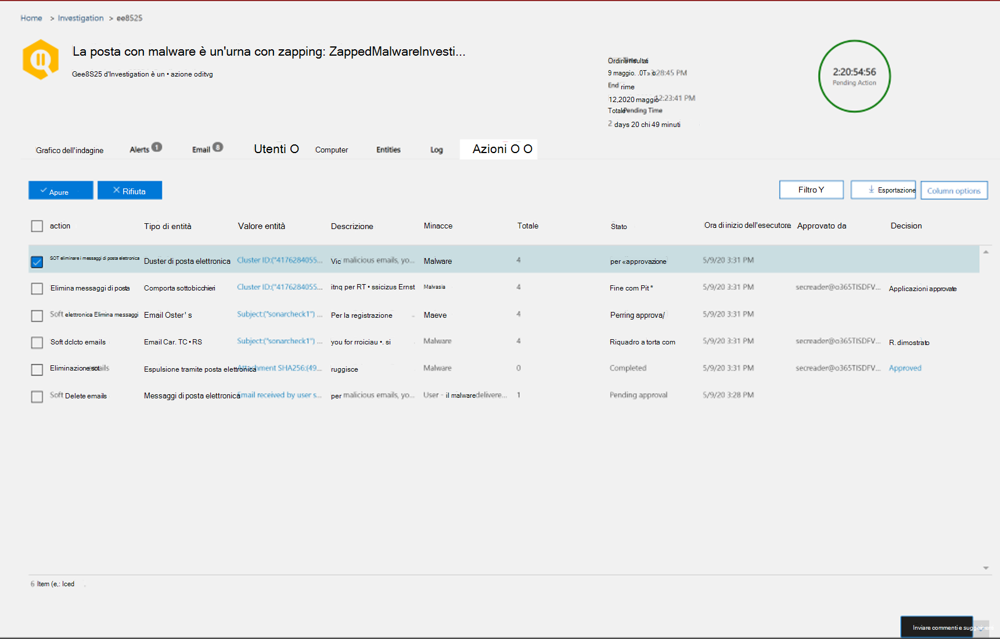

# Rimediare la posta elettronica dannosa recapitata in Office 365Remediate malicious email delivered in Office 365

[!INCLUDE [Microsoft 365 Defender rebranding](../includes/microsoft-defender-for-office.md)]

La correzione comporta l'esecuzione di un'azione prescritta nei confronti di una minaccia.Remediation means taking a prescribed action against a threat. I messaggi di posta elettronica dannosi inviati all'organizzazione possono essere rimossi dal sistema, tramite lo zapping automatico zero-hour (ZAP) o dai team di sicurezza tramite azioni correttive come *Sposta in posta in arrivo*, *Sposta su posta indesiderata*, *Sposta su elementi eliminati*, Elimina o Elimina *temporaneamente* *.*Malicious email sent to your organization can be cleaned up either by the system, through zero-hour auto purge (ZAP), or by security teams through remediation actions like *move to inbox*, *move to junk*, *move to deleted items*, *soft delete*, or *hard delete*. Microsoft Defender per Office 365 P2/E5 consente ai team di sicurezza di correggere le minacce nelle funzionalità di posta elettronica e collaborazione tramite l'analisi manuale e automatizzata.Microsoft Defender for Office 365 P2/E5 enables security teams to remediate threats in email and collaboration functionality through manual and automated investigation.

> [!NOTE]
> Per correggere il messaggio di posta elettronica dannoso, i team di sicurezza devono essere assegnati al ruolo di *ricerca ed eliminazione* .To remediate malicious email, security teams need the *search and purge* role assigned to them. L'assegnazione di ruolo viene fatta tramite le autorizzazioni nel centro sicurezza e conformità.Role assignment is done through permissions in the security and compliance center.

## Cosa è necessario sapere prima di iniziareWhat you need to know before you begin

Gli amministratori possono intraprendere le azioni necessarie per i messaggi di posta elettronica, ma per ottenere queste operazioni approvate, è necessario che il ruolo di *ricerca e Purge* venga assegnato tramite le autorizzazioni del **Centro sicurezza & conformità** \> .Admins can take required action on emails, but to get those actions approved, they must have the *search and purge* role assigned to them via **Security & Compliance Center** \> **Permissions**. Senza il ruolo "Search and Purge" aggiunto a uno dei gruppi di ruoli, non saranno in grado di eseguire l'azione.Without the "search and purge" role added to one of the role-groups, they won't be able to execute the action.

## Correzione automatica e manualeManual and automated remediation

La *caccia manuale* si verifica quando i team di sicurezza identificano le minacce manualmente utilizzando le funzionalità di ricerca e filtro in Esplora minacce.*Manual hunting* occurs when security teams identify threats manually by using the search and filtering capabilities in Threat Explorer. La correzione dei messaggi di posta elettronica manuale può essere attivata tramite qualsiasi visualizzazione di posta elettronica (*malware*, *phishing* o *tutti i messaggi di posta elettronica*) dopo aver identificato un insieme di messaggi di posta elettronica che devono essere corretti.Manual email remediation can be triggered through any email view (*Malware*, *Phish*, or *All email*) after you identify a set of emails that need to be remediated.

> [!div class="mx-imgBorder"]
> 

I team di sicurezza possono utilizzare la gestione delle minacce per selezionare i messaggi di posta elettronica in diversi modi:Security teams can use Threat Explorer to select emails in several ways:

- Scegliere i messaggi di posta elettronica manualmente: utilizzare filtri in diverse visualizzazioni.Choose emails by hand: Use filters in various views. Selezionare fino a 100 messaggi di posta elettronica per la correzione.Select up to 100 emails to remediate.

- Selezione query: selezionare un'intera query utilizzando il pulsante **Seleziona tutto** in alto.Query selection: Select an entire query by using the top **select all** button. La stessa query viene visualizzata anche nei dettagli sull'invio di posta elettronica del centro informazioni.The same query is also shown in action center mail submission details.

- Selezione di query con esclusione: a volte i team delle operazioni di sicurezza possono decidere di correggere i messaggi di posta elettronica selezionando un'intera query e escludendo manualmente alcuni messaggi di posta elettronica dalla query.Query selection with exclusion: Sometimes security operations teams may want to remediate emails by selecting an entire query and excluding certain emails from the query manually. A tale scopo, un amministratore può utilizzare la casella di controllo **Seleziona tutto** e scorrere verso il basso per escludere manualmente i messaggi di posta elettronica.To do so, an admin can use the **Select all** check box and scroll down to exclude emails manually. La query può contenere un massimo di 1.000 messaggi di posta elettronica.The query can hold a maximum of 1,000 emails. Il numero massimo di esclusioni è 100.The maximum number of exclusions is 100.

Dopo aver selezionato i messaggi di posta elettronica tramite Threat Explorer, è possibile avviare la correzione mediante l'esecuzione di un'azione diretta o accodando messaggi di posta elettronica per un'azione:Once emails are selected through Threat Explorer, you can start remediation by taking direct action or by queuing up emails for an action:

- Approvazione diretta: quando si selezionano azioni come *Sposta in posta in arrivo*, sposta su posta *indesiderata*, *Sposta su elementi eliminati*, *eliminazione* temporanea o *eliminazione* definitiva da personale della sicurezza che dispone delle autorizzazioni appropriate e che vengono seguiti i passaggi successivi per la correzione, il processo di correzione inizia ad eseguire l'azione selezionata.Direct approval: When actions like *move to inbox*, *move to junk*, *move to deleted items*, *soft delete*, or *hard delete* are selected by security personnel who have appropriate permissions, and the next steps in remediation are followed, the remediation process begins to execute the selected action. Un riquadro a comparsa temporaneo Visualizza la correzione in corso.A temporary flyout shows remediation in progress.

- Approvazione in due passaggi: un'azione "Aggiungi a correzione" può essere eseguita dagli amministratori che non dispongono delle autorizzazioni appropriate o che devono attendere l'esecuzione dell'azione.Two-step approval: An "add to remediation" action can be taken by admins who don't have appropriate permissions or who need to wait to execute the action. In questo caso, i messaggi di posta elettronica mirati vengono aggiunti a un contenitore di correzione.In this case, the targeted emails are added to a remediation container. L'approvazione è necessaria prima dell'esecuzione della correzione.Approval is needed before the remediation is executed.

L' **analisi automatizzata e** le azioni di risposta vengono attivate dagli avvisi o dai team di operazioni di sicurezza di Threat Explorer.**Automated investigation and response** actions are triggered by alerts or by security operations teams from Threat Explorer. Possono includere azioni di correzione che devono essere approvate da un team di operazioni di sicurezza.These may include recommended remediation actions that must be approved by a security operations team. Queste azioni sono incluse nella scheda **azione** nell'indagine automatizzata.These actions are included on the **Action** tab in the automated investigation.

> [!div class="mx-imgBorder"]
> 

Nell'Action Center vengono visualizzate tutte le correzioni, ovvero l'approvazione diretta o in due passaggi, che sono state create in Esplora minacce e le azioni approvate provenienti da indagini automatizzate.All remediations (either direct approval or two-step approval) that were created in Threat Explorer as well as approved actions coming from automated investigations are displayed in the Action Center. Accedere a questi tramite il riquadro di spostamento a sinistra in **Review** \> **Action Center**.Access these via the left navigation panel under **Review** \> **Action Center**.

> [!div class="mx-imgBorder"]
> 

Centro azioni Visualizza tutte le azioni di correzione negli ultimi 30 giorni.Action Center shows all remediation actions for the past 30 days. Le azioni eseguite tramite Esplora minacce sono elencate in base al nome che il team delle operazioni di sicurezza ha fornito quando è stata creata la correzione.Actions taken through Threat Explorer are listed by the name that the security operations team provided when the remediation was created. Le azioni intraprese tramite indagini automatizzate dispongono di titoli che iniziano con l'avviso correlato che ha attivato l'indagine, ad esempio "zap email cluster...".Actions taken through automated investigations have titles that begin with the related alert that triggered the investigation, such as "Zap email cluster... ."

Aprire qualsiasi elemento di correzione per visualizzarne i dettagli, inclusi il nome, la data di creazione, la descrizione, la gravità delle minacce e lo stato.Open any remediation item to view details about it, including its name, creation date, description, threat severity, and status. Vengono inoltre visualizzate le due schede seguenti.It also shows the following two tabs.

- Scheda **invio posta** : Visualizza il numero di messaggi di posta elettronica inviati tramite Esplora minacce o indagini automatizzate da correggere.**Mail submission** tab: Displays the number of emails submitted through Threat Explorer or automated investigations to be remediated. Questi messaggi di posta elettronica possono essere fattibili o non utilizzabili.These emails can be actionable or not actionable.

  > [!div class="mx-imgBorder"]
  > 

  - **Azione**: i messaggi di posta elettronica nei seguenti percorsi delle cassette postali cloud possono essere attivati e spostati:**Actionable**: Emails in the following cloud mailbox locations can be acted on and moved:
    - Posta in arrivoInbox
    - Posta indesiderataJunk
    - Cartella eliminataDeleted folder
    - Cartella eliminata temporaneamenteSoft-deleted folder

      > [!NOTE]
      > Attualmente, solo un utente con accesso alla cassetta postale può recuperare gli elementi da una cartella eliminata temporaneamente.Currently, only a user with access to the mailbox can recover items from a soft-deleted folder.

  - **Non** utilizzabile: i messaggi di posta elettronica nei seguenti percorsi non possono essere attivati o spostati in azioni di correzione:**Not actionable**: Emails in the following locations can't be acted on or moved in remediation actions:
    - QuarantenaQuarantine
    - Cartella eliminata definitivamenteHard-deleted folder
    - Locali/esterniOn-premises/external
    - Esito negativo/ritiratoFailed/dropped

  I messaggi sospetti sono classificati come rimediable o nonremediable.Suspicious messages are categorized as either remediable or nonremediable. Nella maggior parte dei casi, i messaggi remediable e nonremediable Combine sono uguali al totale dei messaggi inviati.In most cases, remediable and nonremediable messages combine equals total messages submitted. In rari casi, tuttavia, potrebbe non essere vero.But in rare cases this may not be true. Ciò può verificarsi a causa di ritardi di sistema, timeout o messaggi scaduti.This can happen because of system delays, timeouts, or expired messages. I messaggi scadono in base al periodo di conservazione di Threat Explorer per l'organizzazione.Messages expire based on the Threat Explorer retention period for your organization.

  A meno che non si stiano ripristinando i messaggi obsoleti dopo il periodo di conservazione dell'organizzazione, è consigliabile riprovare gli elementi se vengono visualizzate incoerenze dei numeri.Unless you're remediating old messages after your organization's Threat Explorer retention period, it's advisable to retry remediating items if you see number inconsistencies. Per i ritardi di sistema, gli aggiornamenti correttivi vengono in genere aggiornati in poche ore.For system delays, remediation updates are typically refreshed within a few hours.

  Se il periodo di conservazione dell'organizzazione per la posta elettronica in Threat Explorer è di 30 giorni e si stanno ripristinando i messaggi di posta elettronica che risalgono a 29-30 giorni, il numero di messaggi di invio potrebbe non essere sempre sommato.If your organization's retention period for email in Threat Explorer is 30 days and you're remediating emails going back 29-30 days, mail submission counts may not always add up. I messaggi di posta elettronica potrebbero essere già stati spostati fuori dal periodo di conservazione.The emails might have started moving out of the retention period already.

  Se le correzioni vengono bloccate nello stato "in corso" per un po' di tempo, è probabile che si verifichino ritardi del sistema.If remediations are stuck in the "In progress" state for a while, it's likely due to system delays. La correzione potrebbe richiedere fino a poche ore.It could take up to a few hours to remediate. È possibile che vengano visualizzate le variazioni nei conteggi dell'invio di posta elettronica, in quanto alcuni messaggi di posta elettronica potrebbero non essere stati inclusi nella query all'inizio della correzione a causa di ritardi del sistema.You might see variations in mail submission counts, as some of the emails may not have been included the query at the start of remediation due to system delays. È consigliabile riprovare la correzione in tali casi.It is a good idea to retry remediating in such cases.

  > [!NOTE]
  > Per ottenere risultati ottimali, è necessario eseguire la correzione in batch di 50.000 o meno.For best results, remediation should be done in batches of 50,000 or fewer.

  Durante la correzione vengono attivati solo i messaggi di posta elettronica rimediabili.Only remediable emails are acted on during remediation. I messaggi di posta elettronica di Nonremediable non possono essere corretti dal sistema di e-mail di Office 365, in quanto non vengono archiviati nelle cassette postali cloud.Nonremediable emails can't be remediated by the Office 365 email system, as they aren't stored in cloud mailboxes.

  Gli amministratori possono eseguire azioni sui messaggi di posta elettronica in quarantena, se necessario, ma tali messaggi di posta elettronica scadranno fuori dalla quarantena se non vengono eliminati manualmente.Admins can take actions on emails in quarantine if necessary, but those emails will expire out of quarantine if they're not manually purged. I messaggi di posta elettronica in quarantena a causa di contenuti dannosi non sono accessibili dagli utenti, quindi il personale della sicurezza non deve intraprendere alcuna azione per eliminare le minacce in quarantena.Emails quarantined because of malicious content aren't accessible by users, so security personnel don't have to take any action to get rid of threats in quarantine. Se i messaggi di posta elettronica sono in locale o esterno, l'utente può essere contattato per risolvere il messaggio di posta elettronica sospetto.If the emails are on-premises or external, the user can be contacted to address the suspicious email. Gli amministratori possono utilizzare i server di posta elettronica o gli strumenti di sicurezza separati per la rimozione.Or the admins can use separate email server/security tools for removal. Questi messaggi di posta elettronica possono essere identificati applicando il filtro esterno *posizione di recapito = on-Prem* in Esplora minacce.These emails can be identified by applying the *delivery location = on-prem* external filter in Threat Explorer. Per i messaggi di posta elettronica non riusciti o eliminati o non sono accessibili dagli utenti, non vi sarà alcun messaggio di posta elettronica da attenuare, poiché questi messaggi non raggiungono la cassetta postale.For failed or dropped email, or email not accessible by users, there won't be any email to mitigate, since these mails don't reach the mailbox.

  Nell'immagine seguente viene illustrato il modo in cui l'invio viene visualizzato in Action Center.The following image shows how a submission looks in Action Center. Una correzione può contenere più invii.A remediation can contain multiple submissions. Se più azioni vengono approvate tramite un'indagine automatizzata, ogni azione del cluster di posta elettronica o di posta elettronica viene visualizzata nella stessa correzione di un altro invio.If multiple actions get approved through one automated investigation, each email or email cluster action appears in the same remediation as a different submission.

  > [!div class="mx-imgBorder"]
  > 

  Selezionare un elemento per l'invio della posta per visualizzare i dettagli di tale correzione, ad esempio la query (quando la correzione viene attivata tramite indagini automatizzate o Esplora minacce tramite la selezione di una query) e gli orari di inizio e fine della correzione.Select a mail submission item to show the details of that remediation, such as the query (when remediation is triggered through automated investigations or Threat Explorer through selecting a query) and the start and end times of remediation. Viene inoltre visualizzato un elenco di messaggi inviati per la correzione.It also displays a list of messages that were submitted for remediation. Quando i messaggi vengono spostati dal periodo di conservazione di Threat Explorer, i messaggi scompaiono da questo elenco.As messages move out of the Threat Explorer retention period, the messages disappear from this list. L'elenco Visualizza anche i singoli messaggi che sono risolvibili.The list also shows individual messages that are remediable.

- **Registri azione**: questa scheda Visualizza i messaggi corretti, inclusa la data approvata, l'amministratore che ha approvato l'azione, l'azione, lo stato e i conteggi.**Action logs**: This tab shows the messages remediated, including approved date, admin who approved the action, action, status, and counts.

  Lo stato può essere:Status can be:

  - **Avviato**: viene attivata la correzione.**Started**: Remediation is triggered.
  - **Accodamento**: la correzione è in coda per la riduzione dei messaggi di posta elettronica.**Queued**: Remediation is queued up for mitigation of emails.
  - **In corso**: attenuazione in corso.**In progress**: Mitigation is in progress.
  - **Completata**: la mitigazione su tutti i messaggi di posta elettronica rimediable è stata completata correttamente o con alcuni errori.**Completed**: Mitigation on all remediable emails either completed successfully or with some failures.
  - **Errore**: nessuna correzione ha avuto esito positivo.**Failed**: No remediations were successful.

  Poiché solo i messaggi di posta elettronica rimediabili possono essere attivati, la pulizia di ogni e-mail viene visualizzata con esito positivo o negativo.As only remediable emails can be acted on, each email's cleanup is shown as successful or failed. Dal totale dei messaggi di posta elettronica rimediabili, le attenuazioni riuscite e non riuscite sono segnalate.From the total remediable emails, successful and failed mitigations are reported.

  - **Success**: l'azione desiderata sui messaggi di posta elettronica rimediabili è stata compiuta.**Success**: The desired action on remediable emails was accomplished. Ad esempio, un amministratore vuole rimuovere i messaggi di posta elettronica dalle cassette postali, quindi l'amministratore esegue l'azione di eliminazione dei messaggi di posta elettronica soft.For example: An admin wants to remove emails from mailboxes, so the admin takes the action of soft-deleting emails. Se un messaggio di posta elettronica risolvibile non viene trovato nella cartella originale dopo l'esecuzione dell'azione, lo stato verrà visualizzato come riuscito.If a remediable email isn't found in the original folder after the action is taken, the status will show as successful.

  - **Errore**: Impossibile eseguire l'azione desiderata sui messaggi di posta elettronica rimediable.**Failure**: The desired action on remediable emails failed. Ad esempio, un amministratore vuole rimuovere i messaggi di posta elettronica dalle cassette postali, quindi l'amministratore esegue l'azione di eliminazione dei messaggi di posta elettronica soft.For example: An admin wants to remove emails from mailboxes, so the admin takes the action of soft-deleting emails. Se un messaggio di posta elettronica risolvibile viene ancora trovato nella cassetta postale dopo l'operazione, lo stato verrà visualizzato come non riuscito.If a remediable email is still found in the mailbox after the action is taken, status will show as failed.

  Selezionare un elemento nel log azione per visualizzare i dettagli di correzione.Select any item in the action log to display remediation details. Se i dettagli dicono "riuscito" o "non trovato nella cassetta postale", tale elemento è già stato rimosso dalla cassetta postale.If the details say "successful" or "not found in mailbox," that item was already removed from the mailbox. A volte si verifica un errore sistemico durante la correzione.Sometimes there's a systemic error during remediation. In questi casi, è consigliabile riprovare la correzione.In those cases, it's a good idea to retry remediation.

  In caso di correzione di batch di grandi dimensioni, è anche possibile esportare i messaggi inviati per la correzione tramite invio e messaggi di posta elettronica che sono stati risolti tramite i log di azione.In case of remediating large batches, you can also export the messages send for remediation via Mail Submission and messages which got remediated via Action Logs. Il limite di esportazione viene aumentato a 100K Records.The export limit is increased to 100k records.

  La correzione è uno strumento potente per attenuare le minacce e indirizzare i messaggi di posta elettronica sospetti.Remediation is a powerful tool to mitigate threats and address suspicious emails. Aiuta a mantenere sicura un'organizzazione.It helps keep an organization secure.
