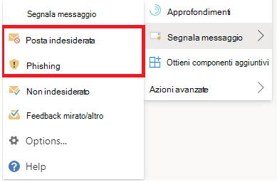

# Segnalare i falsi positivi e i falsi negativi in Outlook

[!INCLUDE [Microsoft 365 Defender rebranding](../includes/microsoft-defender-for-office.md)]

**Si applica a**
- [Exchange Online Protection](exchange-online-protection-overview.md)
- [Microsoft Defender per Office 365 piano 1 e piano 2](defender-for-office-365.md)
- [Microsoft 365 Defender](../defender/microsoft-365-defender.md)

> [!NOTE]
> Se si è un amministratore di un'organizzazione Microsoft 365 con cassette postali di Exchange Online, è consigliabile utilizzare il portale invii nel Centro sicurezza & conformità. Per ulteriori informazioni, vedere [Use Admin Submission to submit suspected spam, phish, URLs, and files to Microsoft](admin-submission.md).

Nelle organizzazioni Microsoft 365 con cassette postali in Exchange Online o cassette postali locali che utilizzano l'autenticazione moderna ibrida, è possibile inviare falsi positivi (buona posta elettronica bloccata o inviata alla cartella posta indesiderata) e falsi negativi (posta elettronica indesiderata o phish recapitati nella posta in arrivo) a Exchange Online Protection (EOP).

## Che cosa è necessario sapere prima di iniziare

- Per una migliore esperienza di invio da parte dell'utente, usa il componente aggiuntivo Segnala messaggio o Segnala phishing.

  > [!IMPORTANT]
  > L'esperienza incorporata per la segnalazione di posta indesiderata o phishing in Outlook non può usare i criteri di invio [degli utenti.](./user-submission.md) È consigliabile usare invece il componente aggiuntivo Segnala messaggio o Segnala phishing.

- Il componente aggiuntivo Segnala messaggio e il componente aggiuntivo Segnala phishing funzionano per Outlook in tutte le piattaforme (Outlook sul Web, iOS, Android e Desktop).

- Se si è un amministratore di un'organizzazione con Exchange Online cassette postali, utilizzare il portale invii nel Centro sicurezza & conformità. Per ulteriori informazioni, vedere [Use Admin Submission to submit suspected spam, phish, URLs, and files to Microsoft](admin-submission.md).

- È possibile configurare l'invio dei messaggi direttamente a Microsoft, a una cassetta postale specificata o a entrambi. Per ulteriori informazioni, vedere [Criteri di invio degli utenti.](user-submission.md)

- Per ulteriori informazioni su come ottenere e abilitare i componenti aggiuntivi Segnala messaggio o Segnala phishing, vedere [Enable the Report Message or the Report Phishing add-ins.](enable-the-report-message-add-in.md)

- Per ulteriori informazioni sulla segnalazione dei messaggi a Microsoft, vedere [Segnalare messaggi e file a Microsoft](report-junk-email-messages-to-microsoft.md).

## Utilizzare la funzionalità Segnala messaggio

### Segnalare messaggi di posta indesiderata e phishing

Per i messaggi in Posta in arrivo o qualsiasi altra cartella di posta elettronica ad eccezione della posta indesiderata, utilizzare il metodo seguente per segnalare messaggi di posta indesiderata e phishing:

1. Selezionare i **puntini di** sospensione Altre azioni nell'angolo in alto a destra del messaggio selezionato, selezionare **Segnala** messaggio dal menu a discesa e quindi selezionare **Posta** indesiderata o **Phishing.**

   
   
   

2. I messaggi selezionati verranno inviati a Microsoft per l'analisi e:
   - Spostato nella cartella Posta indesiderata se sono stati segnalati come posta indesiderata.
   - Eliminato se sono stati segnalati come phishing.

### Segnalare messaggi non indesiderati

1. Selezionare i **puntini di** sospensione Altre azioni nell'angolo superiore destro del messaggio selezionato, selezionare **Segnala** messaggio dal menu a discesa e quindi selezionare **Non indesiderato.**

   
   
   

2. Il messaggio selezionato verrà inviato a Microsoft per l'analisi e spostato in Posta in arrivo o in qualsiasi altra cartella specificata.

## Visualizzare ed esaminare i messaggi segnalati

Per esaminare i messaggi che gli utenti segnalano a Microsoft, sono disponibili le opzioni seguenti:

- Usa il portale per gli invii di amministratori. Per ulteriori informazioni, vedere [View user submissions to Microsoft](admin-submission.md#view-user-submissions-to-microsoft).
- Creare una regola del flusso di posta (nota anche come regola di trasporto) per inviare copie dei messaggi segnalati. Per istruzioni, vedere [Use mail flow rules to see what users are reporting to Microsoft](/exchange/security-and-compliance/mail-flow-rules/use-rules-to-see-what-users-are-reporting-to-microsoft).
