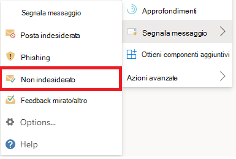

# Segnalare falsi positivi e falsi negativi in OutlookReport false positives and false negatives in Outlook

[!INCLUDE [Microsoft 365 Defender rebranding](../includes/microsoft-defender-for-office.md)]

**Si applica a****Applies to**
- [Exchange Online ProtectionExchange Online Protection](exchange-online-protection-overview.md)
- [Microsoft Defender per Office 365 piano 1 e piano 2Microsoft Defender for Office 365 plan 1 and plan 2](defender-for-office-365.md)
- [Microsoft 365 DefenderMicrosoft 365 Defender](../defender/microsoft-365-defender.md)

> [!NOTE]
> Se si è un amministratore in un'organizzazione di Microsoft 365 con cassette postali di Exchange Online, è consigliabile utilizzare il portale invii nel Centro sicurezza & conformità.If you're an admin in a Microsoft 365 organization with Exchange Online mailboxes, we recommend that you use the Submissions portal in the Security & Compliance Center. Per ulteriori informazioni, vedere [Use Admin Submission to submit suspected spam, phish, URLs, and files to Microsoft](admin-submission.md).For more information, see [Use Admin Submission to submit suspected spam, phish, URLs, and files to Microsoft](admin-submission.md).

Nelle organizzazioni di Microsoft 365 con cassette postali in Exchange Online o nelle cassette postali locali che utilizzano l'autenticazione moderna ibrida, è possibile inviare falsi positivi (buona posta elettronica contrassegnata come posta indesiderata) e falsi negativi (posta elettronica non consentita e phish consentiti) a Exchange Online Protection (EOP).In Microsoft 365 organizations with mailboxes in Exchange Online or on-premises mailboxes using hybrid modern authentication, you can submit false positives (good email marked as spam) and false negatives (bad email and phish allowed) to Exchange Online Protection (EOP).

## Aspetti da ricordare prima di utilizzare la funzionalità Segnala messaggioThings to remember before you use the Report Message feature

- Per una migliore esperienza di invio da parte dell'utente, usa il componente aggiuntivo Segnala messaggio o Segnala phishing.For the best user submission experience, use the Report Message add-in or the Report Phishing add-in.

- Si noti che questo componente aggiuntivo funziona per Outlook in tutte le piattaforme, ovvero sul Web, iOS, Android e Desktop.Note that this add-in works for Outlook in all platforms—on the web, iOS, Android, and Desktop.

- Se si è un amministratore di un'organizzazione con cassette postali di Exchange Online, utilizzare il portale invii nel Centro sicurezza & conformità.If you're an admin in an organization with Exchange Online mailboxes, use the Submissions portal in the Security & Compliance Center. Per ulteriori informazioni, vedere [Use Admin Submission to submit suspected spam, phish, URLs, and files to Microsoft](admin-submission.md).For more information, see [Use Admin Submission to submit suspected spam, phish, URLs, and files to Microsoft](admin-submission.md).

- È possibile configurare l'invio dei messaggi direttamente a Microsoft, a una cassetta postale specificata o a entrambi.You can configure to send messages directly to Microsoft, a mailbox you specify, or both. Per ulteriori informazioni, vedere [Criteri di invio degli utenti.](user-submission.md)For more information, see [User submissions policies](user-submission.md).

- Per ulteriori informazioni sulla segnalazione dei messaggi a Microsoft, vedere [Segnalare messaggi e file a Microsoft](report-junk-email-messages-to-microsoft.md).For more information about reporting messages to Microsoft, see [Report messages and files to Microsoft](report-junk-email-messages-to-microsoft.md).

## Utilizzare la funzionalità Segnala messaggioUse the Report Message feature

### Segnalare messaggi di posta indesiderata e phishingReport junk and phishing messages

Per i messaggi in Posta in arrivo o qualsiasi altra cartella di posta elettronica ad eccezione della posta indesiderata, utilizzare il metodo seguente per segnalare messaggi di posta indesiderata e phishing:For messages in the Inbox or any other email folder except Junk Email, use the following method to report spam and phishing messages:

1. Fare clic **sui puntini** di sospensione Altre azioni nell'angolo superiore destro del messaggio selezionato, fare clic su Segnala messaggio dal menu a discesa e quindi selezionare **Posta** indesiderata o **Phishing.** Click the **More actions** ellipses on the top-right corner of the selected message, click **Report message** from the dropdown menu, and then select **Junk** or **Phishing**.
  
   > [!div class="mx-imgBorder"]
   > 

   > [!div class="mx-imgBorder"]
   > 

2. I messaggi selezionati verranno inviati a Microsoft per l'analisi e:The selected messages will be sent to Microsoft for analysis and:

   - Spostato nella cartella Posta indesiderata se è stato segnalato come posta indesiderata.Moved to the Junk Email folder if it was reported as spam.

   - Eliminato se è stato segnalato come phishing.Deleted if it was reported as phishing.
   
### Segnalare messaggi non indesideratiReport messages that are not junk

1. Fare clic **sui puntini** di sospensione Altre azioni nell'angolo superiore destro del messaggio selezionato, scegliere Segnala messaggio dal menu a discesa e quindi fare clic su **Non indesiderato.** Click the **More actions** ellipses on the top-right corner of the selected message, click **Report message** from the dropdown menu, and then click **Not Junk**.  

   > [!div class="mx-imgBorder"]
   > 

   > [!div class="mx-imgBorder"]
   > 

2. Il messaggio selezionato verrà inviato a Microsoft per l'analisi e spostato in Posta in arrivo o in qualsiasi altra cartella specificata.The selected message will be sent to Microsoft for analysis and moved to Inbox or any other specified folder.

## Abilitare i componenti aggiuntivi Segnala messaggio e Segnala phishingEnable the Report Message and Report Phishing add-ins

I componenti aggiuntivi Segnala messaggio e Segnala phishing per Outlook e Outlook sul Web (in precedenza noto come Outlook Web App) consentono agli utenti di segnalare facilmente falsi positivi (buona posta elettronica contrassegnata come non buona) o falsi negativi (posta elettronica non consentita) a Microsoft e alle sue affiliate per l'analisi.The Report Message and Report Phishing add-ins for Outlook and Outlook on the web (formerly known as Outlook Web App) enable people to easily report false positives (good email marked as bad) or false negatives (bad email allowed) to Microsoft and its affiliates for analysis. 

Microsoft usa questi invii per migliorare l'efficacia delle tecnologie di protezione della posta elettronica.Microsoft uses these submissions to improve the effectiveness of email protection technologies. Si supponga, ad esempio, che gli utenti segnalano molti messaggi utilizzando il componente aggiuntivo Segnala phishing.For example, suppose that people are reporting many messages using the Report Phishing add-in. Queste informazioni vengono visualizzate nel dashboard di sicurezza e in altri report.This information surfaces in the Security Dashboard and other reports. Il team di sicurezza dell'organizzazione può utilizzare queste informazioni per indicare che potrebbe essere necessario aggiornare i criteri anti-phishing.Your organization's security team can use this information as an indication that anti-phishing policies might need to be updated. 

È possibile installare il componente aggiuntivo Segnala messaggio o Segnala phishing.You can install either the Report Message or Report Phishing add-in. Se si desidera che gli utenti segnalano messaggi di posta indesiderata e di phishing, distribuire il componente aggiuntivo Segnala messaggio nell'organizzazione.If you want your users to report both spam and phishing messages, deploy the Report Message add-in in your organization. Per ulteriori informazioni, vedere Enable the Report Message add-in.For more information, see Enable the Report Message add-in. 

Il componente aggiuntivo Segnala messaggio consente di segnalare sia i messaggi di posta indesiderata che i messaggi di phishing.The Report Message add-in provides the option to report both spam and phishing messages. Gli amministratori possono abilitare il componente aggiuntivo Segnala messaggio per l'organizzazione e i singoli utenti possono installarlo automaticamente.Admins can enable the Report Message add-in for the organization, and individual users can install it for themselves. 

Il componente aggiuntivo Segnala phishing consente di segnalare solo i messaggi di phishing.The Report Phishing add-in provides the option to report only phishing messages. Gli amministratori possono abilitare il componente aggiuntivo Segnala phishing per l'organizzazione e i singoli utenti possono installarlo automaticamente.Admins can enable the Report Phishing add-in for the organization, and individual users can install it for themselves. 

Se si è un singolo utente, è possibile abilitare entrambi i componenti aggiuntivi.If you're an individual user, you can enable both the add-ins for yourself.

se si è un amministratore globale o un amministratore di Exchange Online ed Exchange è configurato per l'utilizzo dell'autenticazione OAuth, è possibile abilitare il componente aggiuntivo Segnala messaggio e il componente aggiuntivo Segnala phishing per l'organizzazione.f you're a global administrator or an Exchange Online administrator, and Exchange is configured to use OAuth authentication, you can enable the Report Message add-in and the Report Phishing add-in for your organization. Entrambi i componenti aggiuntivi sono ora disponibili tramite [distribuzione centralizzata.](../../admin/manage/centralized-deployment-of-add-ins.md)Both add-ins are now available through [Centralized Deployment](../../admin/manage/centralized-deployment-of-add-ins.md).

## Che cosa è necessario sapere prima di iniziare?What do you need to know before you begin?

- Sia il componente aggiuntivo Segnala messaggio che il componente aggiuntivo Segnala phishing funzionano con la maggior parte delle sottoscrizioni di Microsoft 365 e i prodotti seguenti:Both the Report Message add-in and the Report Phishing add-in works with most Microsoft 365 subscriptions and the following products:

  - Outlook sul WebOutlook on the web
  - Outlook 2013 SP1 o versione successivaOutlook 2013 SP1 or later
  - Outlook 2016 per MacOutlook 2016 for Mac
  - Outlook incluso con le app di Microsoft 365 per le aziendeOutlook included with Microsoft 365 apps for Enterprise
  - App Outlook per iOS e AndroidOutlook app for iOS and Android

- Entrambi i componenti aggiuntivi non sono disponibili per le cassette postali condivise o le cassette postali nelle organizzazioni exchange locali.Both add-ins are not available for shared mailboxes or mailboxes in on-premises Exchange organizations.

- Il Web browser esistente dovrebbe funzionare sia con i componenti aggiuntivi Segnala messaggio che Segnala phishing. Tuttavia, se si nota che il componente aggiuntivo non è disponibile o non funziona come previsto, provare un browser diverso.Your existing web browser should work with both the Report Message and Report Phishing add-ins. But, if you notice the add-in is not available or not working as expected, try a different browser.

- Per le installazioni dell'organizzazione, l'organizzazione deve essere configurata per l'utilizzo dell'autenticazione OAuth.For organizational installs, the organization needs to be configured to use OAuth authentication. Per ulteriori informazioni, vedere [Determine if Centralized Deployment of add-ins works for your organization](../../admin/manage/centralized-deployment-of-add-ins.md).For more information, see [Determine if Centralized Deployment of add-ins works for your organization](../../admin/manage/centralized-deployment-of-add-ins.md).

- Gli amministratori devono essere membri del gruppo di ruoli Amministratori globali.Admins need to be a member of the Global admins role group. Per altre informazioni, vedere [Autorizzazioni nel Centro sicurezza e conformità](permissions-in-the-security-and-compliance-center.md).For more information, see [Permissions in the Security & Compliance Center](permissions-in-the-security-and-compliance-center.md).

## Ottenere il componente aggiuntivo Segnala messaggioGet the Report Message add-in

### Ottenere il componente aggiuntivo per se stessiGet the add-in for yourself

1. Passare a Microsoft AppSource <https://appsource.microsoft.com/marketplace/apps> all'indirizzo e cercare il componente aggiuntivo Segnala messaggio.Go to the Microsoft AppSource at <https://appsource.microsoft.com/marketplace/apps> and search for the Report Message add-in. Per passare direttamente al componente aggiuntivo Segnala messaggio, passare a <https://appsource.microsoft.com/product/office/wa104381180> .To go directly to the Report Message add-in, go to <https://appsource.microsoft.com/product/office/wa104381180>.

2. Fai **clic su SCARICA ORA**.Click **GET IT NOW**.

   

3. Nella finestra di dialogo visualizzata esaminare le condizioni per l'utilizzo e l'informativa sulla privacy e quindi fare clic su **Continua.**In the dialog that appears, review the terms of use and privacy policy, and then click **Continue**.

4. Accedi usando l'account aziendale o dell'istituto di istruzione (per uso aziendale) o l'account Microsoft (per uso personale).Sign in using your work or school account (for business use) or your Microsoft account (for personal use).

Dopo aver installato e abilitato il componente aggiuntivo, verranno visualizzate le icone seguenti:After the add-in is installed and enabled, you'll see the following icons:

- In Outlook l'icona è simile alla seguente:In Outlook, the icon looks like this:

  > [!div class="mx-imgBorder"]
  > 

- In Outlook sul Web l'icona è simile alla seguente:In Outlook on the web, the icon looks like this:

  > [!div class="mx-imgBorder"]
  > 

### Ottenere il componente aggiuntivo per l'organizzazioneGet the add-in for your organization

> [!NOTE]
> La visualizzazione del componente aggiuntivo nell'organizzazione potrebbe richiedere fino a 12 ore.It could take up to 12 hours for the add-in to appear in your organization.

1. Nell'interfaccia di amministrazione di Microsoft 365  passare alla pagina Impostazioni \> **componenti aggiuntivi all'indirizzo** <https://admin.microsoft.com/AdminPortal/Home#/Settings/AddIns> .In the Microsoft 365 admin center, go to the go to the **Settings** \> **Add-ins** page at <https://admin.microsoft.com/AdminPortal/Home#/Settings/AddIns>. Se la pagina componenti  aggiuntivi non è visualizzata, passare al collegamento Impostazioni Componenti aggiuntivi app integrate nella parte superiore  \>  \>  della **pagina App** integrate.If you don't see the **Add-in** Page, go to the **Settings** \> **Integrated apps** \> **Add-ins** link on the top of the **Integrated apps** page.

2. Selezionare **Distribuisci componente aggiuntivo** nella parte superiore della pagina e quindi selezionare **Avanti.**Select **Deploy Add-in** at the top of the page, and then select **Next**.

   

3. Nel riquadro **a comparsa Distribuisci un** nuovo componente aggiuntivo visualizzato esaminare le informazioni e quindi fare clic su **Avanti.**In the **Deploy a new add-in** flyout that appears, review the information, and then click **Next**.

4. Nella pagina successiva fai clic su **Scegli dallo Store.**On the next page, click **Choose from the Store**.

   

5. Nella pagina **Seleziona componente aggiuntivo visualizzata** fare clic nella casella **Di** ricerca, immettere **Segnala** messaggio e quindi fare clic su **Cerca**  Ricerca.In the **Select add-in** page that appears, click in the **Search** box, enter **Report Message**, and then click **Search** . Nell'elenco dei risultati, trovare **Segnala messaggio e** quindi fare clic su **Aggiungi.**In the list of results, find **Report Message** and then click **Add**.

   

6. Nella finestra di dialogo visualizzata esaminare le informazioni sulla licenza e sulla privacy e quindi fare clic su **Continua.**In the dialog that appears, review the licensing and privacy information, and then click **Continue**.

7. Nella pagina **Configura componente aggiuntivo visualizzata** configurare le impostazioni seguenti:In the **Configure add-in** page that appears, configure the following settings:

   - **Utenti assegnati**: selezionare uno dei valori seguenti:**Assigned users**: Select one of the following values:

     - **Tutti** (impostazione predefinita)**Everyone** (default)
     - **Utenti/gruppi specifici****Specific users / groups**
     - **Solo io****Just me**

   - **Metodo di distribuzione:** selezionare uno dei valori seguenti:**Deployment method**: Select one of the following values:

     - **Risolto (impostazione predefinita):** il componente aggiuntivo viene distribuito automaticamente agli utenti specificati e non può essere rimosso.**Fixed (Default)**: The add-in is automatically deployed to the specified users and they can't remove it.
     - **Disponibile**: gli utenti possono installare il componente aggiuntivo in **Home** \> **Get add-ins** \> **Admin-managed**.**Available**: Users can install the add-in at **Home** \> **Get add-ins** \> **Admin-managed**.
     - **Facoltativo:** il componente aggiuntivo viene distribuito automaticamente agli utenti specificati, ma può scegliere di rimuoverlo.**Optional**: The add-in is automatically deployed to the specified users, but they can choose to remove it.

   

   Al termine, fare clic su **Distribuisci**.When you're finished, click **Deploy**.

8. Nella pagina **Deploy Report Message** visualizzata verrà visualizzato un rapporto sullo stato seguito da una conferma della distribuzione del componente aggiuntivo.In the **Deploy Report Message** page that appears, you'll see a progress report followed by a confirmation that the add-in was deployed. Dopo aver letto le informazioni, fare clic su **Avanti.**After you read the information, click **Next**.

   

9. Nella pagina **Annuncia componente aggiuntivo visualizzata** esaminare le informazioni e quindi fare clic su **Chiudi.**On the **Announce add-in** page that appears, review the information, and then click **Close**.

   

## Rivedere o modificare le impostazioni per il componente aggiuntivo Segnala messaggioReview or edit settings for the Report Message add-in

1. Nell'interfaccia di amministrazione di Microsoft 365  passare alla pagina Impostazioni \> **componenti aggiuntivi all'indirizzo** <https://admin.microsoft.com/AdminPortal/Home#/Settings/AddIns> .In the Microsoft 365 admin center, go to the go to the **Settings** \> **Add-ins** page at <https://admin.microsoft.com/AdminPortal/Home#/Settings/AddIns>. Se la pagina componenti  aggiuntivi non è visualizzata, passare al collegamento Impostazioni Componenti aggiuntivi app integrate nella parte superiore  \>  \>  della **pagina App** integrate.If you don't see the **Add-in** Page, go to the **Settings** \> **Integrated apps** \> **Add-ins** link on the top of the **Integrated apps** page.

   

2. Individuare e selezionare il componente aggiuntivo **Segnala** messaggio.Find and select the **Report Message** add-in.

3. Nel riquadro **a comparsa Modifica messaggio** rapporto visualizzato esaminare e modificare le impostazioni in base alle esigenze dell'organizzazione.In the **Edit Report Message** flyout that appears, review and edit settings as appropriate for your organization. Al termine, scegliere **Salva**.When you're finished, click **Save**.

   

## Ottenere il componente aggiuntivo Segnala phishingGet the Report Phishing add-in

### Ottenere il componente aggiuntivo per se stessiGet the add-in for yourself

1. Vai a Microsoft AppSource <https://appsource.microsoft.com/marketplace/apps> all'indirizzo e cerca il componente aggiuntivo Segnala phishing.Go to the Microsoft AppSource at <https://appsource.microsoft.com/marketplace/apps> and search for the Report Phishing add-in.

2. Fai **clic su SCARICA ORA**.Click **GET IT NOW**.

3. Nella finestra di dialogo visualizzata esaminare le condizioni per l'utilizzo e l'informativa sulla privacy e quindi fare clic su **Continua.**In the dialog that appears, review the terms of use and privacy policy, and then click **Continue**.

4. Accedi usando l'account aziendale o dell'istituto di istruzione (per uso aziendale) o l'account Microsoft (per uso personale).Sign in using your work or school account (for business use) or your Microsoft account (for personal use).

Dopo aver installato e abilitato il componente aggiuntivo, verranno visualizzate le icone seguenti:After the add-in is installed and enabled, you'll see the following icons:

- In Outlook l'icona è simile alla seguente:In Outlook, the icon looks like this:

  

- In Outlook sul Web l'icona è simile alla seguente:In Outlook on the web, the icon looks like this:

  > [!div class="mx-imgBorder"]
  > 

### Ottenere il componente aggiuntivo per l'organizzazioneGet the add-in for your organization

> [!NOTE]
> La visualizzazione del componente aggiuntivo nell'organizzazione potrebbe richiedere fino a 12 ore.It could take up to 12 hours for the add-in to appear in your organization.

1. Nell'interfaccia di amministrazione di Microsoft 365  passare alla pagina Impostazioni \> **componenti aggiuntivi all'indirizzo** <https://admin.microsoft.com/AdminPortal/Home#/Settings/AddIns> .In the Microsoft 365 admin center, go to the go to the **Settings** \> **Add-ins** page at <https://admin.microsoft.com/AdminPortal/Home#/Settings/AddIns>. Se la pagina componenti  aggiuntivi non è visualizzata, passare al collegamento Impostazioni Componenti aggiuntivi app integrate nella parte superiore  \>  \>  della **pagina App** integrate.If you don't see the **Add-in** Page, go to the **Settings** \> **Integrated apps** \> **Add-ins** link on the top of the **Integrated apps** page.

2. Selezionare **Distribuisci componente aggiuntivo** nella parte superiore della pagina e quindi selezionare **Avanti.**Select **Deploy Add-in** at the top of the page, and then select **Next**.

   

3. Nel riquadro **a comparsa Distribuisci un** nuovo componente aggiuntivo visualizzato esaminare le informazioni e quindi fare clic su **Avanti.**In the **Deploy a new add-in** flyout that appears, review the information, and then click **Next**.

4. Nella pagina successiva fai clic su **Scegli dallo Store.**On the next page, click **Choose from the Store**.

   

5. Nella pagina **Seleziona componente aggiuntivo visualizzata** fare clic nella casella **Di** ricerca, immettere **Segnala phishing** e quindi fare clic su **Cerca**  Ricerca.In the **Select add-in** page that appears, click in the **Search** box, enter **Report Phishing**, and then click **Search** . Nell'elenco dei risultati, individuare **Segnala phishing** e quindi fare clic su **Aggiungi.**In the list of results, find **Report Phishing** and then click **Add**.

6. Nella finestra di dialogo visualizzata esaminare le informazioni sulla licenza e sulla privacy e quindi fare clic su **Continua.**In the dialog that appears, review the licensing and privacy information, and then click **Continue**.

7. Nella pagina **Configura componente aggiuntivo visualizzata** configurare le impostazioni seguenti:In the **Configure add-in** page that appears, configure the following settings:

   - **Utenti assegnati**: selezionare uno dei valori seguenti:**Assigned users**: Select one of the following values:

     - **Tutti** (impostazione predefinita)**Everyone** (default)
     - **Utenti/gruppi specifici****Specific users / groups**
     - **Solo io****Just me**

   - **Metodo di distribuzione:** selezionare uno dei valori seguenti:**Deployment method**: Select one of the following values:

     - **Risolto (impostazione predefinita):** il componente aggiuntivo viene distribuito automaticamente agli utenti specificati e non può essere rimosso.**Fixed (Default)**: The add-in is automatically deployed to the specified users and they can't remove it.
     - **Disponibile**: gli utenti possono installare il componente aggiuntivo in **Home** \> **Get add-ins** \> **Admin-managed**.**Available**: Users can install the add-in at **Home** \> **Get add-ins** \> **Admin-managed**.
     - **Facoltativo:** il componente aggiuntivo viene distribuito automaticamente agli utenti specificati, ma può scegliere di rimuoverlo.**Optional**: The add-in is automatically deployed to the specified users, but they can choose to remove it.

   Al termine, fare clic su **Distribuisci**.When you're finished, click **Deploy**.

8. Nella pagina **Distribuisci phishing** report visualizzata verrà visualizzato un rapporto sullo stato seguito da una conferma della distribuzione del componente aggiuntivo.In the **Deploy Report Phishing** page that appears, you'll see a progress report followed by a confirmation that the add-in was deployed. Dopo aver letto le informazioni, fare clic su **Avanti.**After you read the information, click **Next**.

9. Nella pagina **Annuncia componente aggiuntivo visualizzata** esaminare le informazioni e quindi fare clic su **Chiudi.**On the **Announce add-in** page that appears, review the information, and then click **Close**.

## Rivedere o modificare le impostazioni per il componente aggiuntivo Segnala phishingReview or edit settings for the Report Phishing add-in

1. Nell'interfaccia di amministrazione di Microsoft 365  passare alla pagina Impostazioni \> **componenti aggiuntivi all'indirizzo** <https://admin.microsoft.com/AdminPortal/Home#/Settings/AddIns> .In the Microsoft 365 admin center, go to the go to the **Settings** \> **Add-ins** page at <https://admin.microsoft.com/AdminPortal/Home#/Settings/AddIns>. Se la pagina componenti  aggiuntivi non è visualizzata, passare al collegamento Impostazioni Componenti aggiuntivi app integrate nella parte superiore  \>  \>  della **pagina App** integrate.If you don't see the **Add-in** Page, go to the **Settings** \> **Integrated apps** \> **Add-ins** link on the top of the **Integrated apps** page.

2. Individuare e selezionare il **componente aggiuntivo Segnala** phishing.Find and select the **Report Phishing** add-in.

3. Nel riquadro **a comparsa Modifica rapporto Phishing** visualizzato, esaminare e modificare le impostazioni in base alle esigenze dell'organizzazione.In the **Edit Report Phishing** flyout that appears, review, and edit settings as appropriate for your organization. Al termine, scegliere **Salva**.When you're finished, click **Save**.

## Visualizzare ed esaminare i messaggi segnalatiView and review reported messages

Per esaminare i messaggi che gli utenti segnalano a Microsoft, sono disponibili le opzioni seguenti:To review messages that users report to Microsoft, you have these options:

- Usa il portale per gli invii di amministratori.Use the Admin Submissions portal. Per ulteriori informazioni, vedere [View user submissions to Microsoft](admin-submission.md#view-user-submissions-to-microsoft).For more information, see [View user submissions to Microsoft](admin-submission.md#view-user-submissions-to-microsoft).

- Creare una regola del flusso di posta (nota anche come regola di trasporto) per inviare copie dei messaggi segnalati.Create a mail flow rule (also known as a transport rule) to send copies of reported messages. Per istruzioni, vedere [Use mail flow rules to see what your users are reporting to Microsoft](use-mail-flow-rules-to-see-what-your-users-are-reporting-to-microsoft.md).For instructions, see [Use mail flow rules to see what your users are reporting to Microsoft](use-mail-flow-rules-to-see-what-your-users-are-reporting-to-microsoft.md).