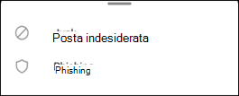
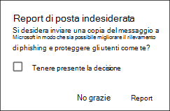

# Segnalare posta indesiderata e phishing in Outlook per iOS e Android in Exchange Online

[!INCLUDE [Microsoft 365 Defender rebranding](../includes/microsoft-defender-for-office.md)]

**Si applica a**
- [Exchange Online Protection](https://go.microsoft.com/fwlink/?linkid=2148611)
- [Microsoft Defender per Office 365 piano 1 e piano 2](https://go.microsoft.com/fwlink/?linkid=2148715)
- [Microsoft 365 Defender](https://go.microsoft.com/fwlink/?linkid=2118804)

Nelle organizzazioni di Microsoft 365 con cassette postali in Exchange Online o nelle cassette postali locali che utilizzano l'autenticazione moderna [ibrida,](https://docs.microsoft.com/microsoft-365/enterprise/hybrid-modern-auth-overview)è possibile utilizzare le opzioni di creazione di report predefinite in Outlook per iOS e Android per inviare falsi positivi (buona posta elettronica contrassegnata come posta indesiderata), falsi negativi (posta elettronica non consentita) e messaggi di phishing a Exchange Online Protection (EOP).

## Cosa è necessario sapere prima di iniziare

- Se si è un amministratore di un'organizzazione con cassette postali di Exchange Online, si consiglia di utilizzare il portale Invii nel Centro sicurezza & conformità. Per ulteriori informazioni, vedere [Use Admin Submission to submit suspected spam, phish, URLs, and files to Microsoft.](admin-submission.md)

- È possibile configurare i messaggi segnalati da copiare o reindirizzare a una cassetta postale specificata. Per altre informazioni, vedi [Criteri per gli invii degli utenti.](user-submission.md)

- Per ulteriori informazioni sulla segnalazione dei messaggi a Microsoft, vedere [Segnalare messaggi e file a Microsoft.](report-junk-email-messages-to-microsoft.md)

  > [!NOTE]
  > Se la segnalazione della posta indesiderata è disabilitata per Outlook nei criteri di invio degli utenti, i messaggi di posta indesiderata o di phishing verranno spostati nella cartella Posta indesiderata e non segnalati all'amministratore o a Microsoft.

## Segnalare messaggi di posta indesiderata e phishing in Outlook per iOS e Android

Per i messaggi nella Cartella Posta in arrivo o in qualsiasi altra cartella di posta ad eccezione della posta indesiderata, utilizzare la procedura seguente per segnalare i messaggi di posta indesiderata e phishing per iOS e Android:

1. Selezionare uno o più messaggi.
2. Nell'angolo superiore destro tocca i tre punti verticali. Verrà visualizzato il menu azioni.

   

3. Toccare **Segnala posta** indesiderata e quindi selezionare Posta **indesiderata** **o Phishing.**

   

4. Nella finestra di dialogo visualizzata, è possibile scegliere **Segnala** o **No Grazie.** Se si **seleziona No Grazie,** se il messaggio viene toccato viene spostato nella cartella Posta indesiderata, se si tocca **Phishing,** il messaggio viene spostato nella cartella Posta eliminata.  Selezionare **Segnala** anche per inviare una copia del messaggio a Microsoft.

   

Se cambi idea, seleziona **Annulla** nella notifica di tipo avviso popup visualizzata. Il messaggio rimane nella cartella Posta in arrivo.

## Segnalare i messaggi non indesiderati dalla cartella Posta indesiderata in Outlook per iOS e Android

Nella cartella Posta indesiderata, utilizzare la procedura seguente per segnalare falsi positivi della posta indesiderata:

1. Selezionare uno o più messaggi.
2. Nell'angolo superiore destro tocca i tre punti verticali. Verrà visualizzato il menu azioni.

   

3. Toccare **Non indesiderato**.

Viene visualizzata una notifica di tipo avviso popup che indica che il messaggio di posta elettronica è stato spostato nella posta in arrivo. Se cambi idea, seleziona Annulla **nella** notifica di tipo avviso popup. Il messaggio di posta elettronica rimane nella cartella Posta indesiderata.
