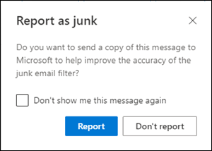
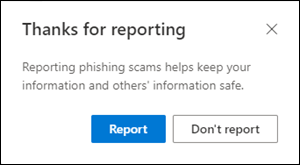
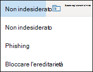

# <a name="report-junk-and-phishing-email-in-outlook-on-the-web-in-office-365"></a><span data-ttu-id="aa91b-103">Segnalare messaggi di posta indesiderata e di phishing in Outlook sul Web in Office 365</span><span class="sxs-lookup"><span data-stu-id="aa91b-103">Report junk and phishing email in Outlook on the web in Office 365</span></span>

<span data-ttu-id="aa91b-104">Se si è un cliente di Office 365 con cassette postali di Exchange Online, è possibile utilizzare le opzioni predefinite per la creazione di report in Outlook sul Web (in precedenza noto come Outlook Web App) per inviare falsi positivi (messaggi di posta elettronica segnalati come posta indesiderata), falsi negativi (messaggi di posta elettronica non consentiti) e messaggi di phishing a Exchange Online Protection (EOP).</span><span class="sxs-lookup"><span data-stu-id="aa91b-104">If you're an Office 365 customer with Exchange Online mailboxes, you can use the built-in reporting options in Outlook on the web (formerly known as Outlook Web App) to submit false positives (good email marked as spam), false negatives (bad email allowed) and phishing messages to Exchange Online Protection (EOP).</span></span>

## <a name="what-do-you-need-to-know-before-you-begin"></a><span data-ttu-id="aa91b-105">Che cosa è necessario sapere prima di iniziare</span><span class="sxs-lookup"><span data-stu-id="aa91b-105">What do you need to know before you begin?</span></span>

- <span data-ttu-id="aa91b-106">Se si è un amministratore di un'organizzazione di Office 365 con cassette postali di Exchange Online, si consiglia di utilizzare il portale di invii nel centro sicurezza & conformità di Office 365.</span><span class="sxs-lookup"><span data-stu-id="aa91b-106">If you're an admin in an Office 365 organization with Exchange Online mailboxes, we recommend that you use the Submissions portal in the Office 365 Security & Compliance Center.</span></span> <span data-ttu-id="aa91b-107">Per ulteriori informazioni, vedere [utilizzare l'invio di amministratore per inviare messaggi di posta indesiderata, phishing, URL e file a Microsoft](admin-submission.md).</span><span class="sxs-lookup"><span data-stu-id="aa91b-107">For more information, see [Use Admin Submission to submit suspected spam, phish, URLs, and files to Microsoft](admin-submission.md).</span></span>

- <span data-ttu-id="aa91b-108">Gli amministratori possono disabilitare o abilitare la possibilità per gli utenti di segnalare i messaggi a Microsoft in Outlook sul Web.</span><span class="sxs-lookup"><span data-stu-id="aa91b-108">Admins can disable or enable the ability for users to report messages to Microsoft in Outlook on the web.</span></span> <span data-ttu-id="aa91b-109">Per informazioni dettagliate, vedere la sezione [disabilitare o abilitare la creazione di report di posta indesiderata in Outlook sul Web](#disable-or-enable-junk-email-reporting-in-outlook-on-the-web) più avanti in questo argomento.</span><span class="sxs-lookup"><span data-stu-id="aa91b-109">For details, see the [Disable or enable junk email reporting in Outlook on the web](#disable-or-enable-junk-email-reporting-in-outlook-on-the-web) section later in this topic.</span></span>

- <span data-ttu-id="aa91b-110">Per ulteriori informazioni sul reporting dei messaggi a Microsoft, vedere [segnalare i messaggi e i file a Microsoft in Office 365](report-junk-email-messages-to-microsoft.md).</span><span class="sxs-lookup"><span data-stu-id="aa91b-110">For more information about reporting messages to Microsoft, see [Report messages and files to Microsoft in Office 365](report-junk-email-messages-to-microsoft.md).</span></span>

## <a name="report-spam-and-phishing-messages-in-outlook-on-the-web"></a><span data-ttu-id="aa91b-111">Segnalare messaggi di posta indesiderata e di phishing in Outlook sul Web</span><span class="sxs-lookup"><span data-stu-id="aa91b-111">Report spam and phishing messages in Outlook on the web</span></span>

1. <span data-ttu-id="aa91b-112">Per i messaggi nella cartella posta in arrivo o in altre cartelle di posta elettronica, ad eccezione della posta indesiderata, utilizzare uno dei metodi seguenti per segnalare messaggi di posta indesiderata</span><span class="sxs-lookup"><span data-stu-id="aa91b-112">For messages in the Inbox or any other email folder except Junk Email, use either of the following methods to report spam and phishing messages:</span></span>

   - <span data-ttu-id="aa91b-113">Selezionare il messaggio, fare clic su **posta indesiderata** sulla barra degli strumenti, quindi selezionare **posta indesiderata** o **phishing**.</span><span class="sxs-lookup"><span data-stu-id="aa91b-113">Select the message, click **Junk** on the toolbar, and then select **Junk** or **Phishing**.</span></span>

     

   - <span data-ttu-id="aa91b-115">Selezionare uno o più messaggi, fare clic con il pulsante destro del mouse, quindi selezionare **Segna come posta indesiderata**.</span><span class="sxs-lookup"><span data-stu-id="aa91b-115">Select one or more messages, right-click, and then select **Mark as junk**.</span></span>

2. <span data-ttu-id="aa91b-116">Nella finestra di dialogo visualizzata fare clic su **segnala**.</span><span class="sxs-lookup"><span data-stu-id="aa91b-116">In the dialog that appears, click **Report**.</span></span> <span data-ttu-id="aa91b-117">Se si cambia idea, fare clic su **non segnalare**.</span><span class="sxs-lookup"><span data-stu-id="aa91b-117">If you change your mind, click **Don't Report**.</span></span>

   

   

3. <span data-ttu-id="aa91b-120">I messaggi selezionati verranno inviati a Microsoft per l'analisi.</span><span class="sxs-lookup"><span data-stu-id="aa91b-120">The selected messages will be sent to Microsoft for analysis.</span></span> <span data-ttu-id="aa91b-121">Per verificare che i messaggi siano stati inviati, aprire la cartella **Posta inviata** per visualizzare i messaggi inviati.</span><span class="sxs-lookup"><span data-stu-id="aa91b-121">To confirm that the messages have been submitted, open your **Sent Items** folder to view the submitted messages.</span></span>

## <a name="report-non-spam-and-phishing-messages-from-the-junk-email-folder-in-outlook-on-the-web"></a><span data-ttu-id="aa91b-122">Segnalare messaggi non di posta indesiderata e di phishing dalla cartella posta indesiderata in Outlook sul Web</span><span class="sxs-lookup"><span data-stu-id="aa91b-122">Report non-spam and phishing messages from the Junk Email folder in Outlook on the web</span></span>

1. <span data-ttu-id="aa91b-123">Nella cartella posta indesiderata, utilizzare uno dei metodi seguenti per segnalare la posta indesiderata o i messaggi di phishing:</span><span class="sxs-lookup"><span data-stu-id="aa91b-123">In the Junk Email folder, use either of the following methods to report spam false positives or phishing messages:</span></span>

   - <span data-ttu-id="aa91b-124">Selezionare il messaggio, fare clic su **non indesiderato** sulla barra degli strumenti, quindi selezionare **non indesiderato** o **phishing**.</span><span class="sxs-lookup"><span data-stu-id="aa91b-124">Select the message, click **Not Junk** on the toolbar, and then select **Not Junk** or **Phishing**.</span></span>

     

   - <span data-ttu-id="aa91b-126">Selezionare uno o più messaggi, fare clic con il pulsante destro del mouse, quindi selezionare **Segna come non indesiderato**.</span><span class="sxs-lookup"><span data-stu-id="aa91b-126">Select one or more messages, right-click, and then select **Mark as not junk**.</span></span>

2. <span data-ttu-id="aa91b-127">Nella finestra di dialogo che viene visualizzata, leggere le informazioni e fare clic su **segnala**.</span><span class="sxs-lookup"><span data-stu-id="aa91b-127">In the dialog that appears, read the information and click **Report**.</span></span> <span data-ttu-id="aa91b-128">Se si cambia idea, fare clic su **non segnalare**.</span><span class="sxs-lookup"><span data-stu-id="aa91b-128">If you change your mind, click **Don't Report**.</span></span>

   

   

3. <span data-ttu-id="aa91b-131">I messaggi selezionati verranno inviati a Microsoft per l'analisi.</span><span class="sxs-lookup"><span data-stu-id="aa91b-131">The selected messages will be sent to Microsoft for analysis.</span></span> <span data-ttu-id="aa91b-132">Per verificare che i messaggi siano stati inviati, aprire la cartella **Posta inviata** per visualizzare i messaggi inviati.</span><span class="sxs-lookup"><span data-stu-id="aa91b-132">To confirm that the messages have been submitted, open your **Sent Items** folder to view the submitted messages.</span></span>

## <a name="disable-or-enable-junk-email-reporting-in-outlook-on-the-web"></a><span data-ttu-id="aa91b-133">Disabilitare o abilitare la segnalazione della posta indesiderata in Outlook sul Web</span><span class="sxs-lookup"><span data-stu-id="aa91b-133">Disable or enable junk email reporting in Outlook on the web</span></span>

<span data-ttu-id="aa91b-134">Per impostazione predefinita, gli utenti possono segnalare messaggi di posta indesiderata falsi positivi, falsi negativi e phishing a Microsoft per l'analisi in Outlook sul Web.</span><span class="sxs-lookup"><span data-stu-id="aa91b-134">By default, users can report spam false positives, false negatives, and phishing messages to Microsoft for analysis in Outlook on the web.</span></span> <span data-ttu-id="aa91b-135">Gli amministratori possono utilizzare i criteri cassetta postale di Outlook sul Web in Exchange Online per disabilitare o abilitare questa funzionalità, ma solo in PowerShell di Exchange Online.</span><span class="sxs-lookup"><span data-stu-id="aa91b-135">Admins can use Outlook on the web mailbox policies in Exchange Online to disable or enable this ability, but only in Exchange Online PowerShell.</span></span>

- <span data-ttu-id="aa91b-136">Per informazioni su come connettersi a PowerShell per Exchange Online, vedere [Connettersi a PowerShell per Exchange Online](https://docs.microsoft.com/powershell/exchange/exchange-online/connect-to-exchange-online-powershell/connect-to-exchange-online-powershell).</span><span class="sxs-lookup"><span data-stu-id="aa91b-136">To connect to Exchange Online PowerShell, see [Connect to Exchange Online PowerShell](https://docs.microsoft.com/powershell/exchange/exchange-online/connect-to-exchange-online-powershell/connect-to-exchange-online-powershell).</span></span>

- <span data-ttu-id="aa91b-137">È necessario disporre delle autorizzazioni prima di poter eseguire queste procedure.</span><span class="sxs-lookup"><span data-stu-id="aa91b-137">You need to be assigned permissions before you can perform these procedures.</span></span> <span data-ttu-id="aa91b-138">In particolare, è necessario che i **criteri destinatario** o i **destinatari di posta elettronica** in Exchange Online, assegnati ai gruppi di ruoli Gestione **organizzazione** **e destinatari** per impostazione predefinita.</span><span class="sxs-lookup"><span data-stu-id="aa91b-138">Specifically you need the **Recipient Policies** or **Mail Recipients** roles in Exchange Online, which are assigned to the **Organization Management** and **Recipient Management** role groups by default.</span></span> <span data-ttu-id="aa91b-139">Per ulteriori informazioni sui gruppi di ruoli in Exchange Online, vedere [Modify role groups in Exchange Online](https://docs.microsoft.com/Exchange/permissions-exo/role-groups#modify-role-groups).</span><span class="sxs-lookup"><span data-stu-id="aa91b-139">For more information about role groups in Exchange Online, see [Modify role groups in Exchange Online](https://docs.microsoft.com/Exchange/permissions-exo/role-groups#modify-role-groups).</span></span>

- <span data-ttu-id="aa91b-140">Ogni organizzazione ha un criterio predefinito denominato OwaMailboxPolicy-Default, ma è possibile creare criteri personalizzati.</span><span class="sxs-lookup"><span data-stu-id="aa91b-140">Every organization has a default policy named OwaMailboxPolicy-Default, but you can create custom policies.</span></span> <span data-ttu-id="aa91b-141">I criteri personalizzati vengono applicati agli utenti con ambito prima del criterio predefinito.</span><span class="sxs-lookup"><span data-stu-id="aa91b-141">Custom policies are applied to scoped users before the default policy.</span></span> <span data-ttu-id="aa91b-142">Per ulteriori informazioni sui criteri cassetta postale di Outlook sul Web, vedere [criteri cassetta postale di Outlook sul Web in Exchange Online](https://docs.microsoft.com/Exchange/clients-and-mobile-in-exchange-online/outlook-on-the-web/outlook-web-app-mailbox-policies).</span><span class="sxs-lookup"><span data-stu-id="aa91b-142">For more information about Outlook on the web mailbox policies, see [Outlook on the web mailbox policies in Exchange Online](https://docs.microsoft.com/Exchange/clients-and-mobile-in-exchange-online/outlook-on-the-web/outlook-web-app-mailbox-policies).</span></span>

1. <span data-ttu-id="aa91b-143">Per trovare i criteri cassetta postale di Outlook sul Web e lo stato della segnalazione della posta indesiderata, utilizzare il seguente comando:</span><span class="sxs-lookup"><span data-stu-id="aa91b-143">To find your existing Outlook on the web mailbox policies and the status of junk email reporting, run the following command:</span></span>

   ```powershell
   Get-OwaMailboxPolicy | Format-Table Name,ReportJunkEmailEnabled
   ```

2. <span data-ttu-id="aa91b-144">Per disabilitare o abilitare la segnalazione della posta indesiderata in Outlook sul Web, utilizzare la sintassi seguente:</span><span class="sxs-lookup"><span data-stu-id="aa91b-144">To disable or enable junk email reporting in Outlook on the web, use the following syntax:</span></span>

   ```powershell
   Set-OwaMailboxPolicy -Identity "<OWAMailboxPolicyName>" -ReportJunkEmailEnabled <$true | $false>
   ```

   <span data-ttu-id="aa91b-145">In questo esempio viene disabilitata la segnalazione della posta indesiderata nel criterio predefinito.</span><span class="sxs-lookup"><span data-stu-id="aa91b-145">This example disables junk email reporting in the default policy.</span></span>

   ```powershell
   Set-OwaMailboxPolicy -Identity "OwaMailboxPolicy-Default" -ReportJunkEmailEnabled $false
   ```

   <span data-ttu-id="aa91b-146">In questo esempio viene attivata la segnalazione della posta indesiderata nel criterio personalizzato denominato contoso managers.</span><span class="sxs-lookup"><span data-stu-id="aa91b-146">This example enabled junk email reporting in the custom policy named Contoso Managers.</span></span>

   ```powershell
   Set-OwaMailboxPolicy -Identity "Contoso Managers" -ReportJunkEmailEnabled $true
   ```

<span data-ttu-id="aa91b-147">Per informazioni dettagliate sulla sintassi e sui parametri, vedere [Get-OwaMailboxPolicy](https://docs.microsoft.com/powershell/module/exchange/client-access/get-owamailboxpolicy) e [Set-OwaMailboxPolicy](https://docs.microsoft.com/powershell/module/exchange/client-access/set-owamailboxpolicy).</span><span class="sxs-lookup"><span data-stu-id="aa91b-147">For detailed syntax and parameter information, see [Get-OwaMailboxPolicy](https://docs.microsoft.com/powershell/module/exchange/client-access/get-owamailboxpolicy) and [Set-OwaMailboxPolicy](https://docs.microsoft.com/powershell/module/exchange/client-access/set-owamailboxpolicy).</span></span>

### <a name="how-do-you-know-this-worked"></a><span data-ttu-id="aa91b-148">Come verificare se l'operazione ha avuto esito positivo</span><span class="sxs-lookup"><span data-stu-id="aa91b-148">How do you know this worked?</span></span>

<span data-ttu-id="aa91b-149">Per verificare la corretta abilitazione o disabilitazione della creazione di report di posta indesiderata in Outlook sul Web, eseguire una delle operazioni seguenti:</span><span class="sxs-lookup"><span data-stu-id="aa91b-149">To verify that you've successfully enabled or disabled junk email reporting in Outlook on the web, use any of the following steps:</span></span>

- <span data-ttu-id="aa91b-150">In PowerShell di Exchange Online, eseguire il comando riportato di seguito e verificare il valore della proprietà **ReportJunkEmailEnabled** :</span><span class="sxs-lookup"><span data-stu-id="aa91b-150">In Exchange Online PowerShell, run the following command and verify the **ReportJunkEmailEnabled** property value:</span></span>

  ```powershell
  Get-OwaMailboxPolicy | Format-Table Name,ReportJunkEmailEnabled
  ```

- <span data-ttu-id="aa91b-151">Aprire una cassetta postale di un utente in questione in Outlook sul Web e verificare le opzioni per segnalare la posta indesiderata, non la posta indesiderata e i messaggi di phishing sono disponibili o non disponibili.</span><span class="sxs-lookup"><span data-stu-id="aa91b-151">Open an affected user's mailbox in Outlook on the web, and verify the options to report junk, not junk, and phishing messages are available or not available.</span></span> <span data-ttu-id="aa91b-152">Si noti che l'utente può ancora contrassegnare i messaggi come posta indesiderata, phishing e non indesiderata, ma l'utente non può segnalarli a Microsoft.</span><span class="sxs-lookup"><span data-stu-id="aa91b-152">Note that the user can still mark messages as junk, phishing, and not junk, but the user can't report them to Microsoft.</span></span>
