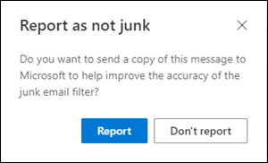

# <a name="report-junk-and-phishing-email-in-outlook-on-the-web-in-exchange-online"></a>Segnalare posta indesiderata e phishing in Outlook sul Web in Exchange Online

[!INCLUDE [Microsoft 365 Defender rebranding](../includes/microsoft-defender-for-office.md)]

**Si applica a**
- [Exchange Online Protection](https://go.microsoft.com/fwlink/?linkid=2148611)
- [Microsoft Defender per Office 365 piano 1 e piano 2](https://go.microsoft.com/fwlink/?linkid=2148715)
- [Microsoft 365 Defender](https://go.microsoft.com/fwlink/?linkid=2118804)

Nelle organizzazioni di Microsoft 365 con cassette postali in Exchange Online, è possibile utilizzare le opzioni di creazione di report predefinite in Outlook sul Web (in precedenza noto come Outlook Web App) per inviare falsi positivi (buona posta elettronica contrassegnata come posta indesiderata), falsi negativi (posta elettronica non consentita) e messaggi di phishing a Exchange Online Protection (EOP).

## <a name="what-do-you-need-to-know-before-you-begin"></a>Che cosa è necessario sapere prima di iniziare

- Se si è un amministratore di un'organizzazione con cassette postali di Exchange Online, si consiglia di utilizzare il portale Invii nel Centro sicurezza & conformità. Per ulteriori informazioni, vedere [Use Admin Submission to submit suspected spam, phish, URLs, and files to Microsoft.](admin-submission.md)

- Gli amministratori possono disabilitare o abilitare la possibilità per gli utenti di segnalare messaggi a Microsoft in Outlook sul Web. Per informazioni dettagliate, vedere la sezione Disabilitare o abilitare [la segnalazione della](#disable-or-enable-junk-email-reporting-in-outlook-on-the-web) posta indesiderata in Outlook sul Web più avanti in questo articolo.

- È possibile configurare i messaggi segnalati da copiare o reindirizzare a una cassetta postale specificata. Per altre informazioni, vedi [Criteri di invio degli utenti.](user-submission.md)

- Per ulteriori informazioni sulla segnalazione dei messaggi a Microsoft, vedere [Segnalare messaggi e file a Microsoft.](report-junk-email-messages-to-microsoft.md)

## <a name="report-spam-and-phishing-messages-in-outlook-on-the-web"></a>Segnalare messaggi di posta indesiderata e di phishing in Outlook sul Web

1. Per i messaggi nella Cartella Posta in arrivo o in qualsiasi altra cartella di posta elettronica ad eccezione della posta indesiderata, utilizzare uno dei metodi seguenti per segnalare messaggi di posta indesiderata e di phishing:

   - Selezionare il messaggio, fare clic **su Posta** indesiderata sulla barra degli strumenti e quindi selezionare **Posta indesiderata** o **Phishing.**

     

   - Selezionare uno o più messaggi, fare clic con il pulsante destro del mouse e scegliere **Segna come posta indesiderata.**

2. Nella finestra di dialogo visualizzata fare clic su **Report.** Se si cambia idea, fare clic **su Non segnalare.**

   |Posta indesiderata|Phishing|
   |:---:|:---:|
   |||

3. I messaggi selezionati verranno inviati a Microsoft per l'analisi. Per verificare che i messaggi siano stati inviati, aprire la cartella **Posta inviata** per visualizzare i messaggi inviati.

## <a name="report-non-spam-and-phishing-messages-from-the-junk-email-folder-in-outlook-on-the-web"></a>Segnalare messaggi non di posta indesiderata e di phishing dalla cartella Posta indesiderata in Outlook sul Web

1. Nella cartella Posta indesiderata, utilizzare uno dei metodi seguenti per segnalare falsi positivi o messaggi di phishing della posta indesiderata:

   - Selezionare il messaggio, fare **clic su Non indesiderato** sulla barra degli strumenti e quindi selezionare **Non indesiderato** o **Phishing.**

     

   - Selezionare uno o più messaggi, fare clic con il pulsante destro del mouse e scegliere **Segna come non indesiderato.**

2. Nella finestra di dialogo visualizzata leggere le informazioni e fare clic su **Report.** Se si cambia idea, fare clic **su Non segnalare.**

   |Non indesiderato|Phishing|
   |:---:|:---:|
   |||

3. I messaggi selezionati verranno inviati a Microsoft per l'analisi. Per verificare che i messaggi siano stati inviati, aprire la cartella **Posta inviata** per visualizzare i messaggi inviati.

## <a name="disable-or-enable-junk-email-reporting-in-outlook-on-the-web"></a>Disabilitare o abilitare la segnalazione della posta indesiderata in Outlook sul Web

Per impostazione predefinita, gli utenti possono segnalare falsi positivi, falsi negativi e messaggi di phishing a Microsoft per l'analisi in Outlook sul Web. Gli amministratori possono configurare i criteri cassetta postale di Outlook sul Web in PowerShell di Exchange Online per impedire agli utenti di segnalare falsi positivi e falsi negativi della posta indesiderata a Microsoft. Non è possibile disabilitare la possibilità per gli utenti di segnalare messaggi di phishing a Microsoft.

### <a name="what-do-you-need-to-know-before-you-begin"></a>Che cosa è necessario sapere prima di iniziare

- Per informazioni su come connettersi a PowerShell per Exchange Online, vedere [Connettersi a PowerShell per Exchange Online](https://docs.microsoft.com/powershell/exchange/connect-to-exchange-online-powershell).

- Per eseguire le procedure descritte in questo articolo, è necessario disporre delle autorizzazioni in Exchange Online. In particolare, sono necessari i ruoli **Criteri** destinatario o Destinatari **di** posta, assegnati ai gruppi di ruoli Gestione organizzazione e **Gestione** destinatari per impostazione predefinita.  Per ulteriori informazioni sui gruppi di ruoli in Exchange Online, vedere [Autorizzazioni in Exchange Online](https://docs.microsoft.com/exchange/permissions-exo/permissions-exo) e Modificare i gruppi di ruoli in Exchange [Online.](https://docs.microsoft.com/Exchange/permissions-exo/role-groups#modify-role-groups)

- Ogni organizzazione dispone di un criterio predefinito denominato OwaMailboxPolicy-Default, ma è possibile creare criteri personalizzati. I criteri personalizzati vengono applicati agli utenti con ambito prima del criterio predefinito. Per ulteriori informazioni sui criteri cassetta postale di Outlook sul Web, vedere Criteri cassetta postale di Outlook sul [Web in Exchange Online.](https://docs.microsoft.com/Exchange/clients-and-mobile-in-exchange-online/outlook-on-the-web/outlook-web-app-mailbox-policies)

- La disabilitazione della segnalazione della posta indesiderata non rimuove la possibilità di contrassegnare un messaggio come indesiderato o non indesiderato in Outlook sul Web. Se si seleziona un messaggio  nella cartella Posta indesiderata e si fa clic su Non indesiderato, il messaggio viene comunque spostato \>  di nuovo nella cartella Posta in arrivo. Se si seleziona un messaggio  in qualsiasi altra cartella di posta elettronica e si fa clic su Posta indesiderata, il messaggio viene comunque spostato \>  nella cartella Posta indesiderata. Ciò che non è più disponibile è l'opzione per segnalare il messaggio a Microsoft.

### <a name="use-exchange-online-powershell-to-disable-or-enable-junk-email-reporting-in-outlook-on-the-web"></a>Utilizzare PowerShell di Exchange Online per disabilitare o abilitare la segnalazione della posta indesiderata in Outlook sul Web

1. Per trovare i criteri cassetta postale di Outlook sul Web esistenti e lo stato della segnalazione della posta indesiderata, eseguire il seguente comando:

   ```powershell
   Get-OwaMailboxPolicy | Format-Table Name,ReportJunkEmailEnabled
   ```

2. Per disabilitare o abilitare la segnalazione della posta indesiderata in Outlook sul Web, utilizzare la sintassi seguente:

   ```powershell
   Set-OwaMailboxPolicy -Identity "<OWAMailboxPolicyName>" -ReportJunkEmailEnabled <$true | $false>
   ```

   In questo esempio viene disabilitata la segnalazione della posta indesiderata nel criterio predefinito.

   ```powershell
   Set-OwaMailboxPolicy -Identity "OwaMailboxPolicy-Default" -ReportJunkEmailEnabled $false
   ```

   In questo esempio viene abilitata la segnalazione della posta indesiderata nel criterio personalizzato denominato Contoso Managers.

   ```powershell
   Set-OwaMailboxPolicy -Identity "Contoso Managers" -ReportJunkEmailEnabled $true
   ```

Per informazioni dettagliate sulla sintassi e sui parametri, vedere [Get-OwaMailboxPolicy](https://docs.microsoft.com/powershell/module/exchange/get-owamailboxpolicy) e [Set-OwaMailboxPolicy.](https://docs.microsoft.com/powershell/module/exchange/set-owamailboxpolicy)

### <a name="how-do-you-know-this-worked"></a>Come verificare se l'operazione ha avuto esito positivo

Per verificare che la segnalazione della posta indesiderata in Outlook sul Web sia stata abilitata o disabilitata correttamente, eseguire una delle operazioni seguenti:

- In PowerShell di Exchange Online, eseguire il comando seguente e verificare il valore della proprietà **ReportJunkEmailEnabled:**

  ```powershell
  Get-OwaMailboxPolicy | Format-Table Name,ReportJunkEmailEnabled
  ```

- Aprire la cassetta postale di un utente interessato in Outlook sul  Web, selezionare un messaggio nella Posta in arrivo, fare clic su Posta indesiderata e verificare che la richiesta di segnalare il messaggio a Microsoft sia o non sia \>  visualizzata.<sup>\*</sup>

- Aprire la cassetta postale di un utente interessato in Outlook sul Web, selezionare un messaggio nella cartella Posta indesiderata, fare clic su Posta indesiderata e verificare che la richiesta di segnalare il messaggio a Microsoft sia o non sia  \>  visualizzata.<sup>\*</sup>

<sup>\*</sup> Gli utenti possono nascondere la richiesta di segnalare il messaggio pur segnalando il messaggio. Per controllare questa impostazione in Outlook sul Web:

1. Fare **clic su Impostazioni** Icona Impostazioni outlook sul Web Visualizza tutte le impostazioni di  \> **Outlook** Posta \> **indesiderata.**
2. Nella sezione **Report** verificare il valore: **Chiedi conferma prima di inviare un report.**

   
