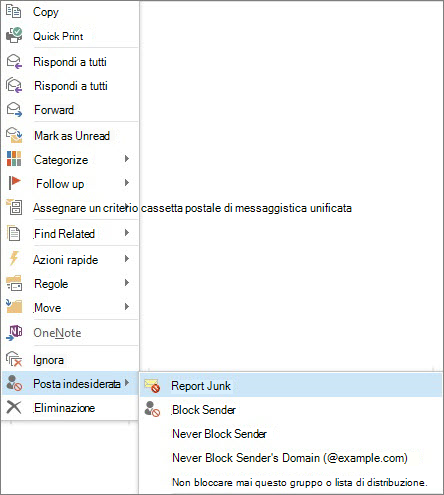

# Segnalazione di messaggi di posta elettronica indesiderata a Microsoft

Il componente aggiuntivo per la segnalazione della posta indesiderata di Microsoft per Microsoft Office Outlook offre all'utente diversi modi per segnalare messaggi indesiderati:

- Dalla barra multifunzione di Outlook

- Dalla casella di Posta in arrivo

- Da un messaggio di posta elettronica aperto

Il componente aggiuntivo per la segnalazione della posta indesiderata consente di inviare report al servizio Microsoft Exchange Online Protection (EOP). Se la cassetta postale non è protetta dal servizio, la procedura di invio dei report relativi alla posta indesiderata non avrà effetti sui filtri della posta indesiderata. Gli amministratori possono ottenere ulteriori informazioni sulle impostazioni di posta indesiderata che si applicano a un'intera organizzazione in [creare elenchi di mittenti attendibili in office 365](create-safe-sender-lists-in-office-365.md) e [creare elenchi di mittenti bloccati in Office 365](create-block-sender-lists-in-office-365.md). Questi articoli sono utili se si svolge il ruolo di amministratore e si desidera impedire la visualizzazione di falsi negativi o di falsi positivi.

> [!TIP]
> È inoltre possibile inviare messaggi di posta indesiderata direttamente a Microsoft utilizzando l'indirizzo di posta elettronica [Junk@office365.microsoft.com](mailto:junk@office365.microsoft.com) e i messaggi falsi positivi (non di posta indesiderata) utilizzando l'indirizzo di posta elettronica di [not_junk@office365.microsoft.com](mailto:not_junk@office365.microsoft.com) . Per ulteriori informazioni, vedere [Invio di messaggi di posta indesiderata e non e tentativi di phishing a Microsoft per l'analisi](submit-spam-non-spam-and-phishing-scam-messages-to-microsoft-for-analysis.md).

### Per segnalare messaggi di posta indesiderata da Outlook

[Utilizzare il componente aggiuntivo per i messaggi di report](https://support.office.com/article/b5caa9f1-cdf3-4443-af8c-ff724ea719d2)

### Per segnalare messaggi di posta indesiderata dalla cartella Posta in arrivo

1. Fare clic con il pulsante destro del mouse sul messaggio o sui messaggi da segnalare come indesiderati.

2. Selezionare **Indesiderato** e fare clic sul pulsante **Segnala messaggi indesiderati**.
    

3. Viene aperta la finestra di dialogo **Componente aggiuntivo per la segnalazione della posta indesiderata Microsoft**. Per confermare la scelta di segnalare come indesiderati i messaggi selezionati, fare clic su **Sì**.
    

    > [!NOTE]
    > Se non si desidera ricevere questo messaggio di conferma quando si inviano messaggi indesiderati, selezionare **Non visualizzare più questo messaggio**.

I messaggi selezionati saranno inviati a Microsoft per l'analisi e spostati nella cartella Posta indesiderata. Per verificare che i messaggi siano stati inviati, aprire la cartella **Posta inviata** per visualizzare i messaggi inviati.

### Per segnalare un messaggio di posta indesiderata dall'interno di un messaggio aperto

1. Da un messaggio aperto, fare clic sul pulsante **Segnala messaggi indesiderati** sulla barra multifunzione del messaggio. Ad esempio **, fare clic** \> **su** 

2. Viene aperta la finestra di dialogo **Componente aggiuntivo per la segnalazione della posta indesiderata Microsoft**. Per confermare la scelta di segnalare come indesiderato il messaggio selezionato, fare clic su **Sì**.
    

    > [!NOTE]
    > Se non si desidera ricevere questo messaggio di conferma quando si inviano messaggi indesiderati, selezionare **Non visualizzare più questo messaggio**.

Il messaggio selezionato sarà inviato a Microsoft per l'analisi e spostato nella cartella Posta indesiderata. Per verificare che il messaggio sia stato inviato, aprire la cartella **Posta inviata** per visualizzare il messaggio inviato.
