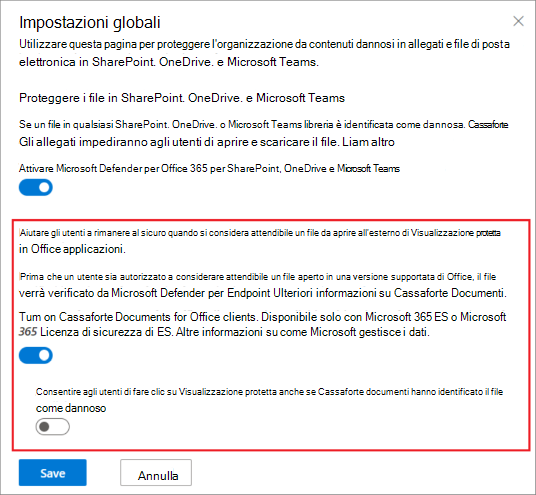

# <a name="safe-documents-in-microsoft-365-e5"></a><span data-ttu-id="467d8-103">Sicurezza documenti in Microsoft 365 E5</span><span class="sxs-lookup"><span data-stu-id="467d8-103">Safe Documents in Microsoft 365 E5</span></span>

[!INCLUDE [Microsoft 365 Defender rebranding](../includes/microsoft-defender-for-office.md)]

<span data-ttu-id="467d8-104">**Si applica a**</span><span class="sxs-lookup"><span data-stu-id="467d8-104">**Applies to**</span></span>
- [<span data-ttu-id="467d8-105">Microsoft 365 Defender</span><span class="sxs-lookup"><span data-stu-id="467d8-105">Microsoft 365 Defender</span></span>](../defender/microsoft-365-defender.md)

<span data-ttu-id="467d8-106">Cassaforte Documenti è una funzionalità di Microsoft 365 E5 o Microsoft 365 E5 Security che usa [Microsoft Defender for Endpoint](/windows/security/threat-protection/microsoft-defender-atp/microsoft-defender-advanced-threat-protection) per analizzare documenti e file aperti in [Visualizzazione](https://support.microsoft.com/office/d6f09ac7-e6b9-4495-8e43-2bbcdbcb6653) protetta o Application Guard [per Office](https://support.microsoft.com/topic/9e0fb9c2-ffad-43bf-8ba3-78f785fdba46).</span><span class="sxs-lookup"><span data-stu-id="467d8-106">Safe Documents is a feature in Microsoft 365 E5 or Microsoft 365 E5 Security that uses [Microsoft Defender for Endpoint](/windows/security/threat-protection/microsoft-defender-atp/microsoft-defender-advanced-threat-protection) to scan documents and files that are opened in [Protected View](https://support.microsoft.com/office/d6f09ac7-e6b9-4495-8e43-2bbcdbcb6653) or [Application Guard for Office](https://support.microsoft.com/topic/9e0fb9c2-ffad-43bf-8ba3-78f785fdba46).</span></span>

## <a name="what-do-you-need-to-know-before-you-begin"></a><span data-ttu-id="467d8-107">Che cosa è necessario sapere prima di iniziare</span><span class="sxs-lookup"><span data-stu-id="467d8-107">What do you need to know before you begin?</span></span>

- <span data-ttu-id="467d8-108">Cassaforte I documenti sono disponibili solo per gli utenti *con Microsoft 365 E5* o *Microsoft 365 E5 Security* licenze.</span><span class="sxs-lookup"><span data-stu-id="467d8-108">Safe Documents is available only to users with *Microsoft 365 E5* or *Microsoft 365 E5 Security* licenses.</span></span> <span data-ttu-id="467d8-109">Queste licenze non sono incluse in Microsoft Defender per Office 365 piani.</span><span class="sxs-lookup"><span data-stu-id="467d8-109">These licenses are not included in Microsoft Defender for Office 365 plans.</span></span>

- <span data-ttu-id="467d8-110">Cassaforte Documents is supported in Microsoft 365 Apps for enterprise (formerly known as Office 365 ProPlus) version 2004 or later.</span><span class="sxs-lookup"><span data-stu-id="467d8-110">Safe Documents is supported in Microsoft 365 Apps for enterprise (formerly known as Office 365 ProPlus) version 2004 or later.</span></span>

- <span data-ttu-id="467d8-111">Per aprire il portale di Microsoft 365 Defender, andare alla pagina <https://security.microsoft.com>.</span><span class="sxs-lookup"><span data-stu-id="467d8-111">You open the Microsoft 365 Defender portal at <https://security.microsoft.com>.</span></span> <span data-ttu-id="467d8-112">Per passare direttamente alla pagina **Cassaforte allegati,** utilizzare <https://security.microsoft.com/safeattachmentv2> .</span><span class="sxs-lookup"><span data-stu-id="467d8-112">To go directly to the **Safe Attachments** page, use <https://security.microsoft.com/safeattachmentv2>.</span></span>

- <span data-ttu-id="467d8-113">Per informazioni su come connettersi a PowerShell per Exchange Online, vedere [Connettersi a PowerShell per Exchange Online](/powershell/exchange/connect-to-exchange-online-powershell).</span><span class="sxs-lookup"><span data-stu-id="467d8-113">To connect to Exchange Online PowerShell, see [Connect to Exchange Online PowerShell](/powershell/exchange/connect-to-exchange-online-powershell).</span></span>

- <span data-ttu-id="467d8-114">Per eseguire le procedure descritte in **Exchange Online,** è necessario disporre delle autorizzazioni seguenti:</span><span class="sxs-lookup"><span data-stu-id="467d8-114">You need permissions in **Exchange Online** before you can do the procedures in this article:</span></span>
  - <span data-ttu-id="467d8-115">Per configurare Cassaforte impostazioni documenti, è necessario essere membri dei gruppi **di** ruoli Gestione organizzazione o Amministratore **sicurezza.**</span><span class="sxs-lookup"><span data-stu-id="467d8-115">To configure Safe Documents settings, you need to be a member of the **Organization Management** or **Security Administrator** role groups.</span></span>
  - <span data-ttu-id="467d8-116">Per l'accesso in sola Cassaforte impostazioni documenti, è necessario  essere membri dei gruppi di ruoli Lettore globale o Lettore **di** sicurezza.</span><span class="sxs-lookup"><span data-stu-id="467d8-116">For read-only access to Safe Documents settings, you need to be a member of the **Global Reader** or **Security Reader** role groups.</span></span>

  <span data-ttu-id="467d8-117">Per altre informazioni, vedere [Autorizzazioni in Exchange Online](/exchange/permissions-exo/permissions-exo).</span><span class="sxs-lookup"><span data-stu-id="467d8-117">For more information, see [Permissions in Exchange Online](/exchange/permissions-exo/permissions-exo).</span></span>

  > [!NOTE]
  >
  > - <span data-ttu-id="467d8-118">L'aggiunta di utenti al ruolo di Azure Active Directory corrispondente nell'interfaccia di amministrazione di Microsoft 365 fornisce agli utenti le autorizzazioni necessarie _e_ le autorizzazioni per altre funzionalità di Microsoft 365.</span><span class="sxs-lookup"><span data-stu-id="467d8-118">Adding users to the corresponding Azure Active Directory role in the Microsoft 365 admin center gives users the required permissions _and_ permissions for other features in Microsoft 365.</span></span> <span data-ttu-id="467d8-119">Per altre informazioni, vedere [Informazioni sui ruoli di amministratore](../../admin/add-users/about-admin-roles.md).</span><span class="sxs-lookup"><span data-stu-id="467d8-119">For more information, see [About admin roles](../../admin/add-users/about-admin-roles.md).</span></span>
  >
  > - <span data-ttu-id="467d8-120">Anche il gruppo di ruoli di **Gestione organizzazione sola visualizzazione** in [Exchange Online](/Exchange/permissions-exo/permissions-exo#role-groups) offre inoltre l'accesso di sola lettura a tale funzionalità.</span><span class="sxs-lookup"><span data-stu-id="467d8-120">The **View-Only Organization Management** role group in [Exchange Online](/Exchange/permissions-exo/permissions-exo#role-groups) also gives read-only access to the feature.</span></span>

### <a name="how-does-microsoft-handle-your-data"></a><span data-ttu-id="467d8-121">In che modo Microsoft gestisce i dati?</span><span class="sxs-lookup"><span data-stu-id="467d8-121">How does Microsoft handle your data?</span></span>

<span data-ttu-id="467d8-122">Per mantenere la protezione, Cassaforte documenti invia i file al cloud [Microsoft Defender for Endpoint](/windows/security/threat-protection/microsoft-defender-atp/microsoft-defender-advanced-threat-protection) per l'analisi.</span><span class="sxs-lookup"><span data-stu-id="467d8-122">To keep you protected, Safe Documents sends files to the [Microsoft Defender for Endpoint](/windows/security/threat-protection/microsoft-defender-atp/microsoft-defender-advanced-threat-protection) cloud for analysis.</span></span> <span data-ttu-id="467d8-123">I dettagli su come Microsoft Defender for Endpoint gestisce i dati sono disponibili qui: [Microsoft Defender for Endpoint data storage and privacy](/windows/security/threat-protection/microsoft-defender-atp/data-storage-privacy).</span><span class="sxs-lookup"><span data-stu-id="467d8-123">Details on how Microsoft Defender for Endpoint handles your data can be found here: [Microsoft Defender for Endpoint data storage and privacy](/windows/security/threat-protection/microsoft-defender-atp/data-storage-privacy).</span></span>

<span data-ttu-id="467d8-124">I file inviati Cassaforte documenti non vengono conservati in Defender oltre il tempo necessario per l'analisi (in genere, meno di 24 ore).</span><span class="sxs-lookup"><span data-stu-id="467d8-124">Files sent by Safe Documents are not retained in Defender beyond the time needed for analysis (typically, less than 24 hours).</span></span>

## <a name="use-the-microsoft-365-defender-to-configure-safe-documents"></a><span data-ttu-id="467d8-125">Utilizzare il Microsoft 365 Defender per configurare Cassaforte documenti</span><span class="sxs-lookup"><span data-stu-id="467d8-125">Use the Microsoft 365 Defender to configure Safe Documents</span></span>

1. <span data-ttu-id="467d8-126">Aprire il portale Microsoft 365 Defender e passare a Criteri di **collaborazione** & e-mail \> **& regole** \> **Criteri** \>  minaccia \> sezione Criteri Cassaforte allegati .</span><span class="sxs-lookup"><span data-stu-id="467d8-126">Open the Microsoft 365 Defender portal and go to **Email & Collaboration** \> **Policies & Rules** \> **Threat policies** page \> **Policies** section \> **Safe Attachments**.</span></span>

2. <span data-ttu-id="467d8-127">Nella pagina **Cassaforte allegati** fare clic su **Impostazioni globali.**</span><span class="sxs-lookup"><span data-stu-id="467d8-127">On the **Safe Attachments** page, click **Global settings**.</span></span>

3. <span data-ttu-id="467d8-128">Nel **riquadro a comparsa** Impostazioni globali visualizzato configurare le impostazioni seguenti:</span><span class="sxs-lookup"><span data-stu-id="467d8-128">In the **Global settings** fly out that appears, configure the following settings:</span></span>
   - <span data-ttu-id="467d8-129">**Attivare Cassaforte documenti per Office** client : spostare l'interruttore a destra per attivare la funzionalità:  attiva.</span><span class="sxs-lookup"><span data-stu-id="467d8-129">**Turn on Safe Documents for Office clients**: Move the toggle to the right to turn on the feature: .</span></span>
   - <span data-ttu-id="467d8-130">**Consentire agli** utenti di fare clic su Visualizzazione protetta anche se Cassaforte Documenti ha identificato il file come dannoso: è consigliabile lasciare disattivata questa opzione (lasciare l'interruttore a sinistra:  disattivato).</span><span class="sxs-lookup"><span data-stu-id="467d8-130">**Allow people to click through Protected View even if Safe Documents identified the file as malicious**: We recommend that you leave this option turned off (leave the toggle to the left: ).</span></span>

   <span data-ttu-id="467d8-131">Al termine, scegliere **Salva**.</span><span class="sxs-lookup"><span data-stu-id="467d8-131">When you're finished, click **Save**.</span></span>

   

### <a name="use-exchange-online-powershell-to-configure-safe-documents"></a><span data-ttu-id="467d8-133">Utilizzare Exchange Online PowerShell per configurare Cassaforte documenti</span><span class="sxs-lookup"><span data-stu-id="467d8-133">Use Exchange Online PowerShell to configure Safe Documents</span></span>

<span data-ttu-id="467d8-134">Usare la sintassi seguente:</span><span class="sxs-lookup"><span data-stu-id="467d8-134">Use the following syntax:</span></span>

```powershell
Set-AtpPolicyForO365 -EnableSafeDocs <$true | $false> -AllowSafeDocsOpen <$true | $false>
```

- <span data-ttu-id="467d8-135">Il _parametro EnableSafeDocs_ consente di abilitare o disabilitare Cassaforte documenti per l'intera organizzazione.</span><span class="sxs-lookup"><span data-stu-id="467d8-135">The _EnableSafeDocs_ parameter enables or disables Safe Documents for the entire organization.</span></span>
- <span data-ttu-id="467d8-136">Il _parametro AllowSafeDocsOpen_ consente o impedisce agli utenti di uscire da Visualizzazione protetta, ovvero l'apertura del documento, se il documento è stato identificato come dannoso.</span><span class="sxs-lookup"><span data-stu-id="467d8-136">The _AllowSafeDocsOpen_ parameter allows or prevents users from leaving Protected View (that is, opening the document) if the document has been identified as malicious.</span></span>

<span data-ttu-id="467d8-137">Questo esempio consente Cassaforte documenti per l'intera organizzazione e impedisce agli utenti di aprire documenti identificati come dannosi da Visualizzazione protetta.</span><span class="sxs-lookup"><span data-stu-id="467d8-137">This example enables Safe Documents for the entire organization, and prevents users from opening documents that have been identified as malicious from Protected View.</span></span>

```powershell
Set-AtpPolicyForO365 -EnableSafeDocs $true -AllowSafeDocsOpen $false
```

<span data-ttu-id="467d8-138">Per informazioni dettagliate sulla sintassi e sui parametri, [vedere Set-AtpPolicyForO365.](/powershell/module/exchange/set-atppolicyforo365)</span><span class="sxs-lookup"><span data-stu-id="467d8-138">For detailed syntax and parameter information, see [Set-AtpPolicyForO365](/powershell/module/exchange/set-atppolicyforo365).</span></span>

### <a name="onboard-to-the-microsoft-defender-for-endpoint-service-to-enable-auditing-capabilities"></a><span data-ttu-id="467d8-139">Eseguire l'onboarding in Microsoft Defender for Endpoint Service per abilitare le funzionalità di controllo</span><span class="sxs-lookup"><span data-stu-id="467d8-139">Onboard to the Microsoft Defender for Endpoint Service to enable auditing capabilities</span></span>

<span data-ttu-id="467d8-140">Per distribuire Microsoft Defender for Endpoint, è necessario passare attraverso le varie fasi della distribuzione.</span><span class="sxs-lookup"><span data-stu-id="467d8-140">To deploy Microsoft Defender for Endpoint, you need to go through the various phases of deployment.</span></span> <span data-ttu-id="467d8-141">Dopo l'onboarding, è possibile configurare le funzionalità di controllo nel Microsoft 365 Defender portale.</span><span class="sxs-lookup"><span data-stu-id="467d8-141">After onboarding, you can configure auditing capabilities in the Microsoft 365 Defender portal.</span></span>

<span data-ttu-id="467d8-142">Per ulteriori informazioni, vedere [Onboard to the Microsoft Defender for Endpoint service.](/microsoft-365/security/defender-endpoint/onboarding)</span><span class="sxs-lookup"><span data-stu-id="467d8-142">To learn more, see [Onboard to the Microsoft Defender for Endpoint service](/microsoft-365/security/defender-endpoint/onboarding).</span></span> <span data-ttu-id="467d8-143">Se hai bisogno di ulteriore assistenza, fai riferimento a [Risolvere i problemi di onboarding](/microsoft-365/security/defender-endpoint/troubleshoot-onboarding)di Microsoft Defender for Endpoint.</span><span class="sxs-lookup"><span data-stu-id="467d8-143">If you need additional help, refer to [Troubleshoot Microsoft Defender for Endpoint onboarding issues](/microsoft-365/security/defender-endpoint/troubleshoot-onboarding).</span></span>

### <a name="how-do-i-know-this-worked"></a><span data-ttu-id="467d8-144">Come verificare se l'operazione ha avuto esito positivo?</span><span class="sxs-lookup"><span data-stu-id="467d8-144">How do I know this worked?</span></span>

<span data-ttu-id="467d8-145">Per verificare di aver abilitato e configurato Cassaforte documenti, eseguire una delle operazioni seguenti:</span><span class="sxs-lookup"><span data-stu-id="467d8-145">To verify that you've enabled and configured Safe Documents, do any of the following steps:</span></span>

- <span data-ttu-id="467d8-146">Nel portale di Microsoft 365 Defender & passare **a** Criteri di collaborazione di posta elettronica & Criteri di collaborazione & Criteri di minaccia sezione Criteri di protezione Cassaforte Allegati Impostazioni globali e verificare l'opzione Attiva documenti Cassaforte per i client Office e Consenti agli utenti di fare clic su Visualizzazione protetta anche se documenti Cassaforte identificano il file come impostazioni \>  \>  \>  \>  \> dannose.  </span><span class="sxs-lookup"><span data-stu-id="467d8-146">In the Microsoft 365 Defender portal, go to **Email & Collaboration** \> **Policies & Rules** \> **Threat policies** page \> **Policies** section \> **Safe Attachments** \> **Global settings**, and verify the **Turn on Safe Documents for Office clients** and **Allow people to click through Protected View even if Safe Documents identifies the file as malicious** settings.</span></span>

- <span data-ttu-id="467d8-147">Eseguire il comando seguente in Exchange Online PowerShell e verificare i valori delle proprietà:</span><span class="sxs-lookup"><span data-stu-id="467d8-147">Run the following command in Exchange Online PowerShell and verify the property values:</span></span>

  ```powershell
  Get-AtpPolicyForO365 | Format-List *SafeDocs*
  ```

- <span data-ttu-id="467d8-148">I file seguenti sono disponibili per testare la protezione Cassaforte documenti.</span><span class="sxs-lookup"><span data-stu-id="467d8-148">The following files are available to test Safe Documents protection.</span></span> <span data-ttu-id="467d8-149">Questi documenti sono simili al file EICAR.TXT per testare le soluzioni antimalware e antivirus.</span><span class="sxs-lookup"><span data-stu-id="467d8-149">These documents are similar to the EICAR.TXT file for testing anti-malware and anti-virus solutions.</span></span> <span data-ttu-id="467d8-150">I file non sono dannosi, ma attiveranno la protezione Cassaforte documenti.</span><span class="sxs-lookup"><span data-stu-id="467d8-150">The files are not harmful, but they will trigger Safe Documents protection.</span></span>

  - [<span data-ttu-id="467d8-151">SafeDocsDemo.docx</span><span class="sxs-lookup"><span data-stu-id="467d8-151">SafeDocsDemo.docx</span></span>](https://github.com/MicrosoftDocs/microsoft-365-docs/raw/public/microsoft-365/downloads/SafeDocsDemo.docx)
  - [<span data-ttu-id="467d8-152">SafeDocsDemo.pptx</span><span class="sxs-lookup"><span data-stu-id="467d8-152">SafeDocsDemo.pptx</span></span>](https://github.com/MicrosoftDocs/microsoft-365-docs/raw/public/microsoft-365/downloads/SafeDocsDemo.pptx)
  - [<span data-ttu-id="467d8-153">SafeDocsDemo.xlsx</span><span class="sxs-lookup"><span data-stu-id="467d8-153">SafeDocsDemo.xlsx</span></span>](https://github.com/MicrosoftDocs/microsoft-365-docs/raw/public/microsoft-365/downloads/SafeDocsDemo.xlsx)
