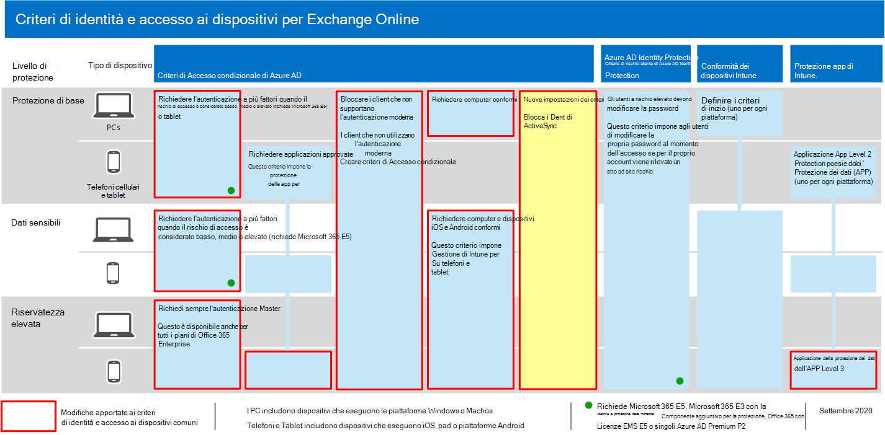

# <a name="policy-recommendations-for-securing-email"></a><span data-ttu-id="d3966-103">Criteri consigliati per la protezione della posta elettronica</span><span class="sxs-lookup"><span data-stu-id="d3966-103">Policy recommendations for securing email</span></span>

<span data-ttu-id="d3966-104">In questo articolo viene descritto come implementare i criteri di identità e accesso ai dispositivi consigliati per proteggere la posta elettronica e i client di posta elettronica che supportano l'autenticazione moderna e l'accesso condizionale.</span><span class="sxs-lookup"><span data-stu-id="d3966-104">This article describes how to implement the recommended identity and device access policies to protect organizational email and email clients that support modern authentication and conditional access.</span></span> <span data-ttu-id="d3966-105">Queste linee guida si basano sui [criteri comuni di accesso a identità e dispositivi](identity-access-policies.md) e sono inoltre disponibili alcuni suggerimenti aggiuntivi.</span><span class="sxs-lookup"><span data-stu-id="d3966-105">This guidance builds on the [Common identity and device access policies](identity-access-policies.md) and also includes a few additional recommendations.</span></span>

<span data-ttu-id="d3966-106">Questi suggerimenti si basano su tre diversi livelli di sicurezza e protezione che possono essere applicati in base alla granularità delle proprie esigenze: **linea di base**, **sensibile** e **altamente regolamentata**.</span><span class="sxs-lookup"><span data-stu-id="d3966-106">These recommendations are based on three different tiers of security and protection that can be applied based on the granularity of your needs: **baseline**, **sensitive**, and **highly regulated**.</span></span> <span data-ttu-id="d3966-107">Per altre informazioni su questi livelli di sicurezza e sui sistemi operativi client consigliati a cui fanno riferimento questi consigli, vedere [Recommended security policies and configurations](microsoft-365-policies-configurations.md) (Criteri di sicurezza e configurazioni consigliati).</span><span class="sxs-lookup"><span data-stu-id="d3966-107">You can learn more about these security tiers, and the recommended client operating systems, referenced by these recommendations in the [recommended security policies and configurations introduction](microsoft-365-policies-configurations.md).</span></span>

<span data-ttu-id="d3966-108">Questi suggerimenti richiedono agli utenti di utilizzare i client di posta elettronica moderni, tra cui Outlook per iOS e Android su dispositivi mobili.</span><span class="sxs-lookup"><span data-stu-id="d3966-108">These recommendations require your users to use modern email clients, including Outlook for iOS and Android on mobile devices.</span></span> <span data-ttu-id="d3966-109">Outlook per iOS e Android fornisce supporto per le migliori funzionalità di Office 365.</span><span class="sxs-lookup"><span data-stu-id="d3966-109">Outlook for iOS and Android provide support for the best features of Office 365.</span></span> <span data-ttu-id="d3966-110">Queste app per dispositivi mobili di Outlook sono inoltre architettate con funzionalità di sicurezza che supportano l'utilizzo dei dispositivi mobili e utilizzano altre funzionalità di sicurezza cloud Microsoft.</span><span class="sxs-lookup"><span data-stu-id="d3966-110">These mobile Outlook apps are also architected with security capabilities that support mobile use and work together with other Microsoft cloud security capabilities.</span></span> <span data-ttu-id="d3966-111">Per ulteriori informazioni, vedere le [domande frequenti su Outlook per iOS e Android](https://docs.microsoft.com/exchange/clients-and-mobile-in-exchange-online/outlook-for-ios-and-android/outlook-for-ios-and-android-faq).</span><span class="sxs-lookup"><span data-stu-id="d3966-111">For more information, see [Outlook for iOS and Android FAQ](https://docs.microsoft.com/exchange/clients-and-mobile-in-exchange-online/outlook-for-ios-and-android/outlook-for-ios-and-android-faq).</span></span>

## <a name="update-common-policies-to-include-email"></a><span data-ttu-id="d3966-112">Aggiornare i criteri comuni per includere messaggi di posta elettronica</span><span class="sxs-lookup"><span data-stu-id="d3966-112">Update common policies to include email</span></span>

<span data-ttu-id="d3966-113">Per proteggere la posta elettronica, nel diagramma seguente vengono illustrati i criteri da aggiornare dai criteri di identità e accesso ai dispositivi comuni.</span><span class="sxs-lookup"><span data-stu-id="d3966-113">To protect email, the following diagram illustrates which policies to update from the the common identity and device access policies.</span></span>

<span data-ttu-id="d3966-114">[](https://github.com/MicrosoftDocs/microsoft-365-docs/raw/public/microsoft-365/media/microsoft-365-policies-configurations/identity-access-ruleset-mail.png)</span><span class="sxs-lookup"><span data-stu-id="d3966-114">[](https://github.com/MicrosoftDocs/microsoft-365-docs/raw/public/microsoft-365/media/microsoft-365-policies-configurations/identity-access-ruleset-mail.png)</span></span>

[<span data-ttu-id="d3966-115">Visualizzazione di una versione più grande di questa immagine</span><span class="sxs-lookup"><span data-stu-id="d3966-115">See a larger version of this image</span></span>](https://github.com/MicrosoftDocs/microsoft-365-docs/raw/public/microsoft-365/media/microsoft-365-policies-configurations/identity-access-ruleset-mail.png)

<span data-ttu-id="d3966-116">Si noti l'aggiunta di un nuovo criterio per Exchange Online per bloccare i client ActiveSync.</span><span class="sxs-lookup"><span data-stu-id="d3966-116">Note the addition of a new policy for Exchange Online to block ActiveSync clients.</span></span> <span data-ttu-id="d3966-117">Questo impone l'utilizzo di Outlook Mobile.</span><span class="sxs-lookup"><span data-stu-id="d3966-117">This forces the use of Outlook mobile.</span></span>

<span data-ttu-id="d3966-118">Se è stato incluso Exchange Online e Outlook nell'ambito dei criteri quando vengono configurati, è necessario creare solo il nuovo criterio per bloccare i client ActiveSync.</span><span class="sxs-lookup"><span data-stu-id="d3966-118">If you included Exchange Online and Outlook in the scope of the policies when you set them up, you only need to create the new policy to block ActiveSync clients.</span></span> <span data-ttu-id="d3966-119">Esaminare i criteri elencati nella tabella seguente e apportare le aggiunte consigliate o confermare che sono già inclusi.</span><span class="sxs-lookup"><span data-stu-id="d3966-119">Review the policies listed in the following table and either make the recommended additions, or confirm that these are already included.</span></span> <span data-ttu-id="d3966-120">Ogni criterio si collega alle istruzioni di configurazione associate nei [criteri comuni di identità e accesso ai dispositivi](identity-access-policies.md).</span><span class="sxs-lookup"><span data-stu-id="d3966-120">Each policy links to the associated configuration instructions in [Common identity and device access policies](identity-access-policies.md).</span></span>

|<span data-ttu-id="d3966-121">Livello di protezione</span><span class="sxs-lookup"><span data-stu-id="d3966-121">Protection level</span></span>|<span data-ttu-id="d3966-122">Criteri</span><span class="sxs-lookup"><span data-stu-id="d3966-122">Policies</span></span>|<span data-ttu-id="d3966-123">Ulteriori informazioni</span><span class="sxs-lookup"><span data-stu-id="d3966-123">More information</span></span>|
|---|---|---|
|<span data-ttu-id="d3966-124">**Protezione di base**</span><span class="sxs-lookup"><span data-stu-id="d3966-124">**Baseline**</span></span>|[<span data-ttu-id="d3966-125">Richiedere l'AMF quando il rischio di accesso è *medio* o *elevato*</span><span class="sxs-lookup"><span data-stu-id="d3966-125">Require MFA when sign-in risk is *medium* or *high*</span></span>](identity-access-policies.md#require-mfa-based-on-sign-in-risk)|<span data-ttu-id="d3966-126">Includere Exchange Online nell'assegnazione delle app Cloud</span><span class="sxs-lookup"><span data-stu-id="d3966-126">Include Exchange Online in the assignment of cloud apps</span></span>|
||[<span data-ttu-id="d3966-127">Bloccare i client che non supportano l'autenticazione moderna</span><span class="sxs-lookup"><span data-stu-id="d3966-127">Block clients that don't support modern authentication</span></span>](identity-access-policies.md#block-clients-that-dont-support-modern-authentication)|<span data-ttu-id="d3966-128">Includere Exchange Online nell'assegnazione delle app Cloud</span><span class="sxs-lookup"><span data-stu-id="d3966-128">Include Exchange Online in the assignment of cloud apps</span></span>|
||[<span data-ttu-id="d3966-129">Applicare i criteri di protezione dei dati dell'APP</span><span class="sxs-lookup"><span data-stu-id="d3966-129">Apply APP data protection policies</span></span>](identity-access-policies.md#apply-app-data-protection-policies)|<span data-ttu-id="d3966-130">Assicurarsi che Outlook sia incluso nell'elenco delle app.</span><span class="sxs-lookup"><span data-stu-id="d3966-130">Be sure Outlook is included in the list of apps.</span></span> <span data-ttu-id="d3966-131">Assicurarsi di aggiornare i criteri per ogni piattaforma (iOS, Android, Windows)</span><span class="sxs-lookup"><span data-stu-id="d3966-131">Be sure to update the policy for each platform (iOS, Android, Windows)</span></span>|
||[<span data-ttu-id="d3966-132">Richiedere applicazioni approvate e protezione delle APP</span><span class="sxs-lookup"><span data-stu-id="d3966-132">Require approved apps and APP protection</span></span>](identity-access-policies.md#require-approved-apps-and-app-protection)|<span data-ttu-id="d3966-133">Includere Exchange Online nell'elenco delle app Cloud</span><span class="sxs-lookup"><span data-stu-id="d3966-133">Include Exchange Online in the list of cloud apps</span></span>|
||[<span data-ttu-id="d3966-134">Richiedere computer conformi</span><span class="sxs-lookup"><span data-stu-id="d3966-134">Require compliant PCs</span></span>](identity-access-policies.md#require-compliant-pcs-but-not-compliant-phones-and-tablets)|<span data-ttu-id="d3966-135">Includere Exchange Online nell'elenco delle app Cloud</span><span class="sxs-lookup"><span data-stu-id="d3966-135">Include Exchange Online in list of cloud apps</span></span>|
||[<span data-ttu-id="d3966-136">Bloccare i client ActiveSync</span><span class="sxs-lookup"><span data-stu-id="d3966-136">Block ActiveSync clients</span></span>](#block-activesync-clients)|<span data-ttu-id="d3966-137">Aggiungere il nuovo criterio</span><span class="sxs-lookup"><span data-stu-id="d3966-137">Add this new policy</span></span>|
|<span data-ttu-id="d3966-138">**Sensibili**</span><span class="sxs-lookup"><span data-stu-id="d3966-138">**Sensitive**</span></span>|[<span data-ttu-id="d3966-139">Richiedere l'AMF quando il rischio di accesso è *basso*, *medio* o *alto*</span><span class="sxs-lookup"><span data-stu-id="d3966-139">Require MFA when sign-in risk is *low*, *medium* or *high*</span></span>](identity-access-policies.md#require-mfa-based-on-sign-in-risk)|<span data-ttu-id="d3966-140">Includere Exchange Online nell'assegnazione delle app Cloud</span><span class="sxs-lookup"><span data-stu-id="d3966-140">Include Exchange Online in the assignment of cloud apps</span></span>|
||[<span data-ttu-id="d3966-141">Richiedere PC conformi *e* dispositivi mobili</span><span class="sxs-lookup"><span data-stu-id="d3966-141">Require compliant PCs *and* mobile devices</span></span>](identity-access-policies.md#require-compliant-pcs-and-mobile-devices)|<span data-ttu-id="d3966-142">Includere Exchange Online nell'elenco delle app Cloud</span><span class="sxs-lookup"><span data-stu-id="d3966-142">Include Exchange Online in the list of cloud apps</span></span>|
|<span data-ttu-id="d3966-143">**Riservatezza elevata**</span><span class="sxs-lookup"><span data-stu-id="d3966-143">**Highly regulated**</span></span>|[<span data-ttu-id="d3966-144">Richiede *sempre* l'autenticazione Master</span><span class="sxs-lookup"><span data-stu-id="d3966-144">*Always* require MFA</span></span>](identity-access-policies.md#require-mfa-based-on-sign-in-risk)|<span data-ttu-id="d3966-145">Includere Exchange Online nell'assegnazione delle app Cloud</span><span class="sxs-lookup"><span data-stu-id="d3966-145">Include Exchange Online in the assignment of cloud apps</span></span>|
|

## <a name="block-activesync-clients"></a><span data-ttu-id="d3966-146">Bloccare i client ActiveSync</span><span class="sxs-lookup"><span data-stu-id="d3966-146">Block ActiveSync clients</span></span>

<span data-ttu-id="d3966-147">Questo criterio impedisce ai client ActiveSync di ignorare altri criteri di accesso condizionale.</span><span class="sxs-lookup"><span data-stu-id="d3966-147">This policy prevents ActiveSync clients from bypassing other Conditional Access policies.</span></span> <span data-ttu-id="d3966-148">La configurazione dei criteri si applica solo ai client ActiveSync.</span><span class="sxs-lookup"><span data-stu-id="d3966-148">The policy configuration applies only to ActiveSync clients.</span></span> <span data-ttu-id="d3966-149">Selezionando **[Richiedi criteri di protezione delle app](https://docs.microsoft.com/azure/active-directory/conditional-access/concept-conditional-access-grant#require-app-protection-policy)**, questo criterio blocca i client ActiveSync.</span><span class="sxs-lookup"><span data-stu-id="d3966-149">By selecting **[Require app protection policy](https://docs.microsoft.com/azure/active-directory/conditional-access/concept-conditional-access-grant#require-app-protection-policy)**, this policy blocks ActiveSync clients.</span></span> <span data-ttu-id="d3966-150">I dettagli sulla creazione di questo criterio sono disponibili in [Richiedi criteri di protezione delle app per l'accesso alle app cloud con accesso condizionale](https://docs.microsoft.com/azure/active-directory/conditional-access/app-protection-based-conditional-access).</span><span class="sxs-lookup"><span data-stu-id="d3966-150">Details on creating this policy can be found in [Require app protection policy for cloud app access with Conditional Access](https://docs.microsoft.com/azure/active-directory/conditional-access/app-protection-based-conditional-access).</span></span>

- <span data-ttu-id="d3966-151">Seguire "passaggio 2: configurare un criterio di accesso condizionale di Azure AD per Exchange Online con ActiveSync (EAS)" nello [scenario 1: le app di Office 365 richiedono applicazioni approvate con i criteri di protezione delle app](https://docs.microsoft.com/azure/active-directory/conditional-access/app-protection-based-conditional-access#scenario-1-office-365-apps-require-approved-apps-with-app-protection-policies), che impediscono ai client di Exchange ActiveSync di sfruttare l'autenticazione di base dalla connessione a Exchange Online.</span><span class="sxs-lookup"><span data-stu-id="d3966-151">Follow "Step 2: Configure an Azure AD Conditional Access policy for Exchange Online with ActiveSync (EAS)" in [Scenario 1: Office 365 apps require approved apps with app protection policies](https://docs.microsoft.com/azure/active-directory/conditional-access/app-protection-based-conditional-access#scenario-1-office-365-apps-require-approved-apps-with-app-protection-policies), which prevents Exchange ActiveSync clients leveraging basic authentication from connecting to Exchange Online.</span></span>

<span data-ttu-id="d3966-152">È inoltre possibile utilizzare i criteri di autenticazione per [disabilitare l'autenticazione di base](https://docs.microsoft.com/exchange/clients-and-mobile-in-exchange-online/disable-basic-authentication-in-exchange-online), che impone a tutte le richieste di accesso client di utilizzare l'autenticazione moderna.</span><span class="sxs-lookup"><span data-stu-id="d3966-152">You can also use authentication policies to [disable Basic authentication](https://docs.microsoft.com/exchange/clients-and-mobile-in-exchange-online/disable-basic-authentication-in-exchange-online), which forces all client access requests to use modern authentication.</span></span>

## <a name="limit-access-to-exchange-online-from-outlook-on-the-web"></a><span data-ttu-id="d3966-153">Limitare l'accesso a Exchange Online da Outlook sul Web</span><span class="sxs-lookup"><span data-stu-id="d3966-153">Limit access to Exchange Online from Outlook on the web</span></span>

<span data-ttu-id="d3966-154">È possibile limitare la possibilità per gli utenti di scaricare gli allegati da Outlook sul Web sui dispositivi di umnanaged.</span><span class="sxs-lookup"><span data-stu-id="d3966-154">You can restrict the ability for users to download attachments from Outlook on the web on umnanaged devices.</span></span> <span data-ttu-id="d3966-155">Gli utenti di questi dispositivi possono visualizzare e modificare i file utilizzando Office Online senza perdere e archiviare i file nel dispositivo.</span><span class="sxs-lookup"><span data-stu-id="d3966-155">Users on these devices can view and edit these files using Office Online without leaking and storing the files on the device.</span></span> <span data-ttu-id="d3966-156">È inoltre possibile impedire agli utenti di visualizzare gli allegati in un dispositivo non gestito.</span><span class="sxs-lookup"><span data-stu-id="d3966-156">You can also block users from seeing attachments on an unmanaged device.</span></span>

<span data-ttu-id="d3966-157">Di seguito sono illustrati i passaggi:</span><span class="sxs-lookup"><span data-stu-id="d3966-157">Here are the steps:</span></span>

1. <span data-ttu-id="d3966-158">[Connettersi a una sessione di PowerShell remota di Exchange Online](https://docs.microsoft.com/powershell/exchange/exchange-online/connect-to-exchange-online-powershell/connect-to-exchange-online-powershell).</span><span class="sxs-lookup"><span data-stu-id="d3966-158">[Connect to an Exchange Online Remote PowerShell session](https://docs.microsoft.com/powershell/exchange/exchange-online/connect-to-exchange-online-powershell/connect-to-exchange-online-powershell).</span></span>
2. <span data-ttu-id="d3966-159">Se non si dispone già di un criterio cassetta postale OWA, crearne uno con il cmdlet [New-OwaMailboxPolicy](https://docs.microsoft.com/powershell/module/exchange/new-owamailboxpolicy) .</span><span class="sxs-lookup"><span data-stu-id="d3966-159">If you don't already have an OWA mailbox policy, create one with the [New-OwaMailboxPolicy](https://docs.microsoft.com/powershell/module/exchange/new-owamailboxpolicy) cmdlet.</span></span>
3. <span data-ttu-id="d3966-160">Se si desidera consentire la visualizzazione degli allegati ma non il download, utilizzare questo comando:</span><span class="sxs-lookup"><span data-stu-id="d3966-160">If you want to allow viewing of attachments but no downloading, use this command:</span></span>

   ```powershell
   Set-OwaMailboxPolicy -Identity Default -ConditionalAccessPolicy ReadOnly
   ```

4. <span data-ttu-id="d3966-161">Se si desidera bloccare gli allegati, utilizzare questo comando:</span><span class="sxs-lookup"><span data-stu-id="d3966-161">If you want to block attachments, use this command:</span></span>

   ```powershell
   Set-OwaMailboxPolicy -Identity Default -ConditionalAccessPolicy ReadOnlyPlusAttachmentsBlocked
   ```

5. <span data-ttu-id="d3966-162">Nel portale di Azure, creare un nuovo criterio di accesso condizionale con queste impostazioni:</span><span class="sxs-lookup"><span data-stu-id="d3966-162">In the Azure portal, create a new Conditional Access policy with these settings:</span></span>

   <span data-ttu-id="d3966-163">**Assegnazioni** \> **Utenti e gruppi**: selezionare gli utenti e i gruppi adatti da includere ed escludere.</span><span class="sxs-lookup"><span data-stu-id="d3966-163">**Assignments** \> **Users and groups**: Select appropriate users and groups to include and exclude.</span></span>

   <span data-ttu-id="d3966-164">**Assegnazioni** \> **App o azioni cloud** \> **App Cloud** \> **Includere** \> **Selezionare le app**: selezionare **Office 365 Exchange Online**</span><span class="sxs-lookup"><span data-stu-id="d3966-164">**Assignments** \> **Cloud apps or actions** \> **Cloud apps** \> **Include** \> **Select apps**: Select **Office 365 Exchange Online**</span></span>

   <span data-ttu-id="d3966-165">**Controlli** \> di accesso **Sessione**: selezionare **USA restrizioni applicate all'app**</span><span class="sxs-lookup"><span data-stu-id="d3966-165">**Access controls** \> **Session**: Select **Use app enforced restrictions**</span></span>

## <a name="require-that-ios-and-android-devices-must-use-outlook"></a><span data-ttu-id="d3966-166">Richiedi che i dispositivi iOS e Android siano in grado di utilizzare Outlook</span><span class="sxs-lookup"><span data-stu-id="d3966-166">Require that iOS and Android devices must use Outlook</span></span>

<span data-ttu-id="d3966-167">Per garantire che gli utenti di dispositivi iOS e Android possano accedere solo ai contenuti del lavoro o dell'Istituto di istruzione utilizzando Outlook per iOS e Android, è necessario un criterio di accesso condizionale destinato a tali potenziali utenti.</span><span class="sxs-lookup"><span data-stu-id="d3966-167">To ensure that users of iOS and Android devices can only access work or school content using Outlook for iOS and Android, you need a Conditional Access policy that targets those potential users.</span></span>

<span data-ttu-id="d3966-168">Vedere la procedura per configurare questo criterio in [gestire l'accesso alla collaborazione di messaggistica tramite Outlook per iOS e Android]( https://docs.microsoft.com/mem/intune/apps/app-configuration-policies-outlook#apply-conditional-access).</span><span class="sxs-lookup"><span data-stu-id="d3966-168">See the steps to configure this policy in [Manage messaging collaboration access by using Outlook for iOS and Android]( https://docs.microsoft.com/mem/intune/apps/app-configuration-policies-outlook#apply-conditional-access).</span></span>

## <a name="set-up-message-encryption"></a><span data-ttu-id="d3966-169">Configurare la crittografia dei messaggi</span><span class="sxs-lookup"><span data-stu-id="d3966-169">Set up message encryption</span></span>

<span data-ttu-id="d3966-170">Con le nuove funzionalità di crittografia dei messaggi di Office 365, che sfruttano le funzionalità di protezione di Azure Information Protection, l'organizzazione può facilmente condividere la posta elettronica protetta con chiunque su qualsiasi dispositivo.</span><span class="sxs-lookup"><span data-stu-id="d3966-170">With the new Office 365 Message Encryption (OME) capabilities, which leverage the protection features in Azure Information Protection, your organization can easily share protected email with anyone on any device.</span></span> <span data-ttu-id="d3966-171">Gli utenti possono inviare e ricevere messaggi protetti con altre organizzazioni di Microsoft 365 e non clienti che utilizzano Outlook.com, Gmail e altri servizi di posta elettronica.</span><span class="sxs-lookup"><span data-stu-id="d3966-171">Users can send and receive protected messages with other Microsoft 365 organizations as well as non-customers using Outlook.com, Gmail, and other email services.</span></span>

<span data-ttu-id="d3966-172">Per ulteriori informazioni, vedere [configurare le nuove funzionalità di crittografia dei messaggi di Office 365](https://docs.microsoft.com/microsoft-365/compliance/set-up-new-message-encryption-capabilities).</span><span class="sxs-lookup"><span data-stu-id="d3966-172">For more information, see [Set up new Office 365 Message Encryption capabilities](https://docs.microsoft.com/microsoft-365/compliance/set-up-new-message-encryption-capabilities).</span></span>

## <a name="next-steps"></a><span data-ttu-id="d3966-173">Passaggi successivi</span><span class="sxs-lookup"><span data-stu-id="d3966-173">Next steps</span></span>


<span data-ttu-id="d3966-175">Configurare i criteri di accesso condizionale per:</span><span class="sxs-lookup"><span data-stu-id="d3966-175">Configure Conditional Access policies for:</span></span>

- [<span data-ttu-id="d3966-176">Microsoft Teams</span><span class="sxs-lookup"><span data-stu-id="d3966-176">Microsoft Teams</span></span>](teams-access-policies.md)
- [<span data-ttu-id="d3966-177">SharePoint</span><span class="sxs-lookup"><span data-stu-id="d3966-177">SharePoint</span></span>](sharepoint-file-access-policies.md)
