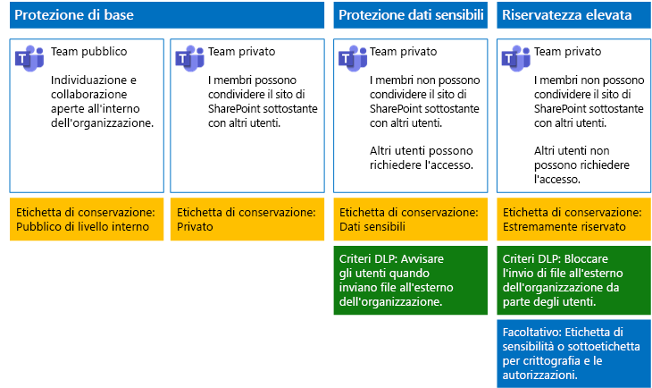

# Proteggere i file in Microsoft TeamsSecure files in Microsoft Teams

Questo articolo fornisce suggerimenti per configurare i team in Microsoft Teams e i siti di SharePoint sottostanti per la protezione dei file in modo da bilanciare la sicurezza con la facilità di collaborazione.This article provides recommendations for configuring teams in Microsoft Teams and their underlying SharePoint sites for file protection that balances security with ease of collaboration. L'articolo definisce quattro diverse configurazioni, a partire da un sito pubblico interno all'organizzazione con i criteri di condivisione più aperti.This article defines four different configurations, starting with a public site within your organization with the most open sharing policies. Ogni configurazione aggiuntiva rappresenta un miglioramento significativo in termini di protezione, ma la possibilità di accedere e collaborare ai file archiviati in Teams si riduce al gruppo di membri dei team interessati.Each additional configuration represents a meaningful step up in protection, but the ability to access and collaborate on files stored within Teams is reduced to the relevant set of team members. Usare questi suggerimenti come punto di partenza e modificare le configurazioni per soddisfare le esigenze della propria organizzazione.Use these recommendations as a starting point and adjust the configurations to meet the needs of your organization.

Le configurazioni descritte in questo articolo sono allineate alle raccomandazioni di Microsoft per i tre livelli di protezione per dati, identità e dispositivi:The configurations in this article align with Microsoft's recommendations for three tiers of protection for data, identities, and devices:

- Protezione di baseBaseline protection

- Protezione dati sensibiliSensitive protection

- Protezione dati altamente riservatiHighly confidential protection

Per altre informazioni su questi livelli e sulle funzionalità consigliate per ogni livello, vedere le risorse seguenti.For more information about these tiers and capabilities recommended for each tier, see the following resources.

- [Protezione di dispositivi e identità per Office 365Identity and Device Protection for Office 365](https://docs.microsoft.com/office365/enterprise/microsoft-cloud-it-architecture-resources#identity-and-device-protection-for-office-365)

- [Soluzioni per la protezione dei file in Office 365File Protection Solutions in Office 365](https://docs.microsoft.com/office365/enterprise/microsoft-cloud-it-architecture-resources#file-protection-solutions-in-office-365)

## Panoramica delle funzionalitàCapability overview

I consigli per i team protetti si basano su una vasta gamma di funzionalità di Microsoft 365.Recommendations for secured teams draw on a variety of Microsoft 365 capabilities. La figura seguente mostra le configurazioni consigliate.The following illustration shows the recommended configurations.

Come illustrato nell'esempio:As illustrated:

- La protezione di base include un team pubblico e un team privato.Baseline protection includes a public team and private team. I team pubblici possono essere individuati e usati da chiunque nell'organizzazione.Public teams can be discovered and accessed by anybody in the organization. I team privati possono essere individuati e usati solo dai membri del team.Private teams can only be discovered and accessed by members of the team. Entrambe le configurazioni consentono la condivisione del sito di SharePoint sottostante in cui i file vengono archiviati all'esterno del gruppo del team.Both of these configurations allow for sharing of the underlying SharePoint site on which files are stored outside the team group.

- I team per la protezione di dati sensibili ed estremamente riservati sono team privati in cui la condivisione e la richiesta di accesso per il sito sottostante prevedono delle limitazioni.Teams for sensitive and highly confidential protection are private teams in which sharing and the requesting of access for the underlying site is limited.

- Le [etichette di conservazione](../../compliance/labels.md) consentono di classificare i file nei siti di SharePoint sottostanti.[Retention labels](../../compliance/labels.md) provide a way to classify files within the underlying SharePoint sites. Ogni sito di SharePoint sottostante è configurato in modo da etichettare automaticamente i file delle raccolte di documenti con un'etichetta di conservazione predefinita.Each of the underlying SharePoint sites are configured to automatically label files in document libraries with a default retention label. In questo esempio le etichette, che corrispondono alle quattro configurazioni dei team, sono Pubblico interno, Privato, Sensibile ed Estremamente riservato.Corresponding to the four team configurations, the labels in this example are Internal Public, Private, Sensitive, and Highly Confidential. Gli utenti possono modificare le etichette nei singoli file, ma questa configurazione garantisce che tutti i file ricevano un'etichetta predefinita.Users can change the labels on the individual files, but this configuration ensures all files receive a default label.

- I criteri di [prevenzione della perdita dei dati](../../compliance/data-loss-prevention-policies.md) sono configurati in modo che le etichette di conservazione Sensibile ed Estremamente riservato avvisino o impediscano agli utenti di inviare questi tipi di file all'esterno dell'organizzazione.[Data loss prevention](../../compliance/data-loss-prevention-policies.md) (DLP) policies are configured for the Sensitive and Highly Confidential retention labels to either warn or prevent users when they attempt to send these types of files outside the organization.

- Se necessario per lo scenario specifico, è possibile usare le [etichette di riservatezza](../../compliance/sensitivity-labels.md) per proteggere file estremamente riservati con la crittografia e le autorizzazioni.If needed for your scenario, you can use [sensitivity labels](../../compliance/sensitivity-labels.md) to protect highly confidential files with encryption and permissions. Per i clienti di Azure Information Protection, è possibile usare le etichette di Azure Information Protection nel Centro conformità Microsoft 365 e, qualora si scegliesse di eseguire operazioni di configurazione aggiuntive o avanzate, le etichette saranno sincronizzate con il portale di Azure.For Azure Information Protection customers, you can use your Azure Information Protection labels in the Microsoft 365 compliance center, and your labels will be synced with the Azure portal in case you choose to perform additional or advanced configuration. Le etichette di Azure Information Protection e le etichette di riservatezza di Office 365 sono completamente compatibili tra loro.Azure Information Protection labels and Office 365 sensitivity labels are fully compatible with each other. Questo significa, ad esempio, che non è necessario riclassificare o etichettare nuovamente contenuti etichettati da Azure Information Protection.This means, for example, if you have content labeled by Azure Information Protection, you won't need to reclassify or relabel your content. Non tutti i clienti necessitano di questo livello di protezione.Not all customers need this level of protection.

## Impostazioni a livello aziendale per SharePoint e OneDriveOrganization-wide settings for SharePoint and OneDrive

SharePoint e OneDrive includono impostazioni a livello aziendale che influiscono su tutti i siti e gli utenti.SharePoint and OneDrive include organization-wide settings that affect all sites and users. Alcune di queste impostazioni si possono modificare anche a livello di sito in modo che siano più restrittive (ma non meno).Some of these settings can also be adjusted at the site level to be more restrictive (but not less). In questa sezione vengono illustrate le impostazioni a livello di tenant che influiscono sulla sicurezza e sulla collaborazione.This section discusses tenant-wide settings that affect security and collaboration.

### CondivisioneSharing

Per questa soluzione, è consigliabile usare le seguenti impostazioni a livello aziendale:For this solution, we recommend the following organization-wide settings:

- Mantenere il criterio di condivisione predefinito che consente la condivisione completa, inclusa quella anonima, con tutti i tipi di account.Keep the default sharing policy that allows all sharing with all account types, including anonymous sharing.

- Impostare la scadenza dei collegamenti anonimi, se desiderato.Set anonymous links to expire, if desired.

- Modificare il tipo di collegamento predefinito per la condivisione in Dati interni. Ciò consente di impedire la perdita accidentale dei dati all'esterno dell'organizzazione.Change the default link type for sharing to Internal. This helps prevent accidental data leakage outside your organization.

Anche se può sembrare illogico consentire la condivisione esterna, questo approccio offre un maggiore controllo sulla condivisione dei file rispetto all'invio dei file con i messaggi di posta elettronica.While it might seem counterintuitive to allow external sharing, this approach provides more control over file sharing compared to sending files in email. SharePoint e Outlook interagiscono in modo da garantire la sicurezza della collaborazione sui file.SharePoint and Outlook work together to provide secure collaboration on files.

- Per impostazione predefinita, Outlook condivide un collegamento a un file anziché inviare il file in un messaggio di posta elettronica.By default, Outlook shares a link to a file instead of sending the file in email.

- SharePoint e OneDrive facilitano la condivisione dei collegamenti ai file con i collaboratori interni ed esterni all'organizzazioneSharePoint and OneDrive make it easy to share links to files with contributors who are both inside and outside your organization

L'utente, inoltre, dispone di controlli utili per gestire la condivisione esterna. Ad esempio, è possibile:You also have controls to help govern external sharing. For example, you can:

- Disabilitare un collegamento guest anonimo.Disable an anonymous guest link.

- Revocare l'accesso utente a un sito.Revoke user access to a site.

- Vedere chi ha accesso a un documento o un sito specifico.See who has access to a specific site or document.

- Impostare i collegamenti di condivisione anonimi in modo che abbiano una scadenza (impostazione del tenant).Set anonymous sharing links to expire (tenant setting).

- Limitare gli utenti che possono condividere all'esterno dell'organizzazione (impostazione del tenant).Limit who can share outside your organization (tenant setting).

### Usare la condivisione esterna con la prevenzione della perdita di datiUse external sharing together with data loss prevention (DLP)

Se non si consente la condivisione esterna, gli utenti con esigenze aziendali troveranno strumenti e metodi alternativi. Microsoft consiglia di combinare la condivisione esterna con i criteri di prevenzione della perdita di dati per proteggere i file sensibili e altamente riservati.If you don't allow external sharing, users with a business need will find alternate tools and methods. Microsoft recommends you combine external sharing with DLP policies to protect sensitive and highly confidential files.

### Impostazioni di accesso dispositivoDevice access settings

Le impostazioni di accesso dispositivo per SharePoint e OneDrive consentono di determinare se l'accesso è limitato solo al browser (non è possibile scaricare i file) o se l'accesso è bloccato.Device access settings for SharePoint and OneDrive let you determine whether access is limited to browser only (files can't be downloaded) or if access is blocked. Per altre informazioni, vedere [Controllare l'accesso da dispositivi non gestiti](https://docs.microsoft.com/sharepoint/control-access-from-unmanaged-devices).For more information, see [Control access from unmanaged devices](https://docs.microsoft.com/sharepoint/control-access-from-unmanaged-devices).

Per usare impostazioni di accesso dispositivo con i criteri di accesso condizionale consigliati in Azure Active Directory, vedere [Suggerimenti sui criteri per la protezione di siti e file di SharePoint](https://docs.microsoft.com/microsoft-365/enterprise/sharepoint-file-access-policies).To use device access settings with recommended conditional access policies in Azure Active Directory, see [Policy recommendations for securing SharePoint sites and files](https://docs.microsoft.com/microsoft-365/enterprise/sharepoint-file-access-policies).

Esaminare queste impostazioni per decidere se si vuole modificare le impostazioni predefinite per i siti di OneDrive.Visit these settings to decide if you want to change the default settings for OneDrive sites. Attualmente, le impostazioni di accesso dispositivo e condivisione vengono duplicate dall'interfaccia di amministrazione di SharePoint e applicate a entrambi gli ambienti.Currently, the sharing and device access settings are duplicated from the SharePoint admin center and apply to both environments.

## Configurazione del sito di SharePoint e del teamTeam and SharePoint site configuration

Nella tabella seguente viene riepilogata la configurazione per ciascuno dei team e dei relativi siti di SharePoint sottostanti descritti in precedenza in questo articolo.The following table summarizes the configuration for each of the teams and their underlying SharePoint site described earlier in this article. Usare queste configurazioni come punto di partenza e modificare i tipi di sito e le relative configurazioni per soddisfare le esigenze della propria organizzazione.Use these configurations as starting point recommendations and adjust the site types and configurations to meet the needs of your organization. Non tutte le organizzazioni necessitano di ogni tipo di team.Not every organization needs every type of team. Solo un numero ridotto di organizzazioni richiede team con la protezione dei dati con riservatezza elevata.Only a small number of organizations require teams with highly confidential protection.

||||||
|:-----|:-----|:-----|:-----|:-----|
||**Protezione di base 1****Baseline protection #1**|**Protezione di base 2****Baseline protection #2**|**Protezione dati sensibili****Sensitive protection**|**Riservatezza elevata****Highly confidential**|
|DescrizioneDescription|Team pubblico con individuazione e collaborazione aperte all'interno dell'organizzazione.Public team with open discovery and collaboration within the organization.|Team privato con condivisione del sito di SharePoint sottostante consentita all'esterno del gruppo.Private team with sharing of the underlying SharePoint site allowed outside the group.|Team privato, ma la condivisione del sito di SharePoint sottostante è consentita solo ai membri del sito.Private team, but sharing of the underlying SharePoint site is only allowed to members of the site. La prevenzione della perdita dei dati avvisa gli utenti quando tentano di inviare file all'esterno dell'organizzazione.DLP warns users when attempting to send files outside the organization.|Team privato con etichette di riservatezza per la crittografia e autorizzazioni che seguono il file.Private team with sensitivity labels for file encryption and permissions that travel with the file. La prevenzione della perdita dei dati impedisce agli utenti di inviare file all'esterno dell'organizzazione.DLP prevents users from sending files outside the organization.|
|Sito del team privato o pubblicoPrivate or public team site|PubblicoPublic|PrivatePrivate|PrivatePrivate|PrivatePrivate|
|Chi può accedere?Who has access?|Tutti gli utenti dell'organizzazione, inclusi gli utenti B2B.Everybody in the organization, including B2B users.|Solo i membri del sito.Members of the site only. Altri utenti possono richiedere l'accesso.Others can request access.|Solo i membri del team.Members of the team only. Altri utenti possono richiedere l'accesso al sito sottostante, che è approvato da un proprietario del team.Others can request access to the underlying site, which is approved by a team owner.|Solo i membri.Members only. Altri utenti non possono richiedere l'accesso al sito sottostante.Others cannot request access to the underlying site.|
|Controlli di condivisione a livello di sitoSite-level sharing controls|Condivisione consentita con chiunque. Impostazioni predefinite.Sharing allowed with anybody. Default settings.|Condivisione consentita con chiunque. Impostazioni predefinite.Sharing allowed with anybody. Default settings.|I membri non possono condividere l'accesso al sito.Members cannot share access to the site.   I non membri possono richiedere l'accesso al sito, ma tali richieste devono essere gestite da un proprietario del gruppo del team.Non-members can request access to the site, but these requests need to be addressed by a group owner for the team.|I membri non possono condividere l'accesso al sito.Members cannot share access to the site.   I non membri non possono richiedere l'accesso al sito o ai suoi contenuti.Non-members cannot request access to the site or its contents.|
|Controlli di accesso dispositivo a livello di sitoSite-level device access controls|Nessun controllo aggiuntivo.No additional controls.|Nessun controllo aggiuntivo.No additional controls.|Impedire agli utenti di scaricare file su dispositivi collegati non compatibili o non di dominio. Ciò consente di accedere solo al browser da tutti gli altri dispositivi.Prevents users from downloading files to non-compliant or non-domain joined devices. This allows browser-only access from all other devices.|Bloccare il download di file su dispositivi collegati non compatibili o non di dominio.Block downloading of files to non-compliant or non-domain joined devices.|
|Etichette di conservazioneRetention labels|Pubblico di livello internoInternal Public|PrivatePrivate|Dati sensibiliSensitive|Highly Confidential (Riservatezza elevata)Highly Confidential|
|Criteri di prevenzione della perdita di dati (DLP)DLP policies|||Gli utenti vengono avvisati se inviano file con etichetta Sensitive (Dati sensibili) all'esterno dell'organizzazione.Warn users when sending files that are labeled as Sensitive outside the organization.   Per bloccare la condivisione esterna di tipi di dati riservati, ad esempio numeri di carta di credito o altri dati personali, è possibile configurare criteri DLP aggiuntivi per questi tipi di dati (inclusi i tipi di dati personalizzati che è necessario configurare).To block external sharing of sensitive data types, such as credit card numbers or other personal data, you can configure additional DLP policies for these data types (including custom data types you configure).|Bloccare l'invio di file contrassegnati come estremamente riservati all'esterno dell'organizzazione da parte degli utenti. Consentire agli utenti di sostituire questa impostazione specificando giustificazioni, inclusa l'informazione sugli utenti con cui si condivide il file.Block users from sending files that are labeled as highly confidential outside organization. Allow users to override this by providing justification, including who they are sharing the file with.|
|Etichette di riservatezzaSensitivity labels||||Usare le etichette di riservatezza per crittografare e concedere le autorizzazioni per i file.Use sensitivity labels to encrypt and grant permissions to files. Questa protezione segue i file in caso di perdita dal sito di SharePoint sottostante.This protection travels with the files in case they are leaked from the underlying SharePoint site.|

Per la procedura di distribuzione dei quattro tipi diversi di team in questa soluzione, vedere [Distribuire team per tre livelli di protezione per i file](deploy-teams-three-tiers.md).For the steps to deploy the four different types of teams in this solution, see [Deploy teams for three tiers of protection for files](deploy-teams-three-tiers.md).

## Etichette di conservazione di Office 365Office 365 retention labels

L'uso delle etichette di conservazione è consigliato per ambienti con dati sensibili.Using retention labels is recommended for environments with sensitive data. Dopo aver configurato e pubblicato le etichette di conservazione:After you configure and publish retention labels:

- È possibile applicare un'etichetta predefinita a una raccolta documenti nel sito di SharePoint sottostante per un team, in modo che tutti i documenti nella sezione **File** del team dispongano dell'etichetta predefinita.You can apply a default label to a document library in the underlying SharePoint site for a team, so that all documents in the **Files** section of the team get the default label.

- È possibile applicare automaticamente etichette al contenuto se questo soddisfa le condizioni specifiche.You can apply labels to content automatically if it matches specific conditions.

- È possibile applicare criteri di prevenzione della perdita dei dati che si basano sulle etichette di conservazione.You can apply DLP policies that are based on retention labels.

- Gli utenti dell'organizzazione possono applicare manualmente un'etichetta a contenuti in Outlook sul Web, Outlook 2010 e versioni successive, OneDrive, SharePoint e gruppi di Office 365.People in your organization can apply a label manually to content in Outlook on the web, Outlook 2010 and later, OneDrive, SharePoint, and Office 365 groups. Gli utenti spesso conoscono meglio il tipo di contenuto su cui stanno lavorando, quindi possono classificarlo e applicare i criteri DLP appropriati.Users often know best what type of content they're working with, so they can classify it and have the appropriate DLP policy applied.

Come indica l'illustrazione, questa soluzione include la creazione delle etichette di conservazione seguenti:As illustrated, this solution includes creating the following retention labels:

- Highly Confidential (Riservatezza elevata)Highly Confidential

- Dati sensibiliSensitive

- PrivatePrivate

- Pubblico di livello internoInternal Public

Queste etichette vengono mappate ai siti consigliati in illustrazioni e grafici presenti nelle sezioni precedenti di questo articolo. In questa soluzione viene consigliato di configurare i criteri DLP per impedire la perdita di file contrassegnati come sensibili ed estremamente riservati.These labels are mapped to the recommended sites in the illustrations and charts earlier in this article. This solution recommends configuring DLP policies to help prevent the leakage of files labeled as Sensitive and Highly Confidential.

Per la procedura di configurazione delle etichette di conservazione e dei criteri di prevenzione della perdita dei dati in questa soluzione, vedere [Proteggere i file nei team con le etichette di conservazione e la prevenzione della perdita dei dati](deploy-teams-retention-DLP.md).For the steps to configure retention labels and DLP policies in this solution, see [Protect files in teams with retention labels and DLP](deploy-teams-retention-DLP.md).

## Etichette di riservatezzaSensitivity labels

Se necessario per lo scenario di sicurezza specifico, è possibile usare le etichette di riservatezza per applicare le protezioni che seguono i file ovunque vanno.If warranted for your security scenario, you can use sensitivity labels to apply protections that follow the files wherever they go. Le etichette di riservatezza nel Centro conformità Microsoft 365 sono uguali alle etichette di Azure Information Protection.Sensitivity labels in the Microsoft 365 compliance center and Azure Information Protection labels are the same. Per questa soluzione, è consigliabile usare un'etichetta di riservatezza o una sottoetichetta per crittografare file e concedere loro le autorizzazioni per la protezione al livello più elevato.For this solution, we recommend you use a sensitivity label or sublabel to encrypt and grant permissions to files that need to be protected with the highest level of security.

Per ulteriori informazioni, vedere [Panoramica delle etichette di riservatezza](../../compliance/sensitivity-labels.md).For more information, see [Overview of sensitivity labels](../../compliance/sensitivity-labels.md).

Per la procedura di configurazione delle etichette di riservatezza in questa soluzione, vedere [Proteggere i file nei team con le etichette di riservatezza](deploy-teams-sensitivity-labels.md).For the steps to configure sensitivity labels in this solution, see [Protect files in teams with sensitivity labels](deploy-teams-sensitivity-labels.md).

## Vedere ancheSee also

[Adozione del cloud e soluzioni ibrideCloud adoption and hybrid solutions](https://docs.microsoft.com/office365/enterprise/cloud-adoption-and-hybrid-solutions)
