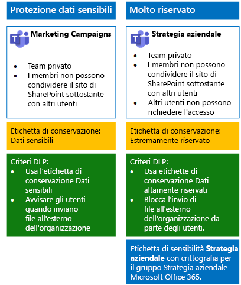
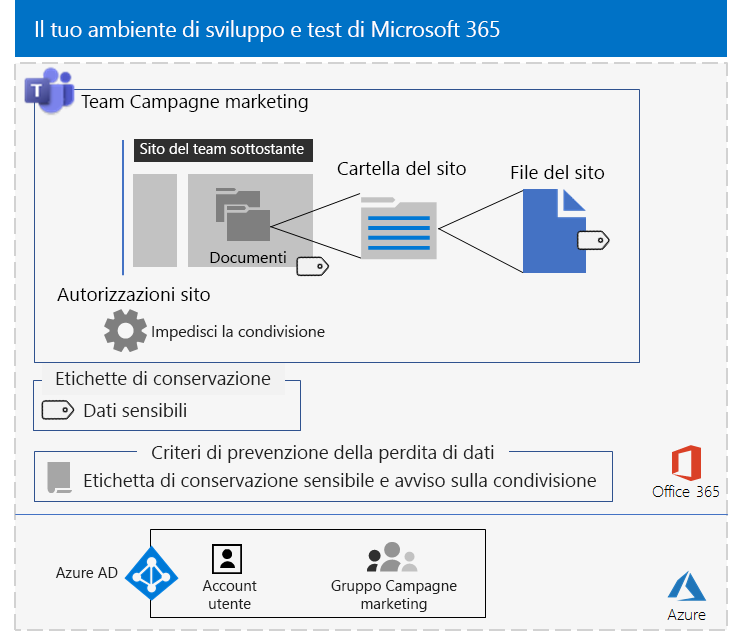
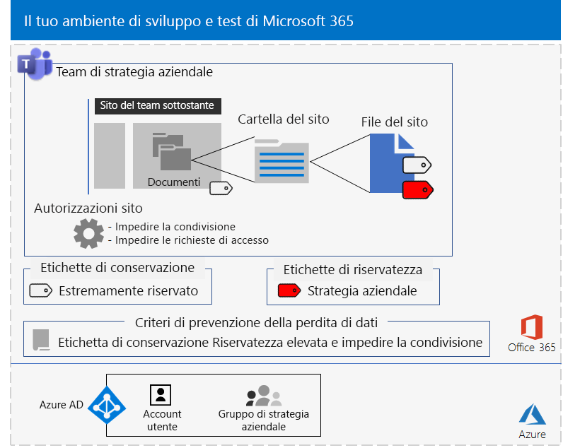

# <a name="secure-teams-for-files-in-a-devtest-environment"></a>Proteggere Teams per i file in un ambiente di sviluppo/test

Questo articolo fornisce istruzioni dettagliate per creare un ambiente di sviluppo/test che include i team sensibili ed estremamente riservati per la soluzione [Proteggere i file in Microsoft Teams](secure-files-in-teams.md).
  

  
Usare questo ambiente di sviluppo/test per sperimentare e perfezionare le impostazioni secondo le proprie necessità specifiche prima di distribuire questi tipi di team in produzione.
  
## <a name="phase-1-build-out-your-microsoft-365-enterprise-test-environment"></a>Fase 1: Creare l'ambiente di testing di Microsoft 365 Enterprise

Se si desidera semplicemente testare i team sensibili ed estremamente riservati con i requisiti minimi, seguire le istruzioni in [Configurazione di base](https://docs.microsoft.com/microsoft-365/enterprise/lightweight-base-configuration-microsoft-365-enterprise).

Se si desidera testare i team sensibili ed estremamente riservati in un'organizzazione simulata, seguire le istruzioni in [Sincronizzazione dell'hash delle password](https://docs.microsoft.com/microsoft-365/enterprise/password-hash-sync-m365-ent-test-environment).

>[!Note]
>Il test dei team sensibili ed estremamente riservati non richiede l'ambiente di testing aziendale simulato, che include una rete Intranet simulata connessa a Internet e la sincronizzazione della directory per una foresta di Active Directory Domain Services (AD DS) attiva. Questo test viene fornito qui come opzione in modo da consentire di testare i team sensibili ed estremamente riservati e sperimentarla in un ambiente che rappresenta un'organizzazione tipica.
>
    
## <a name="phase-2-create-and-configure-your-azure-active-directory-ad-groups-and-users"></a>Fase 2: Creare e configurare i gruppi e gli utenti di Azure Active Directory (AD)

In questa fase vengono creati e configurati i gruppi e gli utenti di Azure AD per l'organizzazione fittizia.
  
Innanzitutto, creare due gruppi per un'organizzazione tipica con il portale di Azure.
  
1. Creare una scheda separata nel browser e accedere al portale di Azure all'indirizzo [https://portal.azure.com](https://portal.azure.com). Se necessario, accedere con le credenziali dell'account amministratore globale dell'abbonamento a pagamento o di valutazione di Microsoft 365 E5.
    
2. Nel portale di Azure fare clic su **Azure Active Directory > Gruppi**.
    
3. Nel pannello **Gruppi - Tutti i gruppi** fare clic su **+ Nuovo gruppo**.
    
4. Nel pannello **Gruppo**:
    
  - Selezionare **Sicurezza** in **Tipo di gruppo**.
    
  - Digitare **C-Suite** in **Nome**.
    
  - Selezionare **Assegnato** in **Tipo di appartenenza**.
      
5. Fare clic su **Crea** e quindi chiudere il pannello **Gruppo**.
    
6.  Ripetere i passaggi 3-5 per un nuovo gruppo denominato **Marketing staff**.
    
Successivamente, si configurano le licenze automatiche in modo che ai membri dei gruppi vengano automaticamente assegnate le licenze per le sottoscrizioni di Office 365 ed EMS.
  
1. Nel portale di Azure fare clic su **Azure Active Directory > Licenze > Tutti i prodotti**.
    
2. Nell'elenco, selezionare **Microsoft 365 Enterprise E5**, quindi fare clic su **Assegna**.
    
3. Nel pannello **Assegnare licenza** fare clic su **Utenti e gruppi**.
    
4. Nell'elenco dei gruppi selezionare gli elementi seguenti:
    
  - C-Suite
    
  - Marketing staff
    
5. Fare clic su **Seleziona**, quindi su **Assegna**.
    
6. Chiudere la scheda del portale di Azure nel browser.
    
Successivamente, [Connettersi con il modulo di Azure Active Directory PowerShell per Graph ](https://docs.microsoft.com/office365/enterprise/powershell/connect-to-office-365-powershell#connect-with-the-azure-active-directory-powershell-for-graph-module).
  
Inserire il nome dell'organizzazione, la posizione e una password comune; eseguire quindi questi comandi dal prompt dei comandi di PowerShell o Integrated Script Environment (ISE) per creare account utente e aggiungerli ai rispettivi gruppi:
  
```
$orgName="<organization name, such as contoso for the contoso.onmicrosoft.com trial subscription domain name>"
$location="<the ISO ALPHA2 country code, such as US for the United States>"
$commonPassword="<common password for all the new accounts>"

$PasswordProfile=New-Object -TypeName Microsoft.Open.AzureAD.Model.PasswordProfile
$PasswordProfile.Password=$commonPassword

$groupName="C-Suite"
$userNames=@("CEO","CFO","CIO") 
$groupID=(Get-AzureADGroup | Where { $_.DisplayName -eq $groupName }).ObjectID
ForEach ($element in $userNames){ 
New-AzureADUser -DisplayName $element -PasswordProfile $PasswordProfile -UserPrincipalName ($element + "@" + $orgName + ".onmicrosoft.com") -AccountEnabled $true -MailNickName $element -UsageLocation $location 
Add-AzureADGroupMember -RefObjectId (Get-AzureADUser | Where { $_.DisplayName -eq $element }).ObjectID -ObjectId $groupID
}
$groupName="Marketing staff"
$userNames=@("Marketing1", "Marketing2") 
$groupID=(Get-AzureADGroup | Where { $_.DisplayName -eq $groupName }).ObjectID
ForEach ($element in $userNames){ 
New-AzureADUser -DisplayName $element -PasswordProfile $PasswordProfile -UserPrincipalName ($element + "@" + $orgName + ".onmicrosoft.com") -AccountEnabled $true -MailNickName $element -UsageLocation $location 
Add-AzureADGroupMember -RefObjectId (Get-AzureADUser | Where { $_.DisplayName -eq $element }).ObjectID -ObjectId $groupID
}
```

> [!NOTE]
> L'uso di una password comune qui consente l'automazione e agevola la configurazione per un ambiente di sviluppo e test. Ovviamente, questo approccio è sconsigliato per le sottoscrizioni di produzione. 
  
Seguire questi passaggi per verificare che le licenze basate su gruppo funzionino correttamente.
  
1. Dalla scheda **Microsoft Office Home** del browser fare clic sul riquadro **Amministratore**.
    
2. Dalla nuova scheda **Interfaccia di amministrazione di Microsoft 365** del browser fare clic su **Utenti**.
    
3. Fare clic su **CEO** nell'elenco degli utenti.
    
4. Nel riquadro in cui sono elencate le proprietà dell'account utente **CEO** verificare che all'account sia stata assegnata la licenza **Microsoft 365 Enterprise E5** (in **Licenze dei prodotti**).
    
## <a name="phase-3-create-office-365-retention-labels"></a>Fase 3: Creare le etichette di conservazione di Office 365

In questa fase vengono create le etichette di conservazione per i diversi livelli di sicurezza per cartelle di documenti dei siti di SharePoint sottostanti.

1. Accedere al [portale Conformità Microsoft 365](https://compliance.microsoft.com) con l'account di amministratore globale.
    
2. Dalla scheda **Home: Conformità Microsoft 365** del browser fare clic su **Classificazioni > Etichette**.
    
3. Fare clic su **Etichette di conservazione > Crea un'etichetta**.
    
4. Nel riquadro **Assegnare un nome all'etichetta** digitare **Sensibile****** e quindi fare clic su **Avanti**.

5. Nel riquadro **Descrittori del piano di archiviazione** fare clic su **Avanti**.
    
6. Nel riquadro **Impostazioni etichetta** impostare **Conservazione** su **Sì**, se necessario, e quindi fare clic su **Avanti**.
    
7. Nel riquadro **Rivedere le impostazioni** fare clic su **Crea etichetta**.
    
8. Ripetere i passaggi 3-7 per un'etichetta di conservazione aggiuntiva denominata **Estremamente riservato**.
    
9. Dal riquadro **Home > Etichette** fare clic su **Publish labels** (Pubblica etichette).
    
10. Nel riquadro **Choose labels to publish** (Scegli etichette da pubblicare) fare clic su **Choose labels to publish** (Scegli etichette da pubblicare).
    
11. Nel riquadro **Choose labels** (Scegli etichette) fare clic su **Aggiungi** e selezionare le quattro etichette.
    
12. Fare clic su **Fine**.
    
13. Nel riquadro **Choose labels to publish** (Scegli etichette da pubblicare) fare clic su **Avanti**.
    
14. Nel riquadro **Choose locations** (Scegli posizioni) fare clic su **Avanti**.
    
15. Nel riquadro **Denomina il criterio** digitare **Example organization** in **Nome**, quindi fare clic su **Avanti**.
    
16. Nel riquadro **Verifica le impostazioni** fare clic su **Publish labels** (Pubblica etichette), quindi fare clic su **Chiudi**.
    
## <a name="phase-4-create-your-teams"></a>Fase 4: Creare i team

In questa fase, vengono creati e configurati i team sensibili ed estremamente riservati per l'organizzazione di esempio.

### <a name="sensitive-team-for-marketing-campaigns"></a>Team sensibile per le campagne di marketing

Per creare un team sensibile per consentire ai membri del gruppo che si occupa del marketing di collaborare sulle campagne di marketing in corso:

1. [Creare un nuovo team privato](https://support.office.com//article/create-a-team-from-scratch-174adf5f-846b-4780-b765-de1a0a737e2b) denominato **Campagne di marketing**.
2. Aprire il team **Campagne di marketing**.
3.  Nella barra degli strumenti per il team fare clic su **File**.
4.  Fare clic sui puntini di sospensione, quindi selezionare **Apri in SharePoint**.
5.  Nella barra degli strumenti del sito di SharePoint sottostante fare clic sull'icona delle impostazioni, quindi su **Autorizzazioni sito**.
6.  Nel riquadro **Autorizzazioni sito** fare clic su **Modifica impostazioni di condivisione** in **Impostazioni di condivisione**.
7.  In **Impostazioni di condivisione** scegliere **Solo i proprietari del sito possono condividere file, cartelle e il sito**, quindi fare clic su **Salva**.

Successivamente, configurare la cartella dei documenti del sito di SharePoint Campagne di marketing sottostante per l'etichetta Sensibile.

1.  Nella scheda **Campagne di marketing - Home** del browser fare clic su **Documenti**.
2.  Fare clic sull'icona delle impostazioni e selezionare **Impostazioni libreria**.
3.  In **Autorizzazioni e gestione** fare clic su **Apply label to items in this library** (Applica etichetta agli elementi in questa libreria).
4.  In **Impostazioni - Applica etichetta** selezionare **Riservato** e quindi fare clic su **Salva**. 

Configurare quindi un criterio di prevenzione della perdita dei dati che informa gli utenti quando condividono un documento presente su un sito di SharePoint sottostante con etichetta Sensibile, che include il sito Campagne di marketing, all'esterno dell'organizzazione.

1. Accedere al [portale Conformità Microsoft 365](https://compliance.microsoft.com/) con l'account di amministratore globale.
    
2. Nella nuova scheda **Sicurezza Microsoft 365** del browser fare clic su **Criteri > Prevenzione della perdita dei dati**.
    
3. Nel riquadro **Home > Prevenzione della perdita dei dati** fare clic su **Crea un criterio**.
    
4. Nel riquadro **Inizia con un modello o crea un criterio personalizzato**, fare clic su **Personalizza**, quindi su **Avanti**.
    
5. Nel riquadro **Denomina il criterio**, digitare **Siti di SharePoint con etichetta Sensibile** in **Nome**, quindi fare clic su **Avanti**.
    
6. Nel riquadro **Choose locations** (Scegli posizioni) fare clic su **Let me choose specific locations** (Consenti di scegliere posizioni specifiche) e fare clic su **Avanti**.
    
7. Nell'elenco di località, disabilitare le località **Posta elettronica di Exchange**, **Account di OneDrive** e **Messaggi di chat e canali di Teams**, quindi fare clic su **Avanti**.
    
8. Nel riquadro **Personalizzare il tipo di contenuti da proteggere**, fare clic su **Modifica**.
    
9. Nel riquadro **Scegliere i tipi di contenuto da proteggere**,fare clic su **Aggiungi** nella casella di riepilogo a discesa, quindi fare clic su **Etichette di conservazione**.
    
10. Nel riquadro **Etichette di conservazione** fare clic su **Aggiungi**, selezionare l'etichetta **Riservato** fare clic su **Aggiungi**, quindi fare clic su **Fine**.
    
11. Nel riquadro **Choose the types of content to protect** (Scegli i tipi di contenuto da proteggere) fare clic su **Salva**.
    
12. Nel riquadro **Personalizzare i tipi di informazioni da proteggere**, fare clic su **Avanti**.

13. Nel riquadro **What do you want to do if we detect sensitive info?** (Selezionare come procedere in caso di informazioni sensibili rilevate) fare clic su **Customize the tip and email** (Personalizza suggerimento e messaggio di posta elettronica).
    
14. Nel riquadro **Customize policy tips and email notifications** (Personalizza i suggerimenti per i criteri e le notifiche tramite posta elettronica) fare clic su **Customize the policy tip text** (Personalizza testo suggerimento per criterio).
    
15. Nella casella di testo digitare o incollare quanto segue:
    
  - Per condividere con un utente esterno all'organizzazione, scaricare il file e quindi aprirlo. Fare clic su File, Proteggi documento, Crittografa con password, quindi specificare una password complessa. Inviare la password in un'e-mail separata o con altri mezzi di comunicazione.
    
16. Fare clic su **OK**.
    
17. Nel riquadro **Quale operazione eseguire se vengono rilevate informazioni riservate?**, fare clic su **Avanti**.
    
18. Nel riquadro **Abilitare il criterio o eseguire prima un test?**, fare clic su **Sì, abilitarlo immediatamente**, quindi su **Avanti**.
    
19. Nel riquadro **Verifica le impostazioni** fare clic su **Crea** e quindi su **Chiudi**.

Ecco la configurazione ottenuta per il team Campagne di marketing.


  
### <a name="company-strategy-team-site"></a>Sito del team di strategia aziendale

Per creare un team estremamente riservato per consentire ai membri del team dirigenziale di collaborare sulla strategia aziendale:

1. [Creare un nuovo team privato](https://support.office.com//article/create-a-team-from-scratch-174adf5f-846b-4780-b765-de1a0a737e2b) denominato **Strategia aziendale**.
2. Aprire il team **Strategia aziendale**.
3.  Nella barra degli strumenti per il team fare clic su **File**.
4.  Fare clic sui puntini di sospensione, quindi selezionare **Apri in SharePoint**.
5.  Nella barra degli strumenti del sito di SharePoint sottostante fare clic sull'icona delle impostazioni, quindi su **Autorizzazioni sito**.
6.  Nel riquadro **Autorizzazioni sito** fare clic su **Modifica impostazioni di condivisione** in **Impostazioni di condivisione**.
7.  In **Impostazioni di condivisione** scegliere **Solo i proprietari del sito possono condividere file, cartelle e il sito**.
8.  Disattivare **Consenti richieste di accesso** e quindi fare clic su **Salva**.

Successivamente, configurare la cartella dei documenti del sito di SharePoint Strategia aziendale sottostante per l'etichetta Estremamente riservato.

1.  Nella scheda **Strategia aziendale - Home** del browser fare clic su **Documenti**.
2.  Fare clic sull'icona delle impostazioni e selezionare **Impostazioni libreria**.
3.  In **Autorizzazioni e gestione** fare clic su **Apply label to items in this library** (Applica etichetta agli elementi in questa libreria).
4.  In **Impostazioni - Applica etichetta**, selezionare **Estremamente riservato** e quindi fare clic su **Salva**. 

Configurare un criterio di prevenzione della perdita dei dati che blocchi gli utenti quando condividono un documento presente su un sito di SharePoint sottostante con etichetta Estremamente riservato, che include il sito Strategia aziendale, all'esterno dell'organizzazione.
  
1. Accedere al [portale Conformità Microsoft 365](https://compliance.microsoft.com/) con un account di amministratore globale.
    
2. Nella nuova scheda **Sicurezza Microsoft 365** del browser fare clic su **Criteri > Prevenzione della perdita dei dati**.
    
3. Nel riquadro **Home > Prevenzione della perdita dei dati** fare clic su **Crea un criterio**.
    
4. Nel riquadro **Inizia con un modello o crea un criterio personalizzato**, fare clic su **Personalizza**, quindi su **Avanti**.
    
5. Nel riquadro **Denomina il criterio**, digitare **Siti di SharePoint con etichetta Estremamente riservato** in **Nome**, quindi fare clic su **Avanti**.
    
6. Nel riquadro **Choose locations** (Scegli posizioni) fare clic su **Let me choose specific locations** (Consenti di scegliere posizioni specifiche) e fare clic su **Avanti**.
    
7. Nell'elenco di località, disabilitare le località **Posta elettronica di Exchange**, **Account di OneDrive** e **Messaggi di chat e canali di Teams**, quindi fare clic su **Avanti**.
    
8. Nel riquadro **Personalizzare il tipo di contenuti da proteggere**, fare clic su **Modifica**.
    
9. Nel riquadro **Scegliere i tipi di contenuto da proteggere**,fare clic su **Aggiungi** nella casella di riepilogo a discesa, quindi fare clic su **Etichette di conservazione**.
    
10. Nel riquadro **Etichette** fare clic su **Aggiungi**, selezionare l'etichetta **Estremamente riservato**, fare clic su **Aggiungi**, quindi fare clic su **Fine**.
    
11. Nel riquadro **Choose the types of content to protect** (Scegli i tipi di contenuto da proteggere) fare clic su **Salva**.
    
12. Nel riquadro **Personalizzare i tipi di informazioni da proteggere**, fare clic su **Avanti**.

13. Nel riquadro **What do you want to do if we detect sensitive info?** (Selezionare come procedere in caso di informazioni sensibili rilevate) fare clic su **Customize the tip and email** (Personalizza suggerimento e messaggio di posta elettronica).
    
14. Nel riquadro **Customize policy tips and email notifications** (Personalizza i suggerimenti per i criteri e le notifiche tramite posta elettronica) fare clic su **Customize the policy tip text** (Personalizza testo suggerimento per criterio).
    
15. Nella casella di testo digitare o incollare quanto segue:
    
  - Per condividere con un utente esterno all'organizzazione, scaricare il file e quindi aprirlo. Fare clic su File, Proteggi documento, Crittografa con password, quindi specificare una password complessa. Inviare la password in un'e-mail separata o con altri mezzi di comunicazione.
    
16. Fare clic su **OK**.
    
17. Nel riquadro **Abilitare il criterio o eseguire prima un test?**, fare clic su **Sì, abilitarlo immediatamente**, quindi su **Avanti**.

18. Nel riquadro **Abilitare il criterio o eseguire prima un test?**, fare clic su **Sì, abilitarlo immediatamente**, quindi su **Avanti**.
    
19. Nel riquadro **Verifica le impostazioni** fare clic su **Crea** e quindi su **Chiudi**.

Seguire [queste istruzioni](https://docs.microsoft.com/microsoft-365/compliance/encryption-sensitivity-labels) per configurare un'etichetta di riservatezza con le impostazioni seguenti:

- Il nome dell'etichetta è Strategia aziendale
- La crittografia è abilitata
- Il gruppo Strategia aziendale ha autorizzazioni di creazione condivisa

Una volta creata, pubblicare la nuova etichetta. Se si accede come membro del gruppo Strategia aziendale, la nuova etichetta verrà visualizzata nell'opzione Riservatezza nella barra degli strumenti Home di Word, Excel e PowerPoint. Selezionare l'etichetta Strategia aziendale dall'opzione Riservatezza per assegnare l'etichetta a un file.

Ecco la configurazione ottenuta per il team Strategia aziendale.

 

I file nella sezione dei documenti del sito di SharePoint Strategia aziendale sottostante sono assegnati all'etichetta di riservatezza Estremamente riservato e sono soggetti al criterio di prevenzione della perdita dei dati configurato. Inoltre, ai file può essere assegnata l'etichetta di riservatezza Strategia aziendale.    
  
## <a name="next-step"></a>Passaggio successivo

Quando si è pronti per la distribuzione di produzione, vedere [Proteggere i file in Microsoft Teams](secure-files-in-teams.md) per informazioni e collegamenti ad articoli dettagliati sulla distribuzione.
  
## <a name="see-also"></a>Vedere anche

[Adozione del cloud e soluzioni ibride](https://docs.microsoft.com/office365/enterprise/cloud-adoption-and-hybrid-solutions)
