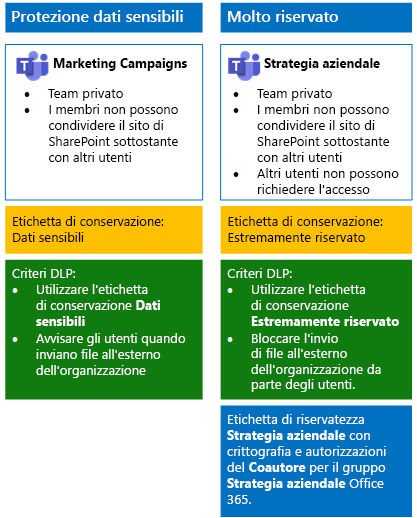

# <a name="secure-teams-for-files-in-a-devtest-environment"></a><span data-ttu-id="7ce9d-103">Proteggere Teams per i file in un ambiente di sviluppo/test</span><span class="sxs-lookup"><span data-stu-id="7ce9d-103">Secure Teams for files in a dev/test environment</span></span>

<span data-ttu-id="7ce9d-104">Questo articolo fornisce istruzioni dettagliate per creare un ambiente di sviluppo/test che include i team sensibili ed estremamente riservati per la soluzione [Proteggere i file in Microsoft Teams](secure-files-in-teams.md).</span><span class="sxs-lookup"><span data-stu-id="7ce9d-104">This article provides step-by-step instructions to create a dev/test environment that includes the sensitive and highly confidential teams for the [Secure files in Microsoft Teams](secure-files-in-teams.md) solution.</span></span>
  

  
<span data-ttu-id="7ce9d-106">Usare questo ambiente di sviluppo/test per sperimentare e perfezionare le impostazioni secondo le proprie necessità specifiche prima di distribuire questi tipi di team in produzione.</span><span class="sxs-lookup"><span data-stu-id="7ce9d-106">Use this dev/test environment to experiment and fine-tune settings for your specific needs before deploying these types of teams in production.</span></span>
  
## <a name="phase-1-build-out-your-microsoft-365-enterprise-test-environment"></a><span data-ttu-id="7ce9d-107">Fase 1: Creare l'ambiente di testing di Microsoft 365 Enterprise</span><span class="sxs-lookup"><span data-stu-id="7ce9d-107">Phase 1: Build out your Microsoft 365 Enterprise test environment</span></span>

<span data-ttu-id="7ce9d-108">Se si desidera semplicemente testare i team sensibili ed estremamente riservati con i requisiti minimi, seguire le istruzioni in [Configurazione di base](https://docs.microsoft.com/microsoft-365/enterprise/lightweight-base-configuration-microsoft-365-enterprise).</span><span class="sxs-lookup"><span data-stu-id="7ce9d-108">If you just want to test sensitive and highly confidential teams in a lightweight way with the minimum requirements, follow the instructions in [Lightweight base configuration](https://docs.microsoft.com/microsoft-365/enterprise/lightweight-base-configuration-microsoft-365-enterprise).</span></span>

<span data-ttu-id="7ce9d-109">Se si desidera testare i team sensibili ed estremamente riservati in un'organizzazione simulata, seguire le istruzioni in [Sincronizzazione dell'hash delle password](https://docs.microsoft.com/microsoft-365/enterprise/password-hash-sync-m365-ent-test-environment).</span><span class="sxs-lookup"><span data-stu-id="7ce9d-109">If you want to test sensitive and highly confidential teams in a simulated enterprise, follow the instructions in [Password hash synchronization](https://docs.microsoft.com/microsoft-365/enterprise/password-hash-sync-m365-ent-test-environment).</span></span>

>[!Note]
><span data-ttu-id="7ce9d-110">Il test dei team sensibili ed estremamente riservati non richiede l'ambiente di testing aziendale simulato, che include una rete Intranet simulata connessa a Internet e la sincronizzazione della directory per una foresta di Active Directory Domain Services (AD DS) attiva.</span><span class="sxs-lookup"><span data-stu-id="7ce9d-110">Testing sensitive and highly confidential teams does not require the simulated enterprise test environment, which includes a simulated intranet connected to the Internet and directory synchronization for an Active Directory Domain Services (AD DS) forest.</span></span> <span data-ttu-id="7ce9d-111">Questo test viene fornito qui come opzione in modo da consentire di testare i team sensibili ed estremamente riservati e sperimentarla in un ambiente che rappresenta un'organizzazione tipica.</span><span class="sxs-lookup"><span data-stu-id="7ce9d-111">It is provided here as an option so that you can test sensitive and highly confidential teams and experiment with it in an environment that represents a typical organization.</span></span>
>
    
## <a name="phase-2-create-and-configure-your-azure-active-directory-ad-groups-and-users"></a><span data-ttu-id="7ce9d-112">Fase 2: Creare e configurare i gruppi e gli utenti di Azure Active Directory (AD)</span><span class="sxs-lookup"><span data-stu-id="7ce9d-112">Phase 2: Create and configure your Azure Active Directory (AD) groups and users</span></span>

<span data-ttu-id="7ce9d-113">In questa fase vengono creati e configurati i gruppi e gli utenti di Azure AD per l'organizzazione fittizia.</span><span class="sxs-lookup"><span data-stu-id="7ce9d-113">In this phase, you create and configure the Azure AD groups and users for your fictional organization.</span></span>
  
<span data-ttu-id="7ce9d-114">Innanzitutto, creare due gruppi per un'organizzazione tipica con il portale di Azure.</span><span class="sxs-lookup"><span data-stu-id="7ce9d-114">First, create two groups for a typical organization with the Azure portal.</span></span>
  
1. <span data-ttu-id="7ce9d-115">Creare una scheda separata nel browser e accedere al portale di Azure all'indirizzo [https://portal.azure.com](https://portal.azure.com).</span><span class="sxs-lookup"><span data-stu-id="7ce9d-115">Create a separate tab in your browser, and then go to the Azure portal at [https://portal.azure.com](https://portal.azure.com).</span></span> <span data-ttu-id="7ce9d-116">Se necessario, accedere con le credenziali dell'account amministratore globale dell'abbonamento a pagamento o di valutazione di Microsoft 365 E5.</span><span class="sxs-lookup"><span data-stu-id="7ce9d-116">If needed, sign in with the credentials of the global administrator account for your Microsoft 365 E5 trial or paid subscription.</span></span>
    
2. <span data-ttu-id="7ce9d-117">Nel portale di Azure fare clic su **Azure Active Directory > Gruppi**.</span><span class="sxs-lookup"><span data-stu-id="7ce9d-117">In the Azure portal, click **Azure Active Directory > Groups**.</span></span>
    
3. <span data-ttu-id="7ce9d-118">Nel pannello **Gruppi - Tutti i gruppi** fare clic su **+ Nuovo gruppo**.</span><span class="sxs-lookup"><span data-stu-id="7ce9d-118">On the **Groups - All groups** blade, click **+ New group**.</span></span>
    
4. <span data-ttu-id="7ce9d-119">Nel pannello **Gruppo**:</span><span class="sxs-lookup"><span data-stu-id="7ce9d-119">On the **Group** blade:</span></span>
    
  - <span data-ttu-id="7ce9d-120">Selezionare **Sicurezza** in **Tipo di gruppo**.</span><span class="sxs-lookup"><span data-stu-id="7ce9d-120">Select **Security** in **Group type**.</span></span>
    
  - <span data-ttu-id="7ce9d-121">Digitare **C-Suite** in **Nome**.</span><span class="sxs-lookup"><span data-stu-id="7ce9d-121">Type **C-Suite** in **Name**.</span></span>
    
  - <span data-ttu-id="7ce9d-122">Selezionare **Assegnato** in **Tipo di appartenenza**.</span><span class="sxs-lookup"><span data-stu-id="7ce9d-122">Select **Assigned** in **Membership type**.</span></span>
      
5. <span data-ttu-id="7ce9d-123">Fare clic su **Crea** e quindi chiudere il pannello **Gruppo**.</span><span class="sxs-lookup"><span data-stu-id="7ce9d-123">Click **Create**, and then close the **Group** blade.</span></span>
    
6.  <span data-ttu-id="7ce9d-124">Ripetere i passaggi 3-5 per un nuovo gruppo denominato **Marketing staff**.</span><span class="sxs-lookup"><span data-stu-id="7ce9d-124">Repeat steps 3-5 for a new group named **Marketing staff**.</span></span>
    
<span data-ttu-id="7ce9d-125">Successivamente, si configurano le licenze automatiche in modo che ai membri dei gruppi vengano automaticamente assegnate le licenze per le sottoscrizioni di Office 365 ed EMS.</span><span class="sxs-lookup"><span data-stu-id="7ce9d-125">Next, you configure automatic licensing so that members of your groups are automatically assigned licenses for your Office 365 and EMS subscriptions.</span></span>
  
1. <span data-ttu-id="7ce9d-126">Nel portale di Azure fare clic su **Azure Active Directory > Licenze > Tutti i prodotti**.</span><span class="sxs-lookup"><span data-stu-id="7ce9d-126">In the Azure portal, click **Azure Active Directory > Licenses > All products**.</span></span>
    
2. <span data-ttu-id="7ce9d-127">Nell'elenco, selezionare **Microsoft 365 Enterprise E5**, quindi fare clic su **Assegna**.</span><span class="sxs-lookup"><span data-stu-id="7ce9d-127">In the list, select **Microsoft 365 Enterprise E5**, and then click **Assign**.</span></span>
    
3. <span data-ttu-id="7ce9d-128">Nel pannello **Assegnare licenza** fare clic su **Utenti e gruppi**.</span><span class="sxs-lookup"><span data-stu-id="7ce9d-128">In the **Assign license** blade, click **Users and groups**.</span></span>
    
4. <span data-ttu-id="7ce9d-129">Nell'elenco dei gruppi selezionare gli elementi seguenti:</span><span class="sxs-lookup"><span data-stu-id="7ce9d-129">In the list of groups, select the following:</span></span>
    
  - <span data-ttu-id="7ce9d-130">C-Suite</span><span class="sxs-lookup"><span data-stu-id="7ce9d-130">C-Suite</span></span>
    
  - <span data-ttu-id="7ce9d-131">Marketing staff</span><span class="sxs-lookup"><span data-stu-id="7ce9d-131">Marketing staff</span></span>
    
5. <span data-ttu-id="7ce9d-132">Fare clic su **Seleziona**, quindi su **Assegna**.</span><span class="sxs-lookup"><span data-stu-id="7ce9d-132">Click **Select**, and then click **Assign**.</span></span>
    
6. <span data-ttu-id="7ce9d-133">Chiudere la scheda del portale di Azure nel browser.</span><span class="sxs-lookup"><span data-stu-id="7ce9d-133">Close the Azure portal tab in your browser.</span></span>
    
<span data-ttu-id="7ce9d-134">Successivamente, [Connettersi con il modulo di Azure Active Directory PowerShell per Graph ](https://docs.microsoft.com/office365/enterprise/powershell/connect-to-office-365-powershell#connect-with-the-azure-active-directory-powershell-for-graph-module).</span><span class="sxs-lookup"><span data-stu-id="7ce9d-134">Next, you [Connect with the Azure Active Directory PowerShell for Graph module ](https://docs.microsoft.com/office365/enterprise/powershell/connect-to-office-365-powershell#connect-with-the-azure-active-directory-powershell-for-graph-module).</span></span>
  
<span data-ttu-id="7ce9d-135">Inserire il nome dell'organizzazione, la posizione e una password comune; eseguire quindi questi comandi dal prompt dei comandi di PowerShell o Integrated Script Environment (ISE) per creare account utente e aggiungerli ai rispettivi gruppi:</span><span class="sxs-lookup"><span data-stu-id="7ce9d-135">Fill in your organization name, your location, and a common password, and then run these commands from the PowerShell command prompt or Integrated Script Environment (ISE) to create user accounts and add them to their groups:</span></span>
  
```powershell
$orgName="<organization name, such as contoso for the contoso.onmicrosoft.com trial subscription domain name>"
$location="<the ISO ALPHA2 country code, such as US for the United States>"
$commonPassword="<common password for all the new accounts>"

$PasswordProfile=New-Object -TypeName Microsoft.Open.AzureAD.Model.PasswordProfile
$PasswordProfile.Password=$commonPassword

$groupName="C-Suite"
$userNames=@("CEO","CFO","CIO") 
$groupID=(Get-AzureADGroup | Where { $_.DisplayName -eq $groupName }).ObjectID
ForEach ($element in $userNames){ 
New-AzureADUser -DisplayName $element -PasswordProfile $PasswordProfile -UserPrincipalName ($element + "@" + $orgName + ".onmicrosoft.com") -AccountEnabled $true -MailNickName $element -UsageLocation $location 
Add-AzureADGroupMember -RefObjectId (Get-AzureADUser | Where { $_.DisplayName -eq $element }).ObjectID -ObjectId $groupID
}
$groupName="Marketing staff"
$userNames=@("Marketing1", "Marketing2") 
$groupID=(Get-AzureADGroup | Where { $_.DisplayName -eq $groupName }).ObjectID
ForEach ($element in $userNames){ 
New-AzureADUser -DisplayName $element -PasswordProfile $PasswordProfile -UserPrincipalName ($element + "@" + $orgName + ".onmicrosoft.com") -AccountEnabled $true -MailNickName $element -UsageLocation $location 
Add-AzureADGroupMember -RefObjectId (Get-AzureADUser | Where { $_.DisplayName -eq $element }).ObjectID -ObjectId $groupID
}
```

> [!NOTE]
> <span data-ttu-id="7ce9d-136">L'uso di una password comune qui consente l'automazione e agevola la configurazione per un ambiente di sviluppo e test.</span><span class="sxs-lookup"><span data-stu-id="7ce9d-136">The use of a common password here is for automation and ease of configuration for a dev/test environment.</span></span> <span data-ttu-id="7ce9d-137">Ovviamente, questo approccio è sconsigliato per le sottoscrizioni di produzione.</span><span class="sxs-lookup"><span data-stu-id="7ce9d-137">Obviously, this is highly discouraged for production subscriptions.</span></span> 
  
<span data-ttu-id="7ce9d-138">Seguire questi passaggi per verificare che le licenze basate su gruppo funzionino correttamente.</span><span class="sxs-lookup"><span data-stu-id="7ce9d-138">Use these steps to verify that group-based licensing is working correctly.</span></span>
  
1. <span data-ttu-id="7ce9d-139">Dalla scheda **Microsoft Office Home** del browser fare clic sul riquadro **Amministratore**.</span><span class="sxs-lookup"><span data-stu-id="7ce9d-139">From the **Microsoft Office Home** tab of your browser, click the **Admin** tile.</span></span>
    
2. <span data-ttu-id="7ce9d-140">Dalla nuova scheda **Interfaccia di amministrazione di Microsoft 365** del browser fare clic su **Utenti**.</span><span class="sxs-lookup"><span data-stu-id="7ce9d-140">From the new **Microsoft 365 admin center** tab of your browser, click **Users**.</span></span>
    
3. <span data-ttu-id="7ce9d-141">Fare clic su **CEO** nell'elenco degli utenti.</span><span class="sxs-lookup"><span data-stu-id="7ce9d-141">In the list of users, click **CEO**.</span></span>
    
4. <span data-ttu-id="7ce9d-142">Nel riquadro in cui sono elencate le proprietà dell'account utente **CEO** verificare che all'account sia stata assegnata la licenza **Microsoft 365 Enterprise E5** (in **Licenze dei prodotti**).</span><span class="sxs-lookup"><span data-stu-id="7ce9d-142">In the pane that lists the properties of the **CEO** user account, verify that it has been assigned the **Microsoft 365 Enterprise E5** license (in **Product licenses**).</span></span>
    
## <a name="phase-3-create-office-365-retention-labels"></a><span data-ttu-id="7ce9d-143">Fase 3: Creare le etichette di conservazione di Office 365</span><span class="sxs-lookup"><span data-stu-id="7ce9d-143">Phase 3: Create Office 365 retention labels</span></span>

<span data-ttu-id="7ce9d-144">In questa fase vengono create le etichette di conservazione per i diversi livelli di sicurezza per cartelle di documenti dei siti di SharePoint sottostanti.</span><span class="sxs-lookup"><span data-stu-id="7ce9d-144">In this phase, you create the retention labels for the different levels of security for underlying SharePoint site documents folders.</span></span>

1. <span data-ttu-id="7ce9d-145">Accedere al [portale Conformità Microsoft 365](https://compliance.microsoft.com) con l'account di amministratore globale.</span><span class="sxs-lookup"><span data-stu-id="7ce9d-145">Sign in to the [Microsoft 365 compliance portal](https://compliance.microsoft.com) with your global admin account.</span></span>
    
2. <span data-ttu-id="7ce9d-146">Dalla scheda **Home: Conformità Microsoft 365** del browser fare clic su **Classificazioni > Etichette**.</span><span class="sxs-lookup"><span data-stu-id="7ce9d-146">From the **Home - Microsoft 365 compliance** tab of your browser, click **Classifications > Labels**.</span></span>
    
3. <span data-ttu-id="7ce9d-147">Fare clic su **Etichette di conservazione > Crea un'etichetta**.</span><span class="sxs-lookup"><span data-stu-id="7ce9d-147">Click **Retention labels > Create a label**.</span></span>
    
4. <span data-ttu-id="7ce9d-148">Nel riquadro **Assegnare un nome all'etichetta** digitare \*\*Sensibile\*\*\*\*\*\* e quindi fare clic su **Avanti**.</span><span class="sxs-lookup"><span data-stu-id="7ce9d-148">On the **Name your label** pane, type **Sensitive** in **Name your label**, and then click **Next**.</span></span>

5. <span data-ttu-id="7ce9d-149">Nel riquadro **Descrittori del piano di archiviazione** fare clic su **Avanti**.</span><span class="sxs-lookup"><span data-stu-id="7ce9d-149">On the **File plan descriptors** pane, click **Next**.</span></span>
    
6. <span data-ttu-id="7ce9d-150">Nel riquadro **Impostazioni etichetta** impostare **Conservazione** su **Sì**, se necessario, e quindi fare clic su **Avanti**.</span><span class="sxs-lookup"><span data-stu-id="7ce9d-150">On the **Label settings** pane, if needed, set **Retention** to **On**, and then click **Next**.</span></span>
    
7. <span data-ttu-id="7ce9d-151">Nel riquadro **Rivedere le impostazioni** fare clic su **Crea etichetta**.</span><span class="sxs-lookup"><span data-stu-id="7ce9d-151">On the **Review your settings** pane, click **Create the label**.</span></span>
    
8. <span data-ttu-id="7ce9d-152">Ripetere i passaggi 3-7 per un'etichetta di conservazione aggiuntiva denominata **Estremamente riservato**.</span><span class="sxs-lookup"><span data-stu-id="7ce9d-152">Repeat steps 3-7 for an additional retention label named **Highly Confidential**.</span></span>
    
9. <span data-ttu-id="7ce9d-153">Dal riquadro **Home > Etichette** fare clic su **Publish labels** (Pubblica etichette).</span><span class="sxs-lookup"><span data-stu-id="7ce9d-153">From the **Home > Labels** pane, click **Publish labels**.</span></span>
    
10. <span data-ttu-id="7ce9d-154">Nel riquadro **Choose labels to publish** (Scegli etichette da pubblicare) fare clic su **Choose labels to publish** (Scegli etichette da pubblicare).</span><span class="sxs-lookup"><span data-stu-id="7ce9d-154">On the **Choose labels to publish** pane, click **Choose labels to publish**.</span></span>
    
11. <span data-ttu-id="7ce9d-155">Nel riquadro **Choose labels** (Scegli etichette) fare clic su **Aggiungi** e selezionare le quattro etichette.</span><span class="sxs-lookup"><span data-stu-id="7ce9d-155">On the **Choose labels** pane, click **Add** and select all four labels.</span></span>
    
12. <span data-ttu-id="7ce9d-156">Fare clic su **Fine**.</span><span class="sxs-lookup"><span data-stu-id="7ce9d-156">Click **Done**.</span></span>
    
13. <span data-ttu-id="7ce9d-157">Nel riquadro **Choose labels to publish** (Scegli etichette da pubblicare) fare clic su **Avanti**.</span><span class="sxs-lookup"><span data-stu-id="7ce9d-157">On the **Choose labels to publish** pane, click **Next**.</span></span>
    
14. <span data-ttu-id="7ce9d-158">Nel riquadro **Choose locations** (Scegli posizioni) fare clic su **Avanti**.</span><span class="sxs-lookup"><span data-stu-id="7ce9d-158">On the **Choose locations** pane, click **Next**.</span></span>
    
15. <span data-ttu-id="7ce9d-159">Nel riquadro **Denomina il criterio** digitare **Example organization** in **Nome**, quindi fare clic su **Avanti**.</span><span class="sxs-lookup"><span data-stu-id="7ce9d-159">On the **Name your policy** pane, type **Example organization** in **Name**, and then click **Next**.</span></span>
    
16. <span data-ttu-id="7ce9d-160">Nel riquadro **Verifica le impostazioni** fare clic su **Publish labels** (Pubblica etichette), quindi fare clic su **Chiudi**.</span><span class="sxs-lookup"><span data-stu-id="7ce9d-160">On the **Review your settings** pane, click **Publish labels**, and then click **Close**.</span></span>
    
## <a name="phase-4-create-your-teams"></a><span data-ttu-id="7ce9d-161">Fase 4: Creare i team</span><span class="sxs-lookup"><span data-stu-id="7ce9d-161">Phase 4: Create your teams</span></span>

<span data-ttu-id="7ce9d-162">In questa fase, vengono creati e configurati i team sensibili ed estremamente riservati per l'organizzazione di esempio.</span><span class="sxs-lookup"><span data-stu-id="7ce9d-162">In this phase, you create and configure sensitive and highly confidential teams for your example organization.</span></span>

### <a name="sensitive-team-for-marketing-campaigns"></a><span data-ttu-id="7ce9d-163">Team sensibile per le campagne di marketing</span><span class="sxs-lookup"><span data-stu-id="7ce9d-163">Sensitive team for marketing campaigns</span></span>

<span data-ttu-id="7ce9d-164">Per creare un team sensibile per consentire ai membri del gruppo che si occupa del marketing di collaborare sulle campagne di marketing in corso:</span><span class="sxs-lookup"><span data-stu-id="7ce9d-164">To create a sensitive-level team for members of the marketing group to collaborate on ongoing marketing campaigns:</span></span>

1. <span data-ttu-id="7ce9d-165">[Creare un nuovo team privato](https://support.office.com/article/174adf5f-846b-4780-b765-de1a0a737e2b) denominato **Campagne di marketing**.</span><span class="sxs-lookup"><span data-stu-id="7ce9d-165">[Create a new private team](https://support.office.com/article/174adf5f-846b-4780-b765-de1a0a737e2b) with the name **Marketing Campaigns**.</span></span>
2. <span data-ttu-id="7ce9d-166">Aprire il team **Campagne di marketing**.</span><span class="sxs-lookup"><span data-stu-id="7ce9d-166">Open the **Marketing Campaigns** team.</span></span>
3.  <span data-ttu-id="7ce9d-167">Nella barra degli strumenti per il team fare clic su **File**.</span><span class="sxs-lookup"><span data-stu-id="7ce9d-167">In the tool bar for the team, click **Files**.</span></span>
4.  <span data-ttu-id="7ce9d-168">Fare clic sui puntini di sospensione, quindi selezionare **Apri in SharePoint**.</span><span class="sxs-lookup"><span data-stu-id="7ce9d-168">Click the ellipsis, and then click **Open in SharePoint**.</span></span>
5.  <span data-ttu-id="7ce9d-169">Nella barra degli strumenti del sito di SharePoint sottostante fare clic sull'icona delle impostazioni, quindi su **Autorizzazioni sito**.</span><span class="sxs-lookup"><span data-stu-id="7ce9d-169">In the tool bar of the underlying SharePoint site, click the settings icon, and then click **Site permissions**.</span></span>
6.  <span data-ttu-id="7ce9d-170">Nel riquadro **Autorizzazioni sito** fare clic su **Modifica impostazioni di condivisione** in **Impostazioni di condivisione**.</span><span class="sxs-lookup"><span data-stu-id="7ce9d-170">In the **Site permissions** pane, under **Sharing Settings**, click **Change sharing settings**.</span></span>
7.  <span data-ttu-id="7ce9d-171">In **Impostazioni di condivisione** scegliere **Solo i proprietari del sito possono condividere file, cartelle e il sito**, quindi fare clic su **Salva**.</span><span class="sxs-lookup"><span data-stu-id="7ce9d-171">Under **Sharing permissions**, choose **Only site owners can share files, folders, and the site**, and then click **Save**.</span></span>

<span data-ttu-id="7ce9d-172">Successivamente, configurare la cartella dei documenti del sito di SharePoint Campagne di marketing sottostante per l'etichetta Sensibile.</span><span class="sxs-lookup"><span data-stu-id="7ce9d-172">Next, configure the documents folder of the underlying Marketing Campaigns SharePoint site for the Sensitive label.</span></span>

1.  <span data-ttu-id="7ce9d-173">Nella scheda **Campagne di marketing - Home** del browser fare clic su **Documenti**.</span><span class="sxs-lookup"><span data-stu-id="7ce9d-173">In the **Marketing Campaigns-Home** tab of your browser, click **Documents**.</span></span>
2.  <span data-ttu-id="7ce9d-174">Fare clic sull'icona delle impostazioni e selezionare **Impostazioni libreria**.</span><span class="sxs-lookup"><span data-stu-id="7ce9d-174">Click the settings icon, and then click **Library settings**.</span></span>
3.  <span data-ttu-id="7ce9d-175">In **Autorizzazioni e gestione** fare clic su **Apply label to items in this library** (Applica etichetta agli elementi in questa libreria).</span><span class="sxs-lookup"><span data-stu-id="7ce9d-175">Under **Permissions and Management**, click **Apply label to items in this library**.</span></span>
4.  <span data-ttu-id="7ce9d-176">In **Impostazioni - Applica etichetta** selezionare **Riservato** e quindi fare clic su **Salva**.</span><span class="sxs-lookup"><span data-stu-id="7ce9d-176">In **Settings-Apply Label**, select **Sensitive**, and then click **Save**.</span></span> 

<span data-ttu-id="7ce9d-177">Configurare quindi un criterio di prevenzione della perdita dei dati che informa gli utenti quando condividono un documento presente su un sito di SharePoint sottostante con etichetta Sensibile, che include il sito Campagne di marketing, all'esterno dell'organizzazione.</span><span class="sxs-lookup"><span data-stu-id="7ce9d-177">Next, configure a data loss prevention (DLP) policy that notifies users when they share a document on the underlying SharePoint site with the Sensitive label, which includes the Marketing Campaigns site, outside the organization.</span></span>

1. <span data-ttu-id="7ce9d-178">Accedere al [portale Conformità Microsoft 365](https://compliance.microsoft.com/) con l'account di amministratore globale.</span><span class="sxs-lookup"><span data-stu-id="7ce9d-178">Sign in to the [Microsoft 365 compliance portal](https://compliance.microsoft.com/) with your global admin account.</span></span>
    
2. <span data-ttu-id="7ce9d-179">Nella nuova scheda **Sicurezza Microsoft 365** del browser fare clic su **Criteri > Prevenzione della perdita dei dati**.</span><span class="sxs-lookup"><span data-stu-id="7ce9d-179">On the new **Microsoft 365 compliance** tab in your browser, click **Policies > Data loss prevention**.</span></span>
    
3. <span data-ttu-id="7ce9d-180">Nel riquadro **Home > Prevenzione della perdita dei dati** fare clic su **Crea un criterio**.</span><span class="sxs-lookup"><span data-stu-id="7ce9d-180">In the **Home > Data loss prevention** pane, click **Create a policy**.</span></span>
    
4. <span data-ttu-id="7ce9d-181">Nel riquadro **Inizia con un modello o crea un criterio personalizzato**, fare clic su **Personalizza**, quindi su **Avanti**.</span><span class="sxs-lookup"><span data-stu-id="7ce9d-181">In the **Start with a template or create a custom policy** pane, click **Custom**, and then click **Next**.</span></span>
    
5. <span data-ttu-id="7ce9d-182">Nel riquadro **Denomina il criterio**, digitare **Siti di SharePoint con etichetta Sensibile** in **Nome**, quindi fare clic su **Avanti**.</span><span class="sxs-lookup"><span data-stu-id="7ce9d-182">In the **Name your policy** pane, type **Sensitive label SharePoint sites** in **Name**, and then click **Next**.</span></span>
    
6. <span data-ttu-id="7ce9d-183">Nel riquadro **Choose locations** (Scegli posizioni) fare clic su **Let me choose specific locations** (Consenti di scegliere posizioni specifiche) e fare clic su **Avanti**.</span><span class="sxs-lookup"><span data-stu-id="7ce9d-183">In the **Choose locations** pane, click **Let me choose specific locations**, and then click **Next**.</span></span>
    
7. <span data-ttu-id="7ce9d-184">Nell'elenco di località, disabilitare le località **Posta elettronica di Exchange**, **Account di OneDrive** e **Messaggi di chat e canali di Teams**, quindi fare clic su **Avanti**.</span><span class="sxs-lookup"><span data-stu-id="7ce9d-184">In the list of locations, disable the **Exchange email**, **OneDrive accounts**, and **Teams chat and channel messages** locations, and then click **Next**.</span></span>
    
8. <span data-ttu-id="7ce9d-185">Nel riquadro **Personalizzare il tipo di contenuti da proteggere**, fare clic su **Modifica**.</span><span class="sxs-lookup"><span data-stu-id="7ce9d-185">In the **Customize the type of content you want to protect** pane, click **Edit**.</span></span>
    
9. <span data-ttu-id="7ce9d-186">Nel riquadro **Scegliere i tipi di contenuto da proteggere**,fare clic su **Aggiungi** nella casella di riepilogo a discesa, quindi fare clic su **Etichette di conservazione**.</span><span class="sxs-lookup"><span data-stu-id="7ce9d-186">In the **Choose the types of content to protect** pane, click **Add** in the drop-down box, and then click **Retention labels**.</span></span>
    
10. <span data-ttu-id="7ce9d-187">Nel riquadro **Etichette di conservazione** fare clic su **Aggiungi**, selezionare l'etichetta **Riservato** fare clic su **Aggiungi**, quindi fare clic su **Fine**.</span><span class="sxs-lookup"><span data-stu-id="7ce9d-187">In the **Retention labels** pane, click **Add**, select the **Sensitive** label, click **Add**, and then click **Done**.</span></span>
    
11. <span data-ttu-id="7ce9d-188">Nel riquadro **Choose the types of content to protect** (Scegli i tipi di contenuto da proteggere) fare clic su **Salva**.</span><span class="sxs-lookup"><span data-stu-id="7ce9d-188">In the **Choose the types of content to protect** pane, click **Save**.</span></span>
    
12. <span data-ttu-id="7ce9d-189">Nel riquadro **Personalizzare i tipi di informazioni da proteggere**, fare clic su **Avanti**.</span><span class="sxs-lookup"><span data-stu-id="7ce9d-189">In the **Customize the type of content you want to protect** pane, click **Next**.</span></span>

13. <span data-ttu-id="7ce9d-190">Nel riquadro **What do you want to do if we detect sensitive info?** (Selezionare come procedere in caso di informazioni sensibili rilevate) fare clic su **Customize the tip and email** (Personalizza suggerimento e messaggio di posta elettronica).</span><span class="sxs-lookup"><span data-stu-id="7ce9d-190">In the **What do you want to do if we detect sensitive info?** pane, click **Customize the tip and email**.</span></span>
    
14. <span data-ttu-id="7ce9d-191">Nel riquadro **Customize policy tips and email notifications** (Personalizza i suggerimenti per i criteri e le notifiche tramite posta elettronica) fare clic su **Customize the policy tip text** (Personalizza testo suggerimento per criterio).</span><span class="sxs-lookup"><span data-stu-id="7ce9d-191">In the **Customize policy tips and email notifications** pane, click **Customize the policy tip text**.</span></span>
    
15. <span data-ttu-id="7ce9d-192">Nella casella di testo digitare o incollare quanto segue:</span><span class="sxs-lookup"><span data-stu-id="7ce9d-192">In the text box, type or paste in the following:</span></span>
    
  - <span data-ttu-id="7ce9d-p104">Per condividere con un utente esterno all'organizzazione, scaricare il file e quindi aprirlo. Fare clic su File, Proteggi documento, Crittografa con password, quindi specificare una password complessa. Inviare la password in un'e-mail separata o con altri mezzi di comunicazione.</span><span class="sxs-lookup"><span data-stu-id="7ce9d-p104">To share with a user outside the organization, download the file and then open it. Click File, then Protect Document, and then Encrypt with Password, and then specify a strong password. Send the password in a separate email or other means of communication.</span></span>
    
16. <span data-ttu-id="7ce9d-196">Fare clic su **OK**.</span><span class="sxs-lookup"><span data-stu-id="7ce9d-196">Click **OK**.</span></span>
    
17. <span data-ttu-id="7ce9d-197">Nel riquadro **Quale operazione eseguire se vengono rilevate informazioni riservate?**, fare clic su **Avanti**.</span><span class="sxs-lookup"><span data-stu-id="7ce9d-197">In the **What do you want to do if we detect sensitive info?** pane, click **Next**.</span></span>
    
18. <span data-ttu-id="7ce9d-198">Nel riquadro **Abilitare il criterio o eseguire prima un test?**, fare clic su **Sì, abilitarlo immediatamente**, quindi su **Avanti**.</span><span class="sxs-lookup"><span data-stu-id="7ce9d-198">In the **Do you want to turn on the policy or test things out first?** pane, click **Yes, turn it on right away**, and then click **Next**.</span></span>
    
19. <span data-ttu-id="7ce9d-199">Nel riquadro **Verifica le impostazioni** fare clic su **Crea** e quindi su **Chiudi**.</span><span class="sxs-lookup"><span data-stu-id="7ce9d-199">In the **Review your settings** pane, click **Create**, and then click **Close**.</span></span>

<span data-ttu-id="7ce9d-200">Ecco la configurazione ottenuta per il team Campagne di marketing.</span><span class="sxs-lookup"><span data-stu-id="7ce9d-200">Here is the resulting configuration for the Marketing Campaigns team.</span></span>


  
### <a name="company-strategy-team-site"></a><span data-ttu-id="7ce9d-202">Sito del team di strategia aziendale</span><span class="sxs-lookup"><span data-stu-id="7ce9d-202">Company strategy team site</span></span>

<span data-ttu-id="7ce9d-203">Per creare un team estremamente riservato per consentire ai membri del team dirigenziale di collaborare sulla strategia aziendale:</span><span class="sxs-lookup"><span data-stu-id="7ce9d-203">To create a highly confidential-level team for members of the senior leadership team to collaborate on company strategy:</span></span>

1. <span data-ttu-id="7ce9d-204">[Creare un nuovo team privato](https://support.office.com/article/174adf5f-846b-4780-b765-de1a0a737e2b) denominato **Strategia aziendale**.</span><span class="sxs-lookup"><span data-stu-id="7ce9d-204">[Create a new private team](https://support.office.com/article/174adf5f-846b-4780-b765-de1a0a737e2b) with the name **Company Strategy**.</span></span>
2. <span data-ttu-id="7ce9d-205">Aprire il team **Strategia aziendale**.</span><span class="sxs-lookup"><span data-stu-id="7ce9d-205">Open the **Company Strategy** team.</span></span>
3.  <span data-ttu-id="7ce9d-206">Nella barra degli strumenti per il team fare clic su **File**.</span><span class="sxs-lookup"><span data-stu-id="7ce9d-206">In the tool bar for the team, click **Files**.</span></span>
4.  <span data-ttu-id="7ce9d-207">Fare clic sui puntini di sospensione, quindi selezionare **Apri in SharePoint**.</span><span class="sxs-lookup"><span data-stu-id="7ce9d-207">Click the ellipsis, and then click **Open in SharePoint**.</span></span>
5.  <span data-ttu-id="7ce9d-208">Nella barra degli strumenti del sito di SharePoint sottostante fare clic sull'icona delle impostazioni, quindi su **Autorizzazioni sito**.</span><span class="sxs-lookup"><span data-stu-id="7ce9d-208">In the tool bar of the underlying SharePoint site, click the settings icon, and then click **Site permissions**.</span></span>
6.  <span data-ttu-id="7ce9d-209">Nel riquadro **Autorizzazioni sito** fare clic su **Modifica impostazioni di condivisione** in **Impostazioni di condivisione**.</span><span class="sxs-lookup"><span data-stu-id="7ce9d-209">In the **Site permissions** pane, under **Sharing Settings**, click **Change sharing settings**.</span></span>
7.  <span data-ttu-id="7ce9d-210">In **Impostazioni di condivisione** scegliere **Solo i proprietari del sito possono condividere file, cartelle e il sito**.</span><span class="sxs-lookup"><span data-stu-id="7ce9d-210">Under **Sharing permissions**, choose **Only site owners can share files, folders, and the site**.</span></span>
8.  <span data-ttu-id="7ce9d-211">Disattivare **Consenti richieste di accesso** e quindi fare clic su **Salva**.</span><span class="sxs-lookup"><span data-stu-id="7ce9d-211">Turn off **Allow access requests**, and then click **Save**.</span></span>

<span data-ttu-id="7ce9d-212">Successivamente, configurare la cartella dei documenti del sito di SharePoint Strategia aziendale sottostante per l'etichetta Estremamente riservato.</span><span class="sxs-lookup"><span data-stu-id="7ce9d-212">Next, configure the documents folder of the underlying Company Strategy SharePoint site for the Highly Confidential label.</span></span>

1.  <span data-ttu-id="7ce9d-213">Nella scheda **Strategia aziendale - Home** del browser fare clic su **Documenti**.</span><span class="sxs-lookup"><span data-stu-id="7ce9d-213">In the **Company Strategy-Home** tab of your browser, click **Documents**.</span></span>
2.  <span data-ttu-id="7ce9d-214">Fare clic sull'icona delle impostazioni e selezionare **Impostazioni libreria**.</span><span class="sxs-lookup"><span data-stu-id="7ce9d-214">Click the settings icon, and then click **Library settings**.</span></span>
3.  <span data-ttu-id="7ce9d-215">In **Autorizzazioni e gestione** fare clic su **Apply label to items in this library** (Applica etichetta agli elementi in questa libreria).</span><span class="sxs-lookup"><span data-stu-id="7ce9d-215">Under **Permissions and Management**, click **Apply label to items in this library**.</span></span>
4.  <span data-ttu-id="7ce9d-216">In **Impostazioni - Applica etichetta**, selezionare **Estremamente riservato** e quindi fare clic su **Salva**.</span><span class="sxs-lookup"><span data-stu-id="7ce9d-216">In **Settings-Apply Label**, select **Highly Confidential**, and then click **Save**.</span></span> 

<span data-ttu-id="7ce9d-217">Configurare un criterio di prevenzione della perdita dei dati che blocchi gli utenti quando condividono un documento presente su un sito di SharePoint sottostante con etichetta Estremamente riservato, che include il sito Strategia aziendale, all'esterno dell'organizzazione.</span><span class="sxs-lookup"><span data-stu-id="7ce9d-217">Next, configure a DLP policy that blocks users when they share a document on an underlying SharePoint site with the Highly Confidential label, which includes the Company Strategy site, outside the organization.</span></span>
  
1. <span data-ttu-id="7ce9d-218">Accedere al [portale Conformità Microsoft 365](https://compliance.microsoft.com/) con un account di amministratore globale.</span><span class="sxs-lookup"><span data-stu-id="7ce9d-218">Sign in to the [Microsoft 365 compliance portal](https://compliance.microsoft.com/) with your global admin.</span></span>
    
2. <span data-ttu-id="7ce9d-219">Nella nuova scheda **Sicurezza Microsoft 365** del browser fare clic su **Criteri > Prevenzione della perdita dei dati**.</span><span class="sxs-lookup"><span data-stu-id="7ce9d-219">On the new **Microsoft 365 compliance** tab in your browser, click **Policies > Data loss prevention**.</span></span>
    
3. <span data-ttu-id="7ce9d-220">Nel riquadro **Home > Prevenzione della perdita dei dati** fare clic su **Crea un criterio**.</span><span class="sxs-lookup"><span data-stu-id="7ce9d-220">In the **Home > Data loss prevention** pane, click **Create a policy**.</span></span>
    
4. <span data-ttu-id="7ce9d-221">Nel riquadro **Inizia con un modello o crea un criterio personalizzato**, fare clic su **Personalizza**, quindi su **Avanti**.</span><span class="sxs-lookup"><span data-stu-id="7ce9d-221">In the **Start with a template or create a custom policy** pane, click **Custom**, and then click **Next**.</span></span>
    
5. <span data-ttu-id="7ce9d-222">Nel riquadro **Denomina il criterio**, digitare **Siti di SharePoint con etichetta Estremamente riservato** in **Nome**, quindi fare clic su **Avanti**.</span><span class="sxs-lookup"><span data-stu-id="7ce9d-222">In the **Name your policy** pane, type **Highly Confidential label SharePoint sites** in **Name**, and then click **Next**.</span></span>
    
6. <span data-ttu-id="7ce9d-223">Nel riquadro **Choose locations** (Scegli posizioni) fare clic su **Let me choose specific locations** (Consenti di scegliere posizioni specifiche) e fare clic su **Avanti**.</span><span class="sxs-lookup"><span data-stu-id="7ce9d-223">In the **Choose locations** pane, click **Let me choose specific locations**, and then click **Next**.</span></span>
    
7. <span data-ttu-id="7ce9d-224">Nell'elenco di località, disabilitare le località **Posta elettronica di Exchange**, **Account di OneDrive** e **Messaggi di chat e canali di Teams**, quindi fare clic su **Avanti**.</span><span class="sxs-lookup"><span data-stu-id="7ce9d-224">In the list of locations, disable the **Exchange email**, **OneDrive accounts**, and **Teams chat and channel messages** locations, and then click **Next**.</span></span>
    
8. <span data-ttu-id="7ce9d-225">Nel riquadro **Personalizzare il tipo di contenuti da proteggere**, fare clic su **Modifica**.</span><span class="sxs-lookup"><span data-stu-id="7ce9d-225">In the **Customize the type of content you want to protect** pane, click **Edit**.</span></span>
    
9. <span data-ttu-id="7ce9d-226">Nel riquadro **Scegliere i tipi di contenuto da proteggere**,fare clic su **Aggiungi** nella casella di riepilogo a discesa, quindi fare clic su **Etichette di conservazione**.</span><span class="sxs-lookup"><span data-stu-id="7ce9d-226">In the **Choose the types of content to protect** pane, click **Add** in the drop-down box, and then click **Retention labels**.</span></span>
    
10. <span data-ttu-id="7ce9d-227">Nel riquadro **Etichette** fare clic su **Aggiungi**, selezionare l'etichetta **Estremamente riservato**, fare clic su **Aggiungi**, quindi fare clic su **Fine**.</span><span class="sxs-lookup"><span data-stu-id="7ce9d-227">In the **Retention labels** pane, click **Add**, select the **Highly Confidential** label, click **Add**, and then click **Done**.</span></span>
    
11. <span data-ttu-id="7ce9d-228">Nel riquadro **Choose the types of content to protect** (Scegli i tipi di contenuto da proteggere) fare clic su **Salva**.</span><span class="sxs-lookup"><span data-stu-id="7ce9d-228">In the **Choose the types of content to protect** pane, click **Save**.</span></span>
    
12. <span data-ttu-id="7ce9d-229">Nel riquadro **Personalizzare i tipi di informazioni da proteggere**, fare clic su **Avanti**.</span><span class="sxs-lookup"><span data-stu-id="7ce9d-229">In the **Customize the type of content you want to protect** pane, click **Next**.</span></span>

13. <span data-ttu-id="7ce9d-230">Nel riquadro **What do you want to do if we detect sensitive info?** (Selezionare come procedere in caso di informazioni sensibili rilevate) fare clic su **Customize the tip and email** (Personalizza suggerimento e messaggio di posta elettronica).</span><span class="sxs-lookup"><span data-stu-id="7ce9d-230">In the **What do you want to do if we detect sensitive info?** pane, click **Customize the tip and email**.</span></span>
    
14. <span data-ttu-id="7ce9d-231">Nel riquadro **Customize policy tips and email notifications** (Personalizza i suggerimenti per i criteri e le notifiche tramite posta elettronica) fare clic su **Customize the policy tip text** (Personalizza testo suggerimento per criterio).</span><span class="sxs-lookup"><span data-stu-id="7ce9d-231">In the **Customize policy tips and email notifications** pane, click **Customize the policy tip text**.</span></span>
    
15. <span data-ttu-id="7ce9d-232">Nella casella di testo digitare o incollare quanto segue:</span><span class="sxs-lookup"><span data-stu-id="7ce9d-232">In the text box, type or paste in the following:</span></span>
    
  - <span data-ttu-id="7ce9d-p105">Per condividere con un utente esterno all'organizzazione, scaricare il file e quindi aprirlo. Fare clic su File, Proteggi documento, Crittografa con password, quindi specificare una password complessa. Inviare la password in un'e-mail separata o con altri mezzi di comunicazione.</span><span class="sxs-lookup"><span data-stu-id="7ce9d-p105">To share with a user outside the organization, download the file and then open it. Click File, then Protect Document, and then Encrypt with Password, and then specify a strong password. Send the password in a separate email or other means of communication.</span></span>
    
16. <span data-ttu-id="7ce9d-236">Fare clic su **OK**.</span><span class="sxs-lookup"><span data-stu-id="7ce9d-236">Click **OK**.</span></span>
    
17. <span data-ttu-id="7ce9d-237">Nel riquadro **Abilitare il criterio o eseguire prima un test?**, fare clic su **Sì, abilitarlo immediatamente**, quindi su **Avanti**.</span><span class="sxs-lookup"><span data-stu-id="7ce9d-237">In the **Do you want to turn on the policy or test things out first?** pane, click **Yes, turn it on right away**, and then click **Next**.</span></span>

18. <span data-ttu-id="7ce9d-238">Nel riquadro **Abilitare il criterio o eseguire prima un test?**, fare clic su **Sì, abilitarlo immediatamente**, quindi su **Avanti**.</span><span class="sxs-lookup"><span data-stu-id="7ce9d-238">In the **Do you want to turn on the policy or test things out first?** pane, click **Yes, turn it on right away**, and then click **Next**.</span></span>
    
19. <span data-ttu-id="7ce9d-239">Nel riquadro **Verifica le impostazioni** fare clic su **Crea** e quindi su **Chiudi**.</span><span class="sxs-lookup"><span data-stu-id="7ce9d-239">In the **Review your settings** pane, click **Create**, and then click **Close**.</span></span>

<span data-ttu-id="7ce9d-240">Seguire [queste istruzioni](https://docs.microsoft.com/microsoft-365/compliance/encryption-sensitivity-labels) per configurare un'etichetta di riservatezza con le impostazioni seguenti:</span><span class="sxs-lookup"><span data-stu-id="7ce9d-240">Use [these instructions](https://docs.microsoft.com/microsoft-365/compliance/encryption-sensitivity-labels) to configure a sensitivity label with the following settings:</span></span>

- <span data-ttu-id="7ce9d-241">Il nome dell'etichetta è Strategia aziendale</span><span class="sxs-lookup"><span data-stu-id="7ce9d-241">The name of the label is Company Strategy</span></span>
- <span data-ttu-id="7ce9d-242">La crittografia è abilitata</span><span class="sxs-lookup"><span data-stu-id="7ce9d-242">Encryption is enabled</span></span>
- <span data-ttu-id="7ce9d-243">Il gruppo Strategia aziendale ha autorizzazioni di creazione condivisa</span><span class="sxs-lookup"><span data-stu-id="7ce9d-243">The Company Strategy group has Co-Author permissions</span></span>

<span data-ttu-id="7ce9d-244">Una volta creata, pubblicare la nuova etichetta.</span><span class="sxs-lookup"><span data-stu-id="7ce9d-244">After creating, publish the new label.</span></span> <span data-ttu-id="7ce9d-245">Se si accede come membro del gruppo Strategia aziendale, la nuova etichetta verrà visualizzata nell'opzione Riservatezza nella barra degli strumenti Home di Word, Excel e PowerPoint.</span><span class="sxs-lookup"><span data-stu-id="7ce9d-245">If you sign in as a member of the Company Strategy group, you will see the new label in the Sensitivity option in the Home toolbar of Word, Excel, and PowerPoint.</span></span> <span data-ttu-id="7ce9d-246">Selezionare l'etichetta Strategia aziendale dall'opzione Riservatezza per assegnare l'etichetta a un file.</span><span class="sxs-lookup"><span data-stu-id="7ce9d-246">Select the Company Strategy label from the Sensitivity option to assign the label to a file.</span></span>

<span data-ttu-id="7ce9d-247">Ecco la configurazione ottenuta per il team Strategia aziendale.</span><span class="sxs-lookup"><span data-stu-id="7ce9d-247">Here is the resulting configuration for the Company Strategy team.</span></span>

 

<span data-ttu-id="7ce9d-249">I file nella sezione dei documenti del sito di SharePoint Strategia aziendale sottostante sono assegnati all'etichetta di riservatezza Estremamente riservato e sono soggetti al criterio di prevenzione della perdita dei dati configurato.</span><span class="sxs-lookup"><span data-stu-id="7ce9d-249">Files in the documents section of the underlying Company Strategy SharePoint site are assigned the Highly confidential retention label and are subject to the configured DLP policy.</span></span> <span data-ttu-id="7ce9d-250">Inoltre, ai file può essere assegnata l'etichetta di riservatezza Strategia aziendale.</span><span class="sxs-lookup"><span data-stu-id="7ce9d-250">Files can also have the Company Strategy sensitivity label assigned.</span></span>    
  
## <a name="next-step"></a><span data-ttu-id="7ce9d-251">Passaggio successivo</span><span class="sxs-lookup"><span data-stu-id="7ce9d-251">Next step</span></span>

<span data-ttu-id="7ce9d-252">Quando si è pronti per la distribuzione di produzione, vedere [Proteggere i file in Microsoft Teams](secure-files-in-teams.md) per informazioni e collegamenti ad articoli dettagliati sulla distribuzione.</span><span class="sxs-lookup"><span data-stu-id="7ce9d-252">When you are ready for production deployment, see [Secure files in Microsoft Teams](secure-files-in-teams.md) for detailed information and links to step-by-step deployment articles.</span></span>
  
## <a name="see-also"></a><span data-ttu-id="7ce9d-253">Vedere anche</span><span class="sxs-lookup"><span data-stu-id="7ce9d-253">See Also</span></span>

[<span data-ttu-id="7ce9d-254">Adozione del cloud e soluzioni ibride</span><span class="sxs-lookup"><span data-stu-id="7ce9d-254">Cloud adoption and hybrid solutions</span></span>](https://docs.microsoft.com/office365/enterprise/cloud-adoption-and-hybrid-solutions)
