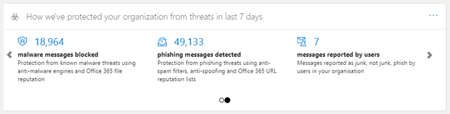
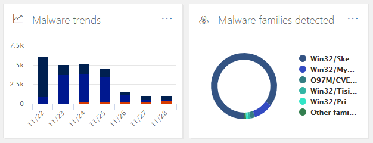
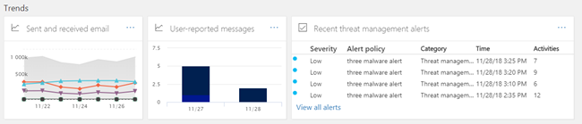

# Dashboard di sicurezza

[!INCLUDE [Microsoft 365 Defender rebranding](../includes/microsoft-defender-for-office.md)]

## Funzioni di base e apertura del dashboard di sicurezza

Il [Centro sicurezza & conformità](../../compliance/go-to-the-securitycompliance-center.md) consente all'organizzazione di gestire la protezione dei dati e la conformità. Se si dispone delle autorizzazioni necessarie, il dashboard di sicurezza consente di esaminare lo stato della protezione dalle minacce, nonché di visualizzare e agire sugli avvisi di sicurezza.

Guarda il video per ottenere una panoramica e quindi leggi questo articolo per ulteriori informazioni.

> [!VIDEO https://www.microsoft.com/videoplayer/embed/RE1VV3o]

A seconda di cosa include la sottoscrizione dell'organizzazione, il dashboard di sicurezza include diversi widget, come riepilogo della gestione delle minacce, stato di protezione delle minacce, rilevamenti di minacce settimanali globali, malware e altro ancora, come descritto nelle sezioni seguenti.

Per visualizzare il dashboard di sicurezza, nel [Centro sicurezza & conformità](../../compliance/go-to-the-securitycompliance-center.md), accedere a **Threat Management** \> **Dashboard**.

> [!NOTE]
> Per visualizzare il dashboard di sicurezza, è necessario essere un amministratore globale, un amministratore della sicurezza o un lettore di sicurezza. Alcuni widget richiedono ulteriori autorizzazioni per la visualizzazione. Per ulteriori informazioni, vedere [Permissions in the Security & Compliance Center](permissions-in-the-security-and-compliance-center.md).

## Riepilogo di gestione delle minacce

Il widget di riepilogo per la gestione delle minacce fornisce una breve panoramica sul modo in cui l'organizzazione è stata protetta dalle minacce negli ultimi sette (7) giorni.

Le informazioni visualizzate nel Riepilogo di gestione delle minacce dipendono dal tipo di sottoscrizione incluso. Nella tabella seguente vengono descritte le informazioni incluse in Office 365 E3 e Office 365 E5.

|Office 365 E3|Office 365 E5|
|---|---|
|Messaggi di malware bloccati Messaggi di phishing bloccati Messaggi segnalati dagli utenti    |Messaggi di malware bloccati Messaggi di phishing bloccati Messaggi segnalati dagli utenti Malware zero-day bloccato Messaggi di phishing avanzati rilevati URL dannosi bloccati|

Per visualizzare o accedere al widget di riepilogo di gestione delle minacce, è necessario disporre delle autorizzazioni per visualizzare i report di Defender per Office 365. Per ulteriori informazioni, vedere [quali autorizzazioni sono necessarie per visualizzare i report del difensore per Office 365?](view-reports-for-atp.md#what-permissions-are-needed-to-view-the-defender-for-office-365-reports).

## Stato di protezione dalle minacce

Il widget dello stato di protezione delle minacce Mostra l'efficacia della protezione dalle minacce con una visualizzazione dettagliata di phishing e malware.

I dettagli dipendono dal fatto che la sottoscrizione Microsoft 365 includa [Exchange Online Protection](exchange-online-protection-overview.md) (EOP) con o senza [Microsoft Defender per Office 365](office-365-atp.md).

|Se l'abbonamento è incluso in...|Vedrai questi dettagli|
|---|---|
|EOP ma non Microsoft Defender per Office 365|Messaggi di posta elettronica dannosi che sono stati rilevati e bloccati da EOP.   Vedere [Threat Protection status report (EOP)](view-email-security-reports.md#threat-protection-status-report).|
|Microsoft Defender per Office 365|Contenuto dannoso e messaggi di posta elettronica dannosi rilevati e bloccati da EOP e Defender per Office 365  Numero aggregato di messaggi di posta elettronica univoci con contenuti dannosi bloccati dal motore antimalware, [zero-hour auto Purge](zero-hour-auto-purge.md)e Defender for Office 365 features (inclusi [collegamenti sicuri](atp-safe-links.md), [allegati sicuri](atp-safe-attachments.md)e [anti-phishing in Defender per Office 365](set-up-anti-phishing-policies.md#exclusive-settings-in-anti-phishing-policies-in-microsoft-defender-for-office-365)).  Vedere [rapporto sullo stato della protezione dalle minacce](view-reports-for-atp.md#threat-protection-status-report).|

Per visualizzare o accedere al widget dello stato di protezione dalle minacce, è necessario disporre delle autorizzazioni per visualizzare i report di Defender per Office 365. Per ulteriori informazioni, vedere [quali autorizzazioni sono necessarie per visualizzare i report del difensore per Office 365?](view-reports-for-atp.md#what-permissions-are-needed-to-view-the-defender-for-office-365-reports)

## Rilevamenti di minacce globali settimanali

Il widget globale settimanale per i rilevamenti di minacce indica quante minacce sono state rilevate nei messaggi di posta elettronica negli ultimi sette (7) giorni.

Le metriche vengono calcolate come descritto nella tabella seguente:

|Metrica|Modalità di calcolo|
|---|---|
|Messaggi analizzati|Numero di messaggi di posta elettronica analizzati moltiplicati per il numero di destinatari|
|Minacce interrotte|Numero di messaggi di posta elettronica identificati come contenenti malware moltiplicato per il numero di destinatari|
|Bloccato da [difensore per Office 365 ](office-365-atp.md)|Numero di messaggi di posta elettronica bloccati dal difensore per Office 365 moltiplicato per il numero di destinatari|
|Rimossi dopo il recapito|Numero di messaggi rimossi da [zero-hour auto Purge](zero-hour-auto-purge.md) moltiplicato per il numero di destinatari|

## Malware

I widget malware mostrano informazioni sui trend di malware e sui tipi di famiglia di malware negli ultimi sette (7) giorni.

## Approfondimenti

Insights non solo i problemi principali che è necessario esaminare, ma anche suggerimenti e azioni da prendere in considerazione.

Ad esempio, si potrebbe vedere che i messaggi di posta elettronica di phishing vengono recapitati perché alcuni utenti hanno disabilitato le opzioni di posta indesiderata. Per ulteriori informazioni sul funzionamento delle intuizioni, vedere [Reports and Insights in the Security & Compliance Center](reports-and-insights-in-security-and-compliance.md).

## Analisi e risposta alle minacce

Se l'abbonamento dell'organizzazione include  [Microsoft Defender per Office 365 piano 2](office-365-ti.md), nel dashboard di sicurezza è presente una sezione che include l'analisi avanzata delle minacce e gli strumenti di risposta. Questi strumenti includono le [funzionalità di analisi e risposta automatizzate](automated-investigation-response-office.md). L'analisi e la risposta automatizzate possono essere utili in scenari quali l' [indirizzamento rapido degli account utente compromessi](address-compromised-users-quickly.md).

Per ulteriori informazioni, vedere [Introduzione all'analisi automatizzata e alla risposta (Air) in Office 365](office-365-air.md).

## Tendenze

Nella parte inferiore del dashboard di sicurezza è presente una sezione **Trends** , in cui vengono riepilogate le tendenze del flusso di posta elettronica per l'organizzazione. I rapporti forniscono informazioni sui messaggi di posta elettronica categorizzati come posta indesiderata, malware, tentativi di phishing e una buona posta elettronica. Fare clic su un riquadro per visualizzare informazioni più dettagliate nel report.

Inoltre, se la sottoscrizione dell'organizzazione include il [difensore per Office 365 piano 2](office-365-ti.md), è disponibile un rapporto di **avvisi di gestione delle minacce recente** in questa sezione che consente al team di sicurezza di visualizzare e intervenire su avvisi di sicurezza ad alta priorità.

Per visualizzare o accedere al widget messaggi di posta elettronica inviati e ricevuti, è necessario disporre delle autorizzazioni per visualizzare i report di Defender per Office 365. Per ulteriori informazioni, vedere [quali autorizzazioni sono necessarie per visualizzare i report del difensore per Office 365?](view-reports-for-atp.md#what-permissions-are-needed-to-view-the-defender-for-office-365-reports).

Per visualizzare o accedere al widget recenti avvisi di gestione delle minacce, è necessario disporre delle autorizzazioni per visualizzare gli avvisi. Per ulteriori informazioni, vedere le [autorizzazioni RBAC necessarie per visualizzare gli avvisi](../../compliance/alert-policies.md#rbac-permissions-required-to-view-alerts).

## Argomenti correlati

[Visualizzare i report sulla sicurezza della posta elettronica nel Centro sicurezza e conformità](view-email-security-reports.md)

[Visualizzare i report per Microsoft Defender per Office 365](view-reports-for-atp.md)

[Defender per Office 365](office-365-atp.md)

[Indagine e risposta alle minacce di Office 365](office-365-ti.md)
