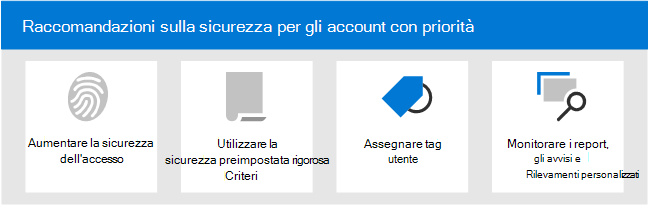

# Suggerimenti per la sicurezza per gli account con priorità in Microsoft 365

Non tutti gli account utente hanno accesso alle stesse informazioni aziendali. Alcuni account hanno accesso a informazioni riservate, ad esempio dati finanziari, informazioni sullo sviluppo di prodotti, accesso dei partner a sistemi di compilazione critici e altro ancora. Se compromessi, gli account che hanno accesso a informazioni estremamente riservate rappresentano una grave minaccia. Chiamiamo questi tipi di account con _priorità_ account . Gli account di priorità includono (ma non sono limitati a) amministratori delegati, CISO, CFO, account di amministratore dell'infrastruttura, creare account di sistema e altro ancora.

Per gli utenti malintenzionati, gli attacchi di phishing ordinari che gettano una rete casuale per gli utenti ordinari o sconosciuti sono inefficienti. D'altra parte, gli _attacchi di spear phishing_ o di caccia alle _whaling_ che mirano agli account con priorità sono molto gratificanti per gli utenti malintenzionati. Pertanto, gli account con priorità richiedono una protezione più avanzata rispetto alla normale per evitare la compromissione dell'account.

Microsoft 365 e Microsoft Defender per Office 365 contengono diverse funzionalità chiave che forniscono livelli di sicurezza aggiuntivi per gli account con priorità. Questo articolo descrive queste funzionalità e come usarle.

****

|Attività|Tutti i piani di Office 365 Enterprise|Microsoft 365 E3|Microsoft 365 E5|
|---|:---:|:---:|:---:|
|[Aumentare la sicurezza di accesso per gli account con priorità](#increase-sign-in-security-for-priority-accounts)||||
|[Usare criteri di sicurezza preimpostati rigorosi per gli account con priorità](#use-strict-preset-security-policies-for-priority-accounts)||||
|[Applicare tag utente agli account con priorità](#apply-user-tags-to-priority-accounts)||||
|[Monitorare gli account di priorità in avvisi, report e rilevamenti](#monitor-priority-accounts-in-alerts-reports-and-detections)||||
|[Formare gli utenti](#train-users)||||
|

## Aumentare la sicurezza di accesso per gli account con priorità

Gli account con priorità richiedono una maggiore sicurezza di accesso. È possibile aumentare la sicurezza di accesso richiedendo l'autenticazione a più fattori (MFA) e disabilitando i protocolli di autenticazione legacy.

Per istruzioni, vedere [Passaggio 1. Aumentare la sicurezza di accesso per i lavoratori remoti con MFA](../../solutions/empower-people-to-work-remotely-secure-sign-in.md). Anche se questo articolo riguarda i lavoratori remoti, gli stessi concetti si applicano agli utenti con priorità.

**Nota:** è consigliabile disabilitare globalmente i protocolli di autenticazione legacy per tutti gli utenti con priorità, come descritto nell'articolo precedente. Se i requisiti aziendali impediscono questa operazione, Exchange Online offre i controlli seguenti per limitare l'ambito dei protocolli di autenticazione legacy:

- È possibile [utilizzare](/exchange/clients-and-mobile-in-exchange-online/disable-basic-authentication-in-exchange-online) i criteri di autenticazione e le regole di Accesso client [in](/exchange/clients-and-mobile-in-exchange-online/client-access-rules/client-access-rules) Exchange Online per bloccare o consentire l'autenticazione di base e i protocolli di autenticazione legacy come POP3, IMAP4 e SMTP autenticato per utenti specifici.

- È possibile disabilitare l'accesso POP3 e IMAP4 sulle singole cassette postali. È possibile disabilitare SMTP autenticato a livello di organizzazione e abilitarlo in cassette postali specifiche che lo richiedono ancora. Per istruzioni, vedere gli argomenti seguenti:
  - [Abilitare o disabilitare l'accesso POP3 o IMAP4 per un utente](/exchange/clients-and-mobile-in-exchange-online/pop3-and-imap4/enable-or-disable-pop3-or-imap4-access)
  - [Abilitare o disabilitare l'invio SMTP del client autenticato (AUTENTICAZIONE SMTP)](/exchange/clients-and-mobile-in-exchange-online/authenticated-client-smtp-submission)

Vale anche la pena notare che l'autenticazione di base è in fase di deprecazione in Exchange Online for Exchange Web Services (EWS), Exchange ActiveSync, POP3, IMAP4 e Remote PowerShell. Per informazioni dettagliate, vedere questo [post di blog](https://developer.microsoft.com/office/blogs/deferred-end-of-support-date-for-basic-authentication-in-exchange-online/).

## Usare criteri di sicurezza preimpostati rigorosi per gli account con priorità

Gli utenti con priorità richiedono azioni più stringenti per le varie protezioni disponibili in Exchange Online Protection (EOP) e Defender per Office 365.

Ad esempio, invece di recapitare i messaggi classificati come posta indesiderata nella cartella Posta indesiderata, è consigliabile mettere in quarantena gli stessi messaggi se sono destinati agli account di priorità.

Puoi implementare questo approccio rigoroso per gli account con priorità usando il profilo Strict nei criteri di sicurezza preimpostati.

I criteri di sicurezza predefiniti sono una posizione comoda e centrale per applicare le impostazioni dei criteri rigorosi consigliate per tutte le protezioni in EOP e Defender per Office 365. Per ulteriori informazioni, vedere [Criteri di sicurezza predefiniti in EOP e Microsoft Defender per Office 365.](preset-security-policies.md)

Per informazioni dettagliate sulle differenze tra le impostazioni dei criteri Strict e standard, vedere [Recommended settings for EOP and Microsoft Defender for Office 365 security.](recommended-settings-for-eop-and-office365-atp.md)

## Applicare tag utente agli account con priorità

I tag utente in Microsoft Defender per Office 365 Piano 2 (nell'ambito di Microsoft 365 E5 o di un abbonamento a un componente aggiuntivo) consentono di identificare e classificare rapidamente utenti o gruppi specifici di utenti in report e indagini sugli incidenti.

**Gli account** di priorità sono un tipo di tag utente predefinito (noto come _tag_ di sistema) che è possibile utilizzare per identificare eventi imprevisti e avvisi che coinvolgono account con priorità. Per ulteriori informazioni sugli **account con priorità,** vedere [Manage and monitor priority accounts](../../admin/setup/priority-accounts.md).

Puoi anche creare tag personalizzati per identificare e classificare ulteriormente gli account di priorità. Per ulteriori informazioni, vedere [Tag utente](user-tags.md). Tieni presente che puoi gestire **gli account di priorità** (tag di sistema) nella stessa interfaccia dei tag utente personalizzati.

## Monitorare gli account di priorità in avvisi, report e rilevamenti

Dopo aver protetto e etichettato gli utenti con priorità, è possibile utilizzare i report, gli avvisi e le indagini disponibili in EOP e Defender per Office 365 per identificare rapidamente gli incidenti o i rilevamenti che coinvolgono account con priorità. Le funzionalità che supportano i tag utente sono descritte nella tabella seguente.

 

****

|Funzionalità|Descrizione|
|---|---|
|Avvisi|I tag utente degli utenti interessati sono  visibili e disponibili come filtri nella pagina Visualizza avvisi nel Centro sicurezza & conformità. Per ulteriori informazioni, vedere [Visualizzazione degli avvisi.](../../compliance/alert-policies.md#viewing-alerts)|
|Esplora minacce 
 Rilevamenti in tempo reale|In **Esplora** minacce (Microsoft Defender per Office 365 Piano 2) o rilevamenti in tempo reale **(Microsoft** Defender per Office 365 Piano 1), i tag utente sono visibili nella visualizzazione Griglia della posta elettronica e nel riquadro a comparsa Dettagli posta elettronica. I tag utente sono disponibili anche come proprietà filtrabile. Per altre informazioni, vedi [Tag in Threat Explorer.](threat-explorer.md#tags-in-threat-explorer)|
|Visualizzazioni campagna|I tag utente sono una delle molte proprietà filtrabili in Visualizzazioni campagna in Microsoft Defender per Office 365 Piano 2. Per ulteriori informazioni, vedere [Visualizzazioni campagna.](campaigns.md)|
|Report dello stato di protezione dalle minacce|In praticamente tutte le visualizzazioni e le tabelle dei dettagli nel rapporto sullo stato di **Threat Protection** è possibile filtrare i risultati in base agli account **di priorità.** Per ulteriori informazioni, vedere [Rapporto sullo stato di Protezione dalle minacce](view-email-security-reports.md#threat-protection-status-report).|
|Report Problemi di posta elettronica per gli account con priorità|Il **report Problemi di posta** elettronica per gli account di priorità nell'interfaccia di amministrazione di Exchange contiene informazioni sui messaggi non recapitati e ritardati per gli account con **priorità.** Per ulteriori informazioni, vedere [Email issues for priority accounts report.](/exchange/monitoring/mail-flow-reports/mfr-email-issues-for-priority-accounts-report)|
|

## Formare gli utenti

La formazione degli utenti con account con priorità può aiutare a risparmiare molto tempo e frustrazione per gli utenti e il team delle operazioni di sicurezza. Gli utenti esperti hanno meno probabilità di aprire allegati o fare clic su collegamenti in messaggi di posta elettronica discutibili e sono più propensi a evitare siti Web sospetti.

Il manuale della campagna per la [cybersecurity](https://www.belfercenter.org/CyberPlaybook) della scuola Kennedy di Harvard fornisce indicazioni eccellenti per stabilire una cultura solida della consapevolezza della sicurezza all'interno dell'organizzazione, inclusa la formazione degli utenti per identificare gli attacchi di phishing.

Microsoft 365 fornisce le risorse seguenti per informare gli utenti dell'organizzazione:

 

****

|Concetti|Risorse|Descrizione|
|---|---|---|
|Microsoft 365|[Percorsi di apprendimento personalizzabili](/office365/customlearning/)|Queste risorse consentono di mettere insieme la formazione per gli utenti dell'organizzazione.|
|Sicurezza Microsoft 365|[Modulo di apprendimento: proteggere l'organizzazione con sicurezza intelligente integrata da Microsoft 365](/learn/modules/security-with-microsoft-365)|Questo modulo consente di descrivere il modo in cui le funzionalità di sicurezza di Microsoft 365 funzionano insieme e di illustrare i vantaggi di queste funzionalità di sicurezza.|
|Autenticazione a più fattori|[Verifica in due passaggi: qual è la pagina di verifica aggiuntiva?](/azure/active-directory/user-help/multi-factor-authentication-end-user-first-time)|Questo articolo consente agli utenti finali di comprendere cos'è l'autenticazione a più fattori e perché viene utilizzata nell'organizzazione.|
|Formazione per la simulazione di attacchi|[Introduzione alla formazione sull’uso di Simulatore di attacchi](attack-simulation-training-get-started.md)|La formazione sulla simulazione di attacchi in Microsoft Defender per Office 365 Piano 2 consente agli amministratori di configurare, avviare e tenere traccia degli attacchi di phishing simulati contro gruppi specifici di utenti.|

Inoltre, Microsoft consiglia agli utenti di eseguire le azioni descritte in questo articolo: Proteggere [l'account](https://support.microsoft.com/office/066d6216-a56b-4f90-9af3-b3a1e9a327d6)e i dispositivi da hacker e malware. Queste azioni includono:

- Utilizzo di password complesse
- Protezione dei dispositivi
- Abilitazione delle funzionalità di sicurezza nei PC Windows 10 e Mac (per dispositivi non gestiti)

## Vedere anche

[Annuncio della protezione dell'account con priorità in Microsoft Defender per Office 365](https://techcommunity.microsoft.com/t5/microsoft-defender-for-office/announcing-priority-account-protection-in-microsoft-defender-for/ba-p/1696385)