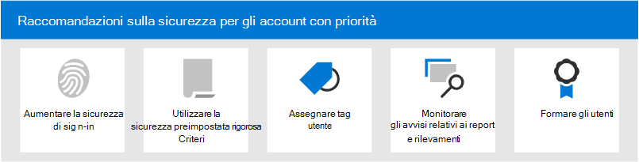

# Consigli sulla sicurezza per gli account con priorità in Microsoft 365

Non tutti gli account utente hanno accesso alle stesse informazioni aziendali. Alcuni account hanno accesso a informazioni riservate, ad esempio dati finanziari, informazioni sullo sviluppo di prodotti, accesso dei partner a sistemi di compilazione critici e altro ancora. Se compromessi, gli account che hanno accesso a informazioni estremamente riservate rappresentano una minaccia grave. Questi tipi di account vengono d'altro tipo _con priorità._ Gli account di priorità includono ( ma non sono limitati a) amministratori delegati, CISO, CFO, account di amministratore dell'infrastruttura, creare account di sistema e altro ancora.

Per gli utenti malintenzionati, gli attacchi di phishing ordinari che scacciano una rete casuale per utenti ordinari o sconosciuti non sono efficienti. D'altra parte, gli attacchi _di phishing_ o _di whaling_ mirati agli account con priorità sono molto gratificanti per gli utenti malintenzionati. Pertanto, gli account con priorità richiedono una protezione più avanzata rispetto a quella ordinaria per evitare la compromissione dell'account.

Microsoft 365 e Microsoft Defender per Office 365 contengono diverse funzionalità chiave che forniscono livelli di sicurezza aggiuntivi per gli account con priorità. Questo articolo descrive queste funzionalità e come usarle.

****

|Attività|Tutti i piani di Office 365 Enterprise|Microsoft 365 E3|Microsoft 365 E5|
|---|:---:|:---:|:---:|
|[Aumentare la sicurezza dell'accesso per gli account con priorità](#increase-sign-in-security-for-priority-accounts)||||
|[Usare criteri di sicurezza preimpostati rigorosi per gli account con priorità](#use-strict-preset-security-policies-for-priority-accounts)||||
|[Applicare tag utente agli account con priorità](#apply-user-tags-to-priority-accounts)||||
|[Monitorare gli account di priorità in avvisi, report e rilevamenti](#monitor-priority-accounts-in-alerts-reports-and-detections)||||
|[Formare gli utenti](#train-users)||||
|

## Aumentare la sicurezza dell'accesso per gli account con priorità

Gli account con priorità richiedono una maggiore sicurezza di accesso. È possibile aumentare la sicurezza di accesso richiedendo l'autenticazione a più fattori (MFA) e disabilitando i protocolli di autenticazione legacy.

Per istruzioni, vedere [il passaggio 1. Aumentare la sicurezza dell'accesso per i lavoratori remoti con MFA.](https://docs.microsoft.com/microsoft-365/solutions/empower-people-to-work-remotely-secure-sign-in) Anche se questo articolo riguarda i lavoratori remoti, gli stessi concetti si applicano agli utenti con priorità.

**Nota:** è consigliabile disabilitare globalmente i protocolli di autenticazione legacy per tutti gli utenti con priorità, come descritto nell'articolo precedente. Se i requisiti aziendali impediscono tale operazione, Exchange Online offre i seguenti controlli per limitare l'ambito dei protocolli di autenticazione legacy:

- È possibile  utilizzare i criteri di autenticazione e le regole di Accesso client [in](https://docs.microsoft.com/exchange/clients-and-mobile-in-exchange-online/client-access-rules/client-access-rules) Exchange Online per bloccare o consentire l'autenticazione di base e i protocolli di autenticazione legacy come POP3, IMAP4 e SMTP autenticato per utenti specifici.

- È possibile disabilitare l'accesso POP3 e IMAP4 nelle singole cassette postali. È possibile disabilitare SMTP autenticato a livello dell'organizzazione e abilitarlo in cassette postali specifiche che lo richiedono ancora. Per istruzioni, vedere gli argomenti seguenti:
  - [Abilitare o disabilitare l'accesso POP3 o IMAP4 per un utente](https://docs.microsoft.com/exchange/clients-and-mobile-in-exchange-online/pop3-and-imap4/enable-or-disable-pop3-or-imap4-access)
  - [Abilitare o disabilitare l'invio SMTP del client autenticato (SMTP AUTH)](https://docs.microsoft.com/exchange/clients-and-mobile-in-exchange-online/authenticated-client-smtp-submission)

Vale anche la pena notare che l'autenticazione di base è in fase di deprecazione in Exchange Online per Exchange Web Services (EWS), Exchange ActiveSync, POP3, IMAP4 e Remote PowerShell. Per informazioni dettagliate, vedere questo [post di blog.](https://developer.microsoft.com/office/blogs/deferred-end-of-support-date-for-basic-authentication-in-exchange-online/)

## Usare criteri di sicurezza preimpostati rigorosi per gli account con priorità

Gli utenti con priorità richiedono azioni più stringenti per le varie protezioni disponibili in Exchange Online Protection (EOP) e Defender per Office 365.

Ad esempio, invece di recapitare i messaggi classificati come posta indesiderata nella cartella Posta indesiderata, è consigliabile mettere in quarantena gli stessi messaggi se sono destinati agli account con priorità.

È possibile implementare questo approccio rigoroso per gli account con priorità utilizzando il profilo Strict nei criteri di sicurezza preimpostati.

I criteri di sicurezza preimpostati sono una posizione comoda e centrale per applicare le impostazioni dei criteri strict consigliate per tutte le protezioni in EOP e Defender per Office 365. Per ulteriori informazioni, vedere [Criteri di sicurezza preimpostati in EOP e Microsoft Defender per Office 365.](preset-security-policies.md)

Per informazioni dettagliate sulle differenze tra le impostazioni dei criteri Strict e le impostazioni predefinite e standard, vedere Impostazioni consigliate per EOP e Microsoft Defender per la sicurezza [di Office 365.](recommended-settings-for-eop-and-office365-atp.md)

## Applicare tag utente agli account con priorità

I tag utente in Microsoft Defender per Office 365 Piano 2 (nell'ambito di Microsoft 365 E5 o di un abbonamento a un componente aggiuntivo) consentono di identificare e classificare rapidamente utenti o gruppi di utenti specifici in report e indagini su eventi imprevisti.

**Gli account** di priorità sono un tipo di tag utente predefinito (noto come _tag_ di sistema) che è possibile utilizzare per identificare eventi imprevisti e avvisi che coinvolgono account con priorità. Per ulteriori informazioni sugli **account con priorità,** vedere [Gestire e monitorare gli account di priorità.](https://docs.microsoft.com/microsoft-365/admin/setup/priority-accounts)

Puoi anche creare tag personalizzati per identificare e classificare ulteriormente gli account con priorità. Per ulteriori informazioni, vedere [Tag utente.](user-tags.md) Tieni presente che puoi gestire **gli account di priorità** (tag di sistema) nella stessa interfaccia dei tag utente personalizzati.

## Monitorare gli account di priorità in avvisi, report e rilevamenti

Dopo aver protetto e etichettato gli utenti con priorità, è possibile utilizzare i report, gli avvisi e le indagini disponibili in EOP e Defender per Office 365 per identificare rapidamente gli eventi imprevisti o i rilevamenti che coinvolgono account con priorità. Le funzionalità che supportano i tag utente sono descritte nella tabella seguente.

 

****

|Funzionalità|Descrizione|
|---|---|
|Avvisi|I tag utente degli utenti interessati sono  visibili e disponibili come filtri nella pagina Visualizza avvisi nel Centro sicurezza & conformità. Per ulteriori informazioni, vedere [Visualizzazione degli avvisi.](https://docs.microsoft.com/microsoft-365/compliance/alert-policies#viewing-alerts)|
|Esplora minacce 
 Rilevamenti in tempo reale|In **Esplora** minacce (Microsoft Defender per Office 365 Piano 2) o rilevamenti in tempo reale **(Microsoft** Defender per Office 365 Piano 1), i tag utente sono visibili nella visualizzazione griglia della posta elettronica e nel riquadro a comparsa Dei dettagli della posta elettronica. I tag utente sono inoltre disponibili come proprietà filtrabile. Per altre informazioni, vedi [Tag in Esplora minacce.](threat-explorer.md#tags-in-threat-explorer)|
|Visualizzazioni campagna|I tag utente sono una delle molte proprietà filtrabili in Visualizzazioni campagna in Microsoft Defender per Office 365 Piano 2. Per ulteriori informazioni, vedere [Visualizzazioni campagna.](campaigns.md)|
|Report dello stato di protezione dalle minacce|In praticamente tutte le tabelle delle visualizzazioni e dei dettagli nella relazione sullo stato di **Protezione** dalle minacce, è possibile filtrare i risultati in base agli **account con priorità.** Per ulteriori informazioni, vedere [la relazione sullo stato di Protezione dalle minacce.](view-email-security-reports.md#threat-protection-status-report)|
|Report Problemi di posta elettronica per gli account con priorità|Il **rapporto Problemi di posta** elettronica per gli account con priorità nell'interfaccia di amministrazione di Exchange contiene informazioni sui messaggi non recapitati e ritardati per gli account con **priorità.** Per ulteriori informazioni, vedere Report [problemi di posta elettronica per gli account con priorità.](https://docs.microsoft.com/exchange/monitoring/mail-flow-reports/mfr-email-issues-for-priority-accounts-report)|
|

## Formare gli utenti

Formare gli utenti con account prioritari può aiutare a risparmiare tempo e frustrazione a tali utenti e al team delle operazioni di sicurezza. Gli utenti esperti sono meno propensi ad aprire allegati o a fare clic sui collegamenti in messaggi di posta elettronica discutibili ed è più probabile che evitino siti Web sospetti.

Il manuale della campagna per la [cybersecurity](https://www.belfercenter.org/CyberPlaybook) dell'università Disaffezione school di Università offre una guida eccellente per stabilire una forte cultura della sicurezza all'interno dell'organizzazione, inclusa la formazione degli utenti per identificare gli attacchi di phishing.

Microsoft 365 fornisce le risorse seguenti per informare gli utenti dell'organizzazione:

 

****

|Concetti|Risorse|Descrizione|
|---|---|---|
|Microsoft 365|[Percorsi di apprendimento personalizzabili](https://docs.microsoft.com/office365/customlearning/)|Queste risorse consentono di mettere insieme la formazione per gli utenti dell'organizzazione.|
|Sicurezza Microsoft 365|[Modulo di apprendimento: Proteggere l'organizzazione con sicurezza intelligente integrata di Microsoft 365](https://docs.microsoft.com/learn/modules/security-with-microsoft-365)|Questo modulo consente di descrivere il modo in cui le funzionalità di sicurezza di Microsoft 365 funzionano insieme e di illustrare i vantaggi di queste funzionalità di sicurezza.|
|Autenticazione a più fattori|[Verifica in due passaggi: che cos'è la pagina di verifica aggiuntiva?](https://docs.microsoft.com/azure/active-directory/user-help/multi-factor-authentication-end-user-first-time)|Questo articolo consente agli utenti finali di comprendere cos'è l'autenticazione a più fattori e perché viene utilizzata nell'organizzazione.|
|Formazione per la simulazione degli attacchi|[Introduzione alla formazione sull’uso di Simulatore di attacchi](attack-simulation-training-get-started.md)|La formazione sulla simulazione degli attacchi in Microsoft Defender per Office 365 Piano 2 consente all'amministratore di configurare, avviare e tenere traccia degli attacchi di phishing simulati contro gruppi specifici di utenti.|

Inoltre, Microsoft consiglia agli utenti di eseguire le azioni descritte in questo articolo: Proteggere [l'account](https://support.microsoft.com/office/066d6216-a56b-4f90-9af3-b3a1e9a327d6)e i dispositivi da hacker e malware. Queste azioni includono:

- Utilizzo di password complesse
- Protezione dei dispositivi
- Abilitazione delle funzionalità di sicurezza nei PC Windows 10 e Mac (per dispositivi non gestiti)

## Vedere anche

[Annuncio della protezione dell'account con priorità in Microsoft Defender per Office 365](https://techcommunity.microsoft.com/t5/microsoft-defender-for-office/announcing-priority-account-protection-in-microsoft-defender-for/ba-p/1696385)
