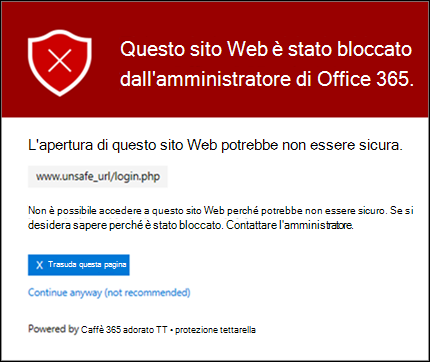

# Configurare un elenco di URL bloccati personalizzato utilizzando i collegamenti sicuri di ATPSet up a custom blocked URLs list using ATP Safe Links

> [!IMPORTANT]
> Questo articolo è rivolto ai clienti aziendali di [Office 365 Advanced Threat Protection](office-365-atp.md).This article is intended for business customers who have [Office 365 Advanced Threat Protection](office-365-atp.md). Se si è un utente di casa che cerca informazioni sui collegamenti sicuri in Outlook, vedere [Advanced Outlook.com Security](https://support.microsoft.com/office/882d2243-eab9-4545-a58a-b36fee4a46e2).If you are a home user looking for information about Safe Links in Outlook, see [Advanced Outlook.com security](https://support.microsoft.com/office/882d2243-eab9-4545-a58a-b36fee4a46e2).

Con [Office 365 Advanced Threat Protection](office-365-atp.md) (ATP), l'organizzazione può disporre di un elenco personalizzato di indirizzi Web (URL) bloccati.With [Office 365 Advanced Threat Protection](office-365-atp.md) (ATP), your organization can have a custom list of website addresses (URLs) that are blocked. Quando viene bloccato un URL, gli utenti che fanno clic sui collegamenti all'URL bloccato vengono indirizzati a una [pagina di avviso](atp-safe-links-warning-pages.md) simile all'immagine seguente:When a URL is blocked, people who click on links to the blocked URL are taken to a [warning page](atp-safe-links-warning-pages.md) that resembles the following image:

L'elenco degli URL bloccati è definito dal team di sicurezza Microsoft 365 for business dell'organizzazione e questo elenco si applica a tutti gli utenti dell'organizzazione interessati dai criteri dei collegamenti sicuri ATP di Office 365.The blocked URLs list is defined by your organization's Microsoft 365 for business security team, and that list applies to everyone in the organization who is covered by Office 365 ATP Safe Links policies.

Leggere questo articolo per informazioni su come configurare l'elenco degli URL bloccati personalizzati dell'organizzazione per i [collegamenti sicuri di ATP in Office 365](atp-safe-links.md).Read this article to learn how to set up your organization's custom blocked URLs list for [ATP Safe Links in Office 365](atp-safe-links.md).

## Visualizzazione o modifica di un elenco personalizzato di URL bloccatiView or edit a custom list of blocked URLs

I [collegamenti sicuri di ATP in Office 365](atp-safe-links.md) utilizzano diversi elenchi, tra cui l'elenco URL bloccati personalizzato dell'organizzazione.[ATP Safe Links in Office 365](atp-safe-links.md) uses several lists, including your organization's custom blocked URLs list. Se si dispone delle autorizzazioni necessarie, è possibile configurare l'elenco personalizzato dell'organizzazione.If you have the necessary permissions, you can set up your organization's custom list. A tale scopo, modificare il criterio collegamenti sicuri predefinito dell'organizzazione.You do this by editing your organization's default Safe Links policy.

Per modificare (o definire) i criteri ATP, è necessario essere assegnati a uno dei ruoli descritti nella tabella seguente:To edit (or define) ATP policies, you must be assigned one of the roles described in the following table:

****

|RuoloRole|Dove/come assegnatoWhere/how assigned|
|---|---|
|amministratore globaleglobal administrator|La persona che si iscrive all'acquisto di Microsoft 365 è un amministratore globale per impostazione predefinita.The person who signs up to buy Microsoft 365 is a global admin by default. Per ulteriori informazioni, vedere [informazioni sui ruoli di amministratore di Microsoft 365](https://docs.microsoft.com/microsoft-365/admin/add-users/about-admin-roles) .(See [About Microsoft 365 admin roles](https://docs.microsoft.com/microsoft-365/admin/add-users/about-admin-roles) to learn more.)|
|Amministratore della sicurezzaSecurity Administrator|Interfaccia di amministrazione di Azure Active Directory ( [https://aad.portal.azure.com](https://aad.portal.azure.com) )Azure Active Directory admin center ([https://aad.portal.azure.com](https://aad.portal.azure.com))|
|Gestione organizzazione di Exchange OnlineExchange Online Organization Management|Interfaccia di amministrazione di Exchange ( [https://outlook.office365.com/ecp](https://outlook.office365.com/ecp) )Exchange admin center ([https://outlook.office365.com/ecp](https://outlook.office365.com/ecp))  oppureor    Cmdlet di PowerShell (vedere [Exchange Online PowerShell](https://docs.microsoft.com/powershell/exchange/exchange-online-powershell))PowerShell cmdlets (See [Exchange Online PowerShell](https://docs.microsoft.com/powershell/exchange/exchange-online-powershell))|
|

> [!TIP]
> Per ulteriori informazioni sui ruoli e sulle autorizzazioni, vedere [Permissions in the Security & Compliance Center](permissions-in-the-security-and-compliance-center.md).To learn more about roles and permissions, see [Permissions in the Security & Compliance Center](permissions-in-the-security-and-compliance-center.md).

### Per visualizzare o modificare un elenco di URL bloccati personalizzatoTo view or edit a custom blocked URLs list

1. Accedere a [https://protection.office.com](https://protection.office.com) e accedere con l'account aziendale o dell'Istituto di istruzione.Go to [https://protection.office.com](https://protection.office.com) and sign in with your work or school account.

2. Nella barra di spostamento a sinistra, in **gestione minacce**, scegliere **Policy** \> **collegamenti sicuri**per i criteri.In the left navigation, under **Threat management**, choose **Policy** \> **Safe Links**.

3. Nei **criteri che si applicano all'intera sezione organizzazione** selezionare **predefinita**e quindi fare clic su **modifica** (il pulsante modifica è simile a una matita).In the **Policies that apply to the entire organization** section, select **Default**, and then choose **Edit** (the Edit button resembles a pencil).  In questo modo è possibile visualizzare l'elenco degli URL bloccati.This enables you to view your list of blocked URLs. All'inizio, potrebbe non essere presente alcun URL.At first, you might not have any URLs listed here. 

4. Selezionare la casella **immettere un URL valido** , digitare un URL e quindi scegliere il segno di addizione ( **+** ).Select the **Enter a valid URL** box, type a URL, and then choose the plus sign (**+**).

5. Dopo aver aggiunto gli URL, fare clic su **Salva**nell'angolo in basso a destra dello schermo.When you are finished adding URLs, in the lower right corner of the screen, choose **Save**.

## Alcuni aspetti da tenere presentiA few things to keep in mind

Quando si aggiungono URL all'elenco, tenere presente quanto segue:While you add URLs to your list, keep the following points in mind:

- Non includere una barra ( **/** ) alla fine dell'URL.Do not include a forward slash ( **/**) at the end of the URL. Ad esempio, invece di `https://www.contoso.com/` immettere, immetti `https://www.contoso.com` .For example, instead of entering `https://www.contoso.com/`, enter `https://www.contoso.com`.

- È possibile specificare un URL di solo dominio (come `contoso.com` or `tailspintoys.com` ).You can specify a domain-only URL (like `contoso.com` or `tailspintoys.com`). Questo bloccherà gli scatti su qualsiasi URL che contiene il dominio.This will block clicks on any URL that contains the domain.

- È possibile specificare un sottodominio (come `toys.contoso.com*` ) senza bloccare un dominio completo (come `contoso.com` ).You can specify a subdomain (like `toys.contoso.com*`) without blocking a full domain (like `contoso.com`). Questo blocco farà clic su qualsiasi URL contenente il sottodominio, ma non bloccherà i clic su un URL che contiene il dominio completo.This will block clicks any URL that contains the subdomain, but it won't block clicks to a URL that contains the full domain.

- È possibile includere fino a tre asterischi jolly ( \* ) per URL.You can include up to three wildcard asterisks (\*) per URL. Nella tabella seguente sono elencati alcuni esempi di elementi che è possibile immettere e quali sono gli effetti di tali voci.The following table lists some examples of what you can enter and what effect those entries have.

****

|Voce di esempioExample Entry|Cosa faWhat It Does|
|---|---|
|`contoso.com` o `*contoso.com*``contoso.com` or `*contoso.com*`|Blocca il dominio, i sottodomini e i percorsi, ad esempio `https://www.contoso.com` , `https://sub.contoso.com` e `https://contoso.com/abc`Blocks the domain, subdomains, and paths, such as `https://www.contoso.com`, `https://sub.contoso.com`, and `https://contoso.com/abc`|
|`https://contoso.com/a`|Blocca un sito, `https://contoso.com/a` ma non altri percorsi secondari come `https://contoso.com/a/b`Blocks a site `https://contoso.com/a` but not additional subpaths like `https://contoso.com/a/b`|
|`https://contoso.com/a*`|Blocca un sito `https://contoso.com/a` e altri percorsi secondari come `https://contoso.com/a/b`Blocks a site `https://contoso.com/a` and additional subpaths like `https://contoso.com/a/b`|
|`https://toys.contoso.com*`|Blocca un sottodominio ("giocattoli" in questo caso), ma consente di fare clic su altri URL di dominio (come `https://contoso.com` or `https://home.contoso.com` ).Blocks a subdomain ("toys" in this case) but allow clicks to other domain URLs (like `https://contoso.com` or `https://home.contoso.com`).|
|

> [!NOTE]
> Per impostazione predefinita, è possibile aggiungere 500 URL all'elenco degli URL bloccati nel criterio predefinito dei collegamenti sicuri ATP di Office 365.By default, you can only add 500 URLs to the blocked URL list in the Office 365 ATP Safe Links default policy.

## Come definire le eccezioni per alcuni utenti di un'organizzazioneHow to define exceptions for certain users in an organization

Se si desidera che alcuni gruppi siano in grado di visualizzare gli URL che potrebbero essere bloccati per gli altri utenti, è possibile specificare un criterio per i collegamenti sicuri ATP che si applica a destinatari specifici.If you want certain groups to be able to view URLs that might be blocked for others, you can specify an ATP Safe Links policy that applies to specific recipients. Vedere [configurare un elenco di URL "non riscrivere" personalizzato utilizzando i collegamenti sicuri di ATP](set-up-a-custom-do-not-rewrite-urls-list-with-atp.md).See [Set up a custom "do not rewrite" URLs list using ATP Safe Links](set-up-a-custom-do-not-rewrite-urls-list-with-atp.md).
