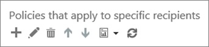

# Configurare un elenco di URL non di riscrittura personalizzato utilizzando i collegamenti sicuri ATP di Office 365Set up a custom do-not-rewrite URLs list using Office 365 ATP Safe Links

> [!IMPORTANT]
> Questo articolo è rivolto ai clienti aziendali di [Office 365 Advanced Threat Protection](office-365-atp.md).This article is intended for business customers who have [Office 365 Advanced Threat Protection](office-365-atp.md). Se si è un utente di casa che cerca informazioni sui collegamenti sicuri in Outlook, vedere [Advanced Outlook.com Security](https://support.office.com/article/882d2243-eab9-4545-a58a-b36fee4a46e2).If you are a home user looking for information about Safe Links in Outlook, see [Advanced Outlook.com security](https://support.office.com/article/882d2243-eab9-4545-a58a-b36fee4a46e2).

Con [Office 365 Advanced Threat Protection](office-365-atp.md) (ATP), l'organizzazione può disporre di un [URL bloccato personalizzato](set-up-a-custom-blocked-urls-list-wtih-atp.md), in modo che quando gli utenti fanno clic su indirizzi Web (URL) nei messaggi di posta elettronica o in determinati documenti di Office, vengono impediti di passare a tali URL.With [Office 365 Advanced Threat Protection](office-365-atp.md) (ATP), your organization can have a [custom blocked URLs](set-up-a-custom-blocked-urls-list-wtih-atp.md), such that when people click on web addresses (URLs) in email messages or certain Office documents, they are prevented from going to those URLs. L'organizzazione può anche disporre di elenchi personalizzati di "non riscrivere" per gruppi specifici dell'organizzazione.Your organization can also have custom "do not rewrite" lists for specific groups in your organization. Un elenco "non riscrivere" consente ad alcuni utenti di visitare gli URL che sono altrimenti bloccati da [collegamenti sicuri di ATP in Office 365](atp-safe-links.md).A "do not rewrite" list enables some people to visit URLs that are otherwise blocked by [ATP Safe Links in Office 365](atp-safe-links.md).

In questo articolo viene descritto come specificare un elenco di URL esclusi dall'analisi dei collegamenti sicuri ATP e alcuni punti importanti da tenere presenti.This article describes how to specify a list of URLs that are excluded from ATP Safe Links scanning, and a few important points to keep in mind.

## Configurare un elenco di "non riscrivere"Set up a "do not rewrite" list

La protezione dei collegamenti sicuri di ATP utilizza diversi elenchi, tra cui l'elenco degli URL bloccati dell'organizzazione e gli elenchi di "non riscrivere" per le eccezioni.ATP Safe Links protection uses several lists, including your organization's blocked URLs list and the "do not rewrite" lists for exceptions. Se si dispone delle autorizzazioni necessarie, è possibile configurare gli elenchi personalizzati "non riscrivere".If you have the necessary permissions, you can set up your custom "do not rewrite" lists. Questa operazione viene eseguita quando si aggiungono o si modificano i criteri per i collegamenti sicuri che si applicano a destinatari specifici dell'organizzazione.You do this when you add or edit Safe Links policies that apply to specific recipients in your organization.

Per modificare (o definire) i criteri ATP, è necessario essere assegnati a un ruolo appropriato.To edit (or define) ATP policies, you must be assigned an appropriate role. Nella tabella seguente sono inclusi alcuni esempi.The following table includes some examples. Per ulteriori informazioni, vedere [Permissions in the Office 365 Security & Compliance Center](permissions-in-the-security-and-compliance-center.md).To learn more, see [Permissions in the Office 365 Security & Compliance Center](permissions-in-the-security-and-compliance-center.md).

|RuoloRole  |Dove/come assegnatoWhere/how assigned  |
|---------|---------|
|Amministratore globale di Office 365Office 365 Global Administrator |Per impostazione predefinita, la persona che si iscrive all'acquisto di Office 365 è un amministratore globale.The person who signs up to buy Office 365 is a global admin by default. Per ulteriori informazioni, vedere [informazioni sui ruoli di amministratore di Office 365](https://docs.microsoft.com/office365/admin/add-users/about-admin-roles) .(See [About Office 365 admin roles](https://docs.microsoft.com/office365/admin/add-users/about-admin-roles) to learn more.)         |
|Amministratore della sicurezzaSecurity Administrator |Interfaccia di amministrazione di Azure Active[https://aad.portal.azure.com](https://aad.portal.azure.com)directory ()Azure Active Directory admin center ([https://aad.portal.azure.com](https://aad.portal.azure.com))|
|Gestione organizzazione di Exchange OnlineExchange Online Organization Management |Interfaccia di amministrazione di[https://outlook.office365.com/ecp](https://outlook.office365.com/ecp)Exchange ()Exchange admin center ([https://outlook.office365.com/ecp](https://outlook.office365.com/ecp))  oppureor    Cmdlet di PowerShell (vedere [Exchange Online PowerShell](https://docs.microsoft.com/powershell/exchange/exchange-online/exchange-online-powershell))PowerShell cmdlets (See [Exchange Online PowerShell](https://docs.microsoft.com/powershell/exchange/exchange-online/exchange-online-powershell)) |

> [!TIP]
> Per ulteriori informazioni sui ruoli e sulle autorizzazioni, vedere [Permissions in the Office 365 Security & Compliance Center](permissions-in-the-security-and-compliance-center.md).To learn more about roles and permissions, see [Permissions in the Office 365 Security & Compliance Center](permissions-in-the-security-and-compliance-center.md).

### Per visualizzare o modificare un elenco di URL personalizzato "non riscrivere"To view or edit a custom "do not rewrite" URLs list

1. Accedere a [https://protection.office.com](https://protection.office.com) e accedere con l'account aziendale o dell'Istituto di istruzione.Go to [https://protection.office.com](https://protection.office.com) and sign in with your work or school account.

2. Nel riquadro di spostamento a sinistra, in **collegamenti sicuri**per i **criteri** \> di **gestione** \> delle minacce.In the left navigation, under **Threat management** \> **Policy** \> **Safe Links**.

3. Nella sezione **criteri che si applicano a destinatari specifici** scegliere **nuovo** (il pulsante nuovo è simile a un segno di addizione ( **+**)) per creare un nuovo criterio.In the **Policies that apply to specific recipients** section, choose **New** (the New button resembles a plus sign ( **+**)) to create a new policy. In alternativa, è possibile modificare un criterio esistente.(Alternatively, you can edit an existing policy.) 

4. Specificare un nome e una descrizione per i criteri.Specify a name and description for your policy.

5. Nella sezione non **riscrivere gli URL seguenti** selezionare la casella **immettere un URL valido** e quindi digitare un URL e quindi scegliere il segno più (+).In the **Do not rewrite the following URLs** section, select the **Enter a valid URL** box, and then type a URL, and then choose the plus sign (+).

6. Nella sezione **applicato a** , scegliere **il destinatario è un membro di**, quindi scegliere il gruppo o i gruppi che si desidera includere nel criterio.In the **Applied To** section, choose **The recipient is a member of**, and then choose the group(s) you want to include in your policy. Scegliere **Aggiungi**e quindi fare clic su **OK**.Choose **Add**, and then choose **OK**.

7. Dopo aver aggiunto gli URL, fare clic su **Salva**nell'angolo in basso a destra dello schermo.When you are finished adding URLs, in the lower right corner of the screen, choose **Save**.

> [!NOTE]
> Assicurarsi di esaminare l'elenco personalizzato dell'organizzazione degli URL bloccati.Make sure to review your organization's custom list of blocked URLs. Vedere [configurare un elenco di URL bloccati personalizzato utilizzando i collegamenti sicuri di ATP](set-up-a-custom-blocked-urls-list-wtih-atp.md).See [Set up a custom blocked URLs list using ATP Safe Links](set-up-a-custom-blocked-urls-list-wtih-atp.md).

## Punti importanti da tenere presentiImportant points to keep in mind

- Gli URL specificati nell'elenco "non riscrivere" sono esclusi dall'analisi dei collegamenti sicuri ATP per i destinatari specificati.Any URLs that you specify in the "do not rewrite" list are excluded from ATP Safe Links scanning for the recipients that you specify.

- Se nell'elenco "non riscrivere" è già presente un elenco di URL, assicurarsi di esaminare l'elenco e aggiungere i caratteri jolly in base alle esigenze.If you already have a list of URLs in your "do not rewrite" list, make sure to review that list and add wildcards as appropriate. Ad esempio, se l'elenco esistente dispone di una voce `https://contoso.com/a` come e si desidera includere i sottopercorsi come `https://contoso.com/a/b` nel criterio, aggiungere un carattere jolly alla voce in modo che appaia come `https://contoso.com/a/*`.For example, if your existing list has an entry like `https://contoso.com/a` and you want to include subpaths like `https://contoso.com/a/b` in your policy, add a wildcard to your entry so it looks like `https://contoso.com/a/*`.

- Quando si specifica un elenco "non riscrivere" per un criterio di collegamenti sicuri ATP, è possibile includere fino a tre asterischi jolly (\*).When you specify a "do not rewrite" list for an ATP Safe Links policy, you can include up to three wildcard asterisks (\*). I caratteri jolly\*() vengono utilizzati per includere in modo esplicito prefissi o sottodomini.Wildcards (\*) are used to explicitly include prefixes or subdomains. La voce `contoso.com` non è la stessa `*.contoso.com/*`, perché `*.contoso.com/*` consente ai popoli di visitare i sottodomini e i percorsi nel dominio specificato.The entry `contoso.com` is not the same as `*.contoso.com/*`, because `*.contoso.com/*` allow peoples to visit subdomains and paths in the specified domain.

Nella tabella seguente sono elencati esempi di elementi che è possibile immettere e quali effetti hanno tali voci.The following table lists examples of what you can enter and what effect those entries have.

|**Voce di esempio****Example Entry**|**Cosa fa****What It Does**|
|:-----|:-----|
|`contoso.com`|Consente ai destinatari di visitare un sito `https://contoso.com` , ad esempio, ma non sottodomini o percorsi.Allows recipients to visit a site like `https://contoso.com` but not subdomains or paths.|
|`*.contoso.com/*`|Consente ai destinatari di visitare un dominio, sottodomini e percorsi, ad `https://www.contoso.com`esempio, `https://www.contoso.com` `https://maps.contoso.com`, o. `https://www.contoso.com/a`Allows recipients to visit a domain, subdomains, and paths, such as `https://www.contoso.com`, `https://www.contoso.com`, `https://maps.contoso.com`, or `https://www.contoso.com/a`.    Questa voce è intrinsecamente migliore rispetto `*contoso.com*`a quella, perché non include siti potenzialmente fraudolenti `https://www.falsecontoso.com` , come o`https://www.false.contoso.completelyfalse.com`This entry is inherently better than `*contoso.com*`, because it doesn't include potentially fraudulent sites, like `https://www.falsecontoso.com` or `https://www.false.contoso.completelyfalse.com`|
|`https://contoso.com/a`|Consente ai destinatari specifici di visitare un sito `https://contoso.com/a`, ad esempio, ma non i sottopercorsi come`https://contoso.com/a/b`Allows specific recipients to visit a site like `https://contoso.com/a`, but not subpaths like `https://contoso.com/a/b`|
|`https://contoso.com/a/*`|Consente ai destinatari specifici di visitare un sito `https://contoso.com/a` come e i sottopercorsi come`https://contoso.com/a/b`Allows specific recipients to visit a site like `https://contoso.com/a` and subpaths like `https://contoso.com/a/b`|
