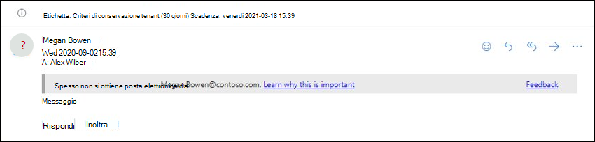

# Criteri anti-phishing in Microsoft 365

[!INCLUDE [Microsoft 365 Defender rebranding](../includes/microsoft-defender-for-office.md)]

**Si applica a**
- [Exchange Online Protection](exchange-online-protection-overview.md)
- [Microsoft Defender per Office 365 piano 1 e piano 2](defender-for-office-365.md)
- [Microsoft 365 Defender](../defender/microsoft-365-defender.md)

I criteri per configurare le impostazioni di protezione anti-phishing sono disponibili nelle organizzazioni di Microsoft 365 con cassette postali di Exchange Online, nelle organizzazioni di Exchange Online Protection (EOP) autonome senza cassette postali di Exchange Online e in Microsoft Defender per le organizzazioni Office 365.

Esempi di Microsoft Defender per Office 365 organizzazioni includono:

- Microsoft 365 Enterprise E5, Microsoft 365 Education A5 e così via.
- [Microsoft 365 Enterprise](https://www.microsoft.com/microsoft-365/enterprise/home)
- [Microsoft 365 Business](https://www.microsoft.com/microsoft-365/business)
- [Microsoft Defender per Office 365 come componente aggiuntivo](https://products.office.com/exchange/advance-threat-protection)

Le differenze di alto livello tra i criteri anti-phishing in EOP e i criteri anti-phishing in Defender per Office 365 sono descritte nella tabella seguente:

 

****

|Funzionalità|Criteri anti-phishing in EOP|Criteri anti-phishing in Defender per Office 365|
|---|:---:|:---:|
|Criterio predefinito creato automaticamente|||
|Creazione di criteri personalizzati|||
|Impostazioni dei criteri comuni\*|||
|Impostazioni spoofing|||
|Primo contatto suggerimento per la sicurezza|||
|Impostazioni di rappresentazione|||
|Soglie di phishing avanzate|||
|

\* Nel criterio predefinito, il nome e la descrizione del criterio sono di sola lettura (la descrizione è vuota) e non è possibile specificare a chi si applica il criterio (il criterio predefinito si applica a tutti i destinatari).

Per configurare i criteri anti-phishing, vedere gli articoli seguenti:

- [Configurare i criteri anti-phishing in Exchange Online Protection](configure-anti-phishing-policies-eop.md)
- [Configurare i criteri anti-phishing in Microsoft Defender per Office 365](configure-mdo-anti-phishing-policies.md)

Il resto di questo articolo descrive le impostazioni disponibili nei criteri anti-phishing in EOP e Defender per Office 365.

## Impostazioni dei criteri comuni

Le impostazioni dei criteri seguenti sono disponibili nei criteri anti-phishing in EOP e Defender per Office 365:

- **Nome**: non è possibile rinominare il criterio anti-phishing predefinito. Dopo aver creato un criterio anti-phishing personalizzato, non è possibile rinominare il criterio nel portale Microsoft 365 Defender.

- **Descrizione** Non è possibile aggiungere una descrizione al criterio anti-phishing predefinito, ma è possibile aggiungere e modificare la descrizione per i criteri personalizzati creati.

- **Utenti, gruppi e domini**: identifica i destinatari interni a cui si applica il criterio anti-phishing. Questo valore è obbligatorio nei criteri personalizzati e non è disponibile nel criterio predefinito (il criterio predefinito si applica a tutti i destinatari).

  È possibile utilizzare una condizione o un'eccezione solo una volta, ma è possibile specificare più valori per la condizione o l'eccezione. Più valori della stessa condizione o eccezione utilizzano la logica OR (ad esempio, _\<recipient1\>_ o _\<recipient2\>_). Condizioni o eccezioni diverse utilizzano la logica AND (ad esempio, _\<recipient1\>_ e _\<member of group 1\>_).

  - **Utenti**: una o più cassette postali, utenti di posta o contatti di posta nell'organizzazione.
  - **Gruppi**: uno o più gruppi nell'organizzazione.
  - **Domini**: uno o più domini accettati [configurati](/exchange/mail-flow-best-practices/manage-accepted-domains/manage-accepted-domains) in Microsoft 365.

  - **Escludere questi utenti, gruppi e domini:** eccezioni per il criterio. Le impostazioni e il comportamento sono esattamente come le condizioni:
    - **Utenti**
    - **Gruppi**
    - **Domini**

  > [!NOTE]
  > Almeno una selezione nelle impostazioni **utenti,** gruppi e domini è necessaria nei  criteri anti-phishing personalizzati per identificare i destinatari del messaggio a cui si <u>applica il criterio.</u> I criteri anti-phishing in Defender per  Office 365 hanno anche impostazioni di rappresentazione <u></u> in cui è possibile specificare singoli indirizzi di posta elettronica del mittente o domini di mittente che riceveranno la protezione della rappresentazione, come descritto più avanti in questo articolo.

## Impostazioni spoofing

Lo spoofing si verifica quando l'indirizzo mittente in un messaggio di posta elettronica (l'indirizzo del mittente visualizzato nei client di posta elettronica) non corrisponde al dominio dell'origine di posta elettronica. Per ulteriori informazioni sullo spoofing, vedere [Protezione anti-spoofing in Microsoft 365](anti-spoofing-protection.md).

Le impostazioni di spoofing seguenti sono disponibili nei criteri anti-phishing in EOP e Defender per Office 365:

- **Abilita spoof intelligence**: attiva o disattiva l'intelligence spoofing. È consigliabile lasciarlo attivato.

  Quando l'intelligence spoofing è abilitata, le informazioni **di spoof intelligence** mostrano i mittenti falsificati che sono stati rilevati automaticamente e consentiti o bloccati da spoof intelligence. È possibile ignorare manualmente il verdetto di spoof intelligence per consentire o bloccare i mittenti contraffatti rilevati dall'interno delle informazioni dettagliate. Tuttavia, quando si esegue questa operazione, il mittente contraffatto scompare dall'analisi dell'intelligence di spoofing ed è ora visibile solo nella **scheda Spoof** nell'elenco tenant consentiti/bloccati. È inoltre possibile creare manualmente voci consentite o bloccate per i mittenti contraffatti nell'elenco Tenant consentiti/bloccati. Per altre informazioni, vedere gli articoli seguenti:

  - [Informazioni di intelligence di spoofing in EOP](learn-about-spoof-intelligence.md)
  - [Gestire l'elenco tenant consentiti/bloccati in EOP](tenant-allow-block-list.md)

  > [!NOTE]
  >
  > - La protezione anti-spoofing è abilitata per impostazione predefinita nel criterio anti-phishing predefinito e in qualsiasi nuovo criterio anti-phishing personalizzato creato.
  > - Non è necessario disabilitare la protezione anti-spoofing se il record MX non punta a Microsoft 365; si abilita invece il filtro avanzato per i connettori. Per istruzioni, vedere [Enhanced Filtering for Connectors in Exchange Online](/Exchange/mail-flow-best-practices/use-connectors-to-configure-mail-flow/enhanced-filtering-for-connectors).
  > - La disabilitazione della protezione anti-spoofing disabilita solo la protezione da spoofing _implicita_ dai [controlli di autenticazione](email-validation-and-authentication.md#composite-authentication) composita. Se il mittente non _supera_ i controlli [DMARC](use-dmarc-to-validate-email.md) espliciti in cui il criterio è impostato per la quarantena o il rifiuto, il messaggio viene ancora messo in quarantena o rifiutato.

- **Notifiche mittente non autenticate**: queste notifiche sono disponibili solo quando è attivata l'intelligence di spoofing. Vedere le informazioni nella sezione successiva.
- **Azioni**: per i messaggi provenienti da mittenti spoofing bloccati (bloccati automaticamente da spoof intelligence o bloccati manualmente nell'elenco Tenant Consenti/Blocca), è inoltre possibile specificare l'azione da eseguire sui messaggi:
  - **Spostare i messaggi nelle cartelle posta indesiderata** dei destinatari: questo è il valore predefinito. Il messaggio viene recapitato alla cassetta postale e spostato nella cartella Posta indesiderata. In Exchange Online, il messaggio viene spostato nella cartella Posta indesiderata se la regola di posta indesiderata è abilitata nella cassetta postale (è abilitata per impostazione predefinita). Per ulteriori informazioni, vedere [Configure junk email settings on Exchange Online mailboxes in Microsoft 365](configure-junk-email-settings-on-exo-mailboxes.md).
  - **Mettere in quarantena il** messaggio : invia il messaggio in quarantena anziché i destinatari previsti. Per informazioni sulla quarantena, vedere gli articoli seguenti:
    - [Quarantena in Microsoft 365](quarantine-email-messages.md)
    - [Gestire i messaggi e i file in quarantena come amministratore in Microsoft 365](manage-quarantined-messages-and-files.md)
    - [Trovare e rilasciare i messaggi in quarantena come utente in Microsoft 365](find-and-release-quarantined-messages-as-a-user.md)

### Mittente non autenticato

Le notifiche dei mittenti non autenticati fanno parte delle impostazioni [di spoofing](#spoof-settings) disponibili nei criteri anti-phishing in EOP e Defender per Office 365, come descritto nella sezione precedente. Le impostazioni seguenti sono disponibili solo quando l'intelligence spoofing è attivata:

- **Show (?) for unauthenticated senders for spoof**: This notification adds a question mark is added to the sender's photo in the From box if the message does not pass SPF or DKIM checks **and** the message does not pass DMARC or [composite authentication](email-validation-and-authentication.md#composite-authentication). Quando questa impostazione è disattivata, il punto interrogativo non viene aggiunto alla foto del mittente.

- **Mostra tag "via"?**: questa notifica aggiunge il tag via (chris@contoso.com <u>tramite</u> fabrikam.com) nella casella Da se il dominio nell'indirizzo mittente (il mittente del messaggio visualizzato nei client di posta elettronica) è diverso dal dominio nella firma DKIM o nell'indirizzo **MAIL FROM.** Per ulteriori informazioni su questi indirizzi, vedere [Panoramica degli standard dei messaggi di posta elettronica.](how-office-365-validates-the-from-address.md#an-overview-of-email-message-standards)

Per impedire l'aggiunta del punto interrogativo o tramite tag ai messaggi provenienti da mittenti specifici, sono disponibili le opzioni seguenti:

- Consentire al mittente contraffatto di effettuare [lo spoofing delle](learn-about-spoof-intelligence.md) informazioni di intelligence o manualmente nell'elenco [tenant consentiti/bloccati.](tenant-allow-block-list.md) Se si consente al mittente contraffatto di visualizzare il tag via nei messaggi del mittente quando l'identificazione del mittente non autenticato è disabilitata.
- [Configurare l'autenticazione di](email-validation-and-authentication.md#configure-email-authentication-for-domains-you-own) posta elettronica per il dominio del mittente.
  - Per il punto interrogativo nella foto del mittente, SPF o DKIM sono i più importanti.
  - Per il tag via, confermare il dominio nella firma DKIM o l'indirizzo **MAIL FROM** corrisponde (o è un sottodominio di) al dominio nell'indirizzo Mittente.

Per ulteriori informazioni, vedere [Identificare i messaggi sospetti in Outlook.com e Outlook sul web](https://support.microsoft.com/office/3d44102b-6ce3-4f7c-a359-b623bec82206)

## Primo contatto suggerimento per la sicurezza

Le **impostazioni Mostra primo** contatto suggerimento per la sicurezza contatto sono disponibili in EOP e Defender per le organizzazioni Office 365 e non hanno alcuna dipendenza dalle impostazioni di spoof intelligence o protezione della rappresentazione. Il suggerimento per la sicurezza viene visualizzato ai destinatari negli scenari seguenti:

- La prima volta che si ottiene un messaggio da un mittente
- Spesso non ottengono messaggi dal mittente.

Questa funzionalità aggiunge un ulteriore livello di protezione da potenziali attacchi di rappresentazione, quindi ti consigliamo di attivarla.

Il primo suggerimento per la sicurezza di contatto sostituisce anche la necessità di creare regole del flusso di posta (note anche come regole di trasporto) che aggiungono l'intestazione **denominata X-MS-Exchange-EnableFirstContactSafetyTip** con il valore **Enable** to messages (anche se questa funzionalità è ancora disponibile).

## Impostazioni esclusive nei criteri anti-phishing in Microsoft Defender per Office 365

In questa sezione vengono descritte le impostazioni dei criteri disponibili solo nei criteri anti-phishing in Defender per Office 365.

> [!NOTE]
> Il criterio anti-phishing predefinito in Defender for Office 365 fornisce protezione [spoofing](set-up-anti-phishing-policies.md#spoof-settings) e intelligence delle cassette postali per tutti i destinatari. Tuttavia, le altre funzionalità di [protezione della rappresentazione](#impersonation-settings-in-anti-phishing-policies-in-microsoft-defender-for-office-365) disponibili e [le impostazioni avanzate](set-up-anti-phishing-policies.md#advanced-phishing-thresholds-in-anti-phishing-policies-in-microsoft-defender-for-office-365) non sono configurate o abilitate nel criterio predefinito. Per abilitare tutte le funzionalità di protezione, modificare il criterio anti-phishing predefinito o creare ulteriori criteri anti-phishing.

### Impostazioni di rappresentazione nei criteri anti-phishing in Microsoft Defender per Office 365

La rappresentazione è il punto in cui il mittente o il dominio di posta elettronica del mittente in un messaggio è simile a un mittente o a un dominio reale:

- Un esempio di rappresentazione del dominio contoso.com è ćóntoso.com.
- Un esempio di rappresentazione dell'utente michelle@contoso.com è michele@contoso.com.

Un dominio rappresentato potrebbe essere considerato legittimo (dominio registrato, record di autenticazione e-mail configurati, e così via), tranne per l’intento di ingannare i destinatari.

Le impostazioni di rappresentazione seguenti sono disponibili solo nei criteri anti-phishing in Defender per Office 365:

- **Enable users to protect**: Impedisce agli indirizzi di posta elettronica interni o esterni specificati di essere **rappresentati come mittenti di messaggi.** Ad esempio, si riceve un messaggio di posta elettronica dal vicepresidente della società che richiede di inviarle alcune informazioni aziendali interne. Lo faresti? Molte persone inviano la risposta senza pensare.

  È possibile utilizzare gli utenti protetti per aggiungere indirizzi di posta elettronica dei mittenti interni ed esterni per proteggere dalla rappresentazione. Questo elenco  di mittenti protetti dalla rappresentazione utente  è diverso dall'elenco dei destinatari a cui si applica il criterio (tutti i destinatari per il criterio predefinito, destinatari specifici come configurato nell'impostazione **Utenti,** gruppi e domini nella sezione [Impostazioni](#common-policy-settings) criteri comuni).

  > [!NOTE]
  >
  > - In ogni criterio anti-phishing, è possibile specificare un massimo di 60 utenti protetti (indirizzi di posta elettronica del mittente). Non è possibile specificare lo stesso utente protetto in più criteri. Pertanto, indipendentemente dal numero di criteri applicati a un destinatario, il numero massimo di utenti protetti (indirizzi di posta elettronica del mittente) per ogni singolo destinatario è 60. Per ulteriori informazioni sulla priorità dei criteri e sul modo in cui l'elaborazione dei criteri si interrompe dopo l'applicazione del primo criterio, vedere [Order and precedence of email protection](how-policies-and-protections-are-combined.md).
  > - La protezione della rappresentazione dell'utente non funziona se il mittente e il destinatario hanno precedentemente comunicato tramite posta elettronica. Se il mittente e il destinatario non hanno mai comunicato tramite posta elettronica, il messaggio verrà identificato come tentativo di rappresentazione.

  Per impostazione predefinita, nessun indirizzo di posta elettronica del mittente è configurato per la protezione della rappresentazione in **Utenti per proteggere**. Pertanto, per impostazione predefinita, nessun indirizzo di posta elettronica del mittente è coperto dalla protezione della rappresentazione, nel criterio predefinito o nei criteri personalizzati.

  Quando si aggiungono indirizzi di  posta elettronica interni o  esterni all'elenco Utenti da proteggere, i messaggi provenienti da tali mittenti sono soggetti a controlli di protezione della rappresentazione. Il messaggio viene controllato  per la rappresentazione se il messaggio viene inviato **a** un destinatario a cui si applica il criterio (tutti i destinatari per il criterio predefinito; **Destinatari di utenti, gruppi e** domini nei criteri personalizzati). Se viene rilevata la rappresentazione nell'indirizzo di posta elettronica del mittente, le azioni di protezione della rappresentazione per gli utenti vengono applicate al messaggio (cosa fare con il messaggio, se mostrare i suggerimenti per la sicurezza degli utenti impersonati e così via).

- **Enable domains to protect**: Impedisce la rappresentazione dei domini specificati **nel dominio del mittente del messaggio.** Ad esempio, tutti i domini di cui si è proprietari ([domini](/exchange/mail-flow-best-practices/manage-accepted-domains/manage-accepted-domains)accettati ) o domini personalizzati specifici (domini di cui si è proprietari o domini partner). Questo elenco  di domini mittente protetti dalla rappresentazione  è diverso dall'elenco dei destinatari a cui si applica il criterio (tutti i destinatari per il criterio predefinito, destinatari specifici come configurato nell'impostazione **Utenti,** gruppi e domini nella sezione [Impostazioni](#common-policy-settings) criteri comuni).

  > [!NOTE]
  > Il numero massimo di domini protetti che è possibile definire in tutti i criteri anti-phishing è 50.

  Per impostazione predefinita, nessun dominio mittente è configurato per la protezione della rappresentazione in **Abilitare i domini per proteggere**. Pertanto, per impostazione predefinita, nessun dominio mittente è coperto dalla protezione della rappresentazione, sia nel criterio predefinito che nei criteri personalizzati.

  Quando si aggiungono domini **all'elenco Consenti** ai domini di proteggere, i messaggi provenienti dai mittenti **in** tali domini sono soggetti a controlli di protezione della rappresentazione. Il messaggio viene controllato  per la rappresentazione se il messaggio viene inviato **a** un destinatario a cui si applica il criterio (tutti i destinatari per il criterio predefinito; **Destinatari di utenti, gruppi e** domini nei criteri personalizzati). Se viene rilevata la rappresentazione nel dominio del mittente, le azioni di protezione della rappresentazione per i domini vengono applicate al messaggio (cosa fare con il messaggio, se mostrare i suggerimenti per la sicurezza degli utenti impersonati e così via).

- **Azioni**: scegliere l'azione da eseguire sui messaggi in ingresso che contengono tentativi di rappresentazione contro gli utenti protetti e i domini protetti nel criterio. È possibile specificare azioni diverse per la rappresentazione degli utenti protetti e la rappresentazione dei domini protetti:
  - **Non applicare alcuna azione**
  - **Reindirizza il messaggio ad altri indirizzi di** posta elettronica : invia il messaggio ai destinatari specificati anziché ai destinatari previsti.
  - **Spostare i messaggi nelle cartelle posta indesiderata** dei destinatari: il messaggio viene recapitato nella cassetta postale e spostato nella cartella Posta indesiderata. In Exchange Online, il messaggio viene spostato nella cartella Posta indesiderata se la regola di posta indesiderata è abilitata nella cassetta postale (è abilitata per impostazione predefinita). Per ulteriori informazioni, vedere [Configure junk email settings on Exchange Online mailboxes in Microsoft 365](configure-junk-email-settings-on-exo-mailboxes.md).
  - **Mettere in quarantena il** messaggio : invia il messaggio in quarantena anziché i destinatari previsti. Per informazioni sulla quarantena, vedere gli articoli seguenti:
    - [Quarantena in Microsoft 365](quarantine-email-messages.md)
    - [Gestire i messaggi e i file in quarantena come amministratore in Microsoft 365](manage-quarantined-messages-and-files.md)
    - [Trovare e rilasciare i messaggi in quarantena come utente in Microsoft 365](find-and-release-quarantined-messages-as-a-user.md)
  - **Recapita** il messaggio e aggiungi altri indirizzi alla riga Ccn : Recapita il messaggio ai destinatari previsti e recapita automaticamente il messaggio ai destinatari specificati.
  - **Elimina il messaggio prima che venga recapitato:** elimina automaticamente l'intero messaggio, inclusi tutti gli allegati.

- **Suggerimenti per la sicurezza della rappresentazione**: attivare o disattivare i seguenti suggerimenti per la sicurezza della rappresentazione che verranno visualizzati i messaggi che non riescono a controllare la rappresentazione:
  - **Mostra suggerimento per gli utenti rappresentati:** l'indirizzo mittente contiene **un'opzione Consenti agli utenti di proteggere l'utente.** Disponibile solo se **l'opzione Consenti agli utenti di** proteggere è attivata e configurata.
  - **Show tip for impersonated domains**: L'indirizzo From contiene **un elemento Enable domains to protect** domain. Disponibile solo se **l'opzione Abilita domini da proteggere** è attivata e configurata.
  - **Mostra** suggerimento per caratteri insoliti : L'indirizzo Mittente contiene set di caratteri insoliti (ad esempio, simboli matematici  e testo o una combinazione di lettere maiuscole e minuscole) in Un abilita gli utenti a proteggere il mittente o abilita i domini per proteggere il dominio del mittente.   Disponibile solo se **l'opzione Consenti agli utenti di proteggere** _o_ Abilita domini **da** proteggere è attivata e configurata.

- **Enable mailbox intelligence**: Abilita o disabilita l'intelligenza artificiale (AI) che determina i modelli di posta elettronica degli utenti con i contatti frequenti. Questa impostazione consente all'IA di distinguere i messaggi dai mittenti legittimi e impersonati.

  Ad esempio, Gabriela Laureano (glaureano@contoso.com) è il CEO della società, quindi la  aggiungi come mittente protetto in Consenti agli utenti di proteggere le impostazioni del criterio. Tuttavia, alcuni dei destinatari che il criterio si applica per comunicare regolarmente con un fornitore denominato anche Gabriela Laureano (glaureano@fabrikam.com). Poiché tali destinatari hanno una cronologia delle comunicazioni con glaureano@fabrikam.com, l'intelligence delle cassette postali non identificherà i messaggi provenienti da glaureano@fabrikam.com come tentativo di rappresentazione di glaureano@contoso.com per tali destinatari.

  Per utilizzare contatti frequenti appresi dall'intelligence delle cassette postali (e non presenti) per proteggere gli utenti dagli attacchi di rappresentazione, è possibile attivare Abilita protezione della rappresentazione di **intelligence** dopo aver attivato Abilita intelligence cassetta **postale.**

- **Enable intelligence impersonation protection**: Attivare questa impostazione per specificare l'azione da eseguire sui messaggi per i rilevamenti di rappresentazione dai risultati dell'intelligence delle cassette postali:
  - Non applicare alcuna azione : si noti che questo  valore ha lo stesso risultato **dell'attivazione dell'intelligence** per le cassette postali, ma la disattivazione di Abilita protezione della **rappresentazione di intelligence**.
  - **Reindirizzare il messaggio ad altri indirizzi di posta elettronica**
  - **Spostare il messaggio nelle cartelle posta indesiderata dei destinatari**
  - **Mettere in quarantena il messaggio**
  - **Recapitare il messaggio e aggiungere altri indirizzi alla riga Ccn**
  - **Eliminare il messaggio prima che venga recapitato**

- **Aggiungere mittenti e domini attendibili:** eccezioni alle impostazioni di protezione della rappresentazione. I messaggi provenienti dai mittenti e dai domini del mittente specificati non vengono mai classificati come attacchi basati sulla rappresentazione dal criterio. In altre parole, l'azione per i mittenti protetti, i domini protetti o la protezione dell'intelligence delle cassette postali non viene applicata a questi mittenti attendibili o domini mittente. Il limite massimo per questi elenchi è di circa 1000 voci.

### Soglie di phishing avanzate nei criteri anti-phishing in Microsoft Defender per Office 365

Le soglie di phishing avanzate seguenti sono disponibili solo nei criteri anti-phishing in Defender per Office 365. Queste soglie controllano la riservatezza per l'applicazione di modelli di apprendimento automatico ai messaggi per determinare un verdetto di phishing:

- **1 - Standard**: questo è il valore predefinito. La gravità dell'azione eseguita sul messaggio dipende dal grado di probabilità che il messaggio sia phishing (probabilità bassa, media, alta o molto alta). Ad esempio, ai messaggi identificati come phishing con un livello di sicurezza molto elevato vengono applicate le azioni più gravi, mentre ai messaggi identificati come phishing con un basso livello di sicurezza vengono applicate azioni meno gravi.
- **2 - Aggressivo**: i messaggi identificati come phishing con un elevato grado di sicurezza vengono considerati come se fossero identificati con un livello di sicurezza molto elevato.
- **3 - Più aggressivo:** i messaggi identificati come phishing con un grado di sicurezza medio o elevato vengono considerati come se fossero identificati con un livello di sicurezza molto elevato.
- **4 - Più** aggressivo: i messaggi identificati come phishing con un livello di sicurezza basso, medio o alto vengono considerati come se fossero identificati con un livello di sicurezza molto elevato.

Con l'aumento di questa impostazione aumenta la probabilità di falsi positivi (messaggi positivi contrassegnati come non positivi). Per informazioni sulle impostazioni consigliate, vedere [Criteri anti-phishing in Microsoft Defender per Office 365 impostazioni](recommended-settings-for-eop-and-office365.md#anti-phishing-policy-settings-in-microsoft-defender-for-office-365).
