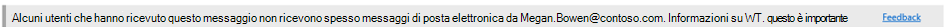

# Criteri anti-phishing in Microsoft 365Anti-phishing policies in Microsoft 365

[!INCLUDE [Microsoft 365 Defender rebranding](../includes/microsoft-defender-for-office.md)]

**Si applica a****Applies to**
- [Exchange Online ProtectionExchange Online Protection](exchange-online-protection-overview.md)
- [Microsoft Defender per Office 365 piano 1 e piano 2Microsoft Defender for Office 365 plan 1 and plan 2](defender-for-office-365.md)
- [Microsoft 365 DefenderMicrosoft 365 Defender](../defender/microsoft-365-defender.md)

I criteri per configurare le impostazioni di protezione anti-phishing sono disponibili nelle organizzazioni di Microsoft 365 con cassette postali di Exchange Online, nelle organizzazioni di Exchange Online Protection (EOP) autonome senza cassette postali di Exchange Online e in Microsoft Defender per le organizzazioni Office 365.Policies to configure anti-phishing protection settings are available in Microsoft 365 organizations with Exchange Online mailboxes, standalone Exchange Online Protection (EOP) organizations without Exchange Online mailboxes, and Microsoft Defender for Office 365 organizations.

I criteri anti-phishing in Microsoft Defender per Office 365 sono disponibili solo nelle organizzazioni che dispongono di Defender per Office 365.Anti-phishing policies in Microsoft Defender for Office 365 are only available in organizations that have Defender for Office 365. Ad esempio:For example:

- Microsoft 365 Enterprise E5, Microsoft 365 Education A5 e così via.Microsoft 365 Enterprise E5, Microsoft 365 Education A5, etc.
- [Microsoft 365 EnterpriseMicrosoft 365 Enterprise](https://www.microsoft.com/microsoft-365/enterprise/home)
- [Microsoft 365 BusinessMicrosoft 365 Business](https://www.microsoft.com/microsoft-365/business)
- [Microsoft Defender per Office 365 come componente aggiuntivoMicrosoft Defender for Office 365 as an add-on](https://products.office.com/exchange/advance-threat-protection)

Le differenze di alto livello tra i criteri anti-phishing in EOP e i criteri anti-phishing in Microsoft Defender per Office 365 sono descritte nella tabella seguente:The high-level differences between anti-phishing policies in EOP and anti-phishing policies in Microsoft Defender for Office 365 are described in the following table:

****

|FunzionalitàFeature|Criteri anti-phishing in EOPAnti-phishing policies in EOP|Criteri anti-phishing in Microsoft Defender per Office 365Anti-phishing policies in Microsoft Defender for Office 365|
|---|:---:|:---:|
|Criterio predefinito creato automaticamenteAutomatically created default policy|||
|Creazione di criteri personalizzatiCreate custom policies|||
|Impostazioni dei criteri\*Policy settings\*|||
|Impostazioni di rappresentazioneImpersonation settings|||
|Impostazioni spoofingSpoof settings|||
|Soglie di phishing avanzateAdvanced phishing thresholds|||
|

\* Nel criterio predefinito, il nome e la descrizione del criterio sono di sola lettura (la descrizione è vuota) e non è possibile specificare a chi si applica il criterio (il criterio predefinito si applica a tutti i destinatari).\* In the default policy, the policy name and description are read-only (the description is blank), and you can't specify who the policy applies to (the default policy applies to all recipients).

Per configurare i criteri anti-phishing, vedere gli articoli seguenti:To configure anti-phishing policies, see the following articles:

- [Configurare i criteri anti-phishing in Exchange Online ProtectionConfigure anti-phishing policies in EOP](configure-anti-phishing-policies-eop.md)

- [Configurare i criteri anti-phishing in Microsoft Defender per Office 365Configure anti-phishing policies in Microsoft Defender for Office 365](configure-atp-anti-phishing-policies.md)

Il resto di questo articolo descrive le impostazioni disponibili nei criteri anti-phishing in EOP e Defender per Office 365.The rest of this article describes the settings that are available in anti-phishing policies in EOP and Defender for Office 365.

## Impostazioni dei criteriPolicy settings

Le impostazioni dei criteri seguenti sono disponibili nei criteri anti-phishing in EOP e Microsoft Defender per Office 365:The following policy settings are available in anti-phishing policies in EOP and Microsoft Defender for Office 365:

- **Nome**: non è possibile rinominare il criterio anti-phishing predefinito.**Name**: You can't rename the default anti-phishing policy. Dopo aver creato un criterio anti-phishing personalizzato, non è possibile rinominare il criterio nel Centro sicurezza & conformità.After you create a custom anti-phishing policy, you can't rename the policy in the Security & Compliance Center.

- **Descrizione** Non è possibile aggiungere una descrizione al criterio anti-phishing predefinito, ma è possibile aggiungere e modificare la descrizione per i criteri personalizzati creati.**Description** You can't add a description to the default anti-phishing policy, but you can add and change the description for custom policies that you create.

- **Applicato a**: Identifica i destinatari interni a cui si applica il criterio anti-phishing.**Applied to**: Identifies internal recipients that the anti-phishing policy applies to. Questo valore è obbligatorio nei criteri personalizzati e non è disponibile nel criterio predefinito (il criterio predefinito si applica a tutti i destinatari).This value is required in custom policies, and not available in the default policy (the default policy applies to all recipients).

  È possibile utilizzare una condizione o un'eccezione solo una volta, ma è possibile specificare più valori per la condizione o l'eccezione.You can only use a condition or exception once, but you can specify multiple values for the condition or exception. Più valori della stessa condizione o eccezione utilizzano la logica OR (ad esempio, _\<recipient1\>_ o _\<recipient2\>_).Multiple values of the same condition or exception use OR logic (for example, _\<recipient1\>_ or _\<recipient2\>_). Condizioni o eccezioni diverse utilizzano la logica AND (ad esempio, _\<recipient1\>_ e _\<member of group 1\>_).Different conditions or exceptions use AND logic (for example, _\<recipient1\>_ and _\<member of group 1\>_).

  - **Il destinatario** è : una o più cassette postali, utenti di posta o contatti di posta nell'organizzazione.**Recipient is**: One or more mailboxes, mail users, or mail contacts in your organization.
  - **Il destinatario è un membro** di : Uno o più gruppi nell'organizzazione.**Recipient is a member of**: One or more groups in your organization.
  - **Il dominio del destinatario** è : uno o più domini accettati configurati in Microsoft 365.**The recipient domain is**: One or more of the configured accepted domains in Microsoft 365.

  - **Tranne quando**: Eccezioni per la regola.**Except when**: Exceptions for the rule. Le impostazioni e il comportamento sono esattamente come le condizioni:The settings and behavior are exactly like the conditions:

    - **Il destinatario è****Recipient is**
    - **Il destinatario è un membro di****Recipient is a member of**
    - **Il dominio del destinatario è****The recipient domain is**

  > [!NOTE]
  > **L'impostazione Applicato** a è necessaria nei criteri  anti-phishing personalizzati per identificare i destinatari del messaggio a cui si applica <u>il criterio.</u>The **Applied to** setting is required in custom anti-phishing policies to identify the message **recipients** <u>that the policy applies to</u>. I criteri anti-phishing in Microsoft Defender  per Office 365 dispongono anche di impostazioni di <u></u> rappresentazione in cui è possibile specificare singoli indirizzi di posta elettronica del mittente o domini di mittente che riceveranno la protezione della rappresentazione, come descritto più avanti in questo articolo.Anti-phishing policies in Microsoft Defender for Office 365 also have [impersonation settings](#impersonation-settings-in-anti-phishing-policies-in-microsoft-defender-for-office-365) where you can specify individual sender email addresses or sender domains <u>that will receive impersonation protection</u> as described later in this article.

## Impostazioni spoofingSpoof settings

Lo spoofing si verifica quando l'indirizzo mittente in un messaggio di posta elettronica (l'indirizzo del mittente visualizzato nei client di posta elettronica) non corrisponde al dominio dell'origine di posta elettronica.Spoofing is when the From address in an email message (the sender address that's shown in email clients) doesn't match the domain of the email source. Per ulteriori informazioni sullo spoofing, vedere [Protezione anti-spoofing in Microsoft 365](anti-spoofing-protection.md).For more information about spoofing, see [Anti-spoofing protection in Microsoft 365](anti-spoofing-protection.md).

Le impostazioni di spoofing seguenti sono disponibili nei criteri anti-phishing in EOP e Microsoft Defender per Office 365:The following spoof settings are available in anti-phishing policies in EOP and Microsoft Defender for Office 365:

- **Abilita spoof intelligence?**: attiva o disattiva l'intelligence di spoofing.**Enable spoof intelligence?**: Turns spoof intelligence on or off. È consigliabile lasciarlo attivato.We recommend that you leave it turned on.

  Quando l'intelligence spoofing è abilitata, le informazioni **di spoof intelligence** mostrano i mittenti falsificati che sono stati rilevati automaticamente e consentiti o bloccati da spoof intelligence.When spoof intelligence is enabled, the **spoof intelligence insight** shows spoofed senders that were automatically detected and allowed or blocked by spoof intelligence. È possibile ignorare manualmente il verdetto di spoof intelligence per consentire o bloccare i mittenti contraffatti rilevati dall'interno delle informazioni dettagliate.You can manually override the spoof intelligence verdict to allow or block the detected spoofed senders from within the insight. Tuttavia, quando si esegue questa operazione, il mittente contraffatto scompare dall'analisi dell'intelligence di spoofing ed è ora visibile solo nella **scheda Spoof** nell'elenco tenant consentiti/bloccati.But when you do, the spoofed sender disappears from the spoof intelligence insight, and is now visible only on the **Spoof** tab in the Tenant Allow/Block List. È inoltre possibile creare manualmente voci consentite o bloccate per i mittenti contraffatti nell'elenco Tenant consentiti/bloccati.You can also manually create allow or block entries for spoofed senders in the Tenant Allow/Block List. Per ulteriori informazioni, vedere i seguenti argomenti:For more information, see the following topics:

  - [Informazioni di intelligence di spoofing in EOPSpoof intelligence insight in EOP](learn-about-spoof-intelligence.md)
  - [Gestire l'elenco tenant consentiti/bloccati in EOPManage the Tenant Allow/Block List in EOP](tenant-allow-block-list.md)

  > [!NOTE]
  >
  > - La protezione anti-spoofing è abilitata per impostazione predefinita nel criterio anti-phishing predefinito e in qualsiasi nuovo criterio anti-phishing personalizzato creato.Anti-spoofing protection is enabled by default in the default anti-phishing policy and in any new custom anti-phishing policies that you create.
  >
  > - Non è necessario disabilitare la protezione anti-spoofing se il record MX non punta a Microsoft 365; si abilita invece il filtro avanzato per i connettori.You don't need to disable anti-spoofing protection if your MX record doesn't point to Microsoft 365; you enable Enhanced Filtering for Connectors instead. Per istruzioni, vedere [Enhanced Filtering for Connectors in Exchange Online](/Exchange/mail-flow-best-practices/use-connectors-to-configure-mail-flow/enhanced-filtering-for-connectors).For instructions, see [Enhanced Filtering for Connectors in Exchange Online](/Exchange/mail-flow-best-practices/use-connectors-to-configure-mail-flow/enhanced-filtering-for-connectors).
  >
  > - La disabilitazione della protezione anti-spoofing disabilita solo la protezione da spoofing implicita dai [controlli di autenticazione](email-validation-and-authentication.md#composite-authentication) composita.Disabling anti-spoofing protection only disables implicit spoofing protection from [composite authentication](email-validation-and-authentication.md#composite-authentication) checks. Se il mittente non supera i controlli [DMARC](use-dmarc-to-validate-email.md) espliciti in cui il criterio è impostato per la quarantena o il rifiuto, il messaggio viene ancora messo in quarantena o rifiutato.If the sender fails explicit [DMARC](use-dmarc-to-validate-email.md) checks where the policy is set to quarantine or reject, the message is still quarantined or rejected.

- **Impostazioni mittente non autenticato**: vedere le informazioni nella sezione successiva.**Unauthenticated sender settings**: See the information in the next section.

- **Azioni**: per i messaggi provenienti da mittenti spoofing bloccati (bloccati automaticamente da spoof intelligence o bloccati manualmente nell'elenco Tenant Consenti/Blocca), è inoltre possibile specificare l'azione da eseguire sui messaggi:**Actions**: For messages from blocked spoofed senders (automatically blocked by spoof intelligence or manually blocked in the Tenant Allow/Block list), you can also specify the action to take on the messages:

  - **Spostare i messaggi nelle cartelle posta indesiderata** dei destinatari: questo è il valore predefinito.**Move messages to the recipients' Junk Email folders**: This is the default value. Il messaggio viene recapitato alla cassetta postale e spostato nella cartella Posta indesiderata.The message is delivered to the mailbox and moved to the Junk Email folder. In Exchange Online, il messaggio viene spostato nella cartella Posta indesiderata se la regola di posta indesiderata è abilitata nella cassetta postale (è abilitata per impostazione predefinita).In Exchange Online, the message is moved to the Junk Email folder if the junk email rule is enabled on the mailbox (it's enabled by default). Per ulteriori informazioni, vedere [Configure junk email settings on Exchange Online mailboxes in Microsoft 365](configure-junk-email-settings-on-exo-mailboxes.md).For more information, see [Configure junk email settings on Exchange Online mailboxes in Microsoft 365](configure-junk-email-settings-on-exo-mailboxes.md).

  - **Mettere in quarantena il** messaggio : invia il messaggio in quarantena anziché i destinatari previsti.**Quarantine the message**: Sends the message to quarantine instead of the intended recipients. Per informazioni sulla quarantena, vedere gli articoli seguenti:For information about quarantine, see the following articles:

    - [Quarantena in Microsoft 365Quarantine in Microsoft 365](quarantine-email-messages.md)
    - [Gestire i messaggi e i file in quarantena come amministratore in Microsoft 365Manage quarantined messages and files as an admin in Microsoft 365](manage-quarantined-messages-and-files.md)
    - [Trovare e rilasciare i messaggi in quarantena come utente in Microsoft 365Find and release quarantined messages as a user in Microsoft 365](find-and-release-quarantined-messages-as-a-user.md)

### Mittente non autenticatoUnauthenticated sender

Le impostazioni dei mittenti non autenticati fanno parte delle impostazioni [di spoofing](#spoof-settings) disponibili nei criteri anti-phishing in EOP e Microsoft Defender per Office 365, come descritto nella sezione precedente.Unauthenticated sender settings are part of the [Spoof settings](#spoof-settings) that are available in anti-phishing policies in EOP and Microsoft Defender for Office 365 as described in the previous section.

- Abilitare il simbolo del punto interrogativo **(?)** del mittente non autenticato? : quando questa impostazione è attivata, viene aggiunto un punto  interrogativo alla foto del mittente nella casella Da se il messaggio non supera i controlli SPF o DKIM e il messaggio non supera l'autenticazione DMARC o [composita.](email-validation-and-authentication.md#composite-authentication)**Enable unauthenticated sender question mark (?) symbol?**: When this setting is turned on, a question mark is added to the sender's photo in the From box if the message does not pass SPF or DKIM checks **and** the message does not pass DMARC or [composite authentication](email-validation-and-authentication.md#composite-authentication). Quando questa impostazione è disattivata, il punto interrogativo non viene aggiunto alla foto del mittente.When this setting is turned off, the question mark isn't added to the sender's photo.

- Abilita tag **"via"?**: quando questa impostazione è attivata, il tag via (chris@contoso.com tramite fabrikam.com) viene aggiunto nella casella Da se il dominio nell'indirizzo mittente (il mittente del messaggio visualizzato nei client di posta elettronica) è diverso dal dominio nella firma \* DKIM o nell'indirizzo **MAIL FROM.** <u></u>**Enable "via" tag?**\*: When this setting is turned on, the via tag (chris@contoso.com <u>via</u> fabrikam.com) is added in the From box if the domain in the From address (the message sender that's displayed in email clients) is different from the domain in the DKIM signature or the **MAIL FROM** address. Per ulteriori informazioni su questi indirizzi, vedere [Panoramica degli standard dei messaggi di posta elettronica.](how-office-365-validates-the-from-address.md#an-overview-of-email-message-standards)For more information about these addresses, see [An overview of email message standards](how-office-365-validates-the-from-address.md#an-overview-of-email-message-standards).

> [!NOTE]
> Attualmente, **l'impostazione Abilita tag "via"?** non è disponibile in tutte le organizzazioni.Currently, the **Enable "via" tag?** setting is not available in all organizations. Se non si dispone dell'impostazione **Abilita tag "via"?** il punto interrogativo e il tag via sono entrambi controllati dall'impostazione Abilita punto interrogativo mittente non autenticato **(?)** nell'organizzazione. If you don't have the **Enable "via" tag?** setting, the question mark **and** the via tag are both controlled by the **Enable unauthenticated sender question mark (?) symbol?** setting in your organization.

Per impedire l'aggiunta del punto interrogativo o tramite tag ai messaggi provenienti da mittenti specifici, sono disponibili le opzioni seguenti:To prevent the question mark or via tag from being added to messages from specific senders, you have the following options:

- Consentire al mittente contraffatto di effettuare [lo spoofing delle](learn-about-spoof-intelligence.md) informazioni di intelligence o manualmente nell'elenco [tenant consentiti/bloccati.](tenant-allow-block-list.md)Allow the spoofed sender in the [spoof intelligence insight](learn-about-spoof-intelligence.md) or manually in the [Tenant Allow/Block List](tenant-allow-block-list.md). Se si consente al mittente contraffatto di visualizzare il tag via nei messaggi del mittente quando l'identificazione del mittente non autenticato è disabilitata.Allowing the spoofed sender will prevent the via tag from appearing in messages from the sender when unauthenticated sender identification is disabled.

- [Configurare l'autenticazione di](email-validation-and-authentication.md#configure-email-authentication-for-domains-you-own) posta elettronica per il dominio del mittente.[Configure email authentication](email-validation-and-authentication.md#configure-email-authentication-for-domains-you-own) for the sender domain.
  - Per il punto interrogativo nella foto del mittente, SPF o DKIM sono i più importanti.For the question mark in the sender's photo, SPF or DKIM are the most important.
  - Per il tag via, confermare il dominio nella firma DKIM o l'indirizzo **MAIL FROM** corrisponde (o è un sottodominio di) al dominio nell'indirizzo Mittente.For the via tag, confirm the domain in the DKIM signature or the **MAIL FROM** address matches (or is a subdomain of) the domain in the From address.

Per ulteriori informazioni, vedere [Identificare i messaggi sospetti in Outlook.com e Outlook sul web](https://support.microsoft.com/office/3d44102b-6ce3-4f7c-a359-b623bec82206)For more information, see [Identify suspicious messages in Outlook.com and Outlook on the web](https://support.microsoft.com/office/3d44102b-6ce3-4f7c-a359-b623bec82206)

## Impostazioni esclusive nei criteri anti-phishing in Microsoft Defender per Office 365Exclusive settings in anti-phishing policies in Microsoft Defender for Office 365

In questa sezione vengono descritte le impostazioni dei criteri disponibili solo nei criteri anti-phishing in Microsoft Defender per Office 365.This section describes the policy settings that are only available in anti-phishing policies in Microsoft Defender for Office 365.

> [!NOTE]
> Il criterio anti-phishing predefinito in Microsoft Defender per Office 365 fornisce protezione [spoofing](set-up-anti-phishing-policies.md#spoof-settings) e intelligence delle cassette postali per tutti i destinatari.The default anti-phishing policy in Microsoft Defender for Office 365 provides [spoof protection](set-up-anti-phishing-policies.md#spoof-settings) and mailbox intelligence for all recipients. Tuttavia, le altre funzionalità di [protezione della rappresentazione](#impersonation-settings-in-anti-phishing-policies-in-microsoft-defender-for-office-365) disponibili e [le impostazioni avanzate](set-up-anti-phishing-policies.md#advanced-phishing-thresholds-in-anti-phishing-policies-in-microsoft-defender-for-office-365) non sono configurate o abilitate nel criterio predefinito.However, the other available [impersonation protection](#impersonation-settings-in-anti-phishing-policies-in-microsoft-defender-for-office-365) features and [advanced settings](set-up-anti-phishing-policies.md#advanced-phishing-thresholds-in-anti-phishing-policies-in-microsoft-defender-for-office-365) are not configured or enabled in the default policy. Per abilitare tutte le funzionalità di protezione, modificare il criterio anti-phishing predefinito o creare ulteriori criteri anti-phishing.To enable all protection features, modify the default anti-phishing policy or create additional anti-phishing policies.

### Impostazioni di rappresentazione nei criteri anti-phishing in Microsoft Defender per Office 365Impersonation settings in anti-phishing policies in Microsoft Defender for Office 365

La rappresentazione è il punto in cui il mittente o il dominio di posta elettronica del mittente in un messaggio è simile a un mittente o a un dominio reale:Impersonation is where the sender or the sender's email domain in a message looks similar to a real sender or domain:

- Un esempio di rappresentazione del dominio contoso.com è ćóntoso.com.An example impersonation of the domain contoso.com is ćóntoso.com.
- Un esempio di rappresentazione dell'utente michelle@contoso.com è michele@contoso.com.An example impersonation of the user michelle@contoso.com is michele@contoso.com.

Un dominio rappresentato potrebbe essere considerato legittimo (dominio registrato, record di autenticazione e-mail configurati, e così via), tranne per l’intento di ingannare i destinatari.An impersonated domain might otherwise be considered legitimate (registered domain, configured email authentication records, etc.), except its intent is to deceive recipients.

Le impostazioni di rappresentazione seguenti sono disponibili solo nei criteri anti-phishing in Microsoft Defender per Office 365:The following impersonation settings are only available in anti-phishing policies in Microsoft Defender for Office 365:

- **Aggiungere utenti da proteggere**: Impedisce che gli indirizzi di posta elettronica interni o esterni specificati vengano rappresentati **come mittenti di messaggi.****Add users to protect**: Prevents the specified internal or external email addresses from being impersonated **as message senders**. Ad esempio, si riceve un messaggio di posta elettronica dal vicepresidente della società che richiede di inviarle alcune informazioni aziendali interne.For example, you receive an email message from the Vice President of your company asking you to send her some internal company information. Lo faresti?Would you do it? Molte persone inviano la risposta senza pensare.Many people would send the reply without thinking.

  È possibile utilizzare gli utenti protetti per aggiungere indirizzi di posta elettronica dei mittenti interni ed esterni per proteggere dalla rappresentazione.You can use protected users to add internal and external sender email addresses to protect from impersonation. Questo elenco  di mittenti protetti dalla rappresentazione dell'utente è diverso dall'elenco dei destinatari a cui si  applica il criterio  (tutti i destinatari per il criterio predefinito, destinatari specifici come configurato nell'impostazione Applicato a nella sezione Impostazioni criterio). This list of **senders** that are protected from user impersonation is different from the list of **recipients** that the policy applies to (all recipients for the default policy; specific recipients as configured in the **Applied to** setting in the [Policy settings](#policy-settings) section).

  > [!NOTE]
  >
  > - In ogni criterio anti-phishing, è possibile specificare un massimo di 60 utenti protetti (indirizzi di posta elettronica del mittente).In each anti-phishing policy, you can specify a maximum of 60 protected users (sender email addresses). Non è possibile specificare lo stesso utente protetto in più criteri.You can't specify the same protected user in multiple policies. Pertanto, indipendentemente dal numero di criteri applicati a un destinatario, il numero massimo di utenti protetti (indirizzi di posta elettronica del mittente) per ogni singolo destinatario è 60.So, regardless of how many policies apply to a recipient, the maximum number of protected users (sender email addresses) for each individual recipient is 60. Per ulteriori informazioni sulla priorità dei criteri e sul modo in cui l'elaborazione dei criteri si interrompe dopo l'applicazione del primo criterio, vedere [Order and precedence of email protection](how-policies-and-protections-are-combined.md).For more information about policy priority and how policy processing stops after the first policy is applied, see [Order and precedence of email protection](how-policies-and-protections-are-combined.md).
  >
  > - La protezione della rappresentazione dell'utente non funziona se il mittente e il destinatario hanno precedentemente comunicato tramite posta elettronica.User impersonation protection does not work if the sender and recipient have previously communicated via email. Se il mittente e il destinatario non hanno mai comunicato tramite posta elettronica, il messaggio verrà identificato come tentativo di rappresentazione.If the sender and recipient have never communicated via email, the message will be identified as an impersonation attempt.

  Per impostazione predefinita, nessun indirizzo di posta elettronica del mittente è configurato per la protezione della rappresentazione in **Utenti per proteggere**.By default, no sender email addresses are configured for impersonation protection in **Users to protect**. Pertanto, per impostazione predefinita, nessun indirizzo di posta elettronica del mittente è coperto dalla protezione della rappresentazione, nel criterio predefinito o nei criteri personalizzati.Therefore, by default, no sender email addresses are covered by impersonation protection, either in the default policy or in custom policies.

  Quando si aggiungono indirizzi di  posta elettronica interni o  esterni all'elenco Utenti da proteggere, i messaggi provenienti da tali mittenti sono soggetti a controlli di protezione della rappresentazione.When you add internal or external email addresses to the **Users to protect** list, messages from those **senders** are subject to impersonation protection checks. Il messaggio viene controllato  per la rappresentazione se il messaggio viene inviato **a** un destinatario a cui si applica il criterio (tutti i destinatari per il criterio predefinito; **Applicato ai** destinatari nei criteri personalizzati).The message is checked for impersonation **if** the message is sent to a **recipient** that the policy applies to (all recipients for the default policy; **Applied to** recipients in custom policies). Se viene rilevata la rappresentazione nell'indirizzo di posta elettronica del mittente, le azioni di protezione della rappresentazione per gli utenti vengono applicate al messaggio (cosa fare con il messaggio, se mostrare i suggerimenti per la sicurezza degli utenti impersonati e così via).If impersonation is detected in the sender's email address, the impersonation protections actions for users are applied to the message (what to do with the message, whether to show impersonated users safety tips, etc.).

- **Aggiungere domini da proteggere**: Impedisce ai domini specificati di essere **rappresentati nel dominio del mittente del messaggio.****Add domains to protect**: Prevents the specified domains from being impersonated **in the message sender's domain**. Ad esempio, tutti i domini di cui si è proprietari ([domini](/exchange/mail-flow-best-practices/manage-accepted-domains/manage-accepted-domains)accettati ) o domini specifici (domini di cui si è proprietari o domini partner).For example, all domains that you own ([accepted domains](/exchange/mail-flow-best-practices/manage-accepted-domains/manage-accepted-domains)) or specific domains (domains you own or partner domains). Questo elenco di domini mittente protetti dalla rappresentazione  è diverso dall'elenco dei destinatari a cui si applica  il criterio  (tutti i destinatari per il criterio predefinito, destinatari specifici come configurato nell'impostazione Applicato a nella sezione Impostazioni criterio). This list of **sender domains** that are protected from impersonation is different from the list of **recipients** that the policy applies to (all recipients for the default policy; specific recipients as configured in the **Applied to** setting in the [Policy settings](#policy-settings) section).

  > [!NOTE]
  > Il numero massimo di domini protetti che è possibile definire in tutti i criteri anti-phishing è 50.The maximum number of protected domains that you can define in all anti-phishing policies is 50.

  Per impostazione predefinita, nessun dominio mittente è configurato per la protezione della rappresentazione in **Domini per proteggere**.By default, no sender domains are configured for impersonation protection in **Domains to protect**. Pertanto, per impostazione predefinita, nessun dominio mittente è coperto dalla protezione della rappresentazione, sia nel criterio predefinito che nei criteri personalizzati.Therefore, by default, no sender domains are covered by impersonation protection, either in the default policy or in custom policies.

  Quando si aggiungono domini all'elenco  **Domini da** proteggere, i messaggi provenienti da tali domini sono soggetti a controlli di protezione della rappresentazione.When you add domains to the **Domains to protect** list, messages from **senders in those domains** are subject to impersonation protection checks. Il messaggio viene controllato  per la rappresentazione se il messaggio viene inviato **a** un destinatario a cui si applica il criterio (tutti i destinatari per il criterio predefinito; **Applicato ai** destinatari nei criteri personalizzati).The message is checked for impersonation **if** the message is sent to a **recipient** that the policy applies to (all recipients for the default policy; **Applied to** recipients in custom policies). Se viene rilevata la rappresentazione nel dominio del mittente, le azioni di protezione della rappresentazione per i domini vengono applicate al messaggio (cosa fare con il messaggio, se mostrare i suggerimenti per la sicurezza degli utenti impersonati e così via).If impersonation is detected in the sender's domain, the impersonation protection actions for domains are applied to the message (what to do with the message, whether to show impersonated users safety tips, etc.).

- **Azioni**: scegliere l'azione da eseguire sui messaggi in ingresso che contengono tentativi di rappresentazione contro gli utenti protetti e i domini protetti nel criterio.**Actions**: Choose the action to take on inbound messages that contain impersonation attempts against the protected users and protected domains in the policy. È possibile specificare azioni diverse per la rappresentazione degli utenti protetti e la rappresentazione dei domini protetti:You can specify different actions for impersonation of protected users vs. impersonation of protected domains:

  - **Non applicare alcuna azione****Don't apply any action**

  - **Reindirizza il messaggio ad altri indirizzi di** posta elettronica : invia il messaggio ai destinatari specificati anziché ai destinatari previsti.**Redirect message to other email addresses**: Sends the message to the specified recipients instead of the intended recipients.

  - **Spostare i messaggi nelle cartelle posta indesiderata** dei destinatari: il messaggio viene recapitato nella cassetta postale e spostato nella cartella Posta indesiderata.**Move messages to the recipients' Junk Email folders**: The message is delivered to the mailbox and moved to the Junk Email folder. In Exchange Online, il messaggio viene spostato nella cartella Posta indesiderata se la regola di posta indesiderata è abilitata nella cassetta postale (è abilitata per impostazione predefinita).In Exchange Online, the message is moved to the Junk Email folder if the junk email rule is enabled on the mailbox (it's enabled by default). Per ulteriori informazioni, vedere [Configure junk email settings on Exchange Online mailboxes in Microsoft 365](configure-junk-email-settings-on-exo-mailboxes.md).For more information, see [Configure junk email settings on Exchange Online mailboxes in Microsoft 365](configure-junk-email-settings-on-exo-mailboxes.md).

  - **Mettere in quarantena il** messaggio : invia il messaggio in quarantena anziché i destinatari previsti.**Quarantine the message**: Sends the message to quarantine instead of the intended recipients. Per informazioni sulla quarantena, vedere gli articoli seguenti:For information about quarantine, see the following articles:
    - [Quarantena in Microsoft 365Quarantine in Microsoft 365](quarantine-email-messages.md)
    - [Gestire i messaggi e i file in quarantena come amministratore in Microsoft 365Manage quarantined messages and files as an admin in Microsoft 365](manage-quarantined-messages-and-files.md)
    - [Trovare e rilasciare i messaggi in quarantena come utente in Microsoft 365Find and release quarantined messages as a user in Microsoft 365](find-and-release-quarantined-messages-as-a-user.md)

  - **Recapita** il messaggio e aggiungi altri indirizzi alla riga Ccn : Recapita il messaggio ai destinatari previsti e recapita automaticamente il messaggio ai destinatari specificati.**Deliver the message and add other addresses to the Bcc line**: Deliver the message to the intended recipients and silently deliver the message to the specified recipients.

  - **Elimina il messaggio prima che venga recapitato:** elimina automaticamente l'intero messaggio, inclusi tutti gli allegati.**Delete the message before it's delivered**: Silently deletes the entire message, including all attachments.

- **Attivare i suggerimenti per la sicurezza della** rappresentazione : attivare o disattivare i seguenti suggerimenti per la sicurezza della rappresentazione che verranno visualizzati i messaggi che non riescono a controllare la rappresentazione:**Turn on impersonation safety tips**: Turn on or turn off the following impersonation safety tips that will appear messages that fail impersonation checks:
  - **Mostra suggerimento per gli utenti rappresentati:** l'indirizzo mittente contiene un utente protetto.**Show tip for impersonated users**: The From address contains a protected user.
  - **Show tip for impersonated domains**: L'indirizzo From contiene un dominio protetto.**Show tip for impersonated domains**: The From address contains a protected domain.
  - **Mostra suggerimento** per caratteri insoliti : L'indirizzo From contiene set di caratteri insoliti (ad esempio, simboli matematici e testo o una combinazione di lettere maiuscole e minuscole) in un mittente o dominio protetto.**Show tip for unusual characters**: The From address contains unusual character sets (for example, mathematical symbols and text or a mix of uppercase and lowercase letters) in a protected sender or domain.

  > [!IMPORTANT]
  > Anche se i suggerimenti per la  sicurezza della rappresentazione sono disattivati, è consigliabile utilizzare una regola del flusso di posta (nota anche come regola di trasporto) per aggiungere ai messaggi l'intestazione del messaggio seguente:Even if the impersonation safety tips are turned off, **we recommend** that you use a mail flow rule (also known as a transport rule) to add a the following message header to messages:
  >
  > - Nome intestazione: **X-MS-Exchange-EnableFirstContactSafetyTip**Header name: **X-MS-Exchange-EnableFirstContactSafetyTip**
  > - Valore intestazione: **Enable**Header value: **Enable**
  >
  > Un suggerimento per la sicurezza invierà una notifica ai destinatari la prima volta che riceve un messaggio dal mittente o se spesso non riceve messaggi dal mittente.A safety tip will notify recipients the first time they get a message from the sender or if they don't often get messages from the sender. Questa funzionalità aggiunge un ulteriore livello di protezione da potenziali attacchi di rappresentazione.This capability adds an extra layer of security protection against potential impersonation attacks.
  >
  > 

- **Intelligence delle cassette** postali: abilita o disabilita l'intelligenza artificiale (AI) che determina i modelli di posta elettronica degli utenti con i contatti frequenti.**Mailbox intelligence**: Enables or disables artificial intelligence (AI) that determines user email patterns with their frequent contacts. Questa impostazione consente all'IA di distinguere i messaggi dai mittenti legittimi e impersonati.This setting helps the AI distinguish between messages from legitimate and impersonated senders.

  Ad esempio, Gabriela Laureano (glaureano@contoso.com) è il CEO della società, quindi la aggiungi come mittente protetto in **Utenti** per proteggere le impostazioni del criterio.For example, Gabriela Laureano (glaureano@contoso.com) is the CEO of your company, so you add her as a protected sender in the **Users to protect** settings of the policy. Tuttavia, alcuni dei destinatari che il criterio si applica per comunicare regolarmente con un fornitore denominato anche Gabriela Laureano (glaureano@fabrikam.com).But, some of the recipients that the policy applies to communicate regularly with a vendor who is also named Gabriela Laureano (glaureano@fabrikam.com). Poiché tali destinatari hanno una cronologia delle comunicazioni con glaureano@fabrikam.com, l'intelligence delle cassette postali non identificherà i messaggi provenienti da glaureano@fabrikam.com come tentativo di rappresentazione di glaureano@contoso.com per tali destinatari.Because those recipients have a communication history with glaureano@fabrikam.com, mailbox intelligence will not identify messages from glaureano@fabrikam.com as an impersonation attempt of glaureano@contoso.com for those recipients.

  Per utilizzare contatti frequenti appresi dall'intelligence delle cassette postali (e non presenti)  per proteggere gli utenti dagli attacchi  di rappresentazione, è possibile attivare la protezione della rappresentazione basata sull'intelligence delle cassette postali e specificare l'azione da eseguire se si attiva anche l'intelligence delle cassette **postali.**To use frequent contacts that were learned by mailbox intelligence (and lack thereof) to help protect users from impersonation attacks, you can turn on **Mailbox intelligence based impersonation protection** and specify the action to take **if** you also turn on **Mailbox intelligence**.

- **Protezione della rappresentazione basata sull'intelligence** delle cassette postali : attivare questa impostazione per specificare l'azione da eseguire sui messaggi per i rilevamenti di rappresentazione dai risultati dell'intelligence delle cassette postali:**Mailbox intelligence based impersonation protection**: Turn on this setting to specify the action to take on messages for impersonation detections from mailbox intelligence results:

  - Non applicare alcuna azione: si noti che questo valore  ha lo stesso risultato **dell'attivazione dell'intelligence** per le cassette postali, ma della disattivazione della protezione della rappresentazione basata sull'intelligence per le **cassette postali.****Don't apply any action**: Note that this value has the same result as turning on **Mailbox intelligence** but turning off **Mailbox intelligence based impersonation protection**.
  - **Reindirizzare il messaggio ad altri indirizzi di posta elettronica****Redirect message to other email addresses**
  - **Spostare il messaggio nelle cartelle posta indesiderata dei destinatari****Move message to the recipients' Junk Email folders**
  - **Mettere in quarantena il messaggio****Quarantine the message**
  - **Recapitare il messaggio e aggiungere altri indirizzi alla riga Ccn****Deliver the message and add other addresses to the Bcc line**
  - **Eliminare il messaggio prima che venga recapitato****Delete the message before it's delivered**

- **Aggiungere mittenti e domini attendibili:** eccezioni alle impostazioni di protezione della rappresentazione.**Add trusted senders and domains**: Exceptions to the impersonation protection settings. I messaggi provenienti dai mittenti e dai domini del mittente specificati non vengono mai classificati come attacchi basati sulla rappresentazione dal criterio.Messages from the specified senders and sender domains are never classified as impersonation-based attacks by the policy. In altre parole, l'azione per i mittenti protetti, i domini protetti o la protezione dell'intelligence delle cassette postali non viene applicata a questi mittenti attendibili o domini mittente.In other words, the action for protected senders, protected domains, or mailbox intelligence protection aren't applied to these trusted senders or sender domains. Il limite massimo per questi elenchi è di circa 1000 voci.The maximum limit for these lists is approximately 1000 entries.

### Soglie di phishing avanzate nei criteri anti-phishing in Microsoft Defender per Office 365Advanced phishing thresholds in anti-phishing policies in Microsoft Defender for Office 365

Le soglie di phishing avanzate seguenti sono disponibili solo nei criteri anti-phishing in Microsoft Defender per Office 365.The following advanced phishing thresholds are only available in anti-phishing policies in Microsoft Defender for Office 365. Queste soglie controllano la riservatezza per l'applicazione di modelli di machine learning ai messaggi per determinare un verdetto di phishing:These thresholds control the sensitivity for applying machine learning models to messages for determining a phishing verdict:

- **1 - Standard**: questo è il valore predefinito.**1 - Standard**: This is the default value. La gravità dell'azione eseguita sul messaggio dipende dal grado di probabilità che il messaggio sia phishing (probabilità bassa, media, alta o molto alta).The severity of the action that's taken on the message depends on the degree of confidence that the message is phishing (low, medium, high, or very high confidence). Ad esempio, ai messaggi identificati come phishing con un livello di sicurezza molto elevato vengono applicate le azioni più gravi, mentre ai messaggi identificati come phishing con un basso livello di sicurezza vengono applicate azioni meno gravi.For example, messages that are identified as phishing with a very high degree of confidence have the most severe actions applied, while messages that are identified as phishing with a low degree of confidence have less severe actions applied.

- **2 - Aggressivo**: i messaggi identificati come phishing con un elevato grado di sicurezza vengono considerati come se fossero identificati con un livello di sicurezza molto elevato.**2 - Aggressive**: Messages that are identified as phishing with a high degree of confidence are treated as if they were identified with a very high degree of confidence.

- **3 - Più aggressivo:** i messaggi identificati come phishing con un grado di sicurezza medio o elevato vengono considerati come se fossero identificati con un livello di sicurezza molto elevato.**3 - More aggressive**: Messages that are identified as phishing with a medium or high degree of confidence are treated as if they were identified with a very high degree of confidence.

- **4 - Più** aggressivo: i messaggi identificati come phishing con un livello di sicurezza basso, medio o alto vengono considerati come se fossero identificati con un livello di sicurezza molto elevato.**4 - Most aggressive**: Messages that are identified as phishing with a low, medium, or high degree of confidence are treated as if they were identified with a very high degree of confidence.

Con l'aumento di questa impostazione aumenta la probabilità di falsi positivi (messaggi positivi contrassegnati come non positivi).The chance of false positives (good messages marked as bad) increases as you increase this setting. Per informazioni sulle impostazioni consigliate, vedere [Criteri anti-phishing in Microsoft Defender per Office 365 impostazioni](recommended-settings-for-eop-and-office365.md#anti-phishing-policy-settings-in-microsoft-defender-for-office-365).For information about the recommended settings, see [anti-phishing policy in Microsoft Defender for Office 365 settings](recommended-settings-for-eop-and-office365.md#anti-phishing-policy-settings-in-microsoft-defender-for-office-365).
