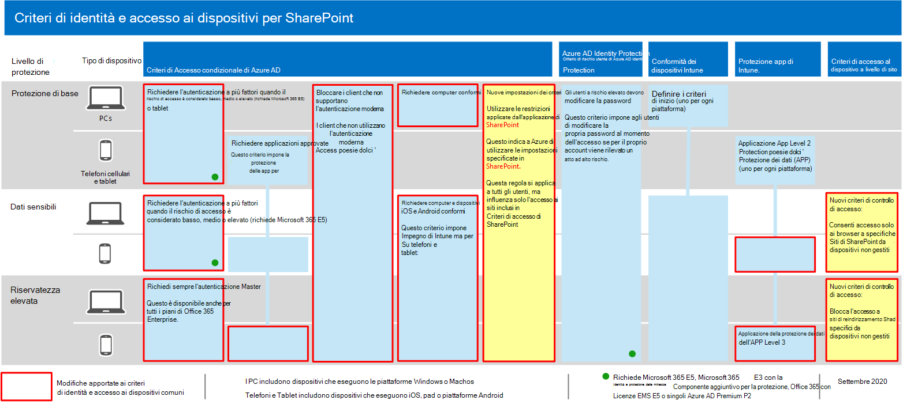
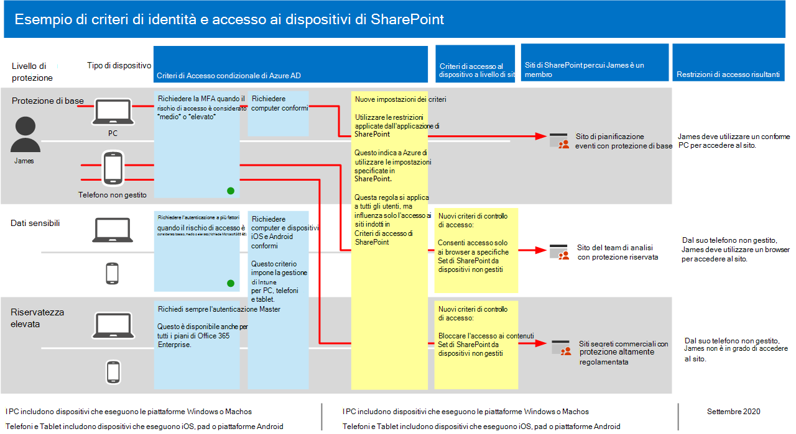

# Suggerimenti sui criteri per la protezione di siti e file di SharePointPolicy recommendations for securing SharePoint sites and files

In questo articolo viene descritto come implementare i criteri di identità e accesso ai dispositivi consigliati per la protezione di SharePoint e OneDrive for business.This article describes how to implement the recommended identity and device-access policies to protect SharePoint and OneDrive for Business. Queste linee guida si basano sui [criteri comuni di identità e accesso ai dispositivi](identity-access-policies.md).This guidance builds on the [common identity and device access policies](identity-access-policies.md).

Questi suggerimenti si basano su tre diversi livelli di sicurezza e protezione per i file di SharePoint che possono essere applicati in base alla granularità delle proprie esigenze: **linea di base**, **sensibile**e **altamente regolamentata**.These recommendations are based on three different tiers of security and protection for SharePoint files that can be applied based on the granularity of your needs: **baseline**, **sensitive**, and **highly regulated**. È possibile ottenere ulteriori informazioni su questi livelli di sicurezza e sui sistemi operativi client consigliati, a cui si fa riferimento in questa [sezione](microsoft-365-policies-configurations.md).You can learn more about these security tiers, and the recommended client operating systems, referenced by these recommendations in [the overview](microsoft-365-policies-configurations.md).

Oltre all'implementazione di queste linee guida, assicurarsi di configurare i siti di SharePoint con la giusta quantità di protezione, tra cui l'impostazione delle autorizzazioni appropriate per i contenuti sensibili e altamente regolamentati.In addition to implementing this guidance, be sure to configure SharePoint sites with the right amount of protection, including setting appropriate permissions for sensitive and highly-regulated content.

## Aggiornamento dei criteri comuni per includere SharePoint e OneDrive for businessUpdating common policies to include SharePoint and OneDrive for Business

Per proteggere i file in SharePoint e OneDrive, nel diagramma seguente vengono illustrati i criteri da aggiornare dai criteri di identità e accesso ai dispositivi comuni.To protect files in SharePoint and OneDrive, the following diagram illustrates which policies to update from the the common identity and device access policies.

[Visualizzazione di una versione più grande di questa immagineSee a larger version of this image](https://github.com/MicrosoftDocs/microsoft-365-docs/raw/public/microsoft-365/media/microsoft-365-policies-configurations/identity-access-ruleset-sharepoint.png)

Se è stato incluso SharePoint quando sono stati creati i criteri comuni, è necessario creare solo i nuovi criteri.If you included SharePoint when you created the common policies, you only need to create the new policies. Per i criteri di accesso condizionale, SharePoint include OneDrive.For Conditional Access policies, SharePoint includes OneDrive.

I nuovi criteri implementano la protezione del dispositivo per soddisfare sensibili e altamente regolamentati applicando specifici requisiti di accesso ai siti di SharePoint specificati.The new policies implement device protection for sensitive and highly-regulated content by applying specific access requirements to SharePoint sites that you specify.

Nella tabella seguente sono elencati i criteri che è necessario rivedere e aggiornare o creare nuovi per SharePoint.The following table lists the policies you either need to review and update or create new for SharePoint. I criteri comuni collegano le istruzioni di configurazione associate nell'articolo [Common Identity and Device Access Policies](identity-access-policies.md) .The common policies link to the associated configuration instructions in the [Common identity and device access policies](identity-access-policies.md) article.

|Livello di protezioneProtection level|CriteriPolicies|Ulteriori informazioniMore information|
|:---------------|:-------|:----------------|
|**Protezione di base****Baseline**|[Richiedere l'AMF quando il rischio di accesso è *medio* o *elevato*Require MFA when sign-in risk is *medium* or *high*](identity-access-policies.md#require-mfa-based-on-sign-in-risk)|Includere SharePoint nell'assegnazione delle app cloud.Include SharePoint in the assignment of cloud apps.|
|        |[Bloccare i client che non supportano l'autenticazione modernaBlock clients that don't support modern authentication](identity-access-policies.md#block-clients-that-dont-support-modern-authentication)|Includere SharePoint nell'assegnazione delle app cloud.Include SharePoint in the assignment of cloud apps.|
|        |[Applicare i criteri di protezione dei dati dell'APPApply APP data protection policies](identity-access-policies.md#apply-app-data-protection-policies)|Assicurarsi che tutte le app consigliate siano incluse nell'elenco delle app.Be sure all recommended apps are included in the list of apps. Assicurarsi di aggiornare i criteri per ogni piattaforma (iOS, Android, Windows).Be sure to update the policy for each platform (iOS, Android, Windows).|
|        |[Richiedere computer conformiRequire compliant PCs](identity-access-policies.md#require-compliant-pcs-but-not-compliant-phones-and-tablets)|Includere SharePoint nell'elenco delle app cloud.Include SharePoint in list of cloud apps.|
|        |[Utilizzare le restrizioni applicate dalle app in SharePointUse app enforced restrictions in SharePoint](#use-app-enforced-restrictions-in-sharepoint)|Aggiungere il nuovo criterio.Add this new policy. Questo indica ad Azure Active Directory (Azure AD) di utilizzare le impostazioni specificate in SharePoint.This tells Azure Active Directory (Azure AD) to use the settings specified in SharePoint. Questo criterio si applica a tutti gli utenti, ma influenza solo l'accesso ai siti inclusi nei criteri di accesso di SharePoint.This policy applies to all users, but only affects access to sites included in SharePoint access policies.|
|**Sensibili****Sensitive**|[Richiedere l'AMF quando il rischio di accesso è *basso*, *medio* o *alto*Require MFA when sign-in risk is *low*, *medium* or *high*](identity-access-policies.md#require-mfa-based-on-sign-in-risk)|Includere SharePoint nelle assegnazioni delle app cloud.Include SharePoint in the assignments of cloud apps.|
|         |[Richiedere PC conformi *e* dispositivi mobiliRequire compliant PCs *and* mobile devices](identity-access-policies.md#require-compliant-pcs-and-mobile-devices)|Includere SharePoint nell'elenco delle app cloud.Include SharePoint in the list of cloud apps.|
||[Criteri di controllo di accesso di SharePoint](#sharepoint-access-control-policies): Consenti accesso solo browser a siti di SharePoint specifici da dispositivi non gestiti.[SharePoint access control policy](#sharepoint-access-control-policies): Allow browser-only access to specific SharePoint sites from unmanaged devices.|In questo modo si impedisce la modifica e il download dei file.This prevents edit and download of files. Utilizzare PowerShell per specificare i siti.Use PowerShell to specify sites.|
|**Riservatezza elevata****Highly regulated**|[Richiede *sempre* l'autenticazione Master*Always* require MFA](identity-access-policies.md#require-mfa-based-on-sign-in-risk)|Includere SharePoint nell'assegnazione delle app cloud.Include SharePoint in the assignment of cloud apps.|
||[Criteri di controllo dell'accesso di SharePoint](#use-app-enforced-restrictions-in-sharepoint): bloccare l'accesso a siti di SharePoint specifici da dispositivi non gestiti.[SharePoint access control policy](#use-app-enforced-restrictions-in-sharepoint): Block access to specific SharePoint sites from unmanaged devices.|Utilizzare PowerShell per specificare i siti.Use PowerShell to specify sites.|

## Utilizzare le restrizioni applicate dalle app in SharePointUse app-enforced restrictions in SharePoint

Se si implementano i controlli di accesso in SharePoint, è necessario creare il criterio di accesso condizionale in Azure ad per indicare ad Azure ad di applicare i criteri configurati in SharePoint.If you implement access controls in SharePoint, you must create this Conditional Access policy in Azure AD to tell Azure AD to enforce the policies you configure in SharePoint. Questo criterio si applica a tutti gli utenti, ma influenza solo l'accesso ai siti specificati tramite PowerShell quando si creano i controlli di accesso in SharePoint.This policy applies to all users, but only affects access to the sites you specify using PowerShell when you create the access controls in SharePoint.

Per configurare questo criterio, vedere "bloccare o limitare l'accesso a specifiche raccolte siti di SharePoint o account OneDrive" in [controllare l'accesso da dispositivi non gestiti](https://docs.microsoft.com/sharepoint/control-access-from-unmanaged-devices).To configure this policy see "Block or limit access to specific SharePoint site collections or OneDrive accounts" in [Control access from unmanaged devices](https://docs.microsoft.com/sharepoint/control-access-from-unmanaged-devices).

## Criteri di controllo di accesso di SharePointSharePoint access control policies

Microsoft consiglia di proteggere il contenuto nei siti di SharePoint con contenuti sensibili e altamente regolamentati con i controlli di accesso ai dispositivi.Microsoft recommends you protect content in SharePoint sites with sensitive and highly-regulated content with device access controls. A tale scopo, è possibile creare un criterio che specifichi il livello di protezione e i siti a cui applicare la protezione.You do this by creating a policy that specifies the level of protection and the sites to apply the protection to.

- Siti sensibili: Consenti accesso solo ai browser.Sensitive sites: Allow browser-only access. In questo modo si impedisce agli utenti di modificare e scaricare file.This prevents users from editing and downloading files.
- Siti altamente regolamentati: blocca l'accesso da dispositivi non gestiti.Highly regulated sites: Block access from unmanaged devices.

Vedere "bloccare o limitare l'accesso a specifiche raccolte siti di SharePoint o account di OneDrive" in [controllo accesso da dispositivi non gestiti](https://docs.microsoft.com/sharepoint/control-access-from-unmanaged-devices).See "Block or limit access to specific SharePoint site collections or OneDrive accounts" in [Control access from unmanaged devices](https://docs.microsoft.com/sharepoint/control-access-from-unmanaged-devices).

## Modalità di collaborazione tra questi criteriHow these policies work together

È importante comprendere che le autorizzazioni per il sito di SharePoint in genere si basano sull'esigenza aziendale di accedere ai siti.It's important to understand that SharePoint site permissions are typically based on business need for access to sites. Queste autorizzazioni vengono gestite dai proprietari del sito e possono essere estremamente dinamiche.These permissions are managed by site owners and can be highly dynamic. L'utilizzo dei criteri di accesso ai dispositivi di SharePoint garantisce la protezione di tali siti, indipendentemente dal fatto che gli utenti siano assegnati a un gruppo di Azure AD associato a una protezione di base, sensibile o fortemente regolamentata.Using SharePoint device access policies ensures protection to these sites, regardless of whether users are assigned to an Azure AD group associated with baseline, sensitive, or highly regulated protection.

Nella figura seguente viene illustrato un esempio di come i criteri di accesso ai dispositivi di SharePoint proteggono l'accesso ai siti per un utente.The following illustration provides an example of how SharePoint device access policies protect access to sites for a user.

[Visualizzazione di una versione più grande di questa immagineSee a larger version of this image](https://github.com/MicrosoftDocs/microsoft-365-docs/raw/public/microsoft-365/media/microsoft-365-policies-configurations/SharePoint-rules-scenario.png)

James dispone di criteri di accesso condizionale di base assegnati, ma può essere consentito l'accesso ai siti di SharePoint con protezione sensibile o fortemente regolamentata.James has baseline Conditional Access policies assigned, but he can be given access to SharePoint sites with sensitive or highly-regulated protection.

- Se James accede a un sito sensibile o altamente regolamentato, è membro dell'utilizzo del PC, il suo accesso è concesso purché il PC sia conforme.If James accesses a sensitive or highly-regulated site he is a member of using his PC, his access is granted as long as his PC is compliant.
- Se James accede a un sito sensibile che è membro dell'utilizzo del telefono non gestito, consentito per gli utenti di base, riceverà l'accesso solo ai browser al sito riservato a causa dei criteri di accesso al dispositivo configurati per il sito.If James accesses a sensitive site he is a member of using his unmanaged phone, which is allowed for baseline users, he will receive browser-only access to the sensitive site due to the device access policy configured for this site.
- Se James accede a un sito fortemente regolamentato, è membro dell'utilizzo del telefono non gestito, verrà bloccato a causa dei criteri di accesso configurati per il sito.If James accesses a highly regulated site he is a member of using his unmanaged phone, he will be blocked due to the access policy configured for this site. Può accedere a questo sito solo utilizzando il suo PC gestito e conforme.He can only access this site using his managed and compliant PC.

## Passaggio successivoNext step

Configurare i criteri di accesso condizionale per:Configure Conditional Access policies for:

- [Microsoft TeamsMicrosoft Teams](teams-access-policies.md)
- [Exchange OnlineExchange Online](secure-email-recommended-policies.md)

